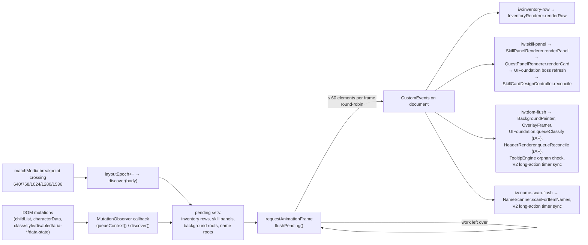
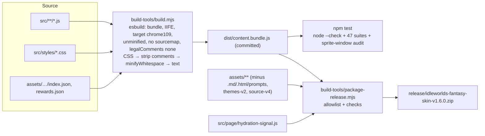

# 1. Project overview

> **Snapshot.** Everything in this chapter describes commit `059081671bf3af4490a025121f25f13ada142b7e` (branch `main`, extension version **1.6.0**), inspected on **17 September 2026**. The source tree (`src/`, `build-tools/`, `tests/`, `manifest.json`, `package.json`) was clean at that commit. Line numbers in links refer to that commit.
>
> **Evidence labels used throughout this package**
>
> | Label | Meaning |
> | --- | --- |
> | **[Source]** | Confirmed by reading the file and line cited. |
> | **[Generated]** | Produced by a script in `tools/` from the source files, and reproducible. |
> | **[Test run]** | Confirmed by running `npm test` in the project on 2026-09-17 (see [Chapter 7](07-testing-and-verification.md#72-current-results)). |
> | **[Project record]** | Stated in the project's own notes (`CLAUDE.md`, `docs/traps/*.md`, asset READMEs). These are historical measurements that were **not** re-measured for this handover. |
> | **[Assumption]** / **[Verify]** | Cannot be confirmed from the repository. It needs a check against the live IdleWorlds application, its server, or its owners. |

## 1.1 Purpose

The **IdleWorlds Fantasy Skin** is a Chrome **Manifest V3 browser extension** that restyles the live web application at `https://idleworlds.com` (and `https://www.idleworlds.com`) into a dark-fantasy RPG interface. It replaces the game's flat Tailwind "dashboard" look with forged-metal frames, parchment-and-brass typography, illustrated item and skill artwork, per-zone colour palettes, and denser, more game-like layouts for the main surfaces (header, navigation, skill cards, quests, inventory, world bosses, village, market and the activity feeds).

It is built by a third party **without access to the IdleWorlds source code**. Everything it does is layered over the DOM that the IdleWorlds React application renders in the player's browser.

The project states its governing rule as **"Presentation only"** ([CLAUDE.md](../../CLAUDE.md)):

1. never change what a game control does;
2. never reparent (move) a node React owns — decoration may only be *appended*;
3. every attribute, element and inline style the skin adds must be reversible by its teardown;
4. one `MutationObserver` only;
5. never destroy information the game paints (active tab, equipped item, red/green state).

This handover shows (Chapters 2, 3 and 5) that the implementation follows these rules closely. It also records the specific places where the effect goes further than "presentation". One example: a game button is hidden by CSS and becomes unreachable ([finding FUN-01](05-javascript-safety-review.md#findings-register)). Another: the skin performs an authenticated read of a game API endpoint ([SEC-04](05-javascript-safety-review.md#findings-register)).

## 1.2 Scope

**In scope (what the skin changes):**

| Surface | What the player sees | Primary implementation |
| --- | --- | --- |
| Whole page | Dark "Ashen Iron" palette, self-hosted fonts (Cinzel, Barlow, Crimson Text), flattened Tailwind radii, forged control plates, themed scrollbars, focus rings | `base.css`, `ui-system.css` |
| Per-zone theming | Nine environment palettes (glacial, infernal, verdant, …) chosen from the player's current zone. Zone-specific header painting (desktop strip and mobile portrait crop), frame filigree, separators and button art | `HeaderRenderer.js`, `zoneThemes.js`, `SkillsArtService.js`, `base.css` |
| Header | Live player header reorganised: crest, smoked-glass identity block, utility rail, vitals/buff tile grid | `HeaderRenderer.js`, `header.css` |
| Navigation + zone bar + announcement | One merged framed "chrome" box. Route tabs with the active tab preserved, zone title and actions, and an added outbound **Toolkit** link | `UIFoundation.js`, `HeaderChrome.js`, `ui-system.css`, `header.css` |
| Every `.panel` | The shared "forged frame" (textured ground, gold hairline, four-corner filigree). A per-panel **collapse** control, remembered per panel | `UIFoundation.js`, `CollapsibleFrames.js`, `ui-system.css`, `collapsible.css` |
| Current Action / Action Log / World Chat | Framed activity panels. The Current Action bar is smoothed into continuous motion; the feeds are restyled | `UIFoundation.js`, `ProgressCadence.js`, `ui-system.css` |
| Skill Actions cards | The "V2" skill card: medallion with XP ring, level badge, action title with base-XP chip, material/source/detail frame, unmet-requirement note, themed square action button with discipline icon, fitted label, smoothed activity fill, long-action countdown, recipe pager | `DOMWatcher.js`, `SkillPanelRenderer.js`, `SkillCardDesignController.js`, `SkillsArtService.js`, `skillpanel.css`, `skillcard-v2.css`, `card-buttons.css` |
| Quests | Three-zone quest card with a themed sigil (objective item icon, completion %), reward chip, sprite-framed Turn In / Skip, and a hovercard on the objective item | `QuestPanelRenderer.js`, `skillpanel.css` |
| Inventory | Each item row replaced visually by a rich overlay: sprite icon (with +N badge), category colour, stat chips, owned-item details (loadout, sockets, rolled stats), requirements, quantity. The native action buttons are kept and restyled. Themed panel chrome with a single-row filter bar | `InventoryRenderer.js`, `InventoryModel.js`, `itemDisplay.js`, `AtlasService.js`, `inventory.css` |
| Item information | Rich item hovercard (stats, acquisition, wiki link) on inventory icons, quest objectives, village buildings, boss rewards, and item names detected in the game's prose | `TooltipEngine.js`, `NameScanner.js`, `ItemDatabase.js`, `tooltip-engine.css` |
| World Bosses & Zone Control | Illustrated encounter cards, compact Prejoin/Queued labels, a "Possible Rewards" disclosure derived from item data, and an animated "Dominion Ward" visual for zone control | `WorldBossPanels.js`, `ui-system.css` |
| Market | Smoked-glass listing rows | `UIFoundation.js`, `ui-system.css` |
| Village route | Housing hero with house art and tier pips, add-on slot cards with building art, art in the install picker, and building hovercards | `VillagePanels.js`, `villageBuildings.js`, `ui-system.css` |
| Dashboard (new) | A **Village scene** frame added below Skill Actions: five building plots plus a ledger of per-building and total stat benefits | `VillageScene.js`, `VillageLedger.js`, `village-scene.css` |
| Pop-ups / modals | Generic forged frame on any viewport-covering dialog | `OverlayFramer.js`, `overlay.css` |
| Small controls | Theme-atlas "ghost metal" art on nav tabs, filters, pagers, row actions, the chat Send button and the loadout I/II toggle | `CompactButtons.js`, `compact-buttons.css` |

**Out of scope (the skin does not do these) [Source]:**

- It implements **no gameplay**: no actions, purchases, sales, joins, equips or crafting. It never calls a game action endpoint, and never clicks or submits on the player's behalf.
- It has **no background service worker, popup, options page, telemetry, analytics, remote code, or server of its own** ([manifest.json](../../manifest.json)).
- It does not reach the Equipment Window, Mailbox, Notifications, Settings, Supporter Pack, Invite Friends or Profile panels. The one exception: if they open as a full-screen modal, the generic overlay frame applies ([docs/traps/classification.md](../../docs/traps/classification.md) coverage note).
- It is not integrated into the IdleWorlds build. It cannot use the game's Tailwind configuration, component props, stores or events.

## 1.3 Intended user experience

- **Instant, non-destructive activation.** The skin boots once the page has hydrated, typically within ~0–4 s of load ([HydrationGate.js](../../src/modules/HydrationGate.js)). It decorates what is on screen and follows every React update. If the game changes a value, the skin re-reads it: the skin never computes or stores game state.
- **Every native control still works.** Buttons keep their handlers, labels and disabled states. Where the skin hides the game's own text (to redraw a cleaner label), that text stays in the DOM as the accessible name. The exception is FUN-01, where a control is hidden entirely.
- **State stays legible.** Active tabs, equipped items, met/unmet requirements, disabled buttons, team colours and quest readiness are read from the game's own classes and attributes and restyled, not flattened (rule 5).
- **Reduced motion is honoured.** Under `prefers-reduced-motion: reduce`, transitions and animations are disabled (skin-wide, and page-wide through `base.css`; see FUN-03).
- **Phones and tablets are first-class.** The skin's own breakpoints are aligned to the game's Tailwind breakpoints (640/768/1024/1280). Component-level container queries are used where panel width is not a function of viewport width.
- **Reversible at any moment.** Setting `chrome.storage.local['iw-skin-enabled'] = false` removes the whole skin from the live page without a reload. Setting it back to `true` rebuilds it (see [§6.1.4](06-integration-and-maintenance.md#614-kill-switch)).

## 1.4 How the reskin integrates with IdleWorlds

### 1.4.1 Delivery vehicle

The integration is entirely client-side, through two content scripts declared in [manifest.json](../../manifest.json) (lines 13–37) [Source]:

| # | Script | World | Runs at | Frames | Purpose |
| --- | --- | --- | --- | --- | --- |
| 1 | `dist/content.bundle.js` | **ISOLATED** (default content-script world) | `document_idle` | top frame only | The whole skin: styles, classifiers, renderers, data services |
| 2 | `src/page/hydration-signal.js` | **MAIN** (the page's own JavaScript world) | `document_start` | top frame only | Watches React's root for hydration completion and writes one attribute, `data-iw-page-hydrated`, on `<html>` |

- **Permissions:** `storage` only. **Host permissions:** `https://idleworlds.com/*`, `https://www.idleworlds.com/*`.
- **Web-accessible resources:** `assets/*` plus four PNG globs for button atlases. These are required because the stylesheets are injected into the page, so image and font URLs are fetched with `chrome-extension://<id>/assets/…` URLs that the page must be allowed to load.

### 1.4.2 The integration contract (what the skin relies on)

The skin reads the rendered DOM and relies on these observable facts about IdleWorlds. Each is documented as a fragility in [§6.5](06-integration-and-maintenance.md#65-assumptions-about-the-application):

1. The app is a React (Next.js) single-page app that **hydrates** server HTML. `hydration-signal.js` reads React's private root fields (`__reactContainer$…` → `stateNode.current.memoizedState.isDehydrated`) [Source].
2. It ships very few stable hooks: `.panel`, `.compact-panel`, `.compact-row`, `#current-action-panel`, `data-skin`, `header`, and some named classes such as `.header-icon-btn`, `.stat-chip` and `.header-player-name` [Source; Project record].
3. Most surfaces are identified from **English copy**: "Inventory", "Skill Actions", "World Bosses", "Village Add-ons", "Zone N:", "Turn In", "Reward:", "Base reward:", "Lv N - X% • … to go", "Message World Chat", "Current tier: N", filter labels, action verbs and more [Source].
4. The whole panel stack is rendered **twice** (a wide `hidden xl:grid` copy and a narrow `xl:hidden` copy). Which copy is visible swaps at Tailwind's `xl` breakpoint, 1280 px [Source: [Viewport.js](../../src/modules/Viewport.js) comment; Project record].
5. Progress bars are `width: N%` inline styles rewritten once per tick [Source].
6. `https://idleworlds.com/items.json` is a public item catalogue with fields such as `item_id`, `name`, `category`, `subcategory`, `tier`, `effects_raw` and `atk` [Source; `build-tools/audit-items-contract.mjs`].
7. `GET /api/player?section=<route>&scope=core` returns `player.housing.tier` and `player.villageAddons.{totalSlots, installed[]}` for the logged-in session. The league is selected by an `x-idleworlds-league` request header that the page normally adds by patching `fetch` [Source: [VillageScene.js:43-66, 312-316](../../src/modules/VillageScene.js#L43); Project record: docs/traps/village.md].

### 1.4.3 How presentation is applied

The skin changes what the player sees through six mechanisms only [Source]:

| Mechanism | Where it lives | Reversible by |
| --- | --- | --- |
| **Injected `<style data-iw-style>` elements** (7 of them, in fixed order) | `StyleInjector.inject()` | `StyleInjector.removeAll()` |
| **Semantic role attributes** on game nodes (`data-iw-ui="section-frame"`, `data-iw-skill-role="action-button"`, …) — 141 distinct `data-iw-*`/`data-fs-*` names [Generated: `tools/hook-census.mjs`] | Classifiers/renderers | each module's `clear*()` |
| **Classes on game nodes** (only a few: `fs-skill-panel`, `fs-skill--<type>`, `fs-skills-section-frame`, `fs-quest-panel`) | `SkillPanelRenderer`, `QuestPanelRenderer` | `clearPanelChrome`, `clearCard` |
| **Inline style properties** on game nodes, owned property-by-property (`InlineStyleOwner`) or written as custom properties (`--iw-…`, `--fs-…`) | `BackgroundPainter`, `SkillPanelRenderer`, `InventoryRenderer`, `UIFoundation`, `HeaderRenderer`, `QuestPanelRenderer`, `SkillCardDesignController`, `SkillsArtService` | owner `restore*()` / `removeProperty` |
| **Skin-owned elements appended/inserted** into game containers (overlays, medallions, labels, toggles, the Toolkit link, the Village scene, …) | many renderers | each module's `clear*()` removes them |
| **CSS Custom Highlight API** registrations (`iw-item-name`, `iw-skill-ingredient-met`) — paint without DOM nodes | `NameScanner`, `SkillPanelRenderer` | `CSS.highlights.delete` |

No game node is moved or replaced, and no game text node is rewritten. The smoke suite asserts that game text nodes are never detached [Test run].

## 1.5 Architecture

### 1.5.1 Component diagram

```mermaid
flowchart TB
  subgraph Page["idleworlds.com tab (one DOM)"]
    React["IdleWorlds React app<br/>(owns game nodes, state, handlers)"]
    DOM[("Rendered DOM")]
    React --> DOM
  end

  subgraph MAIN["MAIN world"]
    Signal["hydration-signal.js<br/>polls React root, writes html[data-iw-page-hydrated]"]
  end

  subgraph ISO["ISOLATED world: dist/content.bundle.js"]
    Content["content.js<br/>start/boot/teardown, kill switch"]
    Runtime["Runtime.js<br/>guard, storage, assetUrl, raf"]
    Gate["HydrationGate.js"]
    Styles["StyleInjector.js<br/>7 style elements"]
    Watcher["DOMWatcher.js<br/>the only MutationObserver<br/>budgeted rAF flush"]
    Viewport["Viewport.js<br/>rendered-state picks, layout epoch"]
    subgraph Data["Data & art services"]
      ItemDB["ItemDatabase.js<br/>items.json + cache"]
      Atlas["AtlasService.js<br/>gear/item sprite atlases"]
      SkillArt["SkillsArtService.js<br/>skills UI atlas, theme button art"]
    end
    subgraph Renderers["Classifiers & renderers"]
      UIF["UIFoundation.js (classify pass)<br/>nav, zone bar, frames, activity panels,<br/>boss cards, market, village, compact buttons, collapse"]
      Header["HeaderRenderer.js / HeaderChrome.js"]
      Inv["InventoryRenderer.js"]
      Skill["SkillPanelRenderer.js + SkillCardDesignController.js"]
      Quest["QuestPanelRenderer.js"]
      Boss["WorldBossPanels.js"]
      Village["VillagePanels.js / VillageScene.js / VillageLedger.js"]
      Overlay["OverlayFramer.js"]
      BG["BackgroundPainter.js"]
      Tip["TooltipEngine.js"]
      Names["NameScanner.js"]
    end
  end

  Ext[("chrome.storage.local")]
  Assets[("extension assets<br/>chrome-extension://…/assets")]
  ItemsJSON[("https://idleworlds.com/items.json")]
  PlayerAPI[("/api/player?…&scope=core<br/>(same origin, session cookies)")]

  Signal -. "attribute latch" .-> DOM
  Gate -. "reads/removes latch" .-> DOM
  Content --> Gate & Styles & Watcher & ItemDB & Atlas
  Content --> Runtime
  Runtime <--> Ext
  Styles --> DOM
  Watcher -- observes --> DOM
  Watcher -- "iw:inventory-row" --> Inv
  Watcher -- "iw:skill-panel" --> Skill & Quest & UIF
  Watcher -- "iw:dom-flush" --> UIF & Header & BG & Overlay & Tip & Skill
  Watcher -- "iw:name-scan-flush" --> Names & Skill
  Viewport --> Watcher & UIF & Header & Skill & Village
  ItemDB -- fetch --> ItemsJSON
  ItemDB <--> Ext
  ItemDB -- "iw:item-db-updated" --> Inv & Tip & Names & Village
  Atlas -- "fetch index" --> Assets
  Atlas -- "iw:atlas-updated" --> Inv & Tip
  SkillArt -- "fetch index" --> Assets
  Village -- fetch --> PlayerAPI
  Renderers -- "attributes, classes, owned inline styles, appended nodes" --> DOM
  Tip & Names --> ItemDB
```



### 1.5.2 Layers and responsibilities

| Layer | Modules | Responsibility | Owns DOM? |
| --- | --- | --- | --- |
| **Entry & lifecycle** | `content.js`, `HydrationGate.js`, `hydration-signal.js` | Read the enabled flag, wait for hydration, boot/teardown, keep the kill-switch listener alive | No (only `<style>` elements through StyleInjector, and the hydration latch) |
| **Runtime utilities** | `Runtime.js`, `StyleInjector.js`, `InlineStyleOwner.js`, `Viewport.js`, `ProgressCadence.js` | Error isolation, extension storage, asset URLs, animation-frame scheduling, style injection, reversible inline styles, rendered-state checks and breakpoint epoch, tick measurement | No |
| **Observation** | `DOMWatcher.js` | The single `MutationObserver`: collects dirty rows, panels and subtrees, then emits typed `CustomEvent`s on `document` within a 60-element-per-frame budget. It also runs skill-type detection | No |
| **Data services** | `ItemDatabase.js`, `AtlasService.js`, `SkillsArtService.js`, `InventoryModel.js`, `itemDisplay.js`, `normaliseItemName.js`, `aliases.js`, `zoneThemes.js`, `villageBuildings.js` | Item catalogue, sprite geometry, art indexes, pure parsing and formatting, and generated lookup tables | No (AtlasService and SkillsArtService paint inline backgrounds and custom properties on hosts their callers pass in) |
| **Classifiers & renderers** | `UIFoundation.js`, `HeaderRenderer.js`, `HeaderChrome.js`, `InventoryRenderer.js`, `SkillPanelRenderer.js`, `SkillCardDesignController.js`, `QuestPanelRenderer.js`, `WorldBossPanels.js`, `VillagePanels.js`, `VillageScene.js`, `VillageLedger.js`, `CollapsibleFrames.js`, `CompactButtons.js`, `OverlayFramer.js`, `BackgroundPainter.js` | Recognise game surfaces, write roles, append decorations, and restore everything on teardown | Yes, each in its own attribute namespace |
| **Item information UI** | `TooltipEngine.js`, `NameScanner.js` | One shared hovercard element and delegated listeners. Item-name detection in prose, using live `Range`s and CSS highlights | `#iw-tip` (skin-owned) plus ARIA attributes on triggers |
| **Presentation** | `src/styles/*.css` (14 active sheets, concatenated into 7 style elements) | All visual treatment | — |

### 1.5.3 Boot sequence

```mermaid
sequenceDiagram
  autonumber
  participant Chrome
  participant Sig as hydration-signal.js (MAIN)
  participant C as content.js (ISOLATED)
  participant S as chrome.storage.local
  participant G as HydrationGate
  participant SI as StyleInjector
  participant M as Modules (init*)
  participant D as DOMWatcher

  Chrome->>Sig: document_start
  loop every 50 ms, up to 15 s
    Sig->>Sig: find __reactContainer$ root, read isDehydrated
  end
  Sig-->>Chrome: html[data-iw-page-hydrated="1" | "unknown"]
  Chrome->>C: document_idle
  C->>C: setRuntimeActive(false)
  C->>S: get('iw-skin-enabled')
  C->>G: waitForPageHydration() (poll 50 ms, timeout 4 s)
  G-->>C: {state: '1' | 'unknown' | 'timeout', waitedMs}
  alt enabled (stored !== false)
    C->>C: boot(): setRuntimeActive(true)
    C->>SI: inject base, tooltip-engine, inventory, skillpanel(+V2, card), header, overlay, ui-system(+compact, village-scene, collapsible)
    C->>M: bindConsumersOnce(): init Tooltip, Inventory, SkillPanel, QuestPanel, UIFoundation, Header; subscribe dom-flush/name-scan/item-db
    C->>M: initSkillCardDesignController() (html[data-iw-skill-card-design="new"])
    C->>M: AtlasService.ready(); ItemDatabase.startAutoRefresh(); ItemDatabase.ready()
    C->>M: paintBackground(document.body)
    C->>D: startWatcher() — observe body, discover(body), watch breakpoints
  else disabled
    C->>C: teardown() (no-op before boot)
  end
  C->>S: onChanged('iw-skin-enabled') (kept for the page lifetime)
```

**Why the order matters [Source: content.js comments; static-invariants test]:**

- Consumers must be subscribed **before** `startWatcher()`. The watcher's initial `discover(document.body)` emits events synchronously on the next animation frame, and a missing listener would lose them.
- `ui-system` must be the **last** style element. Its generic control rules are tuned to win ties against every earlier sheet.
- `initSkillCardDesignController()` runs on **every** boot, after the page-lifetime listeners. Its `iw:skill-panel` listener is registered after `SkillPanelRenderer`'s, so the V2 pass sees the `fs-skill-panel` class the renderer has just added.
- `setRuntimeActive(true)` runs first; teardown calls `setRuntimeActive(false)` **last**. Every `guard()`/`guardEach()` callback is inert while the runtime is inactive, but teardown's own guarded cleanup must still run.

### 1.5.4 The reconciliation loop (steady state)



Every renderer is written to be **idempotent**: it compares before writing, caches its "which node plays which role" resolutions, and revalidates those caches cheaply. This keeps a quiet page quiet. `tests/flush-quiescence.test.mjs` asserts **zero** mutations and flushes on a page whose game timers are stopped [Test run].

The classify pass inside `UIFoundation.queueClassify()` has a fixed order that later steps depend on [Source: [UIFoundation.js:1362-1401](../../src/modules/UIFoundation.js#L1362)]:

1. `classifyMainNav` → 2. `classifyZoneBar` → 3. `classifyActivityPanels` → 4. `classifySectionFrames` → 5. `classifyHeaderChrome` → 6. `classifyDailyBoost` → 7. `classifyBossCards` → 8. `classifyMarket` → 9. `classifyVillagePanels` → 10. `reconcileVillageScene` (async) → 11. `decorateCompactButtons` → 12. `decorateCollapsibleFrames` (**last**: it reads every earlier mark).

### 1.5.5 Event bus

All inter-module communication inside the bundle happens through a handful of `CustomEvent`s dispatched on `document` (`bubbles: false`), plus direct function calls along the import graph. No event carries game data beyond element references and counters [Source].

| Event | Dispatched by | `detail` | Consumers (registration order) |
| --- | --- | --- | --- |
| `iw:inventory-row` | `DOMWatcher.flushPending` ([DOMWatcher.js:45](../../src/modules/DOMWatcher.js#L45)) | `{ row, reason: 'reconcile' }` | `InventoryRenderer.renderRow` |
| `iw:skill-panel` | `DOMWatcher.flushPending` | `{ panel, skill, reason }` where `skill` is the detected discipline or `'unknown'`/`'locked'` | `SkillPanelRenderer.renderPanel` → `QuestPanelRenderer.renderCard` → `UIFoundation` (boss cards inside the resolved World Bosses root) → `SkillCardDesignController.reconcile` |
| `iw:dom-flush` | `DOMWatcher.flushPending` | `{ roots }` (subtrees that changed, for background painting) | `content.js` (BackgroundPainter + OverlayFramer), `UIFoundation.queueClassify`, `HeaderRenderer.queueReconcile`, `TooltipEngine` (orphaned-anchor check), `SkillCardDesignController.syncTimersOnTick` |
| `iw:name-scan-flush` | `DOMWatcher.flushPending` | `{ roots }` | `content.js` → `NameScanner.scanForItemNames`; `SkillCardDesignController.syncTimersOnTick` |
| `iw:atlas-updated` | `AtlasService._loadMissing` ([AtlasService.js:225](../../src/modules/AtlasService.js#L225)) | `{ revision, gearReady, itemReady }` | `InventoryRenderer.reconcileAll`, `TooltipEngine.refreshOpen` |
| `iw:item-db-updated` | `ItemDatabase._index` ([ItemDatabase.js:224](../../src/modules/ItemDatabase.js#L224)) | `{ revision, generatedAt, source, count }` | `content.js` (rescan names), `InventoryRenderer.reconcileAll`, `TooltipEngine.refreshOpen`, `VillageScene.reconcileVillageScene` |

> **Warning — the event names are a public surface of the page.** They are dispatched on the page's `document`. The page's own scripts can therefore listen for them, and could also dispatch them. The worst effect of a forged event is extra reconciliation work: every consumer re-reads the DOM itself and trusts nothing in `detail` beyond element references. See [§5.3](05-javascript-safety-review.md#53-cross-cutting-analysis).

## 1.6 Module map

The runtime is 35 JavaScript files (**11,869 lines**) and 15 stylesheets, of which 14 are active [Source; line counts from `wc -l` at the snapshot commit]. The table lists every JavaScript file. "Writes" names the DOM namespace each module owns. Appendix D gives the complete attribute-by-attribute ownership.

| File | Lines | Role | Imports (local) | Events it consumes | DOM it writes |
| --- | ---: | --- | --- | --- | --- |
| [`src/content.js`](../../src/content.js) | 217 | Entry point: `start()` → gate → `boot()`/`teardown()`; kill-switch listener; consumer binding | 15 modules, 10 stylesheets | `iw:dom-flush`, `iw:name-scan-flush`, `iw:item-db-updated` | nothing directly (delegates) |
| [`src/page/hydration-signal.js`](../../src/page/hydration-signal.js) | 64 | MAIN-world hydration probe (not bundled) | — | — | `html[data-iw-page-hydrated]` |
| [`HydrationGate.js`](../../src/modules/HydrationGate.js) | 56 | Waits for the latch (4 s cap) and removes it | — | — | removes `data-iw-page-hydrated` |
| [`Runtime.js`](../../src/modules/Runtime.js) | 177 | `guard`/`guardEach`, `warnOnce`, runtime-active flag, `chrome.storage.local` wrappers, `onStorageChanged`, `assetUrl`, `raf` | — | `chrome.storage.onChanged` | — |
| [`StyleInjector.js`](../../src/modules/StyleInjector.js) | 42 | Injects/removes `<style data-iw-style>`; rewrites `../assets/` URLs | Runtime | — | `<style data-iw-style>` in `<head>` |
| [`InlineStyleOwner.js`](../../src/modules/InlineStyleOwner.js) | 144 | Factory for reversible, property-level inline styles | — | — | inline properties (on behalf of callers) |
| [`Viewport.js`](../../src/modules/Viewport.js) | 107 | `isRendered`/`pickRendered`/`preferRendered`; breakpoint epoch via `matchMedia` | — | `MediaQueryList` `change` | — |
| [`ProgressCadence.js`](../../src/modules/ProgressCadence.js) | 115 | Pure tick-interval estimator for smoothed progress bars | — | — | — |
| [`DOMWatcher.js`](../../src/modules/DOMWatcher.js) | 484 | The single `MutationObserver`; dirty queues; 60-per-frame flush; skill-type detection | Runtime, Viewport | DOM mutations | — (dispatches the four watcher events) |
| [`ItemDatabase.js`](../../src/modules/ItemDatabase.js) | 287 | Fetches, caches and indexes `items.json`; 6 h refresh chain | normaliseItemName, Runtime | — | page `localStorage` (one legacy `removeItem`) |
| [`AtlasService.js`](../../src/modules/AtlasService.js) | 466 | Loads gear/item sprite indexes; resolves an item to a sprite; paints icon hosts; `+N` badges | aliases, normaliseItemName, Runtime | — | inline `background-*` on skin-owned hosts; `data-iw-atlas`; `span.iw-icon-badge` |
| [`SkillsArtService.js`](../../src/modules/SkillsArtService.js) | 289 | Skills UI atlas geometry → CSS custom properties; theme button art variables | Runtime, `revised-v5/index.json` (bundled) | — | `--fs-*`/`--iw-*` custom properties, `data-iw-skills-*`, `data-iw-button-atlas`, `data-iw-compact-atlas` |
| [`InventoryModel.js`](../../src/modules/InventoryModel.js) | 260 | Pure parser for owned-item detail text | — | — | — |
| [`itemDisplay.js`](../../src/modules/itemDisplay.js) | 185 | Pure item → stat chips/rows/tier/category helpers | — | — | — |
| [`normaliseItemName.js`](../../src/modules/normaliseItemName.js) | 20 | Pure name normaliser (NFKD, punctuation, case) | — | — | — |
| [`aliases.js`](../../src/modules/aliases.js) | 52 | Temporary cloak-material name aliases | — | — | — |
| [`zoneThemes.js`](../../src/modules/zoneThemes.js) | 62 | **Generated**: zone 1–34 → one of 9 themes | — | — | — |
| [`villageBuildings.js`](../../src/modules/villageBuildings.js) | 63 | **Generated**: 34 buildings + 5 houses → art files | — | — | — |
| [`TooltipEngine.js`](../../src/modules/TooltipEngine.js) | 688 | Shared item hovercard `#iw-tip`; delegated hover/focus/keyboard; positioning | ItemDatabase, AtlasService, itemDisplay, StyleInjector | `iw:dom-flush`, `iw:atlas-updated`, `iw:item-db-updated`; DOM input events | `div#iw-tip`; `aria-controls`/`aria-haspopup`/`aria-expanded`/`aria-describedby` on triggers |
| [`NameScanner.js`](../../src/modules/NameScanner.js) | 456 | Finds item names in game prose; CSS highlight `iw-item-name`; hover hit-testing | ItemDatabase, TooltipEngine, Runtime | (called by content.js); `mousemove`, `click`, `scroll` | `CSS.highlights` entry only (no DOM) |
| [`InventoryRenderer.js`](../../src/modules/InventoryRenderer.js) | 760 | Inventory row overlay, native-child suppression, panel chrome classification | DOMWatcher, AtlasService, ItemDatabase, TooltipEngine, StyleInjector, itemDisplay, InventoryModel, Runtime, InlineStyleOwner | `iw:inventory-row`, `iw:item-db-updated`, `iw:atlas-updated` | `data-fs-*`, `data-iw-inventory-*`, `div.fs-inv-row`, `div.fs-inv-rule`, inline `display:none` |
| [`SkillPanelRenderer.js`](../../src/modules/SkillPanelRenderer.js) | 1577 | Skill card structure annotation (three-zone), button styling, readout/ingredient neutralisation, medallion art | DOMWatcher, StyleInjector, Runtime, InlineStyleOwner, SkillsArtService | `iw:skill-panel` | `data-fs-skill`, `data-iw-skill-*`, `data-iw-btn-state`, `data-iw-req-state`, …; classes `fs-skill-panel`, `fs-skill--<type>`, `fs-skills-section-frame`; skin spans; highlight `iw-skill-ingredient-met` |
| [`SkillCardDesignController.js`](../../src/modules/SkillCardDesignController.js) | 548 | "V2" skill card layer: level readout, glyph/label, fill smoothing, long-action countdown, material body, requirement note | DOMWatcher, Runtime, ProgressCadence, Viewport | `iw:skill-panel`, `iw:dom-flush`, `iw:name-scan-flush` | `html[data-iw-skill-card-design]`, `data-iw-skill-v2-*`, `.iw-skill-v2-*` nodes, `--iw-skill-v2-*` inline properties |
| [`QuestPanelRenderer.js`](../../src/modules/QuestPanelRenderer.js) | 466 | Quest card detection, roles, sigil medallion, objective tooltip trigger | DOMWatcher, StyleInjector, Runtime, SkillsArtService, AtlasService, ItemDatabase | `iw:skill-panel` | `data-fs-quest`, `data-iw-quest-*`, class `fs-quest-panel`, `span.fs-quest-sigil`, `--fs-quest-*`; trigger attributes on the objective `<p>` |
| [`UIFoundation.js`](../../src/modules/UIFoundation.js) | 1468 | Classifier hub: nav, zone bar, activity panels, section frames, daily boost, bosses, market, village; Toolkit link; runs the ordered classify pass | DOMWatcher, StyleInjector, Runtime, ProgressCadence, Viewport, WorldBossPanels, VillagePanels, VillageScene, CollapsibleFrames, HeaderChrome, CompactButtons | `iw:dom-flush`, `iw:skill-panel` | `data-iw-ui`, `data-iw-tab`, `data-iw-state`, `data-iw-panel(-part/-header)`, `data-iw-zone-*`, `data-iw-boss`, `data-iw-market`, `data-iw-skill-boost`, `data-iw-progress-reset`, `--iw-progress-duration`, `a[data-iw-nav-link="toolkit"]` |
| [`HeaderRenderer.js`](../../src/modules/HeaderRenderer.js) | 465 | Header roles, crest, header art variables, per-zone surface and theme | DOMWatcher, StyleInjector, Runtime, zoneThemes, SkillsArtService | `iw:dom-flush` | `data-iw-header*`, `data-iw-zone`, `span.fs-header-crest`, `--iw-header-*`/`--iw-nav-*`/`--iw-zone-*`; on `<html>`: `data-iw-zone-theme`, `--iw-zone-atlas`, `--iw-corner-filigree`, `--iw-zone-separator`, button-art variables |
| [`HeaderChrome.js`](../../src/modules/HeaderChrome.js) | 144 | Resolves nav + notice + zone bar into one merged frame | Viewport | (called by UIFoundation) | `data-iw-chrome` |
| [`OverlayFramer.js`](../../src/modules/OverlayFramer.js) | 188 | Detects viewport-covering modal scrims and their cards | Runtime | (called by content.js on `iw:dom-flush`) | `data-iw-overlay` |
| [`CollapsibleFrames.js`](../../src/modules/CollapsibleFrames.js) | 295 | Collapse toggles on frames; persisted preferences | Runtime | (called by UIFoundation); `click` on its own buttons | `button[data-iw-collapse]`, `data-iw-collapse-head/-title/-spine`, `data-iw-collapsed`; storage `iw-collapsed-frames` |
| [`CompactButtons.js`](../../src/modules/CompactButtons.js) | 77 | Marks small controls and appends three art layers into each | — | (called by UIFoundation) | `data-iw-compact-button`, `data-iw-compact-selected`, `span[data-iw-compact-layer]` ×3 |
| [`WorldBossPanels.js`](../../src/modules/WorldBossPanels.js) | 364 | Boss/zone-control cards: roles, art, rewards disclosure, Dominion Ward | AtlasService, ItemDatabase, SkillsArtService, TooltipEngine, Runtime, `world-bosses/rewards.json` (bundled) | (called by UIFoundation); `toggle` on its `<details>`; `MediaQueryList` `change` | `data-iw-encounter`, `data-iw-boss-*`, `data-iw-control*`, skin nodes `data-iw-boss-owned`, `p.iw-boss-notice`; storage `iw-boss-rewards-collapsed:<boss>` |
| [`VillagePanels.js`](../../src/modules/VillagePanels.js) | 380 | Village route housing hero and add-on slot cards | ItemDatabase, Runtime, villageBuildings | (called by UIFoundation) | `data-iw-village*`, skin nodes `data-iw-village-owned`, `--iw-village-sprite`; trigger attributes on building-name `<p>` |
| [`VillageScene.js`](../../src/modules/VillageScene.js) | 346 | Dashboard Village frame; **reads `/api/player`** | Runtime, Viewport, villageBuildings, ItemDatabase, VillageLedger | `iw:item-db-updated`; (called by UIFoundation) | `section.iw-village-scene` (all nodes `data-iw-village-scene-owned`) |
| [`VillageLedger.js`](../../src/modules/VillageLedger.js) | 415 | Building benefit ledger inside the scene | ItemDatabase, itemDisplay, Runtime | `click` on its own buttons | nodes created through VillageScene's `own()`; `data-iw-vs-*`; storage `iw-village-ledger` |
| [`BackgroundPainter.js`](../../src/modules/BackgroundPainter.js) | 142 | Replaces the game's navy surface colours with the skin's warm dark ink | Runtime, InlineStyleOwner | (called by content.js on `iw:dom-flush`) | inline `background-color`/`border-color` `!important`, `data-iw-painted` |

## 1.7 Repository layout

### 1.7.1 Tracked files (556 at the snapshot commit)

| Path | Tracked files | What it is | Ships in the release zip? |
| --- | ---: | --- | --- |
| `manifest.json` | 1 | MV3 manifest | Yes |
| `package.json`, `package-lock.json` | 2 | Dev tooling manifest; **no runtime dependencies** | No |
| `dist/content.bundle.js` | 1 | **Committed** build output (668,309 bytes, unminified). CI fails if it is stale | Yes |
| `src/` | 50 | 35 JS files (§1.6) + 15 CSS files (14 active; `header.claude.css` inactive) | Only `src/page/hydration-signal.js` (the bundle contains the rest) |
| `assets/` | 337 | Art, fonts, sprite indexes (§1.8) | Yes, minus `.md`, `.html`, `prompt(s).txt/json` |
| `build-tools/` | 26 | Build, packaging, vendoring, art import/generation, audits, fixture renderer | No |
| `tests/` | 47 | Standalone Node test suites (Chapter 7) | No |
| `claude/` | 51 | Development probes and DevTools capture snippets, perf harness, mobile audit, two archived CSS drafts (`header.chatgpt.css`, `inventory.pre-forge.css`) and two captured layout JSONs | No |
| `docs/` | 19 | `docs/traps/*.md` (14 engineering post-mortems), `docs/superpowers/` (2 plans + 2 specs), `docs/zone-control-motion-notes.md` | No |
| `handoff/` | 7 | Earlier handoff specs for the collapsible and (retired) rearrangeable panels: HTML, PDF and a spec script each, plus a README | No |
| `.github/workflows/ci.yml` | 1 | CI | No |
| Root Markdown | 13 | `README.md`, `CLAUDE.md`, `STABILITY_NOTES.md`, `VISUAL_NOTES.md` and nine version notes (`V1.5.0_UI_FOUNDATION.md` … `V1.6.0_MOBILE_LAYOUT_AUDIT.md`) | No |
| `.gitignore` | 1 | See below | No |

### 1.7.2 Untracked and ignored local content (present on the inspecting machine)

> **Warning — do not commit or share these.**
>
> | Path | Size | Why it matters |
> | --- | ---: | --- |
> | `build-tools/header-live-profile/` | — | A **real Chromium browser profile** used by `audit-header-live.mjs`. `.gitignore` says it holds saved logins, autofill and wallet state. It must never be committed, zipped or uploaded. |
> | `output/` | ~80 MB | Previews, motion recordings, image-generation work files, PDFs. `.gitignore` describes it as holding business/legal documents. |
> | `tmp/` | ~333 MB | Audit and perf-harness output (`tmp/mobile-audit/`, `tmp/perf/`) |
> | `release/` | ~137 MB | `idleworlds-fantasy-skin-v1.6.0.zip` (142,788,866 bytes) |
> | `build-tools/fixtures/` | — | Rendered visual fixtures (`npm run fixtures`) |
> | `node_modules/` | ~47 MB | Dev dependencies |
> | `assets/skills-ui/buttons/themes-v2/`, `…/source-v4/` | ~70 MB | Superseded button-art generator inputs (ignored) |
> | `handoff/technical/`, `handoff/reskin-technical-handover/` | — | Untracked documentation drafts. The first was produced by another tool and left untouched. The second is this package |

## 1.8 Asset inventory

Sizes are raw bytes of tracked files [Generated: `git ls-files` + `stat`]. The release column is derived by re-running the allowlist logic in `build-tools/package-release.mjs` (325 files, 144.6 MB raw; the zip is 142.8 MB because PNG/WebP do not recompress).

| Asset family | Files | Size | How it reaches the page | Runtime consumer | Provenance (as recorded in the repo) |
| --- | ---: | ---: | --- | --- | --- |
| `assets/gear_icons_atlas.png` + `gear_icons_manifest.json` | 2 | 25.9 MB | `fetch()` of the manifest (JSON) from the extension; atlas via inline `background-image: url(chrome-extension://…)` | `AtlasService` | Vendored by `vendor-assets.mjs` from `raw.githubusercontent.com/BustedCypher/idleWorlds-game-sprites-BC` pinned at commit `eadbc0fe1eae549184dd740470b69fc76974a411` |
| `assets/item_icons_atlas.png` + `item_icons_index.csv` | 2 | 12.5 MB | `fetch()` of the CSV; atlas as inline background | `AtlasService` | Same pinned repository |
| `assets/fonts/*.woff2` | 6 | 142 KB | `@font-face` in `base.css` | all text | Downloaded from Google Fonts by `vendor-assets.mjs` (Cinzel 600–700 variable, Barlow 400/500/600/700, Crimson Text italic). **[Assumption — licence]** these families are published under the SIL Open Font License; the repository does not include `OFL.txt` ([§4](04-constraints-and-workarounds.md)) |
| `assets/skills_ui_atlas.webp` + `skills_ui_index.json` | 2 | 92 KB | JSON `fetch()`; atlas via CSS custom properties | `SkillsArtService`; default `--iw-zone-atlas` | Project-generated art (see `docs/superpowers/*retina-skill-theme-atlases*`) |
| `assets/skills_icons_atlas.webp` + `skills_icons_index.json` | 2 | 73 KB | JSON `fetch()` (the index names the atlas) | `SkillsArtService.paintIcon` (skill medallion) | Project art |
| `assets/skills_panel_texture.webp`, `skills_nav_prev/next.svg` | 3 | 5 KB | CSS `url()` and custom properties | frames, tooltip, overlay, skill nav | Project art |
| `assets/skills_xp_plaque_wide.webp` | 1 | 10 KB | **not referenced at runtime** (a CSS comment records the plaque being dropped) | — | Project art; removal candidate |
| `assets/skills-ui/theme_*.webp`, `panel_corners_*.webp`, `separator_flourish_*.webp` | 27 | 7.9 MB | Inline custom properties on `<html>` (`HeaderRenderer.applyZoneTheme`) | every frame, inventory title separator, skill UI atlas | Imported by `import-skill-themes.mjs` from the sibling repository `../idleWorlds-game-sprites-BC/assets/skills-ui-atlas/families` |
| `assets/skills-ui/zone-theme-map.json` | 1 | small | not at runtime (compiled into `zoneThemes.js`) | tests, importer | same sibling repository |
| `assets/inventory/panel_corners.webp`, `separator_flourish.webp` | 2 | 51 KB | `base.css` defaults for `--iw-corner-filigree` / `--iw-zone-separator` | un-themed fallback | Generated by `make-panel-corners.mjs` (`npm run art`) [Source: package.json] |
| `assets/header/*.webp` | 15 | 1.5 MB | Inline custom properties on header, nav, announcement and zone bar | `HeaderRenderer` + `header.css` | Project art; audited by `audit-header-assets.mjs` |
| `assets/header/zones/zone_N.webp`, `zone_N_mobile.webp` (N = 1…34) | 68 | 8.4 MB | `--iw-header-surface(-mobile)` inline on the header | `HeaderRenderer.applyZoneSurface` | Imported by `import-zone-headers.mjs` from `../idleWorlds-game-sprites-BC/assets/zone-headers/`; `make-zone-surfaces.mjs` can generate procedural placeholders for missing zones |
| `assets/skills-ui/action-icons/*.svg` + `index.json` | 11 | 44 KB | CSS `url()` per discipline in `skillcard-v2.css` | V2 action-button glyph | Converted from the project owner's Illustrator EPS by `import-action-icons.mjs` |
| `assets/skills-ui/buttons/revised-v5/*.png` + `index.json` | 13 | 9.3 MB | Custom properties on `<html>` (`SkillsArtService.applyThemeVariables`); `index.json` is **bundled** into the JS | skill/quest/boss action and chevron buttons | First four themes from reference images supplied by the owner; remaining five generated with a built-in image-generation tool (`README.md` in that folder; prompts in `sources/`, which are not tracked) |
| `assets/skills-ui/buttons/compact-ghost-v3/*.png` | 13 | 2.9 MB | `--iw-compact-atlas` on `<html>` | `compact-buttons.css` | Built by `build-compact-buttons.py` from generated source sheets |
| `assets/skills-ui/buttons/card-v6/{action,nav}-atlas.png` | 6 | 3.8 MB | `card-button-atlas.css` (generated) custom properties | V2 action and nav plates | Generated with the built-in image-generation tool; windows built by `build-card-buttons.mjs` |
| `assets/skills-ui/buttons/exact-v3/<theme>/*.png` | 111 | **60.8 MB** | Referenced only in the `else` branch of `SkillsArtService.applyThemeVariables` ([SkillsArtService.js:178-181](../../src/modules/SkillsArtService.js#L178)) | **none — unreachable.** All nine themes that `zoneThemes.js` can produce are listed in `revised-v5/index.json → themes`, so the `revised` branch is always taken | Produced by `make-exact-button-states.ps1`; superseded by revised-v5 |
| `assets/quest-frames/approved-frames.png` | 1 (+3 docs) | 1.6 MB | CSS `url()` (`skillpanel.css:2777`) with hard-coded percentage windows | quest sigil ring | Built-in image-generation tool (`prompt.txt`) |
| `assets/world-bosses/encounters.png`, `zone-control-contested-v3.png`, `rewards.json` | 3 (+README) | 5.7 MB | CSS `url()`; `rewards.json` **bundled** | boss art, Dominion Ward crest, reward fallback data | Built-in image-generation tool, 2026-09-07 (README) |
| `assets/village/building_1…34.webp`, `house_1…5.webp`, `cobblestone.png`, `buildings.json` | 41 | 3.8 MB | `` (scene/ledger), `--iw-village-sprite` (panels), CSS `url()` (cobblestone) | `VillageScene`, `VillageLedger`, `VillagePanels` | `import-village-art.mjs` from `../idleWorlds-art-source/construction-2026-09-04` and `../idleWorlds-game-sprites-BC/assets/housing`. `CLAUDE.md` calls this **the game's own hand-painted art** |

> **[Verify] Rights and provenance.**
> - **Game art.** The item, gear, village and housing sprites appear to be IdleWorlds' own art, re-hosted inside the extension. The IdleWorlds team must confirm this is permitted, or supply the art from the game's CDN in an official integration.
> - **AI-generated art.** Several families were produced with an AI image-generation tool. The team should check that this is acceptable under their content policy.
> - **Unshipped sources.** The generator source folders (`sources/`, `themes-v2/`, `source-v4/`) are not in the repository. Those art sets cannot be rebuilt from a clean clone.

> **Release-size finding (SIZE-01).** The shipped zip contains 60.8 MB of unreachable `exact-v3` art, plus ten small files that are not needed at runtime ([Appendix A](appendix-a-file-inventory.md) lists them as "not referenced at runtime"):
> - `registration.json` ×2 and `verification.json`;
> - the `index.json` files of `card-v6`, `compact-ghost-v3`, `quest-frames` and `action-icons`;
> - `zone-theme-map.json` and `buildings.json`;
> - `skills_xp_plaque_wide.webp`.
>
> Because `web_accessible_resources` exposes `assets/*`, every one of them can also be fetched by the page. See [§4](04-constraints-and-workarounds.md) and [§6.8](06-integration-and-maintenance.md) for the removal procedure. This handover changes nothing.

## 1.9 Dependencies

### 1.9.1 Runtime

**None.** The bundle imports only its own modules and three JSON files, and all three are compiled in at build time:
- `revised-v5/index.json`;
- `world-bosses/rewards.json`;
- the CSS text.

There is no framework, polyfill, analytics SDK or third-party script [Source: [package.json](../../package.json) has `devDependencies` only; `dist/content.bundle.js` is a single IIFE].

### 1.9.2 Development

| Tool | Version constraint | Used by |
| --- | --- | --- |
| Node.js | CI uses **24** ([ci.yml](../../.github/workflows/ci.yml)); the local version is not pinned (`engines` absent) | everything |
| `esbuild` | `^0.28.2` | `build-tools/build.mjs` |
| `jsdom` | `^25.0.0` | ~half the test suites |
| `playwright` (+ `npx playwright install chromium`) | `^1.47.0` | real-browser suites, fixtures, audits, perf harness |
| Python 3 (+ imaging libraries) **[Verify exact packages]** | — | `build-compact-buttons.py`, `build-revised-buttons.py` (art rebuilds only) |
| Windows PowerShell | — | `make-exact-button-states.ps1`, `make-source-preview-button-states.ps1` (art rebuilds only) |
| Sibling repositories `../idleWorlds-game-sprites-BC`, `../idleWorlds-art-source` | — | `import:*` scripts only |

## 1.10 Browser platform requirements

The manifest declares no `minimum_chrome_version`. The build targets `chrome109` ([build.mjs:89, 101](../../build-tools/build.mjs#L89)), but esbuild does not lower the modern CSS features the stylesheets use. Their counts below are occurrences in the 14 active sheets [Generated]. Minimum versions are **general platform knowledge [Assumption — verify against current compatibility tables]**:

| Feature | Where | Min. Chrome | Behaviour on older Chrome |
| --- | --- | --- | --- |
| `content_scripts[].world: "MAIN"` | manifest | 111 | Inference: the signal cannot see React's root, so no latch is written and the gate waits its full 4 s |
| `color-mix()` (145 uses) | theme edge scale, V2 card, buttons | 111 | Declarations are invalid; custom properties that depend on them become *invalid at computed-value time*, so many borders and fills fall back to their initial values |
| `:has()` (58) | frames, header, V2 card, collapse | 105 | Rules are dropped |
| Size container queries, `cqi` (6 / 7) | inventory filter row, nav row, V2 card, village | 105 | Responsive font fitting and phone card layouts are lost |
| CSS Custom Highlight API (`CSS.highlights`, `::highlight`) | `NameScanner`, `SkillPanelRenderer` | 105 | The JS feature-detects it and paints nothing |
| `Element.checkVisibility()` | `Viewport.js`, V2 controller | 105 | Viewport.js falls back to rect size |
| `dvh` | tooltip max-height | 108 | Declaration dropped |
| `caretPositionFromPoint` / `caretRangeFromPoint` | `NameScanner` | 128 / long-standing | Falls back to `caretRangeFromPoint` |
| `WeakRef`, `FinalizationRegistry` | `InlineStyleOwner` | 84 | — |
| `backdrop-filter` (14), prefixed + unprefixed `mask` | glass plates, rings | 76 / prefixed long-standing | — |

**Effective minimum: Chrome 111** (desktop and Android Chrome). Firefox and Safari are **not supported**. The manifest uses `world: "MAIN"` and the `chrome.*` namespace, and there is no cross-browser test. Chromium derivatives (Edge, Brave, Opera) are **untested [Verify]**.

> **Recommendation (non-behavioural):**
> - Add `"minimum_chrome_version": "111"` to `manifest.json`.
> - Change the esbuild target to `chrome111`, so the declared and the real minimum agree.
>
> See [§4](04-constraints-and-workarounds.md).

## 1.11 External resources and network surface

| Resource | Type | When | Initiated by | Credentials | Data sent | Data kept |
| --- | --- | --- | --- | --- | --- | --- |
| `https://idleworlds.com/items.json` | `fetch` (GET, `cache: 'no-cache'`, conditional) | At boot, if no fresh cache (6 h max age), then every 6 h; retry after 15 min on failure | `ItemDatabase._fetchFresh` ([ItemDatabase.js:165](../../src/modules/ItemDatabase.js#L165)) | Default `same-origin`. **Same-origin on `idleworlds.com`, so the page's cookies are sent. On `www.idleworlds.com` the request is cross-origin, so no cookies are sent, and it depends on the server's CORS/redirect behaviour [Verify]** | none (URL only) | The item catalogue in `chrome.storage.local` |
| `/api/player?section=<route>&scope=core` | `fetch` (GET, `credentials: 'same-origin'`, `cache: 'no-store'`, 10 s abort) | On the dashboard when the Village frame's anchor exists, the tab is visible, and the snapshot is stale: every 5 min; 30 s retry; ≤10 s after a route change | `VillageScene.reconcileVillageScene` ([VillageScene.js:312](../../src/modules/VillageScene.js#L312)) | **Session cookies** (same origin) + `x-idleworlds-league` header | route section, league | In memory only: housing tier, slot capacity, installed buildings |
| `chrome-extension://<id>/assets/…` | CSS `url()`, ``, JSON/CSV `fetch` | Boot and on demand | StyleInjector-injected CSS, AtlasService, SkillsArtService, VillageScene | n/a | none | — |
| `https://idleworlds.com/wiki/items/<slug>` | Link (`target="_blank" rel="noopener noreferrer"`) | Only when the player clicks | `TooltipEngine` | n/a | — | — |
| `https://idleworldstoolkit.com` | Link (`target="_blank" rel="noopener noreferrer"`) | Only when the player clicks | `UIFoundation.ensureToolkitLink` | n/a | — | — |
| `raw.githubusercontent.com`, `fonts.googleapis.com`/`fonts.gstatic.com` | Download | **Build time only** (`npm run vendor`) | `vendor-assets.mjs` | — | — | committed files |
| `idleworlds.com` (live page, CSS) | Headless browser | **Developer tooling only** (`claude/audit-mobile.mjs`, `build-tools/audit-*-live.mjs`, `npm run audit:items`) | scripts | The `audit-header-live.mjs` profile may be logged in **[Verify]** | — | `tmp/` |

No runtime request goes to any origin other than the game's own origins and the extension itself [Source: every `fetch(` call site, listed in the Chapter 5 census].

## 1.12 Build, packaging and CI



- **`npm run build`** ([build.mjs](../../build-tools/build.mjs)) first checks 10 `REQUIRED_ASSETS`: 4 sprite files and 6 fonts. It fails if any are missing, unless `--allow-missing-assets` is passed, which is what `npm test` uses. The CSS plugin normalises line endings and strips comments with a quote-aware scanner. It then minifies whitespace (target `chrome109`) and returns the CSS as a text module. The bundle has a **soft budget of 300,000 bytes**: exceeding it prints a warning, and the current bundle is 668,309 bytes [Test run].
- **`npm run package`** ([package-release.mjs](../../build-tools/package-release.mjs)) builds from an **allowlist**. It fails when:
  - the versions in `manifest.json`, `package.json` and `content.js` disagree;
  - a content-script file is missing;
  - a `web_accessible_resources` pattern matches no packaged file;
  - the bundle references a source map.
  
  It warns that the manifest has **no icons** (the Chrome Web Store requires a 128×128 icon).
- **CI** ([ci.yml](../../.github/workflows/ci.yml)) runs on `ubuntu-latest` with Node 24 (`permissions: contents: read`, 10-minute timeout):
  1. `npm ci`;
  2. installs Playwright Chromium;
  3. runs `npm test`;
  4. runs `git diff --exit-code dist/content.bundle.js`.
  
  CI never writes to the repository.
- **Versioning:** `1.6.0` appears in `manifest.json`, `package.json` and `content.js` (`VERSION`). The package step enforces agreement between them.

## 1.13 Documentation drift found during this inspection

These statements in the project's own documentation or comments no longer match the source. None changes runtime behaviour, but each can mislead a maintainer [Source unless noted]:

| # | Where | Says | Actually |
| --- | --- | --- | --- |
| D-01 | `CLAUDE.md` ("Cascade") | The generic `button:not(…)` rule in `ui-system.css` is **(0,4,1)** | Computed specificity of [ui-system.css:1019](../../src/styles/ui-system.css#L1019) is **(0,30,3)** because every `:not()` argument adds its specificity [Generated: Appendix B] |
| D-02 | `README.md` lines 15, 106, 117 | `npm test` "runs five suites"; "all five runtime stylesheets" | 47 suites plus the sprite audit; 7 `<style>` elements |
| D-03 | [content.js:130-132](../../src/content.js#L130) comment | `initSkillCardDesignController` restores "the persisted New/Current choice" | The toggle and stored preference were removed; the controller always sets `data-iw-skill-card-design="new"` |
| D-04 | [UIFoundation.js:929-933](../../src/modules/UIFoundation.js#L929) comment | DOMWatcher's `attributeFilter` is `['class','style','disabled','aria-disabled']` | Eight entries (adds `aria-pressed`, `aria-selected`, `aria-current`, `data-state`) |
| D-05 | `OverlayFramer.pickCard` comment | Picks the "outermost" visible `.panel` | Picks a panel that contains no other candidate, i.e. the **innermost** |
| D-06 | `Viewport.js` comment; `README.md` line 26 | Targets "Chrome 109+" | Effective minimum is Chrome 111 (§1.10) |
| D-07 | [ItemDatabase.js:17 vs 163](../../src/modules/ItemDatabase.js#L17) | "~5.5 MB (4,458 items)" vs "fresh ~230 KB download" | Probably decoded size vs compressed transfer; **[Verify]** against the live endpoint |
| D-08 | `assets/world-bosses/README.md` | Active Zone Control art uses `zone-control-red-v3.png`, `-blue-v3.png`, `-contested-v3.png` | Only `zone-control-contested-v3.png` is tracked and referenced ([ui-system.css:1564](../../src/styles/ui-system.css#L1564)) |
| D-09 | `CLAUDE.md` (Rearrange removed) | `:not([data-iw-order-handle])` exclusions are kept deliberately | Still true; recorded here because it inflates specificity (see D-01) |
| D-10 | [HeaderRenderer.js:155, 232, 462](../../src/modules/HeaderRenderer.js#L232) | — | Two statements share one line in three places, e.g. `if (!profile) return {…};  setRole(profile, 'profile');` (L232) and `export function initHeaderRenderer() {  inject('header', css);` (L462). The code is correct, but it reads like a bug (probably an automated-edit artefact) |
