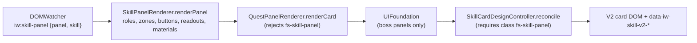

# 2. Complete feature inventory

This chapter lists **every** visual, interactive and behavioural feature of the skin as its own entry. Each entry uses the same rows so features can be compared:

| Row | Meaning |
| --- | --- |
| **What** | What the player sees or experiences |
| **Why** | The problem it solves or the design intent (from code comments and `docs/traps`) |
| **Where** | Modules, functions, stylesheets and line ranges |
| **Depends on** | Game DOM hooks, other skin modules, data, assets |
| **Runs** | When it executes and how often |
| **States & fallbacks** | Loading, empty, error, and degraded behaviour |
| **Responsive** | Breakpoints and container queries |
| **Motion** | Transitions and animations, and reduced-motion behaviour |
| **Hover / focus / keyboard** | Interaction states |
| **Accessibility** | Semantics, names, hidden content, target sizes |
| **Edge cases & findings** | Known limits and linked findings (register in [Chapter 5](05-javascript-safety-review.md#findings-register)) |
| **Tests** | Suites that pin it ([Chapter 7](07-testing-and-verification.md)) |

Evidence labels ([Source], [Generated], [Test run], [Project record], [Assumption]/[Verify]) are defined in [Chapter 1](01-project-overview.md). Unless marked otherwise, every statement here is [Source].

## 2.0 Feature index

| ID | Feature | Primary modules | Primary stylesheets |
| --- | --- | --- | --- |
| F-01 | Activation and hydration gate | `content.js`, `HydrationGate.js`, `hydration-signal.js` | — |
| F-02 | Kill switch and teardown | `content.js`, every `clear*()` | — |
| F-03 | Style injection and asset URL rewriting | `StyleInjector.js` | all |
| F-04 | Mutation reconciliation and flush budget | `DOMWatcher.js` | — |
| F-05 | Rendered-copy selection and breakpoint epoch | `Viewport.js` | — |
| F-06 | Error isolation and console reporting | `Runtime.js` | — |
| F-07 | Global dark-fantasy theme and typography | — | `base.css` |
| F-08 | Surface colour repainting | `BackgroundPainter.js` | — |
| F-09 | Per-zone theming | `HeaderRenderer.js`, `zoneThemes.js`, `SkillsArtService.js` | `base.css`, `card-button-atlas.css` |
| F-10 | Generic control language | — | `ui-system.css`, `base.css` |
| F-11 | Ghost-metal compact button art | `CompactButtons.js` | `compact-buttons.css` |
| F-12 | Forged section frames | `UIFoundation.classifySectionFrames` | `ui-system.css` |
| F-13 | Collapsible frames | `CollapsibleFrames.js` | `collapsible.css` |
| F-14 | Player header reorganisation | `HeaderRenderer.js` | `header.css` |
| F-15 | Per-zone header painting | `HeaderRenderer.applyZoneSurface` | `header.css` |
| F-16 | Main navigation rail | `UIFoundation.classifyMainNav` | `ui-system.css`, `header.css` |
| F-17 | Toolkit link | `UIFoundation.ensureToolkitLink` | `ui-system.css` |
| F-18 | Announcement bar | `HeaderRenderer.classifyAdjacent` | `header.css` |
| F-19 | Zone bar | `UIFoundation.classifyZoneBar` | `header.css`, `ui-system.css` |
| F-20 | Merged header chrome | `HeaderChrome.js` | `ui-system.css` |
| F-21 | Current Action panel and progress smoothing | `UIFoundation` activity panels, `ProgressCadence.js` | `ui-system.css` |
| F-22 | Action Log panel | `UIFoundation` | `ui-system.css` |
| F-23 | World Chat panel | `UIFoundation` | `ui-system.css` |
| F-24 | Daily XP Boost chip | `UIFoundation.classifyDailyBoost` | `ui-system.css` |
| F-25 | Skill card detection and discipline identity | `DOMWatcher.detectSkillType` | — |
| F-26 | Skill card structure and three-zone layout | `SkillPanelRenderer.annotateStructure` | `skillpanel.css` |
| F-27 | Skill command button styling | `SkillPanelRenderer.styleButton` | `skillpanel.css` |
| F-28 | Skill medallion artwork and identity text | `SkillPanelRenderer`, `SkillsArtService` | `skillpanel.css` |
| F-29 | Level/XP readout presentation | `SkillPanelRenderer.neutraliseReadouts` | `skillpanel.css`, `skillcard-v2.css` |
| F-30 | Material (ingredient) lists and met highlighting | `SkillPanelRenderer` | `skillpanel.css` |
| F-31 | V2 card: medallion XP ring and level badge | `SkillCardDesignController` | `skillcard-v2.css` |
| F-32 | V2 card: themed square action button, glyph and fitted label | `SkillCardDesignController`, `SkillsArtService` | `skillcard-v2.css`, `card-buttons.css`, `card-button-atlas.css`, `skillpanel.css` |
| F-33 | V2 card: activity fill smoothing | `SkillCardDesignController.smoothActionFill` | `skillcard-v2.css`, `card-buttons.css` |
| F-34 | V2 card: long-action countdown | `SkillCardDesignController` | `skillcard-v2.css` |
| F-35 | V2 card: detail body and requirement note | `SkillCardDesignController` | `skillcard-v2.css`, `skillcard-v2-runtime-safe.css` |
| F-36 | Recipe pager (previous/next) | `SkillPanelRenderer`, `SkillCardDesignController` | `skillpanel.css`, `skillcard-v2.css`, `card-buttons.css` |
| F-37 | Skill Actions section frame | `SkillPanelRenderer.ensureSkillActionsFrame` | `skillpanel.css`, `ui-system.css` |
| F-38 | Quest cards | `QuestPanelRenderer.js` | `skillpanel.css` (quest section) |
| F-39 | Quest objective item hovercard | `QuestPanelRenderer.ensureObjectiveTrigger` | `skillpanel.css` |
| F-40 | Inventory row overlay | `InventoryRenderer.renderRow` | `inventory.css` |
| F-41 | Inventory panel chrome and filters | `InventoryRenderer.classifyInventoryChrome` | `inventory.css` |
| F-42 | Item catalogue service | `ItemDatabase.js` | — |
| F-43 | Sprite icons and upgrade badges | `AtlasService.js` | `base.css`, `inventory.css`, `tooltip-engine.css` |
| F-44 | Item hovercard (tooltip) | `TooltipEngine.js` | `tooltip-engine.css` |
| F-45 | Item-name detection in game text | `NameScanner.js` | *(no stylesheet; see FUN-02)* |
| F-46 | World Boss encounter cards | `WorldBossPanels.js`, `UIFoundation.classifyBossCards` | `ui-system.css` |
| F-47 | World Boss "Possible Rewards" | `WorldBossPanels.rewards` | `ui-system.css` |
| F-48 | Zone Control "Dominion Ward" | `WorldBossPanels.ensureDominion/updateDominion` | `ui-system.css` |
| F-49 | Market listing rows | `UIFoundation.classifyMarket` | `ui-system.css` |
| F-50 | Village route panels | `VillagePanels.js` | `ui-system.css` |
| F-51 | Dashboard Village scene | `VillageScene.js` | `village-scene.css` |
| F-52 | Village ledger | `VillageLedger.js` | `village-scene.css` |
| F-53 | Pop-up and modal framing | `OverlayFramer.js` | `overlay.css` |
| F-54 | Reduced-motion support | many | all |
| F-55 | Responsive and touch behaviour | `Viewport.js`, many | all |

---

## 2.1 Lifecycle and platform features

### F-01 Activation and hydration gate

| | |
| --- | --- |
| **What** | Nothing visible. The skin appears within roughly 0–4 s of page load, once React has finished hydrating the server-rendered page. |
| **Why** | Appending skin nodes while React was hydrating made React throw minified error **#418** (hydration mismatch) and re-render the whole tree [Project record: `CLAUDE.md`, `HydrationGate.js` header]. |
| **Where** | [`src/page/hydration-signal.js`](../../src/page/hydration-signal.js) (MAIN world, `document_start`); [`HydrationGate.waitForPageHydration`](../../src/modules/HydrationGate.js); [`content.js` `start()`](../../src/content.js#L196) lines 196–217. |
| **Depends on** | React's private root fields: the `__reactContainer$<random>` expando on the container, then `.stateNode.current.memoizedState.isDehydrated`. The candidate containers are `document`, `<html>`, `<body>`, `#__next` and each child of `<body>`. |
| **Runs** | Once per page load. The signal polls every 50 ms with a `setTimeout` chain for up to 15 s. The gate polls the latch every 50 ms for up to 4 s. |
| **States & fallbacks** | The signal writes `data-iw-page-hydrated` as follows: <ul><li>`"1"` when `isDehydrated === false`;</li><li>`"unknown"` when the root is found but the field is not a boolean;</li><li>nothing after 15 s.</li></ul> The gate resolves `{state: '1' \| 'unknown' \| 'timeout' \| 'disabled', waitedMs}`, then removes the latch. On timeout the skin boots anyway. `console.log('[IW Fantasy Skin] boot after page hydration: <state> (<ms>ms)')` records the measurement. |
| **Responsive / Motion** | — |
| **Hover / focus / keyboard** | — |
| **Accessibility** | — |
| **Edge cases & findings** | <ul><li>If hydration finishes between 4 s and 15 s, the latch is written after the gate has gone and stays on `<html>` until teardown (FUN-13).</li><li>The page could write the latch itself and make the skin boot early (SEC-06).</li><li>A React upgrade that renames these private fields degrades every load to the 4 s timeout.</li><li>`HYDRATION_GATE_ENABLED = true` is a compile-time switch.</li></ul> |
| **Tests** | `hydration-gate.test.mjs` (protocol, timeout, disabled path); `extension-e2e.test.mjs` (both worlds load from the real unpacked extension). |

### F-02 Kill switch and teardown

| | |
| --- | --- |
| **What** | Setting `chrome.storage.local['iw-skin-enabled']` to `false` removes the whole skin from the open page without a reload, and setting it to `true` rebuilds it. **There is no user-facing toggle** (no popup or options page). The key is changed from DevTools in the extension's content-script context ([§6.1.4](06-integration-and-maintenance.md#614-kill-switch)). |
| **Why** | A/B debugging against the same live game state, and a guarantee that the skin is fully reversible (rule 3) [Source: README "Kill switch"]. |
| **Where** | [`content.js`](../../src/content.js) `applyEnabled`, `boot` (L119–153) and `teardown` (L163–189); [`Runtime.onStorageChanged`](../../src/modules/Runtime.js#L108). |
| **Depends on** | `chrome.storage.local` (permission `storage`). |
| **Runs** | On every change to the key, for the page lifetime. Boot is idempotent (`booted` flag). Teardown before boot only marks the runtime inactive. |
| **States & fallbacks** | A missing key or a failed read means **enabled**. Teardown order: watcher → item-DB refresh timer → tooltip hide → name-scan highlight → inventory → V2 card → skill panels → quests → UI foundation (header chrome, collapse, Village scene, compact buttons, boost, bosses, Village panels, nav, frames) → header → background paint → overlays → **all style elements** → hydration latch → `setRuntimeActive(false)` → `console.log('… disabled — active presentation removed')`. |
| **Responsive / Motion** | — |
| **Hover / focus / keyboard** | — |
| **Accessibility** | Restores every native `aria-*` value that the skin overwrote. Exception: the attributes listed in FUN-09 are removed unconditionally. |
| **Edge cases & findings** | <ul><li>Page-lifetime listeners (tooltip, name scanner, event-bus consumers) stay bound but inert. `#iw-tip` stays in the DOM, hidden (FUN-10).</li><li>Collapsed-panel titles can disappear after a round trip (FUN-04).</li><li>The enabled value is read **before** the up-to-4 s hydration wait, and the change listener is only registered **after** it. A change made during that window is not seen until the next change.</li></ul> |
| **Tests** | `smoke.test.mjs` (disable/enable/disable round trips, native inline styles restored exactly, no duplicate tooltip/storage surfaces); `compact-button-boot.test.mjs` (real bundled reactivation path); `extension-e2e.test.mjs`. |

### F-03 Style injection and asset URL rewriting

| | |
| --- | --- |
| **What** | Seven `<style data-iw-style="…">` elements appended to `<head>`, in fixed order. |
| **Why** | <ul><li>Manifest-declared CSS cannot be removed at runtime.</li><li>Injecting text lets the kill switch remove every rule, including the global theme [Source: README rule 5].</li><li>Rewriting `url(../assets/…)` to `chrome-extension://<id>/assets/…` makes art load from the extension, not a third-party origin that the page's CSP could block [Source: `vendor-assets.mjs` header].</li></ul> |
| **Where** | [`StyleInjector.js`](../../src/modules/StyleInjector.js) (`inject`, `rewriteAssetUrls`, `removeAll`); `content.js` `injectPresentationStyles` (L57–72); `UIFoundation.injectUIFoundationStyles`. |
| **Depends on** | `chrome.runtime.getURL`; `web_accessible_resources` for `assets/*`. |
| **Runs** | Once per boot. `inject(id)` is a no-op if that id is already injected. |
| **States & fallbacks** | <ul><li>Without `chrome.runtime` (tests), `assetUrl` returns the relative path.</li><li>The rewrite regex only matches `url(../assets/…)` with optional quotes. Any other form, such as `url(/assets/…)` or `url(assets/…)`, is left untouched and would 404 on the game's origin.</li></ul> |
| **Edge cases & findings** | <ul><li>`removeAll()` removes **every** `style[data-iw-style]`, including one another script might add with the same attribute.</li><li>`textContent` is used, so no HTML is parsed.</li><li>Injection order is load-bearing: `ui-system` must be last (`static-invariants.test.mjs`).</li></ul> |
| **Tests** | `static-invariants.test.mjs` (order, count of 7); `smoke.test.mjs` (all style elements removed on disable). |

### F-04 Mutation reconciliation and flush budget

| | |
| --- | --- |
| **What** | Nothing visible directly. Every skin decoration follows React's updates within a frame or two. |
| **Why** | React replaces and updates nodes constantly (timers, XP ticks, chat). One budgeted observer keeps the skin current without feedback loops or long frames [Project record: `docs/traps/performance.md`]. |
| **Where** | [`DOMWatcher.js`](../../src/modules/DOMWatcher.js): `startWatcher` (L358 observer), `queueContext`, `discover`, `drainGlobalBudget`, `flushPending`, `emit`. |
| **Depends on** | `.compact-row` / `[class*="item-row"]` (inventory rows) and `.compact-panel` (skill, quest, boss, village and shop cards). |
| **Runs** | <ul><li>**Observer.** Observes `document.body` with `childList`, `subtree`, `characterData`, and `attributes` filtered to `class`, `style`, `disabled`, `aria-disabled`, `aria-pressed`, `aria-selected`, `aria-current` and `data-state`.</li><li>**Flush scheduling.** Mutations are sorted into four pending sets (inventory rows, skill panels, background roots, name roots). One `requestAnimationFrame` flush processes at most **60 elements in total**, round-robin across the sets. Leftovers reschedule to the next frame.</li><li>**Breakpoint crossings** (640/768/1024/1280/1536) trigger `discover(document.body)`.</li></ul> |
| **States & fallbacks** | Disconnected elements are dropped from the queues. Name roots already covered by an ancestor root are skipped. |
| **Edge cases & findings** | <ul><li>`data-iw-*` writes and `<html>` attribute changes are invisible to the observer (by design). Code that changes state only through them must run its own pass.</li><li>A same-value `class`/`setAttribute`/`textContent` write still emits a record, so every renderer compares before writing.</li><li>Page scripts can dispatch forged `iw:*` events (SEC-05).</li></ul> |
| **Tests** | `flush-quiescence.test.mjs` (zero flushes on a quiet page); `smoke.test.mjs`; `route-swap-reclassify.test.mjs`; `viewport-swap.test.mjs`. |

### F-05 Rendered-copy selection and breakpoint epoch

| | |
| --- | --- |
| **What** | Nothing visible. The skin decorates the copy of each panel that is actually on screen. |
| **Why** | The game renders its panel stack twice: a `hidden xl:grid` copy and an `xl:hidden` copy. Which one is visible swaps at 1280 px, and a breakpoint crossing mutates nothing [Source: `Viewport.js` header; Project record]. |
| **Where** | [`Viewport.js`](../../src/modules/Viewport.js): `isRendered` (`checkVisibility()`, else a non-zero rect), `pickRendered`, `preferRendered` (falls back to every candidate when none is rendered, as in jsdom), `startLayoutWatch`/`stopLayoutWatch` (`matchMedia('(min-width: Npx)')` change listeners), `getLayoutEpoch`. |
| **Depends on** | Tailwind breakpoints 640/768/1024/1280/1536. |
| **Runs** | Consulted by every classifier cache. The epoch increments on each breakpoint crossing and is never reset. |
| **Edge cases & findings** | Caches keyed on elements must also check the epoch, or they keep decorating the now-hidden copy. |
| **Tests** | `viewport-swap.test.mjs`, `header-hidden-duplicate.test.mjs`, `inventory-root.test.mjs`. |

### F-06 Error isolation and console reporting

| | |
| --- | --- |
| **What** | If one element is malformed, only that element stays un-skinned. The console receives at most one warning per failure label. |
| **Why** | The game mutates continuously, so an exception thrown per frame would flood the console and break every later renderer in the same flush. |
| **Where** | [`Runtime.js`](../../src/modules/Runtime.js) `warnOnce` (L132), `guard` (L145), `guardEach` (L160). |
| **Runs** | Around every consumer, renderer and teardown step. `guard` returns `false` without running `fn` while the runtime is inactive. |
| **States & fallbacks** | Console output from the skin: <ul><li>boot and hydration lines (`console.log`);</li><li>`warnOnce` warnings prefixed `[IW Fantasy Skin] <label>:`;</li><li>`AtlasService` warns once per item name without an icon (`[AtlasService] No icon found for "<name>"`);</li><li>`ItemDatabase` warns on load and refresh failures.</li></ul> No error is sent anywhere. |
| **Edge cases & findings** | `_warned` and `AtlasService._missingWarned` are unbounded `Set`s keyed by label and by item name. Both grow slowly and are cleared only by a reload. |
| **Tests** | `smoke.test.mjs` (malformed rows do not stop others). |

## 2.2 Global look

### F-07 Global dark-fantasy theme and typography

| | |
| --- | --- |
| **What** | <ul><li>**Palette.** Near-black warm ink replaces the game's navy/slate palette, with brass/ember accents.</li><li>**Fonts.** Cinzel headings, Barlow UI text, Crimson Text italic for flavour text.</li><li>**Shapes.** Rounded corners flattened to 2–4 px, and dark forged grounds on every `.compact-panel` and `.compact-row`.</li><li>**Controls.** Themed scrollbars, a gold focus ring on controls, and forged text inputs.</li></ul> |
| **Why** | Establishes the "Ashen Iron" identity with the fewest DOM writes: everything is a stylesheet, removed as one unit. |
| **Where** | [`base.css`](../../src/styles/base.css) (713 lines): <ul><li>`@font-face` ×6;</li><li>`:root` tokens `--iw-ink-*`, `--iw-th-*`, `--iw-line*`, `--iw-gold*`, `--iw-ember*`, text, semantic, tier and font tokens, radii, `--iw-action-tick`;</li><li>**game token overrides** (`--background`, `--foreground`, `--card`, `--popover`, `--primary`, `--accent`, `--ring`, `--border`, `--input`, `--muted`, `--sidebar*`, `--panel-bg`, `--panel-border`, `--surface-*`), all `!important`;</li><li>body ground; heading fonts; forged `.compact-panel`/`.compact-row` ground; Tailwind radius flattening (`[class*="rounded-…"]`); button/input base; `::-webkit-scrollbar`;</li><li>`.tier-*` colours; a global reduced-motion rule.</li></ul> |
| **Depends on** | Tailwind utility class substrings (`rounded-*`, `hover:underline`, `px-`); the shadcn-style CSS variables the game defines [Assumption: token names inferred from the overrides]; `.compact-panel`, `.compact-row`. |
| **Runs** | Static CSS, active while injected. |
| **States & fallbacks** | Font files are self-hosted with `font-display: swap`, so the fallback serif/sans shows until they load. |
| **Responsive** | None in `base.css` beyond inherited tokens. |
| **Motion** | `@media (prefers-reduced-motion: reduce) { * { transition: none !important; animation: none !important } }`. This applies to **the whole page**, including the game (FUN-03). |
| **Hover / focus / keyboard** | Buttons: `filter: brightness(1.08)` on hover. `:focus-visible` gets `outline: 1px solid` gold with 2 px offset (`!important`) on buttons, `[role=button]`, inputs, selects and textareas. |
| **Accessibility** | The focus ring is **1 px**. WCAG 2.2 "Focus Appearance" (AAA) is not met; minimum contrast is [Verify]. Scrollbars are 7 px. |
| **Edge cases & findings** | <ul><li>Overriding the game's own design tokens with `!important` restyles components the skin never classifies. That is useful, but it depends on the game's token names.</li><li>The `.iw-ico`, `.iw-btn*` and `.iw-xp*` rules are unused (MAINT-01).</li></ul> |
| **Tests** | `static-invariants.test.mjs` (breakpoints aligned to Tailwind, injection rules); fixture renders (`npm run fixtures`). |

### F-08 Surface colour repainting

| | |
| --- | --- |
| **What** | Game surfaces painted in one of 20 known navy hex colours are repainted in the nearest-luminance warm ink (`#0B0C0A`, `#14130F`, `#191711` or `#1E1B15`). Borders in those colours become `#342D20`. |
| **Why** | Some grounds come from inline styles or Tailwind arbitrary values that no stylesheet can target generically [Source: module header]. |
| **Where** | [`BackgroundPainter.js`](../../src/modules/BackgroundPainter.js): `GAME_NAVIES`, `SURFACE_SELECTOR`, `isSurfaceCandidate`, `paintElement`, `paintBackground`, `clearBackgroundPaint`. |
| **Depends on** | <ul><li>**Exact computed colours**: an exact-hex whitelist.</li><li>**Candidates**: `body`; any element matching `.compact-panel`, `.compact-row`, `[class*="item-row"]`, `[role=dialog/menu/listbox]`, `main`, `section`, `article`, `aside`, `header` or `nav`; children of `<body>`; grandchildren of `<body>` with more than one child element.</li></ul> |
| **Runs** | <ul><li>At boot on `document.body`.</li><li>On every `iw:dom-flush`, for each changed background root (or the whole document when there are no roots).</li><li>Each run is a TreeWalker over the root, with `getComputedStyle` on candidates only.</li></ul> |
| **States & fallbacks** | Writes inline `!important` through `InlineStyleOwner`, and records `data-iw-painted="1"`. React rewriting a stock colour gets repainted on the next flush. |
| **Edge cases & findings** | <ul><li>Alpha is ignored, so translucent navy becomes opaque (FUN-11).</li><li>The walker runs a `closest()` per element (PERF-04).</li><li>Skin-owned trees (`.fs-inv-row`, `.fs-skill-header`, `.iw-tip`) and `.fs-skill-wrapper` are skipped.</li></ul> |
| **Tests** | `smoke.test.mjs` (native inline background restored exactly on teardown). |

### F-09 Per-zone theming

| | |
| --- | --- |
| **What** | The page's accent palette follows the zone the player is in. There are nine environment themes: **glacial, infernal, verdant, forged-metal, celestial, voidborn, runic-arcane, lunar-spectral and tempest-oceanic**. For each theme the following swap: <ul><li>the theme palette (`--iw-th-*`);</li><li>the skills UI atlas (`theme_<t>.webp`);</li><li>the four-corner frame filigree (`panel_corners_<t>.webp`);</li><li>the separator flourish (`separator_flourish_<t>.webp`);</li><li>the button art (revised-v5 action/chevron atlases, compact-ghost-v3 small-control atlas, card-v6 V2 plates).</li></ul> |
| **Why** | Ties the chrome to the game world, so each zone "feels" different [Project record: `docs/traps/zone-theming.md`]. |
| **Where** | <ul><li>[`HeaderRenderer.applyZoneTheme`](../../src/modules/HeaderRenderer.js#L118) writes `html[data-iw-zone-theme]` plus inline `--iw-zone-atlas`, `--iw-corner-filigree` and `--iw-zone-separator` on `<html>`, and calls `SkillsArtService.applyThemeVariables(html, theme)`. That call writes `data-iw-button-atlas="revised-v5"`, `data-iw-compact-atlas="compact-ghost-v3"`, `--iw-compact-atlas`, and `--iw-<kind>`/`--iw-<kind>-paint` for 12 button-art kinds.</li><li>[`zoneThemes.js`](../../src/modules/zoneThemes.js) (generated map: zone 1–34 → theme).</li><li>`base.css` (9 `:root[data-iw-zone-theme="…"]` palettes, the derived `color-mix` edge scale, the un-themed defaults).</li><li>`card-button-atlas.css` (generated per-theme V2 plate windows).</li><li>`skillpanel.css` L3642–3885 (themed button states, the revised-v5 crossfade).</li></ul> |
| **Depends on** | The zone label, read from `[data-iw-ui="zone-title"]` (F-19). Fallback: a text scan for `^zone\s*\d+\s*:` over every `div, span, p, strong`. |
| **Runs** | On every header reconcile (a rAF after each `iw:dom-flush`). It writes only when the theme key or button readiness changes. |
| **States & fallbacks** | <ul><li>**Unknown zone** (nothing read yet, or a zone outside 1–34): `data-iw-zone-theme="default"`, inline variables removed, `base.css` defaults.</li><li>**Leaving the Game route** (zone bar unmounts): the last zone read is kept (`lastZoneNumber`), so other routes stay themed.</li></ul> |
| **Motion** | Theme changes apply instantly; no transition. |
| **Edge cases & findings** | <ul><li>`<html>` is outside the observed `<body>`, so these writes can never trigger a flush.</li><li>The `exact-v3` art branch is unreachable (SIZE-01).</li><li>The zone text scan on non-Game routes is a cost (PERF-02).</li><li>A zone added after 34 falls back to `default` until `zone-theme-map.json` and `zoneThemes.js` are regenerated.</li></ul> |
| **Tests** | `zone-themes.test.mjs` (map in step with the JSON; every asset exists); `button-art-states.test.mjs`, `revised-button-atlas.test.mjs`, `card-button-art.test.mjs`, `compact-button-atlas.test.mjs`; `corner-filigree-density.test.mjs`; `separator-symmetry.test.mjs`. |

### F-10 Generic control language

| | |
| --- | --- |
| **What** | Every game `<button>` and `[role=button]` that is not specifically themed gets a "carved slate" surface: a faint edge, a bevel gradient and an inset shadow. Hover lights an ember inner glow, and disabled controls are desaturated and darkened. Search inputs get a recessed look. |
| **Why** | Gives unclassified controls (modal buttons, steppers, chat tools) a consistent material without changing their geometry or their **text colour**, which is often live state (rule 5) [Source: comments at `ui-system.css` L1008–1050]. |
| **Where** | [`ui-system.css`](../../src/styles/ui-system.css): L1019 (rest), the hover rule, L1057–1062 (min-height floors for classified controls only), the disabled rule, and `input[type=search]`. `base.css` has the matching `:not()` chains. |
| **Depends on** | The `:not()` opt-out chain lists every control that paints its own art: `.iw-item-ref`, `[data-iw-collapse]`, `[data-iw-compact-button]`, `[data-iw-inventory-control]`, `[data-fs-preserved-action="control"]`, `[data-iw-ui="nav-tab"]`, `[class*="chat-name-"]`, `[class*="hover:underline"]`, the skill level-progress/nav-button/action-button roles, `[data-iw-quest-role]`, plus more (Appendix B, `ui-system.css:1019`). |
| **Runs** | Static CSS. |
| **Hover / focus / keyboard** | Hover: border `--iw-line-hot`, inner glow. Focus: from `base.css`. Disabled (`:disabled`, `[aria-disabled="true"]`): `filter: saturate(.58) brightness(.84)`. |
| **Edge cases & findings** | <ul><li>Specificity is **(0,30,3)** (D-01). A new control that paints its own art must be added to the `:not()` chain, never beaten with higher specificity (MAINT-02).</li><li>Geometry floors apply only to positively classified controls; the reason is recorded as Audit S3.5.</li></ul> |
| **Tests** | `skill-card-system.test.mjs` (cascade checks with all sheets); `revised-button-atlas.test.mjs`. |

### F-11 Ghost-metal compact button art

| | |
| --- | --- |
| **What** | Small text and icon controls wear themed "ghost metal" art with three states (idle, hover, pressed) that crossfade: <ul><li>navigation tabs;</li><li>inventory filters and pager;</li><li>zone actions;</li><li>the World Chat **Send** button;</li><li>preserved inventory row actions;</li><li>the loadout **I/II** pair;</li><li>**Change Zone** and its timer icon.</li></ul> The selected loadout and the active filter keep a visible accent. |
| **Why** | These controls are too small for the large action frames. A three-slice atlas keeps the end caps undistorted at any label width. |
| **Where** | [`CompactButtons.js`](../../src/modules/CompactButtons.js) (`decorateCompactButtons`, called by `UIFoundation.queueClassify` step 11), [`compact-buttons.css`](../../src/styles/compact-buttons.css), `--iw-compact-atlas` from F-09. |
| **Depends on** | <ul><li>**Matching.** `CONTROL` = `button`, `a[data-iw-ui="nav-tab"]`, `a/[role=button][data-fs-preserved-action="control"]`. `kind()` then classifies by earlier skin marks, by label (`^(I\|II)$` pairs, `^change zone$`) and by timer glyphs.</li><li>**Selection.** Read from `aria-pressed`/`aria-selected`, else `data-state="active"`, else a class substring (`bg-/text-/border-` + `orange\|amber\|primary\|accent\|ember`).</li></ul> |
| **Runs** | Every classify pass (rAF after each `iw:dom-flush`), over every matching control. |
| **States & fallbacks** | <ul><li>The layer spans (`span[data-iw-compact-layer="idle\|hover\|clicked"]`, `aria-hidden`) are appended **inside** the native control.</li><li>They stay `display:none` unless `html[data-iw-compact-atlas="compact-ghost-v3"]` is present, so there is no art without a theme.</li><li>A control that stops matching has its layers removed.</li></ul> |
| **Motion** | Hover layer fades in over 180 ms; pressed layer over 70 ms. Both are disabled under reduced motion. |
| **Hover / focus / keyboard** | `:hover` and `:focus-visible` show the hover layer; `:active` shows the pressed layer; `:focus-visible` has a 2 px accent outline. Disabled controls hide the hover and pressed layers and drop to 0.45 opacity. |
| **Accessibility** | Layers are `aria-hidden`; the native label and handlers are untouched. The active nav tab text is forced light for contrast. |
| **Edge cases & findings** | Appending children into a native `<button>` changes `button.children`. Game code that reads `children[0]` of these buttons would see the same first child, because layers are appended last [Assumption: the game does not index children]. |
| **Tests** | `compact-button-atlas.test.mjs`, `compact-button-reconcile.test.mjs`, `compact-button-boot.test.mjs`. |

### F-12 Forged section frames

| | |
| --- | --- |
| **What** | Every top-level game panel (Inventory, Skill Actions, Quests, Market, Leaderboards, World Bosses, Village, Salvaging, Zone Selector, the activity panels, and the nav rail) is drawn as one shared "forged frame". The frame has a textured ground with a per-zone wash, a 1 px themed edge, a gold hairline along the top, and four corner filigrees at a fixed size. Headings get the Cinzel frame title at `--iw-frame-title-size` (18 px). |
| **Why** | One treatment so every panel reads as the same object; previously three different grounds competed [Source: comment L27–41]. |
| **Where** | [`UIFoundation.classifySectionFrames`](../../src/modules/UIFoundation.js) (`data-iw-ui="section-frame"`, `section-title`); [`ui-system.css`](../../src/styles/ui-system.css) L44–134 (frame, `::before` hairline, `::after` corner `border-image`, children raised to z-index 1), the ≤1024 px padding and corner scale, the nav rail opt-out `:not(:has([data-iw-ui="nav-tab"]))`, and layout columns stripped bare. |
| **Depends on** | <ul><li>**Panels.** `.panel`, via `preferRendered`, excluding: overlays; elements owned elsewhere (`header`, the zone bar, `[data-iw-panel]` activity panels); and panels nested in a frame (leaf frames only, via `:not(:has(…))`).</li><li>**Headings.** Orphan headings are matched by name (`inventory\|market\|leaderboards\|quests\|world bosses\|village\|salvaging\|skill actions\|zone selector`) and walked up to 5 levels.</li></ul> |
| **Runs** | Each classify pass, using a heading index built once per pass. |
| **States & fallbacks** | A panel without a recognised heading still gets the frame, because frames key on `.panel` rather than on copy [Project record: `docs/traps/panel-frames.md`]. |
| **Responsive** | ≤1024 px: padding comes from `--iw-frame-pad-mobile-*` and the corner shrinks to 27×25 px. |
| **Accessibility** | Decorative pseudo-elements only, with `pointer-events: none`. |
| **Edge cases & findings** | <ul><li>A frame inside another frame is left bare (the layout-column case).</li><li>A collapsed frame hands its corner art to `collapsible.css` through a `:not([data-iw-collapsed="1"])` opt-out, because the base rule is `!important` on every declaration.</li></ul> |
| **Tests** | `panel-frame-nesting.test.mjs`, `route-swap-reclassify.test.mjs`, `collapsible-frames.test.mjs`. |

### F-13 Collapsible frames

| | |
| --- | --- |
| **What** | A 22 px chevron button at the right of each frame's heading row folds the panel to a single title bar; clicking again expands it. The choice is remembered per panel across reloads. Panels covered: Skills, Inventory, Quests, Village, World Bosses, Current Action, Action Log, World Chat, Zone Control and the Village scene. |
| **Why** | Players with many panels want to hide the ones they are not using. Only the skin's own appended control changes state; React's nodes are never moved or wrapped [Source: `CLAUDE.md`; `docs/traps/collapsible-frames.md`]. |
| **Where** | [`CollapsibleFrames.js`](../../src/modules/CollapsibleFrames.js): <ul><li>`decorateCollapsibleFrames` (the last classify step);</li><li>`markSpine`, `ensureToggle`, `applyState`, `loadPreferences`, `persist`, `clearCollapsibleFrames`.</li></ul> [`collapsible.css`](../../src/styles/collapsible.css). |
| **Depends on** | <ul><li>**Frames.** `FRAME` = `[data-iw-ui="section-frame"]`, `[data-iw-inventory-root="1"]` or `.fs-skills-section-frame[data-iw-skills-ui-ready="1"]` (leaf frames only).</li><li>**Title.** `[data-iw-ui="section-title"]` → `[role=heading]` → `h1–h4`.</li><li>**Head.** The frame's direct child that contains the title.</li><li>**Fold target.** The closest leaf `.panel`, else the frame.</li><li>**Storage key.** `panel:<slug>` or `title:<lowercase title>`.</li></ul> |
| **Runs** | Each classify pass. Preferences load once per activation from `chrome.storage.local['iw-collapsed-frames']`. |
| **States & fallbacks** | Collapsed: <ul><li>`data-iw-collapsed="1"` on the target;</li><li>`[data-iw-collapsed="1"] > *:not(toggle):not(head)` → `display: none`;</li><li>inside the head, every element not on the spine is hidden, leaving the title plus the toggle;</li><li>a single top-left corner filigree is drawn.</li></ul> Expanded: attributes removed. Toggles whose target disappears are removed along with their marks. |
| **Responsive** | Under `(pointer: coarse)`, a `::before` extends the hit area by 5 px on each side (32 px target). |
| **Motion** | The chevron rotates between −135° and 45°; disabled under reduced motion. |
| **Hover / focus / keyboard** | Native `<button type="button">`, so Enter and Space work. `:focus-visible` outline. The click handler calls `preventDefault()` and `stopPropagation()`, so a heading row that is itself clickable in the game does not also react. |
| **Accessibility** | `aria-expanded` reflects state; `aria-label` and `title` read `Collapse <name>` or `Expand <name>`. No `aria-controls`. |
| **Edge cases & findings** | <ul><li>The title can vanish from collapsed bars after a kill-switch round trip (FUN-04).</li><li>The Village ledger and boss rewards use their own disclosure namespaces, so the document-wide sweep never adopts them.</li><li>When V2 cards are folded under a collapsed Skill Actions frame, `skillcard-v2.css:109` hides them explicitly.</li></ul> |
| **Tests** | `collapsible-frames.test.mjs` (38 checks: every parent frame folds alone, persistence, teardown). |

## 2.3 Header, navigation and zone chrome

### F-14 Player header reorganisation

| | |
| --- | --- |
| **What** | The game's player header becomes one framed banner laid out as a grid of three parts: <ul><li>**Identity region**: an ornamental crest, a smoked-glass block with the "IdleWorlds" brand between rules, the player name, the profile title, "Combat Lv N · Zone N", and a "Players online: N" line with a teal dot.</li><li>**Utility rail**: the game's icon buttons as equal-width plates.</li><li>**Status grid**: vitals and buff tiles in two columns (combat, boost, timers, gold). On wide screens the combat and boost tiles form a plaque.</li></ul> |
| **Why** | Gives the header the RPG identity, and makes the stat tiles readable at a glance without changing any value [Project record: `docs/traps/header-chrome.md`]. |
| **Where** | [`HeaderRenderer.js`](../../src/modules/HeaderRenderer.js): <ul><li>resolution: `findLiveHeader`, `classifyProfile`, `ensureCrest` (prepends `span.fs-header-crest`), `classifyUtilities`, `classifyStatus`, `tagStatusCards`, `statKind`;</li><li>painting: `applyHeaderVars`, `reconcile`, `queueReconcile`, `clearHeaderRenderer`.</li></ul> [`header.css`](../../src/styles/header.css) §0–§5, §9, §10. |
| **Depends on** | <ul><li>**The live header**: a `<header>` whose text contains `combat lv N`, `players online: N` and `atk N … def N … hp N`, chosen with a visibility tie-break.</li><li>**Name and profile**: `h1.header-player-name` (or `h1`); `.min-w-0.overflow-hidden` for the profile block.</li><li>**Utilities and status**: `button.header-icon-btn`; `.grid.grid-cols-2` or `.stat-chip`.</li><li>**Assets**: the header art files under `assets/header/`.</li></ul> |
| **Runs** | `queueReconcile` on every `iw:dom-flush`, coalesced to one rAF. The resolution is cached and revalidated by connectivity and roles. Stat cards are re-tagged on every reconcile. |
| **States & fallbacks** | <ul><li>If no qualifying `<header>` exists (logged-out page, changed copy), nothing is tagged and the header stays native.</li><li>A missing profile, utilities or status block leaves that part unstyled.</li><li>Roles are written as `data-iw-header="root\|layout\|profile\|profile-name\|profile-meta\|profile-online\|brand\|profile-title\|identity-region\|utilities\|utility-button\|status-grid\|status-card\|announcement\|zone-shell"`, plus `data-iw-header-card` (1-based index) and `data-iw-header-stat` (the kind).</li></ul> |
| **Responsive** | <ul><li>≤1280 px: one column; the identity block stretches; 42 px utilities.</li><li>≤860 px: crest 108×116; utilities in a flex row; status grid in two auto columns.</li><li>≤768 px: mobile header painting (F-15).</li><li>≥861 px: combat/boost plaque via `:has([data-iw-header-stat="boost"])`.</li></ul> |
| **Motion** | Hover transitions on utility plates; disabled under reduced motion (§10). |
| **Hover / focus / keyboard** | Utility plates brighten on hover. Native buttons keep their focus behaviour, with the `base.css` focus ring. |
| **Accessibility** | The crest is `aria-hidden`. "Players online" is a real `<button>` in the game and stays one; only its chrome is removed. The player-name colour is left to the game (rule 5): it may encode a cosmetic or rank. |
| **Edge cases & findings** | <ul><li>Detection depends on English copy (MAINT-03).</li><li>Teardown walks `querySelectorAll('*')` to remove the header custom properties, which costs O(all nodes) once per disable.</li><li>`--iw-header-frame-bar` maps to no asset (MAINT-04).</li><li>Two statements are joined on one source line (D-10).</li></ul> |
| **Tests** | `header-compact.test.mjs`, `header-hidden-duplicate.test.mjs`, `smoke.test.mjs`. Header assets are audited by `build-tools/audit-header-assets.mjs` (not in `npm test`). |

### F-15 Per-zone header painting

| | |
| --- | --- |
| **What** | The header background shows a painting of the player's current zone: a wide 4:1 strip on desktop, and a portrait crop at ≤768 px. |
| **Why** | Makes location visible at a glance and ties the header to F-09 theming. |
| **Where** | `HeaderRenderer.applyZoneSurface` (L90–102) writes `--iw-header-surface` and `--iw-header-surface-mobile` inline on the header root, plus `data-iw-zone="<N>\|fallback"`. `header.css` §2 paints the variable with `cover`, and §9 swaps to the mobile variable at ≤768 px. |
| **Depends on** | The zone number (F-09 fallback chain); `assets/header/zones/zone_1…34(_mobile).webp`; `header_surface.webp`. |
| **Runs** | Each header reconcile. It writes only when the zone key changes or the variable is missing. |
| **States & fallbacks** | Zone unknown or above `ZONE_SURFACE_MAX` (34) → `header_surface.webp`. The last zone read is retained on non-Game routes. |
| **Responsive** | Desktop/mobile art switch at 768 px. The art choice is CSS-only, so a resize needs no JavaScript. |
| **Edge cases & findings** | `make-zone-surfaces.mjs` can generate procedural placeholders for zones without art. The imported paintings come from a sibling repository (§1.8, [Verify] rights). |
| **Tests** | `zone-headers.test.mjs` (all 68 files present and referenced). |

### F-16 Main navigation rail

| | |
| --- | --- |
| **What** | The route tabs (Game, Market, Leaderboards, Village, Dungeon) become one row of 32 px forged plates in uppercase Barlow. The active tab gets an ember gradient and a glowing underline. |
| **Why** | Clear route affordance that preserves the game's own active state (rule 5). |
| **Where** | `UIFoundation`: <ul><li>`resolveMainNav`, `classifyMainNav` (cached by `mainNavResolutionValid`: epoch, connectivity, roles, tab count);</li><li>`applyMainNavState`, `deriveTabActive`, `warmBackground`.</li></ul> CSS: `ui-system.css` L699–780 (rail), L1081–1090 (≤768 px), L1113–1135 (≤1279 px container font fitting). `header.css` §6 (L661–725) styles the same roles earlier in the cascade; it is overridden property-by-property ([§3.9 Conflicts](03-css-architecture.md#39-conflicts-and-overridden-rules), X-01). |
| **Depends on** | Tabs whose label is one of `NAV_LABELS = ['game','market','leaderboards','village','dungeon']`; the rail is a `.panel`. |
| **Runs** | Each classify pass. |
| **States & fallbacks** | Active-state priority: <ol><li>the tab's own semantic state (`aria-selected="true"`, `aria-current="page"`, or an active-looking class);</li><li>the route in `location.pathname`/`hash`;</li><li>on the first classification only, a "warm" computed background colour;</li><li>the previous state.</li></ol> Writes `data-iw-ui="main-nav\|main-nav-shell\|nav-tab"`, `data-iw-tab="<label>"` and `data-iw-state="active"`. |
| **Responsive** | <ul><li>≤1279 px: the rail becomes an inline-size container `iw-nav-row`, tabs do not wrap, and the font size is `clamp(7.5px, (100cqi − fixed)/k, 11.5px)` with a measured `k` (28.1; 23.25 at ≤767 px).</li><li>≤768 px: full-width rail, tabs flex.</li><li>≤560 px (`header.css`): horizontal scroll with a hidden scrollbar.</li></ul> |
| **Motion** | Colour/background transitions on hover; none under reduced motion. |
| **Hover / focus / keyboard** | Hover lightens the plate. Tabs are the game's own links or buttons, so keyboard behaviour is native. |
| **Accessibility** | Active state is conveyed by the game's semantics when present; the skin adds no ARIA. |
| **Edge cases & findings** | <ul><li>A tab label outside `NAV_LABELS` (a new route) is not styled as a tab.</li><li>The route fallback reads `location` only; it never writes to it.</li></ul> |
| **Tests** | `header-compact.test.mjs`, `menu-rows.test.mjs`, `route-swap-reclassify.test.mjs`. |

### F-17 Toolkit link

| | |
| --- | --- |
| **What** | A "Toolkit ↗" link at the end of the nav rail opens `https://idleworldstoolkit.com` in a new tab. It is hidden below 768 px. |
| **Why** | The skin author's companion calculator site. Opening in a new tab keeps the idle session running [Source: comment at `UIFoundation.js` L292–299]. |
| **Where** | [`UIFoundation.ensureToolkitLink`](../../src/modules/UIFoundation.js#L291) (L289–304); `ui-system.css` L785–815, L1090, L1134. |
| **Depends on** | The resolved nav track (F-16). |
| **Runs** | Each classify pass. The link is created once per track, with every attribute set before insertion, so it costs one mutation record. |
| **States & fallbacks** | Not created if the rail is not found. Its label is not in `NAV_LABELS`, so it can never be marked active. |
| **Responsive** | ≤767 px: `display: none` (the phone bar read as too crowded) [Project record, 2026-09-16]. |
| **Hover / focus / keyboard** | A native `<a href>`: focusable, activates with Enter. Hover changes colour, border and background. |
| **Accessibility** | Its `title` says it opens in a new tab. The visible "↗" is CSS `::after` content. |
| **Edge cases & findings** | A third-party destination inserted into the game's navigation needs a product decision (SEC-09). `rel="noopener noreferrer"` means the target cannot reach the game tab and receives no referrer. |
| **Tests** | `header-compact.test.mjs`, `menu-rows.test.mjs`, `flush-quiescence.test.mjs` (no repeated writes). |

### F-18 Announcement bar

| | |
| --- | --- |
| **What** | The game's short announcement line under the navigation becomes a teal gradient bar with a four-point star ornament. |
| **Why** | Distinguishes system notices from navigation and zone chrome. |
| **Where** | `HeaderRenderer.classifyAdjacent` → `findAnnouncement` (`data-iw-header="announcement"`, `--iw-announcement-frame`); `header.css` §7. When merged, it is `HeaderChrome`'s `data-iw-chrome="notice"` (F-20). |
| **Depends on** | Position: the next sibling of the nav rail's `.panel` (or of the nav or its parent) whose text is ≤260 characters and is not the zone bar. |
| **Runs** | Each header reconcile. |
| **States & fallbacks** | No announcement → nothing is tagged. |
| **Accessibility** | The star is a `::before` pseudo-element; the text is unchanged. |
| **Edge cases & findings** | Identification by position and length: a short, unrelated element in that slot would be styled as an announcement [Verify live]. |
| **Tests** | `header-compact.test.mjs`. |

### F-19 Zone bar

| | |
| --- | --- |
| **What** | The "🧭 Zone N: Name" bar shows the zone title in Cinzel with dimmed secondary text. It has a faint moonlit scene behind it and tone-coded action plates: **Zones** in teal and **Next zone** in ember. Other buttons in the bar become text links. |
| **Why** | Makes the player's location and the zone controls distinct from general navigation. |
| **Where** | `UIFoundation`: <ul><li>`zoneBarCandidatePresent` (a cheap probe for "zones" plus "next zone" buttons);</li><li>`classifyZoneBar` (the innermost label matching `^zone\s*\d+\s*:` after stripping leading icons; host at most 5 levels up and not inside `header`/`nav`);</li><li>role writes `data-iw-ui="zone-bar\|zone-title\|zone-action"`, `data-iw-zone-action="zones\|prev\|next"`, `data-iw-zone-link="1"`;</li><li>cached `zoneBarResolutions`.</li></ul> `HeaderRenderer` adds `data-iw-header="zone-shell"` and the zone art variables. CSS: `header.css` §8, `ui-system.css` zone rail and `[data-iw-zone-link]` rules. |
| **Depends on** | English labels ("Zones", "Next zone", "Zone N:"); the zone bar exists only on the Game route. |
| **Runs** | Each classify pass, with the probe first. |
| **States & fallbacks** | No zone bar (other routes) → nothing is tagged; header theming keeps the last zone (F-09). |
| **Responsive** | Wraps; the action group is pushed right (`margin-left: auto`). In merged layouts, see F-20. |
| **Hover / focus / keyboard** | Native buttons. Tone plates brighten on hover. |
| **Accessibility** | The scene is a masked `::before` at 0.34 opacity, decorative only. |
| **Edge cases & findings** | The tone falls back to `:first-of-type`/`:last-of-type` when `data-iw-zone-action` is missing (FUN-12). |
| **Tests** | `header-compact.test.mjs`, `route-swap-reclassify.test.mjs`, `zone-themes.test.mjs`. |

### F-20 Merged header chrome

| | |
| --- | --- |
| **What** | The nav rail, the announcement and the zone bar render as **one** framed box under the header. Row 1: zone title (left) and announcement (right). Row 2: navigation tabs (left) and zone actions (right). The box has one frame and a divider. |
| **Why** | Three stacked boxes looked cluttered. The merge is done by CSS grid placement on existing nodes, without reparenting (rule 2) [Project record: `docs/traps/header-chrome.md`]. |
| **Where** | [`HeaderChrome.js`](../../src/modules/HeaderChrome.js) (`classifyHeaderChrome`, step 5 of the classify pass) writes `data-iw-chrome="shell\|nav\|notice\|zone-bar\|zone-text\|zone-actions"`. `ui-system.css` "Header chrome merge": the shell becomes a 2-column grid; `zone-bar` gets `display: contents`; its children are placed in grid cells; a `::before` frame spans rows 2–3; an `::after` divider sits on row 3. |
| **Depends on** | Exact structural preconditions: <ul><li>the rendered zone bar's parent has a direct `<header>` child;</li><li>the nav is the nearest preceding sibling containing nav tabs;</li><li>there are exactly zero or one non-`.panel` siblings (text ≤260 characters) between nav and zone bar;</li><li>the zone bar has exactly two children (text containing the zone title; actions containing the zone actions).</li></ul> |
| **Runs** | Each classify pass. Cached; re-resolved when the notice appears or disappears. |
| **States & fallbacks** | Any precondition fails → all marks are cleared and the three parts render separately, styled by F-16, F-18 and F-19. |
| **Responsive** | ≤860 px: rows stack (zone text, notice, nav, actions). |
| **Accessibility** | `display: contents` on the zone bar removes its box but keeps its children. Chromium keeps them in the accessibility tree; historic `display: contents` accessibility bugs apply only to elements with their own role [Assumption: the bar is a plain `div`]. |
| **Edge cases & findings** | Deliberately refuses rather than guesses, so a game layout change degrades to the un-merged look. |
| **Tests** | `header-compact.test.mjs` (34 checks), `menu-rows.test.mjs`. |

## 2.4 Activity panels

### F-21 Current Action panel and progress smoothing

| | |
| --- | --- |
| **What** | The Current Action panel is framed. Its progress bar becomes an 18 px segmented track (10 segments) with a gradient fill and a slow shimmer. The fill moves **continuously** between the game's once-per-tick jumps. The queue ("Queued …" with its button) becomes an inset row. |
| **Why** | The game steps the bar once per tick, so a CSS transition over the measured tick length makes it glide. It snaps back, rather than sliding backwards, when an action completes [Project record: `docs/traps/current-action-progress.md`]. |
| **Where** | <ul><li>**Classification**: `UIFoundation.classifyActivityPanels` → `runActivityPanel` → `classifyCurrentAction` (L1085–1096) → `findCurrentActionProgress`.</li><li>**Smoothing**: `smoothActionProgress` (L978–983) → `ProgressCadence.sampleProgress` (median of the last 5 tick intervals within 60–4000 ms, at least 3 samples, lead bias ×1.12, reset on drop) → inline `--iw-progress-duration`; `markProgressReset` adds `data-iw-progress-reset="1"` for one frame.</li><li>**CSS**: `ui-system.css` L354–462 (text, track, segments, fill transition `width var(--iw-progress-duration, var(--iw-action-tick, 1s)) linear`, `::before` shimmer `iw-control-meter-current 5.7s infinite`, reset, reduced motion), L464–500 (queue).</li></ul> |
| **Depends on** | <ul><li>**Panel**: a "Current Action" heading or leaf text, or `#current-action-panel`.</li><li>**Progress**: `[role=progressbar]`/`[aria-valuenow][aria-valuemax]`, or a descendant with inline `width: N%`.</li><li>**Queue**: a leaf with the text "queued".</li></ul> |
| **Runs** | Each classify pass (the host is cached; parts are re-run every pass). A tick changes the inline `width`, which produces a `style` mutation, a flush and a sample. |
| **States & fallbacks** | <ul><li>No action running (no percentage): no sample, no duration; the CSS default is `--iw-action-tick` (1 s).</li><li>A completion reset (percentage drops) disables the transition for one frame and excludes the next interval from the median.</li></ul> |
| **Responsive** | ≤640 px: tighter gaps. |
| **Motion** | The fill transition equals the measured tick; the shimmer loops forever while the panel exists (PERF-01). Reduced motion removes both. |
| **Hover / focus / keyboard** | The queue button is the game's own control. |
| **Accessibility** | A semantic `role=progressbar` from the game remains. The skin writes no ARIA. |
| **Edge cases & findings** | <ul><li>The skin never computes or writes a progress **value**, only the transition length.</li><li>The duration write is an inline `style` change, visible to the observer; it re-enters once and returns because the percentage is unchanged.</li></ul> |
| **Tests** | `action-progress-theme.test.mjs`, `flush-quiescence.test.mjs`, `smoke.test.mjs`. |

### F-22 Action Log panel

| | |
| --- | --- |
| **What** | The Action Log is framed. Its title (a game `<button>`) loses the plate look and reads as a heading link. "View All" becomes a small caps control. The log becomes a transparent, scrollable feed (max 300 px) whose rows have timestamps, a coloured first line and dim detail text. The XP/hr readout sits in the header row. |
| **Why** | Dense chronological text reads better as a ledger than as stacked cards. |
| **Where** | `classifyActionLog` (L1098–1103) → `classifyFeed` (L1059–1083): markers are leaves matching `^\d{1,2}:\d{2}:\d{2}$`, else leaves reading `system`. The feed is the markers' common ancestor, and the rows are the direct children holding markers. `classifyPanelHeader` handles split headers. `ui-system.css` L246–350 and L503–611. |
| **Depends on** | "Action Log" heading; "View All" label; `hh:mm:ss` timestamps; the XP/hr pattern `[\d,.]+ xp / hr`. |
| **Runs** | Each classify pass; the feed and rows are re-tagged every pass. |
| **States & fallbacks** | No timestamps → the fallback picks the first child that is not a header, not skin-owned, not a form, and has no input or heading. An empty log → no rows. |
| **Responsive** | ≥641 px: the header's first child becomes a flex row. ≤640 px: smaller row padding and font. |
| **Hover / focus / keyboard** | The title button keeps its native behaviour; hover changes colour. |
| **Accessibility** | No semantic change; the feed keeps its native element types. |
| **Edge cases & findings** | Row detection depends on the timestamp format; a localised clock would fall back to the unstyled feed [Assumption]. |
| **Tests** | `route-swap-reclassify.test.mjs`, `smoke.test.mjs`. |

### F-23 World Chat panel

| | |
| --- | --- |
| **What** | World Chat is framed. Messages sit in a dark `#0B0C0A` scroll box (max `min(46vh, 430px)`), with player names and bold text in theme colours. The composer is a two-column grid: a forged input with a gold focus outline, and an ember **Send** button (compact art from F-11). |
| **Why** | Readability, and consistency with the rest of the frame language. |
| **Where** | `classifyWorldChat` (L1105–1120): the input's placeholder matches `/message\s+world\s+chat/i`; the composer is the nearest ancestor (≤3 levels) containing a button with the text `send`. Then `classifyFeed`. `ui-system.css` L607–689. |
| **Depends on** | The placeholder text "Message World Chat"; the "Send" label; `hh:mm:ss` or `system` markers; the game class `.feed-panel`. |
| **Runs** | Each classify pass. |
| **States & fallbacks** | Placeholder not found → no composer styling; the feed is still framed. |
| **Responsive** | ≤430 px: the composer stacks and Send becomes full width; row header items wrap. |
| **Hover / focus / keyboard** | Input `:focus` outline; Send brightens on hover when enabled. Typing, submit and Enter-to-send are native. |
| **Accessibility** | Placeholder colour is restyled [Verify contrast]. Chat text is never rewritten, and player-controlled text is never parsed as HTML (NameScanner reads text nodes only). |
| **Edge cases & findings** | Item names inside chat messages can open item hovercards through NameScanner (F-45), which has no visible affordance (FUN-02). |
| **Tests** | `route-swap-reclassify.test.mjs`. |

### F-24 Daily XP Boost chip

| | |
| --- | --- |
| **What** | The "Daily XP Boost … +N% XP" line in the Skill Actions heading row becomes a small green, met-style chip. |
| **Why** | Signals an active bonus with the same green "met" language used for requirements. |
| **Where** | `UIFoundation.classifyDailyBoost` (L1336–1360; pattern `DAILY_BOOST = /^daily\s+xp\s+boost\b.*\+\s*\d+(?:\.\d+)?\s*%\s*xp/i`) writes `data-iw-skill-boost="1"` on the innermost matching element in a heading row reading "Skill Actions" or "Actions". `ui-system.css` L192–208. |
| **Depends on** | English copy and heading position. |
| **Runs** | Each classify pass; the mark is cleared when the text no longer matches. |
| **Edge cases & findings** | When the Skill Actions frame is collapsed, the chip is hidden with the rest of the head row except the spine (F-13). |
| **Tests** | `collapsible-frames.test.mjs` (hidden with the head row), `smoke.test.mjs`. |

## 2.5 Skill Actions cards

The skill card is built in two layers, and both are always active:

- **Layer 1: `SkillPanelRenderer`.** Recognises the card, assigns semantic roles and zones, styles the command buttons, and neutralises the game's readout and material chrome.
- **Layer 2: `SkillCardDesignController`, the "V2" card.** Adds the compact medallion, the square themed action button with glyph and fitted label, the smoothed fill, the long-action countdown, and the material body.

The old choice between a "New" and a "Current" design was removed. `html[data-iw-skill-card-design="new"]` is always set while the skin is active (D-03). The CSS for both layers is concatenated into the single `skillpanel` style element (F-03).

### F-25 Skill card detection and discipline identity

| | |
| --- | --- |
| **What** | Each skill card is recognised as one of 12 disciplines, or as locked. The rest of the treatment (accent colour, medallion art, button glyph, labels) follows from that. |
| **Why** | `.compact-panel` is shared by skill, quest, boss, village and shop cards, so a skill card is identified **positively**, never from arbitrary body text [Source: `DOMWatcher.js` comments]. |
| **Where** | [`DOMWatcher.detectSkillType`](../../src/modules/DOMWatcher.js#L143) (L143–203), `skillIdentitySignals`, `SKILL_IDENTITY_ALIASES` (L71–85), `skillSignature`, and the `skillTypeCache` WeakMap. The type is delivered in `iw:skill-panel.detail.skill`. |
| **Depends on** | English button labels and identity labels. |
| **Runs** | For each dirty `.compact-panel` in a flush. Cached per panel by a content signature: button texts, identity signals (leaf text ≤32 characters outside buttons and links, plus headings/`[class*=skill-name]`), and locked copy. |
| **States & fallbacks** | Decision order: <ol><li>**Quest rejection.** A `Turn In` or `Skip (n)` button plus a leaf starting `Reward:` → `unknown`.</li><li>**Exact verbs.** `fight`→combat, `mine`→mining, `prospect`/`cut`→jewelcrafting, `smelt`/`forge`→smithing, `brew`→alchemy, `enchant`→spellcrafting, `tailor`/`sew`/`weave`→tailoring, `fish`→fishing, `chop`→woodcutting, `craft parts`/`build`→construction.</li><li>**Locked.** A disabled control plus "coming soon"/"upcoming skill" copy → `locked`.</li><li>**Identity label** via the aliases.</li><li>**Generic verbs.** `craft`→crafting, then `gather`/`harvest`→gathering.</li><li>**Anchored label fallbacks.**</li><li>Otherwise `unknown`, which means "not a skill card".</li></ol> |
| **Edge cases & findings** | <ul><li>`gather`/`harvest` are deliberately deferred: Spellcrafting reuses them for mana harvesting.</li><li>`craft` alone cannot identify a skill because Spellcrafting and Tailoring reuse it.</li><li>An equal-length label change (Mine → Fish) invalidates the cache, because the key is content.</li><li>A new discipline or renamed verb falls through to `unknown`; see `docs/traps/classification.md` "adding a new skill".</li></ul> |
| **Tests** | `smoke.test.mjs` (Mine → Fish invalidation), `quest-card-detection.test.mjs`, `skill-structure-signature.test.mjs`, `skill-card-system.test.mjs`. |

### F-26 Skill card structure and three-zone layout

| | |
| --- | --- |
| **What** | Every skill card is laid out as three zones: <ul><li>**identity** (left column): medallion and discipline name;</li><li>**content** (centre): action title, base-XP chip and materials;</li><li>**commands** (right band): action button and pager.</li></ul> Cards get a discipline accent line and the forged ground. |
| **Why** | The game's card is a vertical stack of loosely structured text. A consistent grid makes 12+ cards scannable. |
| **Where** | [`SkillPanelRenderer.annotateStructure`](../../src/modules/SkillPanelRenderer.js) (L959–1248), `structureSignature` (L941–957), `applyPanelChrome`, `renderPanel`. The card gets the classes `fs-skill-panel` and `fs-skill--<type>`, plus `data-fs-skill`, `data-iw-ui="skill-panel"`, `data-iw-skill` and `data-iw-skill-glyph`.  **Roles** (`data-iw-skill-role`): `identity`, `identity-level`, `identity-icon`, `action-title`, `level-progress`, `action-button`, `nav-button`, `nav-group`, `xp-gain`, `requirement`, `reward`, `action-detail`, `progress-track`, `progress-fill`, `ingredient`.  **Zones** (`data-iw-skill-zone`): `identity`, `content`, `commands`.  **Layout**: `data-iw-skill-layout-shell="1"` on the common shell; `data-iw-skill-layout="three-zone"` when no unexpected flow child exists.  **CSS**: `skillpanel.css`, sections from L81 onwards; the governing composition is L3369–3640, "full-height identity, right-hand command band". |
| **Depends on** | Text shapes: <ul><li>level readout matching `LEVEL_PROGRESS_PATTERN` ("Lv N - X% • … to go");</li><li>verbs and `SKILL_META` title actions;</li><li>requirement text colour classes (`red`, `rose`, `orange`, `amber`, `yellow`, `danger`, `warning` → unmet);</li><li>"Base reward:" lines;</li><li>`[role=progressbar]` or width heuristics.</li></ul> |
| **Runs** | On `iw:skill-panel`. The expensive structural walk is gated by `structureSignature`: type, child count, and button labels **with digits blanked**. `disabled` is included only for locked cards, because the game disables every button during any request (busy toggle); it once caused scroll-anchoring jumps [Project record]. |
| **States & fallbacks** | Non-skill cards are cleared only if this renderer owns them. Without the ownership check, there were once about 400 apply/clear cycles per second fighting the quest renderer [Source comment]. If the zones cannot be resolved, `three-zone` is not written and the earlier generic card styling applies. |
| **Responsive** | Governing composition: `--fs-skill-command-w: 240px`, `--fs-skill-command-h: 64px`, `--fs-skill-identity-w: 150px`. ≤640 px: 116 px rail. ≤430 px: 78 px rail. ≤384 px: the command band spans both columns. The V2 container queries (F-31–F-35) refine this further. |
| **Motion** | Hover plate transitions; none under reduced motion. |
| **Accessibility** | No roles or ARIA are added to game nodes; hidden native text is covered in F-29 and A11Y-01. |
| **Edge cases & findings** | <ul><li>The candidate memo can go stale (FUN-08).</li><li>`skillpanel.css` holds 20+ successive passes; later passes override earlier ones (MAINT-01).</li><li>Locked cards are desaturated.</li></ul> |
| **Tests** | `skill-card-system.test.mjs` (124 checks across all sheets), `skill-structure-signature.test.mjs`, `smoke.test.mjs`, `flush-quiescence.test.mjs`. |

### F-27 Skill command button styling

| | |
| --- | --- |
| **What** | Buttons on skill cards look like forged metal plates in three variants: primary (ember), secondary, and disabled (dimmed). When the Skills UI atlas is ready they use its action frame art. Icon-only buttons (≤2 characters) become small plates. |
| **Why** | The game's buttons use utility colours that clash with the theme. Inline `!important` is used because Tailwind utilities and the game's own inline styles would otherwise win. |
| **Where** | `SkillPanelRenderer.styleButton` (L236–351), `classifyButton`, `FORGE` (L101–119), `ACTION_ART` (L145–161), `BUTTON_STYLES` (L166–225). All writes go through the `buttonStyleOwner` `InlineStyleOwner` (reversible), with `data-iw-btn-state="primary\|secondary\|disabled\|icon"`. The CSS fallbacks in `skillpanel.css` L339–417 mirror the inline values. |
| **Depends on** | The game's primary colour classes (`bg-ember`, `orange`, `primary`, `accent`); the `disabled` attribute; `SkillsArtService` atlas readiness (`[data-iw-skills-ui-ready="1"]`). |
| **Runs** | Per card render. A snapshot key (state, role, art, compact, current `style` attribute) skips unchanged buttons. |
| **States & fallbacks** | <ul><li>**Before the atlas loads**: a gradient plate.</li><li>**After**: `background: var(--fs-button-background, <atlas window>)`, which lets the V2 layer and the zone theme steer the art through CSS variables [Project record: sprites-and-buttons].</li><li>The level-progress button is skipped, and any previously owned styles on it are restored.</li><li>**V2 command buttons** use V2 geometry tokens (`--iw-skill-v2-btn-w/h/pad/font/tracking`, `--iw-skill-v2-nav-w/h/radius`) instead of fixed 155×44 / 26×44 px.</li></ul> |
| **Responsive** | Driven by the tokens above. |
| **Motion** | `transition: var(--fs-button-transition, …)`. |
| **Hover / focus / keyboard** | Native. The `base.css` focus ring; V2 adds a 2 px accent outline at 5 px offset. |
| **Accessibility** | Label text is preserved. V2 hides it visually (`--iw-skill-v2-btn-font: 0px`) and shows an `aria-hidden` mirror (F-32), so the accessible name remains the game's. |
| **Edge cases & findings** | <ul><li>Never put a shorthand and one of its own longhands in one inline map; that once caused about 120 flushes per second (`READOUT_STYLES` comment).</li><li>Inline `!important` beats every stylesheet; see the cascade rule in `CLAUDE.md`.</li></ul> |
| **Tests** | `revised-button-atlas.test.mjs`, `button-art-states.test.mjs`, `skill-card-system.test.mjs`, `smoke.test.mjs` (native inline styles restored). |

### F-28 Skill medallion artwork and identity text

| | |
| --- | --- |
| **What** | A circular medallion with the discipline's illustrated icon, the discipline name in small caps (a cleaned label, e.g. "Herbalism"), and the action title without its leading emoji. |
| **Why** | Identity at a glance; the game's text carries emoji and inconsistent casing. |
| **Where** | <ul><li>`SkillPanelRenderer.ensureSkillArtwork` appends `span.fs-skill-medallion-art` (`aria-hidden`, `data-iw-skill-art=<type>`) into the identity zone. `SkillsArtService.decoratePanel(panel)` sets `--fs-*` custom properties and `data-iw-skills-ui-ready="1"`; `paintIcon` paints from `skills_icons_atlas.webp` using `skills_icons_index.json`.</li><li>`ensureSkillPresentation` writes `data-iw-clean-text` on the identity and title nodes, and appends `span.fs-skill-identity-percent` and `span.fs-skill-identity-progress > span` (fill width = the game's percentage).</li><li>CSS: `skillpanel.css` L924–1251 (medallion, studs, atlas integration) and L1325–1533 (identity/title `font-size: 0` with `::before { content: attr(data-iw-clean-text) }`).</li></ul> |
| **Depends on** | `SKILL_META` labels and glyphs; the icon index aliases (`woodcutting`→`gathering` cell, `construction`→`crafting` cell; unknown → `generic`). |
| **Runs** | Per card render. The art is fetched once (the index JSON), and the sprite is painted inline on the skin's own span. |
| **States & fallbacks** | Index not loaded → `data-iw-skill-art-pending`, and the native identity icon stays visible. `:has()` hides the native icon only once the art is ready. |
| **Accessibility** | Art is `aria-hidden`. The visible label is CSS generated content over zero-size native text, so assistive technology may read both (A11Y-01). |
| **Edge cases & findings** | In V2 the identity zone hides all descendants except the medallion art, the level readout and the identity role chain (`skillcard-v2.css:122`). |
| **Tests** | `skill-card-system.test.mjs`, `skill-card-v2-render.test.mjs`. |

### F-29 Level/XP readout presentation

| | |
| --- | --- |
| **What** | In the three-zone layout, the game's "Lv N - X% • N to go" line is shown as a centred plaque with the cleaned text. In the always-on V2 card, that native readout is **hidden** and replaced by the medallion badge (F-31). |
| **Why** | Visual consistency. The game's readout is a styled `<button>` whose chrome clashed with the card. |
| **Where** | <ul><li>`SkillPanelRenderer.neutraliseReadouts`, `sameTextShellChain`, `readoutBranch`, `READOUT_STYLES` (shorthand only), `readoutCursor` (L380–399). The readout branch is marked `data-iw-readout="1"`; the display copy goes in `data-iw-progress-display`.</li><li>CSS: `skillpanel.css` L1563–1580 (three-zone: `font-size: 0`, `pointer-events: none !important`, `cursor: default !important`, `::before` content) and `skillcard-v2.css:164` (V2: `display: none !important`).</li></ul> |
| **Depends on** | `LEVEL_PROGRESS_PATTERN`; the game's `title="Click to cycle XP display"` on that button [Source comment]. |
| **Runs** | Per card render; nodes that leave the readout branch are restored. |
| **States & fallbacks** | When the pattern does not match, no readout role is assigned and the native text shows. |
| **Hover / focus / keyboard** | **None.** The native control cannot be clicked or focused while the skin is active. |
| **Accessibility** | With `display: none` the control leaves the accessibility tree. |
| **Edge cases & findings** | **FUN-01 (Medium):** the game's "cycle XP display" button is unreachable. The JavaScript `readoutCursor` explicitly tries to keep its pointer affordance, but the later CSS disables and then hides it. |
| **Tests** | `skill-card-system.test.mjs`. No test asserts that the control stays operable; see [§7.6](07-testing-and-verification.md). |

### F-30 Material (ingredient) lists and met highlighting

| | |
| --- | --- |
| **What** | The game's single line of material requirements ("💠 Oak Log 3/5 🪨 Iron Ore 10/10") becomes a two-column grid of material chips. Satisfied materials are shown in green. Where the native text remains, the text of satisfied materials is highlighted green without changing the DOM. |
| **Why** | Scannability, and making met/unmet (game state, rule 5) obvious. |
| **Where** | `SkillPanelRenderer`: <ul><li>`INGR_PATTERN` (`/^(?!.*\bxp\b).{0,80}\b\d+\s*\/\s*\d+\b/i`), `elementTextStarts`/`entryStart`, `ingredientEntries` ({text, state `met`\|`unmet`});</li><li>`updateIngredientLists`: the skin-owned `div.fs-skill-ingredient-grid` (`role="list"`, `aria-label="Required materials"`) with `span.fs-skill-ingredient-item` (`role="listitem"`, `data-iw-ingredient-state`), inserted with `source.after(list)`;</li><li>`neutraliseIngredients` (`ingredientStyleOwner`);</li><li>`completedIngredientRanges` → CSS highlight `iw-skill-ingredient-met`.</li></ul> CSS: `skillpanel.css` L419–460 (`::highlight(iw-skill-ingredient-met)`) and L3933–4001 (the native source line hidden with `[data-iw-ingredient-list-source="1"] { display: none }`; the grid layout). |
| **Depends on** | "N/M" count format; entry boundaries at emoji or element edges. Text that `textContent` joins without separators is anchored on element boundaries [Project record: CLAUDE.md textContent rule]. |
| **Runs** | Per card render, signature-guarded (`data-iw-skill-ingredient-list`). |
| **States & fallbacks** | Without the CSS Highlight API: no highlight, but the grid still shows state. |
| **Responsive** | ≤430 px: the grid becomes one column. |
| **Accessibility** | The grid is an ARIA list with a label. The native line is `display: none`, so there are no duplicates. |
| **Edge cases & findings** | In V2 the material body (F-35) is the primary presentation; see `skillcard-v2-runtime-safe.css`. |
| **Tests** | `ingredient-entries.test.mjs`, `skill-card-v2.test.mjs`. |

### F-31 V2 card: medallion XP ring and level badge

| | |
| --- | --- |
| **What** | A 43 px discipline medallion encircled by a conic **XP ring** filled to the skill's percentage, with a badge beneath reading "Lv N" and "X%". A card with no readable level shows "Lv —" and "—". |
| **Why** | The single, consistently placed level and percent for every card shape. Before this, some cards showed the game's own "LV 57" and "77.2%" at different heights [Source comment L60–65]. |
| **Where** | `SkillCardDesignController.levelReadout` (L66–86): inline `--iw-skill-v2-progress: N%` on the card, and the appended `span[data-iw-skill-v2-level-readout].iw-skill-v2-level-readout > span.iw-skill-v2-level + span.iw-skill-v2-percent`. CSS: `skillcard-v2.css` medallion and `::after` conic gradient with a radial mask (L130–160). |
| **Depends on** | The percentage from `.fs-skill-identity-percent`, else the level-progress text, else the identity zone text; the level from `Lv N`, `Lv N + M` or `Lv -`. |
| **Runs** | Per V2 reconcile. Text is written only when changed. |
| **States & fallbacks** | No percentage → 0% ring and "—". |
| **Responsive** | Container `iw-skill-card` ≤580 px and ≤480 px scale the tokens down. |
| **Motion** | None. The ring updates in steps as the percentage changes. |
| **Accessibility** | The readout spans are **not** `aria-hidden`. With the native readout button hidden (F-29), this is the only level text assistive technology can read. |
| **Tests** | `skill-card-v2.test.mjs`, `skill-card-v2-render.test.mjs`. |

### F-32 V2 card: themed square action button, glyph and fitted label

| | |
| --- | --- |
| **What** | The action button (Mine, Fight, Craft Parts, …) is a square themed plate from the zone's card-v6 art. It has three states (idle, hover, pressed crossfade) and shows the discipline's icon in the centre, with the uppercase label drawn beneath, fitted to the button width. Crafting and Fishing, which have no icon, show the label only. |
| **Why** | Recognisable one-click action, consistent sizing across card shapes, and art that follows the zone theme. |
| **Where** | <ul><li>`ensureActionGlyph` appends `span[data-iw-skill-v2-action-glyph]` (`aria-hidden`) to the **button's parent**, never inside the control; it handles the case where the command zone *is* the button.</li><li>`ensureActionLabel` adds the `aria-hidden` mirror `span[data-iw-skill-v2-action-label]`.</li><li>`fitActionLabel` measures the label text with a `Range` and `getComputedStyle`, then writes `--iw-skill-v2-action-label-font` (4 px–9.5 px) on the card. It is keyed by label, layout, inline width and layout epoch in `data-iw-skill-v2-label-fit`, and refits after `document.fonts.ready`.</li><li>CSS: `skillcard-v2.css` (command group, per-type glyph `url('../assets/skills-ui/action-icons/<type>.svg')` at L376–385, label); `card-buttons.css` (plate from `--iw-card-action-*`); `card-button-atlas.css` (generated windows per theme); `skillpanel.css` L3780–3885 (revised-v5 hover/pressed crossfade on `::before`/`::after`).</li></ul> |
| **Depends on** | Button role from F-26; theme from F-09; card-v6 atlases. |
| **Runs** | Per V2 reconcile; the fit only when its key changes. |
| **States & fallbacks** | <ul><li>**Unthemed** (`data-iw-zone-theme="default"`): a gradient plate from `--fs-motion-*` tokens.</li><li>**Disabled**: grayscale and 0.55–0.6 opacity; hover and pressed layers suppressed.</li><li>**Long action**: the label is hidden and the glyph shows a countdown (F-34).</li></ul> |
| **Responsive** | Container queries resize the tokens. `(pointer: coarse)` enlarges only the nav height (F-36). |
| **Motion** | Crossfade 180 ms (hover) and 70 ms (pressed); `transition: none` under reduced motion. |
| **Hover / focus / keyboard** | Native `<button>`. Hover brightens; `:focus-visible` has a 2 px accent outline at 5 px offset; `:active` shows the pressed layer. |
| **Accessibility** | The native label stays the accessible name (its visible text is transparent/0 px). The glyph and label mirrors are `aria-hidden`. The fitted label can shrink to 4 px (A11Y-03). |
| **Edge cases & findings** | <ul><li>A containing block created by a game wrapper once offset the icon by about 12 px; that is why the icon is a sibling of the button [Source comment].</li><li>Inline `!important` from `styleButton` is steered through `var(--fs-button-background, …)`.</li></ul> |
| **Tests** | `card-button-art.test.mjs`, `skill-card-v2-render.test.mjs`, `skill-card-system.test.mjs`, `revised-button-atlas.test.mjs`. |

### F-33 V2 card: activity fill smoothing

| | |
| --- | --- |
| **What** | While an action runs, an accent band fills the action button continuously, instead of in 250 ms steps. The band snaps back when the next repetition starts, and the running card's button gets a darker track and accent border. |
| **Why** | The game rewrites the fill `width: max(8, elapsed%)` from a 250 ms `setInterval`. A linear transition of one measured tick turns the steps into motion without computing progress (rule 5) [Source comment L205–219]. |
| **Where** | `smoothActionFill` (L223–233): reads the button's `:scope > span[style*="width"]`, samples it with `ProgressCadence.sampleProgress` keyed by card, writes `--iw-skill-v2-fill-duration`, and marks `data-iw-skill-v2-fill-reset="1"` for one frame on reset. CSS: `skillcard-v2.css` fill band and the `:has(> span[style*=width])` running state; `card-buttons.css` clips the fill inside the art rail with `clip-path` and removes the game's `animate-pulse`. |
| **Depends on** | The game's fill span shape (a direct child span with inline width). |
| **Runs** | Once per tick (each width write is a `style` mutation that re-queues the card). |
| **States & fallbacks** | No fill span → idle. A non-percentage width → ignored. |
| **Motion** | Linear width transition over the measured tick; default 0.28 s. Removed under reduced motion. |
| **Edge cases & findings** | Removing `animate-pulse` from the fill is a presentation change to a game activity indicator; the band is still clearly visible as running. |
| **Tests** | `action-progress-theme.test.mjs`, `skill-card-v2-render.test.mjs`. |

### F-34 V2 card: long-action countdown

| | |
| --- | --- |
| **What** | For an action lasting more than 11 s (for example, a long craft), the running card's button shows the remaining time (e.g. "0:42") in place of the icon and label. |
| **Why** | A long action gives little visual feedback. The countdown **mirrors the game's own Current Action timer**, so modifiers (housing, boosts) remain the game's decision [Source comment L241–243]. |
| **Where** | `LONG_ACTION_SECONDS = 11`; `durationSeconds` (`h:mm:ss`, `m:ss`, `1h 2m 3s`); `currentActionRemaining` (the first leaf in the rendered Current Action panel, outside the progress bar, that parses as a duration); `syncLongActionTimer`; `syncTimersOnTick` (on `iw:dom-flush` and `iw:name-scan-flush`). The glyph gets `data-iw-skill-v2-action-timer="1"` and the countdown text; the card gets `data-iw-skill-v2-long-action="1"`. CSS: the `skillcard-v2.css` long-action rules (button text transparent, label hidden, 15 px glyph text). |
| **Depends on** | A rendered Current Action panel (`[data-iw-panel="current-action"]` or `#current-action-panel`) and its timer text format. |
| **Runs** | Only on flushes whose roots touch the Current Action host. A containment test runs first; the rendered-host pick (`checkVisibility`) runs only then. This was measured as about 30 visibility reads per second before and about 1 after [Project record]. |
| **States & fallbacks** | Once started, the countdown stays while the action runs, even if the remaining time drops to 11 s or less. The action stopping (fill span gone) → timer cleared. No readable timer → no countdown. |
| **Accessibility** | The countdown text is inside the `aria-hidden` glyph, so it is not announced. The game's own panel remains the accessible source. |
| **Edge cases & findings** | Every running V2 card mirrors the same Current Action timer. The game runs one action at a time [Assumption], so this is correct as long as only one card shows a fill. |
| **Tests** | `skill-action-countdown.test.mjs`. |

### F-35 V2 card: detail body and requirement note

| | |
| --- | --- |
| **What** | Under the title, a compact auto-fit grid (up to 3 columns) lists the card's materials, sources and details. Materials show name and count, with a ✓ when met (green) and amber when unmet. When a requirement is unmet, a ⚠ amber note row appears at the foot. |
| **Why** | Dense cards; the V2 layout needs the information in one predictable place. |
| **Where** | <ul><li>`markSections` writes `data-iw-skill-v2-section="requirements\|materials\|details\|rewards\|queue\|sources"` on native nodes.</li><li>`ensureDetailBody` builds `div[data-iw-skill-v2-body]` with rows `span.iw-skill-v2-body-row`, using `createElement`/`textContent` only, signature-guarded by `data-iw-skill-v2-body-signature`.</li><li>`ensureFootRow`/`syncRequirementNote` build `div[data-iw-skill-v2-controls]` and `span[data-iw-skill-v2-req-note]` (`role="note"`, text joined with " · ").</li><li>`removeRetiredNodes`.</li></ul> CSS: `skillcard-v2.css` body/controls; `skillcard-v2-runtime-safe.css` visually hides native sections with a clip (not `display: none`, because `SkillPanelRenderer` reads computed visibility). |
| **Depends on** | Roles from F-26; the queue and sources text patterns in `markSections`. |
| **Runs** | Per V2 reconcile. |
| **States & fallbacks** | No materials → no body rows. Requirement met → no foot row. |
| **Responsive** | Container `iw-skill-body` auto-fit cells with a minimum of 96 px; `iw-skill-card` ≤480 px phone layout. |
| **Accessibility** | Native sections stay in the accessibility tree (clip-hidden) **and** the mirror body is not `aria-hidden`, so content can be announced twice (A11Y-01). |
| **Edge cases & findings** | CSS for the retired summary, expand and tab nodes remains (MAINT-01). |
| **Tests** | `skill-card-v2.test.mjs` (24), `skill-card-v2-render.test.mjs` (32), `skill-card-v2-wiring.test.mjs`. |

### F-36 Recipe pager (previous/next)

| | |
| --- | --- |
| **What** | The game's ◀ ▶ recipe buttons become thin, cool-toned chevron plates. In V2 they sit centred below the square action button, with an octagonal card-v6 nav plate and a CSS-drawn chevron. |
| **Why** | The ornate framed arrows were dropped by the owner (2026-09) as too heavy. |
| **Where** | <ul><li>Roles: `nav-button` (≤2 characters or aria prev/next), `data-iw-nav-direction="prev\|next"`, `nav-group`.</li><li>`styleButton` nav geometry.</li><li>CSS: `skillpanel.css` L2389–2589 ("thin cool-toned arrows"; shape A `display: contents` + `order`; shape B absolute over the command column at ≥641 px); `skillcard-v2.css` nav group; `card-buttons.css` nav plate (`clip-path` octagon, hover/focus/active swaps).</li></ul> |
| **Depends on** | Button text or aria labels. |
| **Runs** | Per card render. |
| **States & fallbacks** | Disabled → 0.45 opacity. The native SVG children are hidden and replaced by the `::before` chevron. |
| **Responsive** | `(pointer: coarse)` → `--iw-skill-v2-nav-h: 26px` (target size, WCAG 2.2 2.5.8 minimum 24 px). |
| **Hover / focus / keyboard** | Native buttons. `:focus-visible` inset outline (−3 px). |
| **Accessibility** | The native SVG is hidden. The accessible name depends on the game's `aria-label` [Verify: if the game gives these icon buttons no `aria-label`, they are unnamed with or without the skin]. |
| **Edge cases & findings** | <ul><li>Two page shapes exist live: A, where the nav group is a sibling row, and B, where it sits over the command column. Both are pinned in CSS (L2389–2589).</li><li>A new shape would fall back to the base nav styling.</li></ul> |
| **Tests** | `skill-card-system.test.mjs`, `button-art-states.test.mjs`, `card-button-art.test.mjs`. |

### F-37 Skill Actions section frame

| | |
| --- | --- |
| **What** | The "Skill Actions" panel wears the shared forged frame (F-12) with the Skills texture and atlas variables. Its collapse control folds all cards (F-13). |
| **Why** | The Skill Actions panel is found by heading rather than by `.panel`, and needs the atlas variables for its children. |
| **Where** | `SkillPanelRenderer.ensureSkillActionsFrame`: the nearest ancestor (≤8 levels) with a "Skill Actions" heading gets the class `fs-skills-section-frame` and `SkillsArtService.decoratePanel(frame)` variables. CSS: `ui-system.css` frame selector `.fs-skills-section-frame[data-iw-skills-ui-ready="1"]`; `skillpanel.css` L1535–1691 frame polish; `skillcard-v2.css:109` (folded frame hides V2 cards). |
| **Runs** | Per card render. |
| **Edge cases & findings** | A class is added to a game node (one of four class writes in the skin); `clearSkillPanels` removes it. |
| **Tests** | `collapsible-frames.test.mjs`, `panel-frame-nesting.test.mjs`. |

## 2.6 Quests

### F-38 Quest cards

| | |
| --- | --- |
| **What** | Each quest card has three zones: <ul><li>**Sigil medallion** (left): the objective item's sprite, or a discipline glyph, with a percentage ring and badge.</li><li>**Text** (centre): kicker "Work Order", title, brief in the flavour style, objective with a ◆ bullet, and a reward chip.</li><li>**Command rail** (right): **Turn In** and **Skip** as three-slice atlas plates whose frames follow the label width.</li></ul> A ready-to-turn-in card uses the ember accent. The card frame art is chosen per zone theme from `approved-frames.png`. |
| **Why** | Quests were visually indistinguishable from skill cards. The three-slice art keeps the frame ends undistorted when labels change ("Turn In" vs "Turn In All (38)") [Source: `SkillsArtService.js` comment L37–59]. |
| **Where** | [`QuestPanelRenderer.js`](../../src/modules/QuestPanelRenderer.js): <ul><li>`isQuestCard`, `structureSignature`, `annotateStructure`;</li><li>`ensureDecoration`: `span.fs-quest-sigil` is inserted as the **first child** of the body zone, containing `span.fs-quest-sigil-icon` and `span.fs-quest-sigil-pct`;</li><li>`ensureAtlas`, `measureCommandBlock` (`--fs-quest-cmd-w`), `questState`, `renderCard`, `clearQuestPanels`.</li></ul> Attributes: `data-fs-quest`, `data-iw-quest-role` (kicker, title, brief, objective, reward, progress-label, progress-track, progress-fill, turn-in, skip), `data-iw-quest-zone`, `data-iw-quest-state="ready\|work-order\|active"`, `data-iw-quest-reward`, `data-iw-quest-percent`, `data-iw-quest-glyph`; class `fs-quest-panel`; inline `--fs-quest-accent`. CSS: `skillpanel.css` L2592–3367. |
| **Depends on** | <ul><li>**Text**: a `Reward:` leaf; `Turn In`/`Skip (n)` buttons or `N% complete`; the "work order" kicker; the discipline regex on the reward text (`DISCIPLINE_STYLE`).</li><li>**Data**: `ItemDatabase` for the objective item; `AtlasService` for its sprite.</li><li>**Art**: `SkillsArtService` action frame windows; `quest-frames/approved-frames.png`.</li></ul> |
| **Runs** | On `iw:skill-panel` for every `.compact-panel` (skill cards are rejected by class). The structural walk is gated by a signature: leaf count, labels with "(n)" stripped, track presence; `disabled` is excluded. |
| **States & fallbacks** | <ul><li>**State**: `ready` (Turn In enabled), `work-order` (Skip present) or `active`.</li><li>**Sigil icon**: painted detached and attached only on success. While the atlas loads, it is marked pending and re-rendered when ready. Unknown item → discipline glyph (`❖` generic).</li><li>**Command width**: measured from the rendered rail; 0 means the hidden mirror, so it is not written.</li></ul> |
| **Responsive** | ≤640 px: sigil 44 px, commands absolute top-right, text padded by `--fs-quest-cmd-w`. ≤400 px: further tightening. |
| **Motion** | A ready sigil icon plays a one-time 0.85 s settle animation (`iw-quest-ready-settle`, `ui-system.css:1466–1473`), only under `prefers-reduced-motion: no-preference`. Hover and disabled transitions. |
| **Hover / focus / keyboard** | Turn In and Skip are native buttons. Hover lifts the art; a disabled Turn In re-aims all three bands to the disabled cell (rule 5). |
| **Accessibility** | The sigil is `aria-hidden`. The reward chip text is CSS generated content over zero-size native text (A11Y-01). |
| **Edge cases & findings** | <ul><li>`var(--iw-font-flavour)` is undefined, so the brief falls back to the UI font (FUN-05).</li><li>`textContent` joins elements without separators ("XPTurn In"), so no `\b` is used before "Turn" [Source comment].</li><li>A quest titled `<Discipline> Work Order` is rejected by `detectSkillType` early.</li></ul> |
| **Tests** | `quest-card-detection.test.mjs`, `quest-structure-signature.test.mjs`, `quest-command-width.test.mjs`, `smoke.test.mjs`. |

### F-39 Quest objective item hovercard

| | |
| --- | --- |
| **What** | Hovering, focusing or tapping a quest's objective line (e.g. "💠 Night Claw 22/100") opens the item hovercard (F-44) for that item. |
| **Why** | Players need to know where to get the objective item. |
| **Where** | `QuestPanelRenderer.objectiveItemRef` (strips leading non-letters and the trailing "n/m", then `ItemDatabase.getByName`) and `ensureObjectiveTrigger`. On the **game's** `
` it writes `data-iw-item` or `data-iw-item-name`, `data-iw-tooltip-trigger="1"`, `tabindex="0"`, `aria-haspopup="dialog"`, `aria-controls="iw-tip"` and `aria-expanded="false"`. `clearObjectiveTrigger` removes them. CSS: the `skillpanel.css` objective hover affordance. |
| **Depends on** | The name resolving in the item catalogue. |
| **Runs** | Per quest render. |
| **States & fallbacks** | Name not found → no trigger attributes; the line stays plain. |
| **Hover / focus / keyboard** | Tab reaches the objective. Enter or Space opens the card and moves focus into it; Escape closes it and returns focus. |
| **Accessibility** | A focusable `
` without a role (A11Y-02). `NameScanner` skips `[data-iw-tooltip-trigger]`, so there is no double highlight. |
| **Edge cases & findings** | Teardown removes `tabindex` and the ARIA attributes unconditionally (FUN-09). |
| **Tests** | `smoke.test.mjs`, `tooltip-virtual-anchor.test.mjs` (shared engine). |

## 2.7 Inventory

### F-40 Inventory row overlay

| | |
| --- | --- |
| **What** | Each inventory row is drawn by a skin overlay. From left to right it shows: <ul><li>a 52 px icon socket with the item's sprite and a "+N" upgrade badge;</li><li>the item name in its tier colour (a hovercard trigger), with "+N" and "Lv N" suffixes;</li><li>up to five stat chips (fewer on small screens);</li><li>owned-item details: loadout, sockets, rolled stats, set and status;</li><li>requirement lines;</li><li>the quantity "×N".</li></ul> A 3 px category-colour rail marks the row type: gear, consumable, processed, resource, trade, potion, enchant, XP scroll, cache, orb, unknown. The game's own action buttons (Equip, Equipped, Set, List, icon actions) stay live and are restyled as small forged plates. Equipped rows keep a warm edge. |
| **Why** | The game's rows are plain text. Item data from `items.json` makes them informative without changing the actions (rule 1). Category and equipped state are separate visual axes, so neither destroys the other (rule 5). |
| **Where** | [`InventoryRenderer.renderRow`](../../src/modules/InventoryRenderer.js#L611) (L611–716): <ul><li>data extraction: `extractRowData`, `leafTexts`, `detailTexts`, `guessQuantity`;</li><li>`InventoryModel.buildInventoryDetails` and `itemDisplay` (`categoryClass`, `statChips`);</li><li>overlay creation: `div.fs-inv-row` via `innerHTML` with escaped values (L699);</li><li>`hideOriginalChildren`/`preserveInteractiveTree`, `syncRowState`, `paintIcon` (`AtlasService.paint`, fallback "❓"), `configureIconTooltip`.</li></ul> CSS: `inventory.css` row shell, grid, categories, icon, name, stats, details, action kinds, media queries. |
| **Depends on** | <ul><li>**Rows**: `.compact-row` or `[class*="item-row"]` inside the Inventory root (F-41), or rows containing Equip/Equipped/Unequip/List buttons.</li><li>**Names**: `ItemDatabase.getByName`; `AtlasService`.</li><li>**Details**: detail text shapes such as "🎲 +N · stats", "Not upgradable", loadout and socket lines.</li></ul> |
| **Runs** | On `iw:inventory-row` for each dirty row, and for all rows on `iw:item-db-updated` and `iw:atlas-updated`. Work is gated in two stages: <ol><li>a cheap signature (child count, full text, DB and atlas revisions);</li><li>a row signature stored in `data-fs-inv` (id/name, enhancement, quantity, details, revisions).</li></ol> An unchanged row only re-hides new native children. |
| **States & fallbacks** | <ul><li>**Item not in the catalogue**: plain name, category `unknown`, "❓" icon, no chips.</li><li>**Empty name** (row still rendering): retried on the next frame.</li><li>**Row leaves the inventory**: overlay removed and native children restored.</li><li>**Atlas not ready**: icon painted after `AtlasService.ready()`.</li></ul> |
| **Responsive** | ≤1024 px: smaller grid and icon, chips beyond 5 hidden, details capped at 26 px height. ≤768 px: rows wrap, 42 px icon, chips beyond 3 hidden. |
| **Motion** | Row hover lift; `transition: none` under reduced motion. |
| **Hover / focus / keyboard** | <ul><li>The icon (`.fs-inv-icon`) and the item-name reference (`.iw-item-ref`, `role="button"`, `tabindex="0"`) open the hovercard on hover, focus + Enter/Space, or tap.</li><li>Native action buttons keep their behaviour; they are raised above the overlay (`z-index: 2`).</li><li>Disabled or `aria-disabled` actions drop to 0.45 opacity.</li></ul> |
| **Accessibility** | Non-interactive native children are `display: none` (removed from the accessibility tree); the overlay text replaces them. The icon has `aria-label` and `aria-haspopup`, and its `role` is removed on purpose (a role=button attracted a global `background-image !important`). Native controls stay in tab order. |
| **Edge cases & findings** | <ul><li>`display: none` is written inline **without** `!important` through `InlineStyleOwner`, and restored on teardown.</li><li>The overlay is **appended into** the React row, which is allowed (rule 2 permits appending). A React re-render that replaces children leaves the overlay in place; the cheap signature detects the change.</li><li>Cloak alias table is temporary (`aliases.js`).</li></ul> |
| **Tests** | `inventory-model.test.mjs`, `item-display.test.mjs`, `inventory-root.test.mjs`, `smoke.test.mjs`, `data-services.test.mjs`. |

### F-41 Inventory panel chrome and filters

| | |
| --- | --- |
| **What** | The Inventory panel gets the forged frame (F-12), a Cinzel title with a themed separator ornament, and a recessed list frame. The filter row (All, Gear, Materials, Consumables, Drops) and pager (Prev, Next, "n / m") become 26 px forged plates in one line. The active filter is lit ember. Tool icons become 30×31 px atlas plates, and bare SVG glyphs stay ornaments. |
| **Why** | A dense tool row on phones, and preserving the game's active-filter state (rule 5). |
| **Where** | `InventoryRenderer`: <ul><li>`findInventoryRoot`: an `aria-label="inventory"` ancestor, or an "Inventory" heading whose panel contains **this** row, which handles the hidden duplicate column;</li><li>`classifyInventoryChromeOnce` (one sweep per flush per root) and `classifyInventoryChrome`: `data-iw-inventory-root`, `-title`, `-control="filter\|page\|icon\|glyph\|page-count"`, `-filter-state="active"`, `-filters`, `-list`;</li><li>`ensureInventoryRule`: appends `div.fs-inv-rule` (`aria-hidden`) after the header row.</li></ul> CSS: `inventory.css` root, list, title, rule, controls, container queries, icon tools. |
| **Depends on** | English labels; active state from `aria-selected`, `aria-current="page"`, `data-state="active"` or an active-looking class. |
| **Runs** | Once per flush per inventory root. |
| **States & fallbacks** | No root found → rows can still render when their own actions identify them (F-40); the chrome stays native. |
| **Responsive** | ≤1279 px: the filter row becomes container `iw-inventory-filters`, `nowrap`, font `clamp(7.5px, (100cqi − fixed)/22.5, 10.5px)`. ≤767 px: `k` = 20.9, tighter tracking, flexible widths. ≤560 px: the separator is scaled and lowered. |
| **Motion** | Hover transitions only. |
| **Hover / focus / keyboard** | Native controls; hover plates; the disabled pager is dimmed. |
| **Accessibility** | The ornament rule is `aria-hidden`. Glyph icons keep the game's colour. |
| **Edge cases & findings** | Icon tool windows use **pixel** atlas geometry (`background-size: 322.5px 173.63px`), audited by `audit-sprite-windows.mjs`. |
| **Tests** | `inventory-root.test.mjs`, `menu-rows.test.mjs`, `separator-symmetry.test.mjs`, sprite-window audit. |

## 2.8 Item information

### F-42 Item catalogue service

| | |
| --- | --- |
| **What** | Nothing visible directly. It powers item names, icons, stats, tooltips and the Village ledger. The tooltip footer says whether data is "live data", "cached data" or "stale cached data". |
| **Why** | The DOM does not carry item stats; the public `items.json` does. |
| **Where** | [`ItemDatabase.js`](../../src/modules/ItemDatabase.js): `ready`, `_load` (L132–158), `_fetchFresh` (L160–203), `_index` (L205–233), `startAutoRefresh`/`stopAutoRefresh`/`_scheduleRefresh`, `getById`, `getByName`, `find`, `all`, `source`, `revision`, `isReady`. |
| **Depends on** | `https://idleworlds.com/items.json`; `chrome.storage.local`. |
| **Runs** | <ul><li>**At boot.** A fresh cache (<6 h) is indexed immediately, and a background refresh is scheduled.</li><li>**Stale cache.** Indexed as `stale-cache`, then a network refresh is awaited.</li><li>**No cache.** A network fetch is awaited.</li><li>**Refresh.** A `setTimeout` chain runs every 6 h (15 min after a failure).</li><li>**Conditional request.** Sends the stored validator (ETag/Last-Modified). A match cancels the body and records `iw-item-db-cache-checked`.</li></ul> |
| **States & fallbacks** | <ul><li>**Fetch fails**: stale data stays usable and a warning is logged.</li><li>**Nothing at all**: features that need items degrade (plain names, ❓ icons, no tooltips).</li><li>**Legacy cleanup**: a page `localStorage` key `iw-item-db-cache` from ≤1.5.x is removed once per page.</li></ul> |
| **Edge cases & findings** | <ul><li>Absolute apex URL: on `www.` it is cross-origin (SEC-03).</li><li>Records are trusted field by field (SEC-02).</li><li>Duplicate names: the first record wins.</li></ul> |
| **Tests** | `data-services.test.mjs` (34 checks: cache freshness, validators, legacy eviction, failure paths). `npm run audit:items` validates the live contract manually. |

### F-43 Sprite icons and upgrade badges

| | |
| --- | --- |
| **What** | Item and gear icons come from two large sprite atlases. Upgraded gear ("Iron Sword +3") shows a "+3" badge, which is a sprite for known levels or text otherwise. |
| **Why** | The game's DOM uses emoji or no icons. Self-hosted atlases are immune to page CSP changes [Source: `vendor-assets.mjs`]. |
| **Where** | [`AtlasService`](../../src/modules/AtlasService.js): `ready`/`_loadMissing` (`Promise.allSettled` over the gear manifest JSON and item CSV; backoff of 5 s, or 15 s when partially loaded), `_loadGearAtlas`, `_loadItemAtlas` (column and bounds validation), `resolve` (L332–380), `paint` (L382–395), `_paintBadge` (`span.iw-icon-badge[data-iw-badge]`, `aria-hidden`), `positionBadgeHost` (batches `getComputedStyle` in a microtask). CSS: `base.css` `.iw-icon-badge(--sprite)`; sizing in `inventory.css` and `tooltip-engine.css`. |
| **Depends on** | The item id, else the normalised name. For gear, name fallbacks are tried in order: <ol><li>the exact name;</li><li>the name without "+N";</li><li>the cloak alias;</li><li>without "Lv N";</li><li>without an "of X" suffix;</li><li>without a leading affix (16 words).</li></ol> |
| **Runs** | Per icon paint. The atlases load once per page, with retries. |
| **States & fallbacks** | Unresolved → `false` (the caller shows "❓", a glyph or ◆) plus one console warning per name. |
| **Edge cases & findings** | Icons are painted with plain inline `background-*` on **skin-owned** hosts only (never on game nodes). |
| **Tests** | `data-services.test.mjs`, `smoke.test.mjs`. |

### F-44 Item hovercard (tooltip)

| | |
| --- | --- |
| **What** | A 330 px forged card opens next to an item trigger. It shows: <ul><li>64 px art, the name in tier colour, and badges (tier, category, slot, requirement);</li><li>an effect line and a stat grid;</li><li>"How to get it" (crafted / zone or boss drop / gathered / upgrade / cache / shop / unknown);</li><li>a footer with a **Wiki ↗** link, the data-source label and a close button.</li></ul> |
| **Why** | The single place for item knowledge across inventory, quests, bosses, village and prose. |
| **Where** | [`TooltipEngine.js`](../../src/modules/TooltipEngine.js): `initTooltipEngine` (creates `div#iw-tip`), `renderCard`, `renderAcquisition`, `renderStats`, `renderBadges`, `position` (L234–265), `show` (L338–377), `hide`, `scheduleShow` (120 ms), delegated listeners (L432–607), `showForItem` (virtual anchor), `hideTooltip(source)`, `itemRef`, `registerTooltipItem`. CSS: [`tooltip-engine.css`](../../src/styles/tooltip-engine.css). |
| **Depends on** | **Triggers**: `.iw-item-ref[data-iw-item\|data-iw-item-name]` or `[data-iw-tooltip-trigger="1"][data-iw-item\|data-iw-item-name]`. **Data**: `ItemDatabase`, with a fallback item from `registerTooltipItem` (boss rewards). **Art**: `AtlasService`. |
| **Runs** | <ul><li>**Desktop hover**: capture-phase `mouseover` schedules show after 120 ms. Moving to another trigger hides the current card immediately. `mouseout` hides unless the pointer moves onto the card, which sits flush (`EDGE_GAP = 0`).</li><li>**Pointer tracking**: `mousemove` hides the card when the pointer is on neither the anchor nor the card.</li><li>**Click**: shows the card (desktop), or toggles it (touch: `(hover: none), (pointer: coarse)`). Clicks elsewhere hide it. The click is **never** cancelled, so game rows still receive it.</li><li>**Keyboard**: Enter/Space on a trigger toggles the card with `preventDefault` and focuses the first interactive element inside it. Escape hides it and restores focus.</li><li>**Scroll/resize**: the card repositions, or hides if the pointer left.</li><li>**Window `blur`**: hides.</li><li>**`iw:dom-flush`**: an orphan check.</li><li>**Data updates** (`iw:atlas-updated`, `iw:item-db-updated`): refresh an open card unless keyboard focus is inside it.</li></ul> |
| **States & fallbacks** | <ul><li>Unknown item → no card.</li><li>Missing art → a category glyph.</li><li>Unknown source → "Source not documented…" with a skin-written hint (CONT-01).</li><li>Stale data → the source label is styled `is-stale`.</li></ul> |
| **Responsive** | Clamped to the viewport with a 10 px margin, flipped above when there is no room below, `max-height: calc(100dvh − 20px)` with a scrolling body. ≤420 px: width `100vw − 20px`, smaller art, one-column stats. |
| **Motion** | None: the card is shown and hidden by class and display, with `transition: none`. |
| **Hover / focus / keyboard** | See **Runs**. Keyboard-opened cards are "keyboard-owned": mouse movement does not close them. `focusout` outside closes them. |
| **Accessibility** | `role="dialog"`, `aria-modal="false"`, `tabindex="-1"`, `aria-label="<name> item details"`. Triggers get `aria-controls="iw-tip"`, `aria-haspopup="dialog"` and `aria-expanded`. Content on hover stays dismissible (Escape), hoverable (flush) and persistent, which matches the intent of WCAG 1.4.13 [Assumption: no formal audit performed]. |
| **Edge cases & findings** | <ul><li>`craft_level` and `tier` reach `innerHTML` unescaped (**SEC-01**).</li><li>The wiki slug is not URL-encoded (SEC-08).</li><li>`#iw-tip` persists after teardown (FUN-10).</li><li>`cleanupAnchor` removes `aria-describedby` from any anchor (FUN-09).</li></ul> |
| **Tests** | `tooltip-virtual-anchor.test.mjs`, `smoke.test.mjs` (no duplicate tooltip after re-enable), `world-boss-panels.test.mjs` (keyboard opening via boss rewards). |

### F-45 Item-name detection in game text

| | |
| --- | --- |
| **What** | Item names that appear in the game's own text (log lines, chat, quest copy, descriptions) become hover targets. Resting the pointer on the exact word, or tapping it on touch devices, opens the hovercard. **No visible marking is drawn** (FUN-02). |
| **Why** | Item knowledge everywhere without wrapping React text in elements, which would break React's reconciliation. The CSS Custom Highlight API and `Range` geometry are used instead [Source: module header]. |
| **Where** | [`NameScanner.js`](../../src/modules/NameScanner.js): `buildTrie` (per DB revision), `findMatches` (longest match at ASCII word starts, ≥3 characters), `scanForItemNames` (TreeWalker with skip containers), `rebuildHighlight` (rAF, re-registers only on change), `hitTest` (`elementFromPoint` → `caretPositionFromPoint`/`caretRangeFromPoint` → range rects; fallback subtree walk), `bindHover`, `clearItemNameScan`. |
| **Depends on** | `ItemDatabase` names; skip containers `.iw-item-ref`, `[data-iw-tooltip-trigger]`, `.fs-inv-row`, `.fs-skill-header`, `.iw-tip`, `[role="tooltip"]`, `input`, `textarea`, `select`; skip tags `SCRIPT`, `STYLE`, `INPUT`, `TEXTAREA`, `SELECT`, `OPTION`, `CANVAS`. |
| **Runs** | On `iw:name-scan-flush` for changed roots, and on `iw:item-db-updated` for the whole body. The pointer is hit-tested once per animation frame while the mouse moves. On touch devices a click hit-test runs, and the game's click continues. |
| **States & fallbacks** | Without the Highlight API: matches are still indexed and hover still works. Scroll hides a prose-anchored card. |
| **Accessibility** | Keyboard users cannot reach prose matches, because no element is focusable. The same items are reachable where explicit triggers exist (inventory, quests, rewards, village). |
| **Edge cases & findings** | <ul><li>**FUN-02**: the highlight is invisible.</li><li>**PERF-06**: the fallback walk runs on every pointer frame that misses.</li><li>`SKIP_TAGS` also lists `SVG` and `IW-TIP`, which are ineffective (MAINT-04).</li><li>Ranges are live and are rebuilt when React rewrites a text node.</li></ul> |
| **Tests** | `smoke.test.mjs`; `tooltip-virtual-anchor.test.mjs`. |

## 2.9 World Bosses and Zone Control

### F-46 World Boss encounter cards

| | |
| --- | --- |
| **What** | Each boss card (Ancient Treant, Abyssal Behemoth, World Eater) becomes an illustrated encounter card: <ul><li>a 104 px portrait from a 2×2 art atlas;</li><li>a per-boss accent colour;</li><li>a grid for difficulty, buff, timer, participation, status and progress;</li><li>a themed 132×38 px action plate labelled **PREJOIN** or **QUEUED**.</li></ul> A green notice at the top of the World Bosses panel says there are no minimum requirements and no risk in joining (**skin-authored text**, CONT-01). |
| **Why** | Makes world events feel like encounters, and keeps the join state legible. |
| **Where** | `UIFoundation.classifyBossCards` ("World Bosses" heading → root → leaf `.compact-panel` gets `data-iw-boss="card"`) and the `iw:skill-panel` refresh for cards in the resolved root. [`WorldBossPanels.decorateWorldBossPanel`](../../src/modules/WorldBossPanels.js): <ul><li>`data-iw-encounter=<bossKey\|zone>`;</li><li>`data-iw-boss-role` values `header`, `title`, `action`, `participation`, `difficulty`, `buff`, `timer`, `status`, `progress`, `details`;</li><li>appended `div.iw-boss-art` (`aria-hidden`);</li><li>`data-iw-boss-action-state="active\|idle"` and `data-iw-boss-action-label` ("Queued" when the button reads "Prejoined", "Prejoin" when it reads "Prejoin");</li><li>`SkillsArtService.decoratePanel(action)` (inline variables on the **game** button) and `data-iw-boss-art-ready`;</li><li>`p.iw-boss-notice`.</li></ul> CSS: `ui-system.css` boss sections (card ground, encounter grid, art atlas positions, action plate, `font-size: 0` label with `::after { content: attr(data-iw-boss-action-label) }`). |
| **Depends on** | Boss names in the card title; the button text "Prejoin"/"Prejoined"; the "World Bosses" heading. |
| **Runs** | Each classify pass and on `iw:skill-panel` for boss cards. |
| **States & fallbacks** | Unknown boss name → no portrait or accent, but roles still apply. Atlas not ready → the plate falls back to a gradient. |
| **Responsive** | ≤760 px and ≤380 px layouts (40 and 8 rules). |
| **Hover / focus / keyboard** | The native action button keeps its behaviour. Hover and disabled plate states. |
| **Accessibility** | The visible label comes from CSS content, while the accessible name remains the game's text ("Prejoined"). Sighted users see "QUEUED" and screen-reader users hear "Prejoined" (A11Y-01, CONT-02). |
| **Edge cases & findings** | <ul><li>The notice text is a gameplay claim written by the skin (**CONT-01**).</li><li>Participation link hit area and row placement fixes are pinned by tests.</li></ul> |
| **Tests** | `world-boss-panels.test.mjs` (43), `boss-action-label.test.mjs`, `boss-participation-hit.test.mjs`. |

### F-47 World Boss "Possible Rewards"

| | |
| --- | --- |
| **What** | A "Possible Rewards" disclosure under each boss card shows a grid of reward tiles (icon plus name). Each tile opens the item hovercard. The open/closed choice is remembered per boss. |
| **Why** | The DOM does not list boss drops; the item catalogue does. |
| **Where** | `WorldBossPanels.rewards(card, boss)`: <ul><li>signature `boss\|dbRevision\|atlasReady`;</li><li>builds `details.iw-boss-rewards` with a `summary` and `button.iw-boss-reward[data-iw-tooltip-trigger="1"][data-iw-item][data-iw-item-name]` tiles (`aria-label`), `registerTooltipItem`, `AtlasService.paint` (the orb uses the copper orb art), fallback "◆".</li></ul> Item ids come from: the `BOSSES` table ids; `items.json` records with `acquisition_type` `BossDrop` whose acquisition text names the boss; plus `trader_token` and `boss_upgrade_orb`. Fallback records come from bundled `assets/world-bosses/rewards.json` and two inline records (L15–16). `bindRewardDisclosure` stores `iw-boss-rewards-collapsed:<bossKey>` on `toggle`. |
| **Depends on** | `ItemDatabase`; boss key. |
| **Runs** | Per boss decoration; rebuilt only when the signature changes. |
| **States & fallbacks** | DB not loaded → fallback records (clearly marked as documented fallbacks in code). |
| **Responsive** | Up to 9 columns; tiles 44×70 px. |
| **Motion** | Icon lift on hover under `(hover: hover) and (pointer: fine) and (prefers-reduced-motion: no-preference)`. |
| **Hover / focus / keyboard** | Tiles are real `<button>`s: focusable, and Enter/Space opens the card. The `summary` is natively keyboard operable. |
| **Accessibility** | Native `
`/`
` semantics; tile `aria-label`. Reward names use `var(--iw-font-body, sans-serif)`, which is undefined (FUN-05). |
| **Edge cases & findings** | Drop rates and orb rules shown in fallback copy are skin-authored (CONT-01). |
| **Tests** | `world-boss-panels.test.mjs`. |

### F-48 Zone Control "Dominion Ward"

| | |
| --- | --- |
| **What** | The Zone Control card becomes a "Dominion Ward" visual: <ul><li>a crystal-and-crossed-swords crest that changes with control (red, blue or contested);</li><li>a readout with a kicker and state ("Crimson Dominion", "Azure Dominion", "Ward contested", "Under siege", "Fortified");</li><li>a 10-segment meter showing each side's strength, with a split marker;</li><li>faction labels ("Crimson Oath", "Azure Covenant").</li></ul> A short energy "impact" animation plays when strength changes. |
| **Why** | Turns a numeric race into a readable territorial state, without changing the numbers. |
| **Where** | `WorldBossPanels.ensureDominion` (`section.iw-control-dominion` with `aria-label="Zone dominion status"`, crest layers `aria-hidden`, meter `role="progressbar"` with `aria-valuemin`/`max`/`now`/`valuetext`), `updateDominion`, `controlProgress`, `strengthTeam`, `controlStrengths`, `playStrengthImpact` (Web Animations API, 1000/1250 ms, blue delayed 170 ms; checks `prefers-reduced-motion` and listens for its change during the animation). The native control-strength, HP and progress nodes are marked with `data-iw-boss-role` and hidden by CSS (the mirror replaces them). CSS: `ui-system.css` zone control section and 8 keyframes. |
| **Depends on** | Text "controls Zone N" / "Race to capture" / "contested"; red/blue class or colour words (`red`, `rose`, `pink`, `crimson` vs `blue`, `sky`, `cyan`, `azure`); numeric leaves. |
| **Runs** | Each classify pass for the zone card; the impact animation only when a strength value changes. |
| **States & fallbacks** | `data-iw-control="red\|blue\|contested"`. If team colours cannot be read and exactly two numbers exist, the order is assumed red then blue (FUN-12). |
| **Responsive** | ≤760 px and ≤380 px variants; a mobile impact variant at ≤760 px. |
| **Motion** | Continuous loops: <ul><li>captured aura, 7.4 s;</li><li>resting light, 7.7 s;</li><li>sword filaments, 7.3 / 10.9 / 13.7 / 17.3 s, running only while contested;</li><li>crystal flows, 8.3 / 11.7 s;</li><li>meter currents, 5.7 / 8.1 s;</li><li>a 1.2 s crest crossfade.</li></ul> All are removed under reduced motion, and the impact is skipped (PERF-01). |
| **Accessibility** | The meter exposes values through ARIA. The decorative layers are hidden. The native numbers are hidden with `display: none`, so the mirror is the only accessible source. |
| **Edge cases & findings** | Invented faction and state names (CONT-02). |
| **Tests** | `zone-control-motion.test.mjs` (39), `world-boss-panels.test.mjs`. |

## 2.10 Market

### F-49 Market listing rows

| | |
| --- | --- |
| **What** | Market listings become smoked-glass rows. Empty slots (the game's `opacity-30`) stay visibly empty, and item-name buttons read as plain text links. |
| **Why** | Consistency with the frame language. Keeps the game's own red/green stepper colours (rule 5). |
| **Where** | `UIFoundation.classifyMarket`: the "Market" section title → frame `data-iw-market="root"`; leaf `.compact-row` outside inventory overlays and feeds → `data-iw-market="row"`; name buttons (`button.text-left`, `button[class*=flex-1]`) → `data-iw-market="namebtn"`. CSS: `ui-system.css` market section. |
| **Depends on** | The "Market" heading; Tailwind classes `text-left`, `flex-1`, `opacity-30`. |
| **Runs** | Each classify pass (cached, revalidated). |
| **Edge cases & findings** | Rows with Equip/List buttons may also be claimed by the inventory renderer (F-40). The market classifier skips rows that already carry an inventory overlay. |
| **Tests** | `route-swap-reclassify.test.mjs`. |

## 2.11 Village

### F-50 Village route panels

| | |
| --- | --- |
| **What** | On the Village route: <ul><li>**Housing hero ("Village")**: the current house illustration, name and tier with five diamond pips (held pips gold), salvage and next-upgrade lines, and an ember **Upgrade** button.</li><li>**Add-on slots ("Village Add-ons")**: each slot is a card with the installed building's illustration (or a dashed empty footprint), its name (hovercard trigger), effects, and actions (Install / Upgrade ember CTA, Uninstall / Destroy with danger hover).</li><li>**Install picker**: each option shows small building art.</li></ul> |
| **Why** | The route is text-heavy; the game's own building art makes it legible [Project record: `CLAUDE.md` VillagePanels]. |
| **Where** | `UIFoundation.classifyVillagePanels` (headings "Village" → housing, "Village Add-ons" → addons; root `.panel`). [`VillagePanels.js`](../../src/modules/VillagePanels.js): <ul><li>`decorateVillagePanel`, `decorateHousing` (tier from "Current tier: N", else name), `decorateSlot` (positional parse; `slotSignature`), `ensureArt` (`div.iw-village-art`, inline `--iw-village-sprite`), `ensureOptionArt`, `ensureTrigger`/`clearTrigger`, `clearVillagePanel`;</li><li>namespace `data-iw-village*`, skin nodes `data-iw-village-owned`.</li></ul> CSS: `ui-system.css` village section. |
| **Depends on** | English headings and verbs; the `villageBuildings.js` name map; `assets/village/*`; `ItemDatabase` (building items `construction_building_tier_N`). |
| **Runs** | Each classify pass; per-slot signature gating. |
| **States & fallbacks** | Unknown building → generic art. Vacant slot → dashed footprint and muted text. Picker closed → no options. |
| **Responsive** | ≤760 px: the head uses `display: contents` and actions form a row. ≤380 px: tighter. |
| **Motion** | Hover transitions; none under reduced motion. |
| **Hover / focus / keyboard** | Native buttons. The building name `
` becomes focusable with Enter/Space → hovercard (A11Y-02). |
| **Accessibility** | Art is `aria-hidden`. The destroy action adds a danger hover colour: a distinction the game did not draw. |
| **Edge cases & findings** | <ul><li>Picker option art flip-flops between re-decorations (**FUN-06**).</li><li>Trigger teardown removes `tabindex`/ARIA unconditionally (FUN-09).</li><li>`clearVillagePanel(document.body)` at teardown removes every `[data-iw-tooltip-trigger]` in the body, including quest triggers; this is harmless at full teardown.</li></ul> |
| **Tests** | `village-panels.test.mjs` (53; also pins the generated `villageBuildings.js` against `buildings.json`). |

### F-51 Dashboard Village scene

| | |
| --- | --- |
| **What** | A new **Village** frame inserted directly after the Skill Actions panel on the dashboard. It shows a cobblestone plot composition: the house in the middle, four corner plots and one bottom-centre plot, each with its building art or an empty plot. A count line reads "N installed / M slots", and the ledger (F-52) sits beside the composition. |
| **Why** | The village is not in the dashboard DOM at all, so the skin reads it from the game's own API or reuses what the Village route rendered [Project record: `docs/traps/village.md`]. |
| **Where** | [`VillageScene.js`](../../src/modules/VillageScene.js): <ul><li>`reconcileVillageScene` (L256–332), `findAnchor` (an `h2` "Skill Actions"/"Actions" → closest `.panel` or `.fs-skills-section-frame`), `readRenderedVillage` (from F-50 tags), `readHousingPerks`, `normaliseVillage` (strict validation: tier and slots are integers 0–5, `installed` is an array, duplicate slot → invalid), `render`, `own()` (`data-iw-village-scene-owned`), `art()` (``), `clearVillageScene`.</li><li>The frame is `section.iw-village-scene[data-iw-ui="section-frame"][data-iw-panel="village-scene"][aria-label="Village"]`, inserted with `target.after(frame)`.</li></ul> CSS: [`village-scene.css`](../../src/styles/village-scene.css). |
| **Depends on** | `GET /api/player?section=<route>&scope=core` with session cookies and `x-idleworlds-league` (`ssf` if the path starts with `/ssf`, else `standard`) (**SEC-04**); `villageBuildings.js`; `ItemDatabase`. |
| **Runs** | Every classify pass (async), and on `iw:item-db-updated`. Network reads happen only when: <ul><li>no request is in flight;</li><li>`Date.now() ≥ nextRead`, which is 0 initially, then +5 min, or +30 s after a failure, or at most +10 s after a route change;</li><li>`document.visibilityState` is not `hidden`.</li></ul> Each request is abortable, with a 10 s timeout. A generation counter drops late responses. |
| **States & fallbacks** | <ul><li>"Loading your village…" (initial).</li><li>**Loaded** (API or the rendered Village route).</li><li>"Showing the last loaded village. Refresh unavailable; retrying shortly."</li><li>"Village could not be loaded. Open the Village tab to view your buildings."</li><li>**League change** (path `/ssf…` ↔ standard): the snapshot is dropped.</li><li>**Tab change within the league**: the snapshot survives.</li><li>**No anchor** (Skill Actions not rendered): the frame is removed and the request aborted.</li></ul> |
| **Responsive** | The composition is `clamp(290px, 23vw, 320px)` high, max 680 px wide, in container `iw-village` (≤470 px smaller plots). The scene and ledger wrap at a 592 px container width (`iw-village-frame`). ≤480 px viewport: 12 px frame padding. |
| **Motion** | None, apart from the ledger chevron rotation (F-52). |
| **Accessibility** | A `section` with `aria-label="Village"`; the heading is `role="heading" aria-level="2"`; sprites use `alt=""`. |
| **Edge cases & findings** | <ul><li>**SEC-04**: an authenticated API read that needs owner approval.</li><li>Collapsible like other frames (F-13): a re-render removes only the scene's own children and keeps the collapse toggle.</li><li>Distinct namespace from F-50, to avoid collisions.</li></ul> |
| **Tests** | `village-scene.test.mjs` (30), `village-scene-layout.test.mjs` (19). |

### F-52 Village ledger

| | |
| --- | --- |
| **What** | Beside the scene is a ledger. It lists the home (slot count plus the tier perks printed on the Village route, e.g. "Base actions take 6s") and each installed building as a collapsible heading over its benefits (stats, skill levels). An **Overall stats** block sums **installed buildings only**. The whole "Buildings" list can be folded, and open/closed choices persist. |
| **Why** | The benefit numbers exist only in the item catalogue: each add-on is the item `construction_building_tier_<N>`. Housing is not an item, so only its printed text is shown, not guessed [Source: `CLAUDE.md`]. |
| **Where** | [`VillageLedger.js`](../../src/modules/VillageLedger.js): `buildVillageLedger`, `entry`, `buildingItem` (`ItemDatabase.find({id, name})`), `buildingBenefits`, `totalBenefits` (15 stat specs plus per-skill levels), `wire` (`click` → toggle preference and persist `iw-village-ledger`), `applyEntry` (`data-iw-vs-open`, `aria-expanded`, `title`), `clearVillageLedger`. Nodes are created with `createElement`/`textContent` only. CSS: `village-scene.css` ledger rules. |
| **Depends on** | The F-51 snapshot; `ItemDatabase`; `itemDisplay.deriveDisplayStats`. |
| **Runs** | On each scene render (signature: snapshot, status, perks, DB revision). |
| **States & fallbacks** | Building not in the catalogue → entry with name only. No buildings → vacant lines. |
| **Responsive** | Ledger max width 310 px beside the scene at ≥592 px container width; stretches when folded or stacked. |
| **Motion** | Chevron rotation; none under reduced motion. |
| **Hover / focus / keyboard** | Entry heads are native `<button>`s (plated by the generic control rule), with `aria-controls` pointing to generated ids `iw-vs-entry-N`. |
| **Accessibility** | Buttons with `aria-expanded`; stats in a `dl`; "Overall stats" is `role="heading" aria-level="3"`. |
| **Edge cases & findings** | Uses its own `data-iw-vs-toggle`/`data-iw-vs-open` namespace, so `CollapsibleFrames` never adopts it. |
| **Tests** | `village-ledger.test.mjs` (41). |

## 2.12 Overlays and cross-cutting behaviour

### F-53 Pop-up and modal framing

| | |
| --- | --- |
| **What** | Any game dialog that covers the viewport (for example "Players Online" or confirmation modals) gets a dark blurred scrim, and its content card gets the forged frame: border, corner filigree through `border-image`, and textured ground. |
| **Why** | Portalled dialogs are not route panels, so they reached the page bare before this module existed. The frame uses only the border box, because these cards scroll and pseudo-element ornaments would scroll away [Source: `CLAUDE.md`]. |
| **Where** | [`OverlayFramer.js`](../../src/modules/OverlayFramer.js): `frameOverlays` (every `iw:dom-flush`), `isScrim`, `pickCard`, `tagScrim`, `visible`, `clearOverlayFramer`. `data-iw-overlay="scrim\|panel"`. CSS: [`overlay.css`](../../src/styles/overlay.css) (injected before `ui-system`). |
| **Depends on** | <ul><li>**Candidates**: `[class*="fixed"]` or inline `position: fixed`.</li><li>**A scrim** must be: computed `position: fixed`; `z-index` ≥ 20; covering ≥85% of the viewport width and height, starting within 15%; visible; non-empty; and either blurred or with a dark, sufficiently opaque background (alpha ≥ 0.15, luminance < 90).</li><li>**The card** is a `.panel` (see FUN-07), or else the largest visible child that is not itself full-screen (up to 3 levels deep).</li></ul> |
| **Runs** | Every flush. Tagged scrims are revalidated first; the candidate query then walks the document (PERF-03). |
| **States & fallbacks** | A card inside skin-owned UI, or already framed (section frame, inventory root, Skill Actions frame, `.compact-panel`), is not re-framed. A layer that stops qualifying is untagged. |
| **Accessibility** | No semantic change; the game's dialog semantics are untouched. |
| **Edge cases & findings** | Detection is by rendered state, not class names, so toasts and tooltips that do not cover the viewport are ignored. |
| **Tests** | `overlay-framer.test.mjs` (detection, negative controls, teardown). |

### F-54 Reduced-motion support

| | |
| --- | --- |
| **What** | With the operating-system "reduce motion" preference, the skin shows no transitions or animations. |
| **Where** | 14 `@media (prefers-reduced-motion: reduce)` blocks across `base.css`, `inventory.css`, `skillpanel.css`, `skillcard-v2.css`, `header.css`, `ui-system.css`, `compact-buttons.css`, `village-scene.css` and `collapsible.css`. 4 rules in `ui-system.css` that animate only under `prefers-reduced-motion: no-preference`: 3 in plain `no-preference` blocks, and 1 combined with `(hover: hover) and (pointer: fine)`. `WorldBossPanels.playStrengthImpact` checks `matchMedia('(prefers-reduced-motion: reduce)')`. |
| **Edge cases & findings** | <ul><li>`base.css` uses a universal `*` rule that also stops **the game's** animations and transitions (FUN-03).</li><li>Pseudo-element animations need explicit rules, because `*` does not match `::before`/`::after`. The skin includes those rules for its own shimmer and dominion layers.</li></ul> |
| **Tests** | `zone-control-motion.test.mjs`; `static-invariants.test.mjs`. The project records that an earlier reduced-motion test could not fail (CLAUDE.md "negative control"). |

### F-55 Responsive and touch behaviour

| | |
| --- | --- |
| **What** | The skin adapts from 320 px phones to wide desktops, and enlarges touch targets on coarse pointers. |
| **Why** | Phones and tablets are first-class. Breakpoints are aligned to Tailwind's so skin and game layouts change together (V1.6.0 mobile audit). |
| **Where** | 66 `@media` blocks [Generated: Appendix C.7]. Style-rule counts per width condition: <ul><li>`max-width: 640px` — 76 rules;</li><li>`760px` — 40;</li><li>`768px` — 18;</li><li>`860px` — 17;</li><li>`1024px` — 14;</li><li>`430px` — 14;</li><li>`420px` — 12;</li><li>`400px` — 8;</li><li>`380px` — 8;</li><li>`384px` — 7;</li><li>`1024px` and `min-width: 641px` — 6;</li><li>`560px` — 5;</li><li>`1280px` — 5;</li><li>`1279px` / `767px` — 4 each;</li><li>`min-width: 861px` — 4;</li><li>`520px` — 3;</li><li>`min-width: 641px` — 2.</li></ul> Container queries: `iw-skill-card` (≤580, ≤480), `iw-village` (≤470), `iw-village-frame` (≥592); `cqi`-based font fitting in `iw-inventory-filters` and `iw-nav-row`. `(pointer: coarse)`: V2 nav height 26 px; collapse toggle hit area 32 px. `(hover: none), (pointer: coarse)` in JavaScript switches tooltips to tap-to-toggle. JavaScript breakpoint epoch: F-05. |
| **Edge cases & findings** | <ul><li>Breakpoints at 760/860/420/400/384/380/520 px are skin-specific and do not align with Tailwind [Generated]. They were chosen from measured layouts [Project record: `docs/traps/mobile.md`].</li><li>The mobile audit harness is `node claude/audit-mobile.mjs`.</li></ul> |
| **Tests** | `menu-rows.test.mjs`, `header-compact.test.mjs`, `village-scene-layout.test.mjs`, `quest-command-width.test.mjs`, `viewport-swap.test.mjs`; fixture renders at 320/360/390/430/600/768 px (`npm run fixtures`). |
