# 3. CSS architecture

This chapter explains how the skin's CSS is delivered, how it wins (and sometimes loses) in the cascade, what every stylesheet contains section by section, and how to integrate it more cleanly.

It is paired with two generated references, so that **every selector and rule group** is documented without transcribing 1,373 rules by hand:

- **[Appendix B — CSS rule index](appendix-b-css-rule-index/README.md).** One row per rule in every stylesheet, with:
  - line, `@media`/`@container` context, selectors and specificity;
  - declaration count, `!important` count and every property set;
  - game (host) hooks versus skin hooks, fragility flags, and the nearest authored comment.
- **[Appendix C — CSS dependency surface](appendix-c-css-dependency-surface.md).** Host hooks, skin hooks, fragile patterns, `:has()` rules, `!important` by property, custom properties (defined, used, set by JS), media and container queries, animations and transitions, pseudo-elements, pseudo-classes.
- **[`tools/css-superseded.md`](tools/css-superseded.md).** Declarations that can never apply because a later rule with the identical selector overrides them.

All three are produced by scripts in [`tools/`](tools/) and are reproducible (§3.14).

> **Verification of the generator [Generated].**
> - `tools/css-inventory.mjs` counts **1,373 rules** in the 14 shipped sheets. An independent parse with `rrweb-cssom` (the CSS parser jsdom uses) produced the same count.
> - A comment-stripped regex found **3,879 `!important`** declarations. The CSSOM reports 3,878, because `inventory.css` repeats one property inside a single rule and the CSSOM merges it.
> - The inventory refuses to run if it meets an unaccounted stylesheet, or if it parses zero rules.

## 3.1 Delivery pipeline

```mermaid
flowchart LR
  subgraph Source["src/styles (15 files)"]
    B[base.css]:::s
    T[tooltip-engine.css]:::s
    I[inventory.css]:::s
    SP["skillpanel.css<br/>skillcard-v2.css<br/>skillcard-v2-runtime-safe.css<br/>card-button-atlas.css*<br/>card-buttons.css"]:::s
    H[header.css]:::s
    O[overlay.css]:::s
    U["ui-system.css<br/>compact-buttons.css<br/>village-scene.css<br/>collapsible.css"]:::s
    X["header.claude.css<br/>(never imported)"]:::x
  end
  Source -->|"esbuild onLoad(.css):<br/>CRLF→LF, strip comments (quote-aware),<br/>minifyWhitespace, target chrome109,<br/>loader: text"| Bundle["dist/content.bundle.js<br/>(CSS as JS strings)"]
  Bundle -->|"content.js injectPresentationStyles()<br/>UIFoundation.injectUIFoundationStyles()"| Inject["StyleInjector.inject(id, css)"]
  Inject -->|"rewrite url(../assets/…) →<br/>url(chrome-extension://ID/assets/…)"| Head["&lt;head&gt;: 7 × &lt;style data-iw-style=id&gt;<br/>appended in order"]
  classDef s fill:#222,stroke:#a88,color:#eee
  classDef x fill:#333,stroke:#666,color:#999,stroke-dasharray: 4 3
```



\* `card-button-atlas.css` is **generated** by `build-tools/build-card-buttons.mjs`; do not hand-edit it.

### 3.1.1 The seven style elements

The concatenation order inside each element is fixed by string concatenation in the importing module: `content.js` for `skillpanel`, and `UIFoundation.injectUIFoundationStyles` for `ui-system` [Source; Generated: Appendix B].

| Order | `data-iw-style` | Files, in concatenation order | Rules | Selectors | Declarations | `!important` | `@media` blocks | `:has()` rules | Rules touching game hooks | Highest specificity |
| --- | --- | --- | ---: | ---: | ---: | ---: | ---: | ---: | ---: | --- |
| 1 | `base` | `base.css` | 58 | 92 | 388 | 66 | 1 | 0 | 24 | (0,12,0) |
| 2 | `tooltip-engine` | `tooltip-engine.css` | 51 | 54 | 260 | 24 | 1 | 1 | 9 | (0,3,0) |
| 3 | `inventory` | `inventory.css` | 108 | 142 | 437 | 178 | 6 | 6 | 21 | (0,4,1) |
| 4 | `skillpanel` | `skillpanel.css` + `skillcard-v2.css` + `skillcard-v2-runtime-safe.css` + `card-button-atlas.css` + `card-buttons.css` | 609 | 702 | 2,593 | 2,351 | 30 | 12 | 558 | (0,13,2) |
| 5 | `header` | `header.css` | 81 | 98 | 471 | 400 | 6 | 6 | 3 | (0,3,0) |
| 6 | `overlay` | `overlay.css` | 2 | 2 | 11 | 11 | 0 | 0 | 0 | (0,1,0) |
| 7 | `ui-system` | `ui-system.css` + `compact-buttons.css` + `village-scene.css` + `collapsible.css` | 464 | 534 | 1,728 | 849 | 22 | 12 | 53 | **(0,30,3)** |
| | **Total** | 14 files | **1,373** | **1,624** | **5,888** | **3,879** | **66** | **37** | **668** | |

**Invariants** (asserted by `tests/static-invariants.test.mjs` and `tests/smoke.test.mjs`) [Test run]:

- exactly 7 style elements;
- `ui-system` is injected last;
- all 7 are removed on disable.

### 3.1.2 The asset URL contract

`StyleInjector.rewriteAssetUrls` rewrites only the form `url(../assets/<path>)`, with optional `'` or `"` quotes. It uses the regex `/url\(\s*(['"]?)\.\.\/assets\/([^)'"\s]+)\1\s*\)/g` ([StyleInjector.js:17](../../src/modules/StyleInjector.js#L17)).

> **Warning.** Any other spelling (`url(/assets/…)`, `url(assets/…)`, `url("../../assets/…")`) is left unchanged. The injected `<style>` has no base URL of its own, so the path resolves against the **game page** and 404s on `idleworlds.com`.
>
> Assets must also be covered by `web_accessible_resources`. `assets/*` covers everything.

### 3.1.3 Not shipped

`src/styles/header.claude.css` (560 lines; 53 rules; 270 `!important`) is imported by no module, so esbuild never bundles it. Two further archived drafts live in `claude/`: `header.chatgpt.css` and `inventory.pre-forge.css`. All three are historical; they are candidates for deletion (MAINT-01).

## 3.2 Cascade model

### 3.2.1 Where the skin's rules sit

| Competitor | How the skin relates to it | Consequence |
| --- | --- | --- |
| **Game stylesheets** (Tailwind utilities and components, served by Next.js) | The skin's `<style>` elements are appended to the **end** of `<head>` at `document_idle`, after server-rendered `<link rel="stylesheet">` elements. **[Assumption]**: CSS chunks that the game loads later during client-side navigation may be inserted after the skin's elements. | At equal specificity, the skin wins only if its element comes later. `!important` makes load order irrelevant against the game's normal declarations. |
| **Game inline styles** (`style="width: 40%"`, colours set by components) | Inline normal declarations beat every author rule except `!important` ones. | Properties the game sets inline (fill widths, some colours) can only be overridden with `!important`. The skin deliberately **does not** override the progress `width`; it only adds a transition. |
| **Skin inline `!important`** (`BackgroundPainter`, `SkillPanelRenderer` button, readout and ingredient owners) | Inline `!important` beats every stylesheet declaration, `!important` or not. | To make such a value steerable from CSS, the renderer writes `var(--token, fallback)` inline, and CSS sets the token (`--fs-button-background`, `--fs-button-border`, `--fs-button-shadow`, `--fs-button-transition`) [Project record: `docs/traps/sprites-and-buttons.md`]. |
| **Skin inline normal** (custom properties on game nodes and `<html>`, `display:none` from `InventoryRenderer`, geometry on skin-owned nodes) | Custom properties never conflict with game rules. `display: none` from `InventoryRenderer` is inline and **not** `!important`, so a game `!important` display would beat it [Source: `InventoryRenderer.js:456`]. | — |
| **User agent** | The skin resets UA defaults it relies on (`dd` margin, `summary` marker, button padding). | — |

### 3.2.2 Specificity strategy

1. **Attribute hooks.** Almost every selector keys on a skin-owned attribute (`[data-iw-ui="…"]`, `[data-iw-skill-role="…"]`, …), which gives specificity (0,1,0) per hook. Game hooks are mostly `.compact-panel`, `button` and utility-class substrings (Appendix C.1).
2. **Compound scoping for the dense card systems.** The skill card rules chain the card hooks:
   - `.compact-panel.fs-skill-panel[data-iw-skill-layout="three-zone"]` is (0,3,0) before any descendant;
   - V2 rules prefix `html[data-iw-skill-card-design="new"] .compact-panel.fs-skill-panel[data-iw-skill-v2="1"][data-iw-skill-layout]`, which is (0,5,1).
   
   The `html` type selector plus attribute is used as a cheap tie-breaker: 80 rule starts in `skillpanel.css` and 96 in `skillcard-v2.css` begin with `html` [Generated].
3. **Opt-out `:not()` chains instead of overrides.** The generic control rules in `base.css` and `ui-system.css` list every control that paints its own art. Each `:not(X)` adds X's specificity (Selectors Level 4), so the chain in `ui-system.css:1019` is **(0,30,3)**. `CLAUDE.md` calls it (0,4,1) (drift D-01).

   > **Rule of thumb from the project.** Never out-specify the generic rule. **Add your hook to its `:not()` chain**, in both `ui-system.css` and the matching `base.css` chains.

4. **`:where()`** zeroes specificity in two `base.css` rules (L366, L452). This lets the player-name heading keep its colour without raising the rule.
5. **`:is()`/`:has()` take their most specific argument.** The shared frame rule `:is(section-frame, inventory-root, .fs-skills-section-frame[ready]):not(:has(:is(…)))` is (0,4,0) to (0,6,1) depending on the pseudo-element. `collapsible.css` therefore opts **out** of the frame rule (`:not([data-iw-collapsed="1"])`) rather than trying to beat it.
6. **Retired hooks kept for specificity.** `:not([data-iw-order-handle])` appears 10 times in `base.css` and 6 times in `ui-system.css`, although the Rearrange feature was removed on 2026-09-15. The exclusions match nothing, but other rules may be tuned against the specificity they add [Source: `CLAUDE.md`].

**Highest-specificity rules** [Generated]:

| Rule | Specificity | Why so high |
| --- | --- | --- |
| `ui-system.css:1019` generic `button:not(…)` rest state | (0,30,3) | 30 `:not()` exclusions |
| `ui-system.css:1033` hover | (0,30,2) | same chain |
| `ui-system.css:1065` disabled | (0,29,3) | same chain |
| `card-buttons.css:46` V2 nav plate hover/focus | (0,13,2) | V2 prefix + `:is()` states |
| `base.css` control chains | up to (0,12,0) | exclusion chains |

### 3.2.3 `!important`: where, why, and how to remove it safely

**Census [Generated: Appendix C.5]:**

- 3,879 of 5,888 declarations (66%) are `!important`.
- The most common properties: `color` 199, `font-size` 185, `padding` 165, `display` 163, `background` 160, `width` 146, `box-shadow` 142, `border` 116, `height` 114, `margin` 113, `min-width` 110, `border-radius` 106, `min-height` 105, `position` 92.
- `!important` declarations by file:

| File | `!important` |
| --- | ---: |
| `skillpanel.css` | 1,807 |
| `ui-system.css` | 720 |
| `skillcard-v2.css` | 500 |
| `header.css` | 400 |
| `inventory.css` | 178 |
| `collapsible.css` | 75 |
| `base.css` | 66 |
| `compact-buttons.css` | 54 |
| `card-buttons.css` | 30 |
| `tooltip-engine.css` | 24 |
| `skillcard-v2-runtime-safe.css` | 14 |
| `overlay.css` | 11 |
| `village-scene.css` | 0 |
| `card-button-atlas.css` | 0 |

**Why it is used.** The source comments and `docs/traps` give four reasons, labelled [Source/Project record] with inference where noted:

1. **Against the game's utilities, regardless of load order.** The skin cannot control where later game CSS is inserted (§3.2.1).
2. **Against game inline styles.** Nothing else can override them from a stylesheet.
3. **Against the skin's own earlier passes.** `skillpanel.css` grew as successive "passes" (§3.4.4), each re-asserting a composition over the previous one with equal or higher specificity and `!important`. This is the main source of volume. At least **341 `!important` declarations are provably dead**: a later identical selector overrides them ([`tools/css-superseded.md`](tools/css-superseded.md)). 302 of the 350 dead declarations are in `skillpanel.css` and 46 in `header.css`.
4. **To defeat the generic control rules** in `base.css` and `ui-system.css`, which are themselves `!important` at high specificity.

**Where it is *not* used.** Three places deliberately avoid it:

- `village-scene.css` (0 `!important`): the Village scene is entirely skin-owned DOM, so there is nothing to beat.
- `card-button-atlas.css`: it only defines custom properties.
- A handful of `transition`/`animation` declarations, so that the reduced-motion `!important` rules can win.

**Safe removal procedure.** Apply it one rule group at a time; each step has a check:

1. **Delete dead declarations first.** Work through `tools/css-superseded.md`. Each row is overridden by an identical later selector, so removing it cannot change the computed style. Check: `npm test` (the cascade suites load all sheets in order) and `npm run fixtures`.
2. **Remove superseded passes.** Where a whole section of `skillpanel.css` is overridden by a later "final" section (§3.4.4 marks them), delete the earlier section. Check: `skill-card-system.test.mjs`, `skill-card-v2-render.test.mjs` and the fixture screenshots at 320–1536 px.
3. **Find the actual competitor for the remaining `!important` declarations.** In DevTools → Elements → Computed, expand the property to see which declarations it overrides:
   - **only skin rules** → resolve the ordering inside the skin (merge rules), then drop `!important` from both;
   - **a game utility class** → keep `!important`, or move the skin into a cascade layer strategy (§3.13);
   - **a game inline style** → keep `!important`, or, in an official integration, stop the component from writing that inline style.
4. **Never drop `!important` from a rule that competes with a renderer's inline `!important`.** It loses either way. Instead, make the renderer write `var(--token, fallback)` inline and set the token from CSS.
5. **Keep the reduced-motion `!important` rules** (`transition: none !important`, `animation: none !important`). They must beat every other motion declaration.

### 3.2.4 Inheritance and custom properties

The skin's theming is carried almost entirely by **custom properties**. They inherit, so a value set on `<html>` or on a card reaches every descendant rule without extra selectors [Generated: Appendix C.6 lists every custom property with where it is defined, used and set by JS].

| Scope | Set by | Examples | Notes |
| --- | --- | --- | --- |
| `:root` defaults | `base.css`, `ui-system.css` | `--iw-ink-*`, `--iw-th-*`, `--iw-font-*`, `--iw-r-*`, `--iw-space-*`, `--iw-control-h`, `--iw-frame-title-size`, `--iw-zone-atlas`/`--iw-corner-filigree`/`--iw-zone-separator` (defaults) | The skin's design tokens (§3.3) |
| `:root` **game token overrides** | `base.css` (`!important`) | `--background`, `--foreground`, `--card`, `--popover`, `--primary`, `--accent`, `--ring`, `--border`, `--input`, `--muted`, `--sidebar*`, `--panel-bg`, `--panel-border`, `--surface-*` | Re-themes game components the skin never classifies. **This is the clearest official integration point.** |
| `:root[data-iw-zone-theme="<theme>"]` | `base.css` (9 palettes), `skillpanel.css` (quest frame windows), `card-button-atlas.css` (V2 plate windows) | `--iw-th-accent`, `--iw-th-edge`, `--fs-quest-frame-position`, `--iw-card-action-idle` | Attribute set by `HeaderRenderer` |
| Inline on `<html>` | `HeaderRenderer.applyZoneTheme`, `SkillsArtService.applyThemeVariables` | `--iw-zone-atlas: url(…)`, `--iw-corner-filigree`, `--iw-zone-separator`, `--iw-compact-atlas`, `--iw-action-idle`, `--iw-action-idle-paint`, … (12 kinds × 2) | Outside the observed `<body>`, so writes never trigger a flush |
| Inline on game containers | `HeaderRenderer` (header, nav, announcement, zone bar), `SkillsArtService.decoratePanel` (skill/quest cards, Skill Actions frame, boss action buttons), `QuestPanelRenderer`, `SkillCardDesignController`, `UIFoundation` | `--iw-header-surface`, `--fs-skills-ui-atlas`, `--fs-ui-action-idle-size`, `--fs-quest-accent`, `--fs-quest-cmd-w`, `--iw-skill-v2-progress`, `--iw-skill-v2-fill-duration`, `--iw-skill-v2-action-label-font`, `--iw-progress-duration` | Removed on teardown |
| Rule-local tokens | Component rules | `--fs-skill-accent` (per discipline), `--fs-forge-*`, `--fs-chev-*`, `--iw-skill-v2-*` (≈30 geometry tokens), `--hd-*` (header), `--iw-frame-pad-*`, `--iw-nav-k`, `--fs-tier`, `--fs-frame` | Container-query blocks redefine the tokens rather than the properties |

**Undefined custom properties** (used with `var()` but never defined anywhere) resolve to their fallback (FUN-05):

- `--iw-font-flavour` → `var(--iw-font-ui)`. The intended token is `--iw-font-flav`.
- `--iw-font-body` → `sans-serif`.
- `--iw-font-display` → `'Cinzel', serif`. The fallback is what the author intended.

**Inheritance hazards.** Several font and colour declarations are applied to containers and inherited by native text. For example, `[data-iw-panel]` sets `font-family` and `color` `!important`. A game element that relies on *inheriting* its colour inherits the skin's instead. Elements with their own utility colour class keep it, which is how rule 5 state colours survive.

## 3.3 Design tokens

| Family | Defined | Purpose | Values / examples |
| --- | --- | --- | --- |
| Ink scale | `base.css` `:root` L74+ | Warm near-black grounds | `--iw-ink-950 #070806` … `--iw-ink-600` |
| Theme accent layer `--iw-th-*` | `base.css` `:root` (default "Ashen Iron"), 9 × `:root[data-iw-zone-theme]` (L216–318), derived edges (L320–368, `color-mix`) | Every edge, hairline, bracket, brass, rule, plate, call-to-action, ground and glow colour | `--iw-th-accent`, `-accent-dim`, `-edge`, `-hairline(-hi)`, `-bracket(-dim)`, `-brass`, `-rule(-soft)`, `-plate`, `-cta(-hi)`, `-ground-a/-b/-wash`, `-glow`, `-edge-mid/-soft/-faint` |
| Lines | `base.css` | Rules and borders | `--iw-line`, `--iw-line-hi`, `--iw-line-hot` |
| Legacy aliases | `base.css` | Older rules | `--iw-gold`, `--iw-gold-dim`, `--iw-ember`, `--iw-ember-hi` |
| Text | `base.css` | Text tiers | `--iw-text`, `--iw-text-hi`, `--iw-dim`, `--iw-faint` |
| Semantic | `base.css` L137–139 | Good/bad/info | `--iw-good #82B88A`, `--iw-bad #D27171`, `--iw-info #75A8C8` |
| Tier colours | `base.css` L142+ (`--iw-t-common` … `--iw-t-mythic`) and `.tier-*` classes (L609–616) | Item tier naming colours | `--iw-t-common #B9B4A8`, `--iw-t-uncommon #6FBF73`, … (bands by tier number in `itemDisplay.js`) |
| Fonts | `base.css` | Typefaces | `--iw-font-head` (Cinzel), `--iw-font-ui` (Barlow), `--iw-font-flav` (Crimson Text italic) |
| Radii | `base.css` | Flattened corners | `--iw-r-panel 3px`, `--iw-r-control 2px`, `--iw-r-slot 2px`, plus the aliases `--iw-r`, `--iw-r-sm` |
| Motion | `base.css` | Default tick | `--iw-action-tick: 1s` |
| Spacing and controls | `ui-system.css` L8–25 | Rhythm | `--iw-space-1…5` (4/6/9/12/16 px), `--iw-control-h 32px`, `--iw-control-h-lg 36px`, `--iw-frame-title-size 18px`, `--iw-frame-edge`, `--iw-frame-inner`, `--iw-steel` |
| Frame art | `base.css` L195–214 + inline on `<html>` | Per-zone art | `--iw-zone-atlas`, `--iw-corner-filigree`, `--iw-zone-separator` |
| Discipline accents | `skillpanel.css` L1–21 | Per-skill accent | `--fs-skill-accent`: combat `#B84A20`, mining `#84919B`, smithing `#B28A2A`, gathering `#579A5D`, alchemy `#9271B2`, jewelcrafting `#4E9FB8`, spellcrafting `#8B6FC3`, tailoring `#A56E86`, woodcutting `#8B6A3A`, construction `#5F7F72`, crafting `#5E8FB7`, fishing `#478FA8`, locked `#6A6257` |
| Inventory categories | `inventory.css` | Row identity | `--fs-tier` by `.fs-cat-*`: gear `#6E9BC4`, consumable `#68B96A`, processed `#A6AEB2`, resource `#9E7B54`, trade `#D4AD63`, unknown `#8C8578`, potion `#CE5C6E`, enchant `#8E7BDB`, xpscroll `#3FB2AC`, cache `#B366C4`, orb `#E0913E` |
| Header-local | `header.css` §0 | Header plates | `--hd-bracket(-dim)`, `--hd-plate`, `--hd-rule(-soft)`, `--hd-teal #4FC7D8`, `--hd-teal-dim #1E5C68`, `--hd-gap` |
| V2 card geometry | `skillcard-v2.css` L14+ | Card layout | `--iw-skill-v2-icon 43px`, `-identity-w 144px`, `-command-w 96px`, `-btn-w 64px`, `-btn-h 66px`, `-nav-w 30px`, `-nav-h 22px`, `-action-label-font 9.5px` (ceiling; JS writes the fitted value), … |

> **Note — a JavaScript mirror of CSS tokens.** Some token values are duplicated in JavaScript and must be changed together:
> - the forged plate tokens exist in `skillpanel.css` L22–79 **and** in `SkillPanelRenderer.FORGE` (L101–119), and in `build-tools/render-fixtures.mjs`;
> - the compact button geometry block in `compact-buttons.css` (`/* COMPACT_GEOMETRY */`) is generated by `build-tools/preview-compact-buttons.mjs`.

## 3.4 Stylesheet-by-stylesheet reference

Each table maps a line range to what it targets and its load-bearing declarations. Rule-level detail (every selector, specificity, property and fragility flag) is in the linked Appendix B page.

### 3.4.1 `base.css` — 713 lines, 58 rules, 66 `!important` ([rule index](appendix-b-css-rule-index/base.css.md))

| Lines | Section | Targets | Key declarations and notes |
| --- | --- | --- | --- |
| 1–9 | Header | — | — |
| 10–72 | Typefaces | `@font-face` ×6 | Cinzel 600–700 (variable), Barlow 400/500/600/700, Crimson Text italic; `font-display: swap`; `url('../assets/fonts/…')` |
| 74–193 | Root tokens | `:root` | Ink, `--iw-th-*`, lines, text, semantic, tier, fonts, radii, `--iw-action-tick`. **Game token overrides** (`--background` … `--sidebar-accent`) are all `!important`. `--iw-th-edge` is declared twice (harmless) |
| 195–214 | Per-zone frame theme | `:root` | Defaults: `--iw-zone-atlas: url('../assets/skills_ui_atlas.webp')`, `--iw-corner-filigree: url('../assets/inventory/panel_corners.webp')`, `--iw-zone-separator` |
| 216–318 | Per-zone accent palettes | `:root[data-iw-zone-theme="glacial\|infernal\|verdant\|forged-metal\|celestial\|voidborn\|runic-arcane\|lunar-spectral\|tempest-oceanic"]` | Redefines the `--iw-th-*` layer per theme (0,1,1) |
| 320–368 | Derived inner frames | `:root[data-iw-zone-theme]` | `--iw-th-edge-mid/-soft/-faint`, `--iw-line/-hi` via `color-mix(in srgb, …)`. **Requires Chrome 111** |
| 370–431 | Core surfaces | `html`, `body`, `h1–h3`, `.compact-panel`, `[class~="compact-panel"]`, `.compact-row`, `[class*="item-row"]`, `[class*="rounded-3xl\|2xl\|xl\|lg\|md"]` | `html, body` background, colour and font `!important`. Body gets radial + linear gradients with `background-attachment: fixed`. Headings use Cinzel. The forged ground (texture + gradients, `soft-light` blend) goes on **every** game compact panel and row. Tailwind radii are flattened |
| 433–559 | Controls | `button`, `[role=button]`, `input`, `select`, `textarea`, nav/header/tab buttons | <ul><li>Base control fill (0,0,1), **not** `!important`, overriding the UA `buttonface`.</li><li>`[class*="hover:underline"]` text-link buttons: background, border, shadow and padding cleared (longhands only, so the gradient-clipped player name survives).</li><li>Font on controls; button shadow and transition, with a long `:not()` exclusion chain; hover `brightness(1.08)`.</li><li>`:focus-visible` 1 px gold outline, `!important`.</li><li>Forged inputs; placeholder colour; nav/tab radius and weight.</li></ul> |
| 561–607 | Shared icon slot | `.iw-ico` (unused), `.iw-icon-badge`, `.iw-icon-badge--sprite` | `+N` badge placement for `AtlasService` |
| 609–616 | Tier colours | `.tier-common` … `.tier-mythic` | Used by the tooltip name (`tierClass`) |
| 618–660 | Extension-owned button primitive | `.iw-btn`, `--primary`, `--disabled` | **Unused** by any module (MAINT-01) |
| 662–683 | Progress/XP primitive | `.iw-xp*` | **Unused** (MAINT-01) |
| 685–691 | Scrollbars | `::-webkit-scrollbar`, `-track`, `-thumb` | Page-wide 7 px themed scrollbar (Chromium-only pseudo-elements) |
| 693–697 | Reduced motion | `*` | `transition: none !important; animation: none !important` — **page-wide, including the game** (FUN-03) |
| 698–713 | Pills and bordered rounded boxes | `[class*="rounded-full"][class*="px-"]`, `button[class*=rounded-full]`, `[class*="border"][class*="rounded-3xl\|2xl\|xl"]` | Radius flattening; border colour and shadow for bordered rounded containers |

### 3.4.2 `tooltip-engine.css` — 411 lines, 51 rules, 24 `!important` ([rule index](appendix-b-css-rule-index/tooltip-engine.css.md))

| Lines | Section | Targets | Key declarations and notes |
| --- | --- | --- | --- |
| 1–25 | Header | — | Records the design contract: same frame language as panels |
| 27–56 | Inline item reference | `.iw-item-ref`, `:hover`, `:focus-visible`, `.iw-item-info` | Inherits font, gold colour, `cursor: help`, bottom rule on hover/focus; the "i" glyph is hidden |
| 58–97 | Card frame | `.iw-tip` | Tokens `--fs-tip-w 330px`, `-pad-x 12`, `-art 64`, `-corner-h 20`, `-corner-w 18`; `position: fixed; z-index: 99999`; `max-width: calc(100vw - 20px)`; `max-height: calc(100dvh - 20px)`; forged ground; `opacity: 0; pointer-events: none; transition: none` |
| 98–134 | Ornament and open state | `.iw-tip::before` (hairline), `::after` (corner filigree `border-image: var(--iw-corner-filigree) 50% / h w / 0 stretch`), `.iw-tip > *`, `.is-open`, `:focus-visible` | `.is-open` → `opacity: 1; pointer-events: auto` |
| 135–226 | Head, art slot, name | `.iw-tip-head`, `.iw-tip-art`, `-art-host`, `-art-fallback`, `.iw-tip-name`, `.iw-tip-close` | 64 px slot built like the inventory icon; 22 px close button |
| 227–270 | Badges | `.iw-tip-badge`, `.t` (tier), `.req` (requirement) | Rectangular chips (house style: no pills) |
| 271–292 | Sections | `.iw-tip-body` (scroll, `overscroll-behavior: contain`, `scrollbar-gutter: stable`), `.iw-tip-sec`, `.iw-tip-sec-title` | Cinzel eyebrow in tracked caps |
| 293–357 | Stats | `.iw-tip-stats` (2 columns; `:not(:has(> :nth-child(2)))` → 1 column), `.iw-tip-stat .k/.v`, `.v.amber`, `.v.good` (unused), `.iw-tip-stat-note`, `.iw-tip-effect` | Only `:has()` rule in the file |
| 358–399 | Acquisition, flavour, foot | `.iw-tip-acq(.is-unknown)`, `.iw-tip-flavour` (unused), `.iw-tip-foot:empty`, `.iw-tip-link` | — |
| 400–411 | Source label and phone | `.iw-tip-source.is-stale`; `@media (max-width: 420px)` | Phone: width `100vw - 20px`, smaller art and corners, one-column stats |

### 3.4.3 `inventory.css` — 884 lines, 108 rules, 178 `!important` ([rule index](appendix-b-css-rule-index/inventory.css.md))

| Lines | Section | Targets | Key declarations and notes |
| --- | --- | --- | --- |
| 1–25 | Header | — | "Forged pass, 2026-08-25" rationale |
| 26–388 | Inventory chrome | `[data-iw-inventory-root="1"]` (overflow hidden), `[data-iw-inventory-list="1"]` (recessed card with `::before`/`::after`), `[data-iw-inventory-title="1"]`, `.fs-inv-rule` (`::before` line, `::after` separator ornament `var(--iw-zone-separator)` 186×62), `[data-iw-inventory-control="filter\|page"]` (26 px plates, `top: 3px` optical nudge), `[data-iw-inventory-filters="1"]` (container `iw-inventory-filters`, `cqi` font fit), `[data-iw-inventory-filter-state="active"]` (ember, rule 5), `[data-iw-inventory-control="icon"]` (30×31 px, `display: grid`, **pixel** atlas window `background-size: 322.5px 173.63px`), `…="glyph"` (15 px, drop shadow, colour untouched), `…="page-count"` | Media: ≤1279 px `k=22.5`, ≤767 px `k=20.9`, ≤560 px ornament. `--fs-inv-command-w: 54px` appears unused [Generated: C.6] |
| 389–502 | Row shell | `.compact-row:has(> .fs-inv-row)` / `[class*="item-row"]:has(…)` (flex, min-height 62, top border, hover), `.fs-inv-row` (grid 52 px / 1fr / 38 px), `.fs-cat-*` → `--fs-tier`, `::before` 3 px rail, `::after` hover tint, `.has-details`, `.has-requirements` | 6 `:has()` rules key the row shell on the overlay's presence |
| 503–551 | Icon slot | `.fs-inv-icon` (52 px socket, `overflow: visible` for the badge, `cursor: help`), `:hover`, `:focus-visible`, `.is-equipped` (warm edge `#8A6A2C`) | Equipped is a separate axis from category (rule 5) |
| 552–702 | Identity and information rails | `.fs-inv-body`, `.fs-inv-name` (2-line clamp, Cinzel 14, `--fs-tier`), `.fs-inv-sub`, `.fs-inv-plus`, `.fs-inv-name-plain`, `.fs-inv-stats`, `.fs-stat(--pos\|--tier)`, `.fs-inv-details`, `.fs-inv-detail--loadout\|socket\|effect\|status\|set`, `.fs-inv-requirement(s)`, `.fs-inv-qty` | `.fs-inv-requirement` colour set twice: L657 is superseded by L680 [Generated: `css-superseded.md`] |
| 703–763 | React-owned action rail | `[data-fs-action-host="1"]` (`display: contents; font-size: 0; color: transparent`), `[data-fs-suppressed="1"]` (**`display: none !important`**: hides native row branches), `[data-fs-preserved-action="control"]` (order 2, z-index 2) and its `button, a, [role=button]` plates | The rules that make native row children disappear while controls stay |
| 764–823 | Action kinds | `[data-fs-action-kind="equipped\|equip\|set\|secondary\|icon"]`, hover re-assertions, `:disabled`/`[aria-disabled="true"]` 0.45 | Equipped is green and Equip brass; hover keeps their meaning (rule 5) |
| 824–884 | Responsive collapse | `@media (max-width: 1024px)`, `(max-width: 768px)`, `(prefers-reduced-motion)` | Chip limits by `:nth-child` (5 and 3), icon 42 px, wrapping; the root `::after` border depends on `ui-system.css` frame art |

### 3.4.4 `skillpanel.css` — 4,001 lines, 483 rules, 1,807 `!important` ([rule index](appendix-b-css-rule-index/skillpanel.css.md))

This file is **append-only history**. Each banner section is a design pass that re-asserts parts of the card over earlier passes. The table marks which passes still govern the live card, based on the later sections that override them and on `tools/css-superseded.md` (302 superseded declarations in this file, 97 of them in L200–999 and 146 in L1000–1999).

| Lines | Section (banner) | Targets | Status | Notes |
| --- | --- | --- | --- | --- |
| 1–21 | Discipline accents | `.fs-skill--<type>` | **Live** | `--fs-skill-accent` per discipline |
| 22–79 | Forged plate tokens | `.compact-panel.fs-skill-panel` | **Live** | `--fs-forge-*`, `--fs-chev-*`. Mirrored in `SkillPanelRenderer.FORGE` |
| 81–143 | Base card | card, `::before` accent line, `.fs-skill-wrapper` (`contents`), `.fs-skill-header` (none), three-zone grid | Partly superseded | The grid is redefined at L529 and later |
| 145–287 | Role typography | identity, action-title, level-progress, xp-gain, requirement (`[data-iw-req-state="unmet"]` `#D58282`), reward, action-detail, ingredient, `.iw-item-ref`, progress rail | Partly live | — |
| 289–337 | Readout and ingredient neutralisation | `[data-iw-readout]`, `[data-iw-ingr]` + pseudo-elements | **Live** | Strips game chrome from readouts |
| 339–417 | Command rail and CSS fallbacks | action/nav buttons by `data-iw-btn-state` | Live as fallback | Mirrors inline `BUTTON_STYLES` |
| 419–460 | Zone flex and highlight | zones; `::highlight(iw-skill-ingredient-met)` | **Live** | The only `::highlight()` rule in the skin |
| 462–520 | Early responsive | `@media (max-width: 768px)`, `(max-width: 520px)` | Largely superseded | Documented dead 88 px action width rule |
| 523–922 | "Premium three-zone action card" | identity medallion, content, commands; media 1024/640/420 | Largely superseded | — |
| 924–1150 | "Option 3 art-direction fidelity" | `.fs-skill-medallion-art`, studs, `:has(> .fs-skill-medallion-art[data-iw-skill-art-ready="1"])` hides the native icon | Partly live | — |
| 1153–1251 | Atlas integration | `[data-iw-skills-ui-ready="1"]` texture, medallion, corner filigree, separator, nav, XP plaque | Partly live | — |
| 1253–1324 | Live wrapper compatibility | `[data-iw-skill-layout-shell="1"]` grid | Partly live | `:has(> [data-iw-skill-layout-shell="1"])` |
| 1325–1533 | "Final approved Skills composition" | identity and title `font-size: 0` + `::before { content: attr(data-iw-clean-text) }`; identity progress mirror; native track/fill/xp-gain/reward visually hidden; base-exp plaque; locked desaturation | **Live** (text replacement) | A11Y-01 |
| 1535–1691 | "Skills polish" | identity percent; **level-progress `font-size: 0; pointer-events: none !important; cursor: default !important`** (L1563–1580); nav SVG backgrounds; `.fs-skills-section-frame` | **Live** | **FUN-01** |
| 1693–1908 | "Compact responsive Skills composition" | tighter sizes; media 1024–641 and 640 | Partly superseded | — |
| 1911–2083 | "Alignment pass": real command stacking, true artwork ratios | 155×44 action (ratio 3.52), studs, quest-rail artwork command, base EXP 150×50 | Partly superseded by V2 | — |
| 2085–2349 | "Recipe navigation" | frameless nav, zeroed hidden rows, rhythm, narrow layouts | Partly live | — |
| 2351–2386 | "Base readout: simplified" | plain chip | **Live** | Sprite dropped by the owner |
| 2389–2589 | "Recipe pager — thin cool-toned arrows" | shape A (`nav-group` `display: contents` + `order`), shape B (absolute over command column at ≥641 px), 26×44 plate, `::before` chevron with derived `--fs-chev-ink` | **Live** for the three-zone layout; V2 re-positions it | — |
| 2592–3367 | **Quest cards** | `.compact-panel.fs-quest-panel` frame; `:root[data-iw-zone-theme]` `--fs-quest-frame-position` (L2706–2733); sigil (glyph `::before`, ring sprite `::after` with radial mask, `approved-frames.png`); roles; reward chip (`::before` attr); three-slice command rail; ready state; media 640/400 | **Live** | Only quest CSS in the skin |
| 3369–3640 | "Full-height identity, right-hand command band" | `--fs-skill-command-w 240px`, `--fs-skill-command-h 64px`, `--fs-skill-identity-w 150px`; shell grid; media 640 (116 px), 430 (78 px) | **Live**: supersedes earlier layouts | — |
| 3642–3778 | "Exact themed button states" | `html[data-iw-zone-theme]:not([…="default"])` action, nav and quest backgrounds from `--iw-action-*`/`--iw-chevron-*`; hover/active/disabled swap variables | **Live** (values now come from revised-v5) | — |
| 3780–3885 | revised-v5 crossfade | `html[data-iw-button-atlas="revised-v5"]` `::before` hover (180 ms) and `::after` pressed (70 ms) layers | **Live** | — |
| 3887–3931 | 384 px fallback | command band spans both columns | **Live** | — |
| 3933–4001 | Material grid | `[data-iw-ingredient-list-source="1"]` `display: none`; `.fs-skill-ingredient-grid` 2 columns; met state; ≤430 px one column | **Live** | — |

> **Status labels are an analysis aid, not a proof.** "Superseded" means later sections redefine the same targets. Only the declarations listed in `tools/css-superseded.md` are *proven* dead. Before deleting a whole section, run `npm test` and `npm run fixtures` and compare screenshots.

### 3.4.5 `skillcard-v2.css` — 543 lines, 108 rules, 500 `!important` ([rule index](appendix-b-css-rule-index/skillcard-v2.css.md))

All selectors are scoped to `html[data-iw-skill-card-design="new"] .compact-panel.fs-skill-panel[data-iw-skill-v2="1"][data-iw-skill-layout]`.

| Lines | Section | Key declarations and notes |
| --- | --- | --- |
| 1–13 | Header | V2 is the only design; the old/new switch was removed |
| 14–108 | Shared composition | V2 tokens on the card; `container: iw-skill-card / inline-size`; radius 7; radial + gradient + texture ground; `::before` hairline; `::after` corner filigree (17/16 px, z-index 3, opacity 0.85); shell grid (areas identity/content/body/tabs/command) |
| 109–156 | Fold, zones and identity | L109: cards hidden inside a collapsed Skill Actions frame. L122: identity zone hides every descendant except the medallion art, level readout and identity chain (`display: none`). Medallion 43 px; `::after` **conic XP ring** from `--iw-skill-v2-progress` with a radial mask; level badge |
| 157–165 | Native text and readout | Native identity text `font-size: 0`. **L164: `[data-iw-skill-role="level-progress"]` `display: none !important` (FUN-01)** |
| 166–230 | Title row | Title `::before` `clamp(17px, 2cqi, 23px)`; `.fs-skill-base-exp` chip; retired `.iw-skill-v2-summary`/`-expand` rules (dead) |
| 231–280 | Command group | Action button absolutely centred; `--fs-motion-*`, `--fs-button-border`, `--fs-button-shadow` feeding the inline `var()`s; `color: transparent`; hover brightness; `:focus-visible` 2 px accent outline (offset 5 px); disabled grayscale 0.55 |
| 281–318 | Activity fill | `> span[style*="width"]` accent band; `transition: width var(--iw-skill-v2-fill-duration, .28s) linear`; reset rule; reduced motion (L311); running-state track via `:has()` |
| 319–348 | Shell-child button case | Glyph and label placed in `grid-area: commands` when the button is the zone |
| 349–370 | Long action | Countdown in glyph (15 px), label hidden |
| 371–387 | Discipline icons | 10 rules, `background-image: url('../assets/skills-ui/action-icons/<type>.svg')` |
| 388–432 | Pager | Nav group below the button; wrappers normalised (`position: static; transform: none; filter: none; contain: none; will-change: auto`) so the containing block is the command column; `::before` 7 px chevron; Lucide `<svg>` hidden |
| 433–468 | Body and foot | `.iw-skill-v2-controls` shown only with a requirement note; `.iw-skill-v2-body` container `iw-skill-body`, auto-fit up to 3 columns (min 96 px); material cells (✓ when met) |
| 469–514 | Container queries | `@container iw-skill-card (max-width: 580px)` tokens; `(max-width: 480px)` phone layout |
| 515–519 | Reduced motion; identity wrappers | `* { transition: none !important }`; identity ancestors `display: contents` |
| 520–530 | Touch | `@media (pointer: coarse)` → `--iw-skill-v2-nav-h: 26px` |
| 531–543 | Oldest layout | `@container iw-skill-card (max-width: 480px)` explicit grid lines for cards whose zones are direct children |

### 3.4.6 `skillcard-v2-runtime-safe.css` — 29 lines, 1 rule, 14 `!important`

`[data-iw-skill-v2-section]` is visually hidden with `position: absolute; width/height: 1px; clip-path: inset(50%); opacity: 0; pointer-events: none`. It deliberately does **not** use `display: none`, because `SkillPanelRenderer` reads computed visibility to choose live nodes, and `display: none` would make those nodes unresolvable. The nodes stay in the accessibility tree (A11Y-01).

### 3.4.7 `card-button-atlas.css` — 73 lines, 9 rules, 0 `!important` (**generated**)

One rule per theme, `html[data-iw-zone-theme="<theme>"]`, defines `--iw-card-action-idle|hover|clicked` and `--iw-card-nav-idle|hover|clicked` as `transparent url(card-v6/action-atlas.png|nav-atlas.png) x% y% / size no-repeat`. Regenerate with `node build-tools/build-card-buttons.mjs`.

### 3.4.8 `card-buttons.css` — 55 lines, 8 rules, 30 `!important`

| Lines | Section | Key declarations and notes |
| --- | --- | --- |
| 1–22 | V2 action plate | `--fs-motion-*` = `--iw-card-action-*`; `--fs-button-background`; transparent border; `background-origin/clip: padding-box`; radius 2; `transition: none`; `::before`/`::after` `inset: 0` crossfade layers |
| 23–34 | Fill clip | `> span[style*="width"]`: `clip-path: inset(5px max(0px, calc(100% - var(--iw-skill-v2-btn-w) + 2*border + 5px)) 5px 5px round 2px)`; accent gradient; `animation: none` (removes the game's `animate-pulse`); disabled grayscale 0.6 |
| 35–55 | Nav plate | `--iw-card-nav-*`; octagon `clip-path: polygon(…)` (not `!important`); hover/focus/active swaps; `:focus-visible` outline inset −3 px. Highest specificity in the group: (0,13,2) at L46 |

### 3.4.9 `header.css` — 1,045 lines, 81 rules, 400 `!important` ([rule index](appendix-b-css-rule-index/header.css.md))

| Lines | Section | Targets | Key declarations and notes |
| --- | --- | --- | --- |
| 1–31 | Header | — | Explains why the frame art is used through `border-image` corners rather than the stretched `header_frame.webp` |
| 32–47 | §0 Local tokens | `[data-iw-header="root"]`, `[data-iw-ui="main-nav"]`, `[data-iw-header="announcement"]`, `[data-iw-header="zone-shell"]` | `--hd-*` (bracket, plate, rule, teal `#4FC7D8`/`#1E5C68`, gap) |
| 48–79 | §1 Corner-bracket plate | status cards, utility buttons, zone actions | 8 `linear-gradient` corner brackets. **Partly superseded** by §4/§4b and `ui-system.css:833` (`header.css:59 border` is dead) |
| 80–165 | §2 Header plate | `[data-iw-header="root"]` | `width: 100%; contain: layout inline-size`; padding 16/20; `overflow: hidden`; `background: var(--iw-header-surface) … / cover`; `> *` z-index 1; `::after` corner filigree 34/32 at `inset: 0`; layout grid 62fr/38fr |
| 166–370 | §3 Identity region | `identity-region` (grid: crest/profile/utilities; `max-width: min(560px, 46vw)`), `::before` smoked glass (`rgba(…, .72)` + `backdrop-filter: blur(4px)`), `.fs-header-crest` (104×106, `var(--iw-header-crest)`), `profile`, `brand` (caps with rules), `profile-name` (typography only; colour left to the game), `profile-name button` reset, `profile-title`, `profile-meta`, `profile-online` (real button reduced to text + teal dot `::before`) | Rule 5: the player-name colour is never set |
| 371–438 | §4 Utility buttons | `[data-iw-header="utilities"]` (flex, `space-between`, margin −8 px), `utility-button` (`flex: 1 1 0`, 42 px high), `svg` 18 px, hover | Partly superseded by §4b |
| 439–531 | §4b Purpose-made plate art | utility buttons and status cards: smoked glass | Historical sprite-crop notes; the specificity note at L498 |
| 532–658 | §5/§5a Status tiles | `status-grid` (2 × 4); gold spans; timer/other in column 2; `@media (min-width: 861px)` combat/boost plaque with `:has([data-iw-header-stat="boost"])`; status-card typography (Georgia serif 12 px, white, wrap) | 6 `:has()` rules in this file (L581–601, L790, L837) |
| 659–726 | §6 Navigation rail | `main-nav-shell`, `main-nav`, `nav-tab`, `:hover`, `[data-iw-state="active"]`, `:first-child` | **30 declarations superseded** by `ui-system.css` L699–780 (identical selectors, later element) — conflict X-01 |
| 727–764 | §7 Announcement bar | `[data-iw-header="announcement"]` | Teal gradient; `::before` four-point star via `clip-path` |
| 765–931 | §8 Zone bar | `zone-shell` (flex wrap), title branch `> :has([data-iw-ui="zone-title"])`, `zone-title ~ *` dimmed with `::before` divider (except `zone-link`), action group `margin-left: auto`, `::before` moonlit scene `var(--iw-zone-scene)` at opacity .34 with `-webkit-mask-composite: source-in` / `mask-composite: intersect`, `zone-title` Cinzel 16, `zone-action` sizing, tones by `[data-iw-zone-action]` with `:first-of-type`/`:last-of-type` fallbacks | Position fallbacks: FUN-12. Several `zone-action` declarations superseded by `ui-system.css:833` |
| 932–1038 | §9 Responsive | `@media (max-width: 1280px)` one column; `(max-width: 860px)` crest 108×116, utilities flex, 2 auto columns, nav-tab 14 px, zone-action flex; `(max-width: 768px)` `var(--iw-header-surface-mobile)`; `(max-width: 560px)` main-nav horizontal scroll, hidden scrollbar | — |
| 1039–1045 | §10 Reduced motion | utility button, nav tab, zone action | `transition: none` |

### 3.4.10 `overlay.css` — 55 lines, 2 rules, 11 `!important` ([rule index](appendix-b-css-rule-index/overlay.css.md))

| Selector | Declarations |
| --- | --- |
| `[data-iw-overlay="scrim"]` | `background-color: rgba(7,7,11,.72)`, `backdrop-filter: blur(3px)` |
| `[data-iw-overlay="panel"]` | `isolation: isolate`; border; `border-image: var(--iw-corner-filigree) 50% / 25px 23px / 0 stretch`; radius; forged ground with `skills_panel_texture.webp`; `background-attachment: scroll`; shadows. **No pseudo-elements**, because the card is its own scroll container |

### 3.4.11 `ui-system.css` — 2,460 lines, 350 rules, 720 `!important` ([rule index](appendix-b-css-rule-index/ui-system.css.md))

| Lines | Section | Targets | Key declarations and notes |
| --- | --- | --- | --- |
| 1–25 | Header and tokens | `:root` | `--iw-space-*`, `--iw-control-h(-lg)`, `--iw-frame-title-size`, `--iw-frame-edge/-inner`, `--iw-steel` |
| 27–205 | Shared forged frame | `:is(section-frame, inventory-root, .fs-skills-section-frame[ready]):not(:has(:is(…)))` + `::before` hairline + `::after` corners (`inset: -3px -1px`, `border-width: 34px 32px`, `border-image: var(--iw-corner-filigree) 50% / 34px 32px / 0 stretch`) + `> *` z-index 1; `@media (max-width: 1024px)` padding and 27/25 corners; nav-rail padding tokens; nested layout columns stripped (L164–190); `[data-iw-ui="section-title"]`; `[data-iw-skill-boost="1"]` | Collapsed frames and the nav rail opt **out** through `:not()` |
| 206–352 | Activity surfaces | `[data-iw-panel]` (flex column, font, colour), `[data-iw-panel] *` `box-sizing`, split header grid, header parts, header/tools buttons (excluding the collapse toggle), `panel-control`, Action Log title un-plated, `@media (min-width: 641px)` | — |
| 353–501 | Current action | title/strong 15 px, `p` faint; `progress` 18 px track, `::before` 10 segments, `::after` highlight; fill `> *` gradient + `transition: width var(--iw-progress-duration, var(--iw-action-tick, 1s)) linear` + `will-change: width`; `> *::before` shimmer `iw-control-meter-current 5.7s infinite`; reset; reduced motion; `queue` grid + 32 px button | PERF-01 |
| 502–691 | Feed language (log and chat) | `feed` (scroll box; `scrollbar-color`/`-width`), action-log max 300 px, world-chat `min(46vh, 430px)`, transparent wrappers (`*:has([data-iw-panel-part="feed-row"])`), `feed-row`, `time`, action-log row typography, game `.feed-panel` background, chat `strong`/`b`, `composer`, `chat-input` (+ `::placeholder`, `:focus`), `send`; `@media (max-width: 640px)`, `(max-width: 430px)` | Depends on the game class `.feed-panel` |
| 692–815 | Main navigation rail | `main-nav-shell`, `main-nav` (flex, `max-content`), `nav-tab` (32 px plate, Barlow 11.5 px caps), `:last-of-type`, `:hover:not(:disabled)`, `[data-iw-state="active"]` (+ `::after` ember underline), `[data-iw-nav-link="toolkit"]` (+ `::after` ↗, hover) | Overrides `header.css` §6 (X-01) |
| 816–844 | Zone command rail | `zone-bar`, `zone-title`, `zone-action` plate (L833) | Overrides parts of `header.css` §1/§8 |
| 845–1007 | Header chrome merge | `[data-iw-chrome="shell"]` 2-column grid; header row margin; `zone-bar` `display: contents` (pseudo-elements none); `zone-text` row 2 column 1; `notice` row 2 column 2; `nav` row 3 column 1 (plate reset); `zone-actions` row 3 column 2; shell `::before` frame (rows 2–3), `::after` divider; `@media (max-width: 860px)` stacked rows 2–5; `[data-iw-zone-link]` text-link reset | — |
| 1008–1095 | Generic control language | L1019 `button:not(…×30)`, `[role="button"]:not(…)` (0,30,3) rest; L1033 hover; L1057–1062 min-height floors (classified controls only); L1065 disabled `saturate(.58) brightness(.84)`; `input[type=search]`, `input[placeholder*="Search" i]`; `@media (max-width: 768px)` full-width nav, compact Toolkit | Opt-out chain (§3.2.2) |
| 1096–1148 | One-row rail on phones and tablets | `@media (max-width: 1279px)` `:is(main-nav, section-frame):has(> nav-tab)` container `iw-nav-row`, `nowrap`, `--iw-nav-k: 28.1`; `nav-tab` font `clamp(7.5px, (100cqi - fixed)/k, 11.5px)`; `@media (max-width: 767px)` Toolkit `display: none`, `k = 23.25` | Measured constants [Project record: `docs/traps/mobile.md`] |
| 1149–1482 | World Boss cards and rewards | `[data-iw-boss="card"]` ground, hairline, inset; transparent wrappers; `decoration-dotted` buttons as links; `.iw-boss-notice`; `[data-iw-encounter]` grid (104 px art \| auto \| 1fr); per-boss accents; role placements; `.iw-boss-art` from `encounters.png` (`background-size: 200%`, per-boss positions); boss action 132×38 plate; `[data-iw-boss-art-ready]` atlas action window; `[data-iw-boss-action-label]` `font-size: 0` + `::after { content: attr(…) }` (−.07em optical fix); `details.iw-boss-rewards`, `summary` marker, 9-column grid, 44×70 tiles, 34 px icons; `(prefers-reduced-motion: no-preference)` icon lift; quest-ready settle animation (L1463–1481); `[data-iw-control="red\|blue\|contested"]` colours | `--iw-font-body` undefined (FUN-05) |
| 1483–1921 | Zone Control "Dominion Ward" | `[data-iw-encounter="zone"]`; `.iw-control-dominion` grid; crest `::before` aura (7.4 s); crest art layers (`zone-control-contested-v3.png`) 1.2 s crossfade; captured tint `::after` (`clip-path`, `mix-blend-mode: color`, 7.7 s); sword energy filaments (masks; 7.3/10.9/13.7/17.3 s; contested only); crystal core flows (8.3/11.7 s); readout; meter (10 segments; red fill with blue `::before` sized by control split); currents (5.7/8.1 s); split marker; factions; 8 `@keyframes` (L1806–1863); native control-hp/progress/strength `display: none`; timer ✧; `@media (max-width: 760px)`, `(max-width: 380px)`; reduced motion (`.iw-control-dominion *`, `*::before`, `*::after` → none) | PERF-01 |
| 1922–1976 | Market | `[data-iw-market="root\|row\|namebtn"]`; `[class*="opacity-30"]` empty slots | Keeps game stepper colours |
| 1977–2460 | Village route | `[data-iw-village*]` intro/note; slot card grid (art \| head) with ground and hairline; `[data-iw-village-art]` plot + `::before` sprite `var(--iw-village-sprite)` 88% auto; generic/vacant `::after` dashed footprint; actions (install/upgrade ember call-to-action, destroy danger hover); picker grid; option and option-owned; `.iw-village-option-art` 34 px; housing hero (art 132 px spanning 4 rows); house name/tier/note/salvage/next (keeps the game's emerald)/max; tier pips (diamonds; held gold); `@media (max-width: 760px)`, `(max-width: 380px)`; reduced motion | — |

### 3.4.12 `compact-buttons.css` — 127 lines, 27 rules, 54 `!important`

| Lines | Section | Key declarations and notes |
| --- | --- | --- |
| 1–19 | Base | `[data-iw-compact-layer]` `display: none` unless `html[data-iw-compact-atlas="compact-ghost-v3"]`. The button gets `position: relative; isolation: isolate` with background, border, shadow, filter and transform cleared, a colour transition of 180 ms, and a 10 px cap (nav tab 12 px, send 14 px) |
| 20–81 | `/* COMPACT_GEOMETRY */` (**generated** by `preview-compact-buttons.mjs`) | Mid/cap/icon sizes and x positions; per-state layer y (idle 2.94%, hover 50%, clicked 97.06%); layers absolutely positioned at `inset: 0` with a three-slice layout (mid band content-box, `::before` left cap, `::after` right cap, z-index −3/−2/−1); single-window icon kind |
| 82–94 | States | `:hover`/`:focus-visible`/`:active` → hover layer opacity 1 (180 ms); `:active` → clicked layer (70 ms) |
| 95–107 | Selection legibility | Inset bottom accent for the active filter, `[data-iw-compact-selected]` and equipped (green) |
| 108–118 | Active nav label | Forced light text on the active route tab, including native children |
| 119–127 | Disabled and reduced motion | Hover/clicked layers hidden, 0.45 opacity; `transition: none` |

### 3.4.13 `village-scene.css` — 192 lines, 72 rules, 0 `!important`

| Lines | Section | Key declarations and notes |
| --- | --- | --- |
| 1–15 | Frame and title | `.iw-village-scene`; `.iw-vs-title` `var(--iw-font-display, 'Cinzel', serif)` (undefined token; the fallback is intended) |
| 16–23 | Scene container | `.iw-vs-scene { position: relative; width: 100%; container: iw-village / inline-size; height: clamp(290px, 23vw, 320px); max-width: 680px; overflow: hidden; background: cobblestone.png }`. `width: 100%` is load-bearing |
| 24–70 | Plots | Captions overlaid; house absolute top-centre 40%×52%; plots 27% × 130 px by `[data-slot="1…5"]`; `object-fit: contain`; placeholder glyph; `[data-plot-state="locked"]` opacity |
| 71–82 | Narrow | `@container iw-village (max-width: 470px)`; `@media (max-width: 480px)` frame padding 12 px |
| 83–192 | Ledger | `.iw-vs-body` flex wrap in container `iw-village-frame` (wraps at 592 px = 330 + 250 + 12); `@container (min-width: 592px)` ledger max-width 310; titles and toggles; `[data-iw-vs-open="0"]` hides list/body; entry head (generic plate from `ui-system`), icon, label, chevron rotation (0.16 s); body rule; notes; `dl` stats (`dt`/`dd`); skill-level rows in mythic amber; vacant dashed lines; totals card; folded stretch; reduced motion |

### 3.4.14 `collapsible.css` — 202 lines, 15 rules, 75 `!important`

| Lines | Section | Key declarations and notes |
| --- | --- | --- |
| 1–46 | Head gutter and toggle | `[data-iw-collapse-head] { position: relative; padding-right: 30px }`; `[data-iw-collapse]` 22 px square, absolutely positioned right and centred, with plate and accent colour |
| 47–64 | Chevron | `::after` rotated border corner: −135° expanded, 45° collapsed (`[aria-expanded="false"]`); 0.16 s |
| 65–87 | Touch, hover, focus | `@media (pointer: coarse)` `::before { inset: -5px }` (32 px target); hover; `:focus-visible` outline |
| 88–93 | The fold | `[data-iw-collapsed="1"] > *:not([data-iw-collapse]):not([data-iw-collapse-head])` `display: none !important` |
| 94–134 | The collapsed bar | Tokens `--iw-frame-pad-y: 7px`, `--iw-frame-pad-x: 22px/16px`; head reset; `padding-left: 22px` |
| 135–151 | The spine | `[data-iw-collapsed="1"] [data-iw-collapse-head] *:not([data-iw-collapse-spine]):not([data-iw-collapse])` `display: none !important`; spine `display: block`. **Depends on JS spine marks** (FUN-04) |
| 152–168 | Title treatment | `[data-iw-collapse-title]` 14 px / 20 px Cinzel, single line, ellipsis |
| 169–200 | One flourish | Collapsed `::after` top-left corner only (`border-width: 34px 0 0 32px`) |
| 201–202 | Reduced motion | Chevron `transition: none` |

### 3.4.15 `header.claude.css` — inactive

An alternative header sheet (560 lines, 53 rules, 270 `!important`) that no module imports, so it never ships. Its rule index is generated for completeness ([rule index](appendix-b-css-rule-index/header.claude.css.md)). Recommendation: delete it, or move it to an archive folder outside `src/`.

## 3.5 Selectors, pseudo-classes and pseudo-elements

| Kind | Count (rules) | Notes |
| --- | ---: | --- |
| `:not()` | 130 | Mostly opt-out chains (§3.2.2) and exclusions of skin-owned nodes |
| `:hover` | 62 | Surface-only changes; the skin avoids changing game text colours on hover (rule 5) |
| `:disabled` (+ `[aria-disabled="true"]`: 22) | 57 | Disabled plates, pagers, command buttons |
| `:is()` | 39 | Grouping inside the frame, V2 and compact rules |
| `:has()` | 37 | See the list in [Appendix C.4](appendix-c-css-dependency-surface.md#c4-has-rules). Used to key styles on the presence of skin marks (overlay present, art ready, nav group present, fill running), and for leaf-frame detection |
| `:root` | 23 | Tokens and per-theme palettes |
| `:focus-visible` | 20 | Keyboard focus rings on controls, tooltip, triggers |
| `:first-child`/`:last-child`/`:nth-child`/`:first-of-type`/`:last-of-type`/`:only-child`/`:empty` | 14/3/3/2/2/1/2 | Position-based: fragile (§3.8) |
| `:active` | 9 | Pressed art layers |
| `:where()` | 2 | Specificity-neutral exclusions in `base.css` |
| `:focus` | 1 | Chat input |
| `::before` / `::after` | 140 / 100 | Ornaments (hairlines, corners, studs, chevrons), three-slice caps, crossfade layers, **generated label text** (`content: attr(...)`: A11Y-01) |
| `::-webkit-scrollbar*` | 5 | Chromium/WebKit-only scrollbars |
| `::placeholder` | 2 | Inputs and chat |
| `::highlight(iw-skill-ingredient-met)` | 1 | Met material text. **There is no `::highlight(iw-item-name)`** (FUN-02) |
| `::marker` | 1 | Rewards `summary` |

**Attribute substring selectors on game classes** (Appendix C.3): `[class*="hover:underline"]` (11 rules), `[class*="chat-name-"]` (10), `[class*="item-row"]` (7), `[class*="decoration-dotted"]` (6), `[class*="rounded-*"]` (several), `[class*="opacity-30"]` (2), `[class*="border"]`, `[class*="px-"]`, `[class*="tab"]` (1 each), `[style*="width"]` (9: the game's inline progress widths).

## 3.6 Media queries and container queries

**Breakpoint system.** The skin uses Tailwind's breakpoints where it must change together with the game's own layout: 640, 768, 1024 and 1280 px. The `-1 px` forms (`max-width: 767px`, `1279px`) match Tailwind's `min-width` boundaries exactly. Other breakpoints are component-specific and were chosen from measured layouts:

| Condition | Rules | Files | Purpose |
| --- | ---: | --- | --- |
| `max-width: 640px` | 76 | `skillpanel.css`, `ui-system.css` | Phone skill and quest card layouts, activity panels |
| `max-width: 760px` | 40 | `ui-system.css` | Boss, dominion and village phone layouts |
| `max-width: 768px` | 18 | `inventory.css`, `skillpanel.css`, `header.css`, `ui-system.css` | Tablet portrait; mobile header art; full-width nav |
| `max-width: 860px` | 17 | `header.css`, `ui-system.css` | Header stacking; merged chrome stacking |
| `max-width: 1024px` | 14 | `inventory.css`, `skillpanel.css`, `ui-system.css` | Frame padding and corners; inventory density |
| `max-width: 430px` | 14 | `skillpanel.css`, `ui-system.css` | Small phones |
| `max-width: 420px` | 12 | `tooltip-engine.css`, `skillpanel.css` | Tooltip full width |
| `max-width: 400px` / `384px` / `380px` | 8 / 7 / 8 | `skillpanel.css`, `ui-system.css` | Very small phones |
| `max-width: 1024px and min-width: 641px` | 6 | `skillpanel.css` | Tablet skill card band |
| `max-width: 560px` / `520px` | 5 / 3 | `inventory.css`, `header.css`, `skillpanel.css` | Ornament and nav scroll; legacy |
| `max-width: 1280px` / `1279px` / `767px` | 5 / 4 / 4 | `header.css`, `inventory.css`, `ui-system.css` | Header single column; `cqi` font fitting |
| `min-width: 861px` / `641px` | 4 / 2 | `header.css`, `skillpanel.css`, `ui-system.css` | Header plaque; pager shape B; log header |
| `prefers-reduced-motion: reduce` / `no-preference` | 14 / 3 (+1 combined) | 9 files | Motion (F-54) |
| `pointer: coarse` | 2 | `skillcard-v2.css`, `collapsible.css` | Touch targets |
| `@container iw-skill-card (max-width: 580px / 480px)` | 4 / 11 | `skillcard-v2.css` | V2 card density by card width |
| `@container iw-village (max-width: 470px)` | 4 | `village-scene.css` | Narrow scene |
| `@container iw-village-frame (min-width: 592px)` | 3 | `village-scene.css` | Scene and ledger side by side |

**JavaScript counterpart.** `Viewport.js` watches `(min-width: 640/768/1024/1280/1536px)` and bumps a layout epoch, so caches can re-resolve the visible duplicate column (F-05).

> **Why container queries.** A panel's width is not a function of viewport width: panels sit in 1–3 column grids. The V2 card, the inventory filter row, the nav row and the Village scene therefore size by their container (`cqi` units and `@container`) [Project record: `docs/traps/mobile.md`].

## 3.7 Animations and transitions

**Keyframes** (all in `ui-system.css`) [Generated: Appendix C.8]:

| Keyframes | Defined | Used by | Duration and iteration | Runs when |
| --- | --- | --- | --- | --- |
| `iw-quest-ready-settle` | L1473 | Ready quest sigil icon (L1466) | 0.85 s, once | Quest becomes ready; `no-preference` only |
| `iw-control-meter-current` | L1838 | Current Action fill shimmer (L435); dominion currents (L1759) | 5.7 s, **infinite** | Always while visible (paused under reduced motion) |
| `iw-control-captured-aura` | L1810 | Crest `::before` (L1530) | 7.4 s, **infinite** | Captured state visible |
| `iw-control-resting-light` | L1806 | Crest art `::after` (L1572) | 7.7 s, **infinite** | Not contested |
| `iw-control-filament-red` / `-blue` | L1814 / L1821 | Sword energy `::before`/`::after` (L1630–1633) | 7.3 / 10.9 / 13.7 / 17.3 s, **infinite** | Contested (opacity-gated) |
| `iw-control-crystal-flow` | L1828 | Crystal core (L1644) | 8.3 s, **infinite** | Contested |
| `iw-control-crystal-undertow` | L1833 | Crystal core `::after` (L1654) | 11.7 s, **infinite** | Contested |

**Transitions.** 55 rules declare `transition`. The policy recorded in the sources:

- Hover and focus changes are short (70–240 ms).
- Progress fills use `linear` over the **measured tick**, so they move continuously (F-21, F-33).
- The tooltip uses `transition: none`, so hiding is immediate and cannot linger.
- Width and cadence belong to the game; the skin never animates to a computed value.

**Web Animations API.** `WorldBossPanels.playStrengthImpact` (1000 / 1250 ms, once per strength change) is the only JavaScript animation, and it checks reduced motion.

**Reduced motion.** See F-54.
- `base.css:693` applies `*` (the whole page) and does not match pseudo-elements.
- Pseudo-element loops therefore have explicit rules: `ui-system.css:461`, `:1884`, `:1913`.

## 3.8 DOM-structure dependencies and fragile rules

The complete list of game hooks with rule counts is [Appendix C.1](appendix-c-css-dependency-surface.md#c1-host-game-hooks-the-stylesheets-depend-on). Risk summary:

| Dependency | Rules | What breaks if the game changes it | Detection |
| --- | ---: | --- | --- |
| `.compact-panel` | 561 | Every skill, quest, boss and village card style, and the forged ground on all compact panels | `smoke`, `skill-card-system`, fixtures |
| `button` (element) | 170 | Command and pager styling; generic control language | cascade suites |
| `[aria-disabled="true"]`, `:disabled` | 22 + 57 | Disabled appearance | cascade suites |
| `[role="button"]` | 21 | Generic control rules | — |
| Tailwind class substrings (`hover:underline`, `chat-name-`, `decoration-dotted`, `rounded-*`, `opacity-30`, `px-`, `border`, `tab`) | ≈45 | Text-link exclusions (player names could gain plates), radius flattening, market empty slots | Visual review; `claude/audit-mobile.mjs` |
| `[style*="width"]` | 9 | V2 fill band and clip (F-33) | `action-progress-theme`, `skill-card-v2-render` |
| `.compact-row`, `[class*="item-row"]` | 7 + 7 | Inventory row shell | `inventory-root`, `smoke` |
| `.feed-panel` | 2 | Chat and log background | — |
| Element types (`p`, `strong`, `span`, `summary`, `dd`, `dt`, `time`, `b`, `svg`, `input`, `select`, `textarea`, `hr`, `nav`, `header`) | small | Placement and typography inside classified parts | — |
| Position (`:first-child` … `:first-of-type`) | 25 | Zone action tone fallback (FUN-12); first-row borders; chip limits; tooltip stat layout | — |
| Sibling combinators (`~`, `+`) | 6 | Zone title dimming (`zone-title ~ *`); feed row spacing | — |

**Structural contracts expressed in JavaScript, not CSS.** Most fragility is moved into the classifiers, which write stable `data-iw-*` roles. Chapter 6 §6.5 lists those assumptions, and Appendix D lists every role attribute. When the game's markup changes, the usual failure is that a classifier stops writing a role, so the CSS silently stops applying and the surface renders native. That is the designed fail-safe.

## 3.9 Conflicts and overridden rules

| ID | Conflict | Evidence | Effect today | Resolution |
| --- | --- | --- | --- | --- |
| X-01 | `header.css` §6 navigation (L659–726) vs `ui-system.css` main navigation rail (L692–815): identical selectors, both `!important`; `ui-system` is later | 30 superseded declarations in `header.css` L660–729 [Generated: `css-superseded.md`] | `ui-system.css` governs the rail. For `nav-tab`, `header.css:684` still contributes the properties `ui-system.css:725` does not set: `flex`, `display: flex`, `align-items`, `justify-content`, `gap`, `white-space`, `text-shadow` and `transition` | Merge into one rule set; delete the dead declarations |
| X-02 | `header.css` §1 corner-bracket plate and §4 vs §4b and `ui-system.css:833` | e.g. `header.css:59 border`, `:415 border-radius`, `:419 box-shadow` superseded | Later plate art governs | Delete superseded declarations |
| X-03 | `skillpanel.css` successive passes | 302 superseded declarations; §3.4.4 status column | Later passes govern | Remove dead declarations first, then superseded sections, with fixtures |
| X-04 | `SkillPanelRenderer.readoutCursor` keeps a pointer on the XP-cycle button vs `skillpanel.css:1578` `pointer-events: none !important` and `skillcard-v2.css:164` `display: none !important` | Source | The control is unreachable (**FUN-01**) | Decide product intent; see Chapter 5 hardening/behaviour split |
| X-05 | Renderer inline `!important` plates vs stylesheet button art | `docs/traps/sprites-and-buttons.md` | Resolved: inline values are `var(--fs-button-*, fallback)` and CSS sets the tokens | Keep the pattern for any new inline `!important` |
| X-06 | Shared frame corner rule (0,4,0) `!important` vs collapsed bar | `ui-system.css:100` `:not([data-iw-collapsed="1"])` | Resolved by opt-out | — |
| X-07 | Generic control `box-shadow`/`background-image` `!important` vs component plates | Opt-out chains; `docs/traps/sprites-and-buttons.md` L116 | Resolved by exclusions; every new self-painting control must be added | — |
| X-08 | `base.css` universal reduced-motion vs the game's own animations | `base.css:693` | Game animations frozen for reduced-motion users (**FUN-03**) | Scope to skin selectors |
| X-09 | `inventory.css` `.fs-inv-requirement` colour set twice | L657 vs L680 | L680 governs | Delete L657 declaration |
| X-10 | `InventoryRenderer` inline `display: none` (**not** `!important`) vs any game `!important` display on row children | `InventoryRenderer.js:456` | None observed [Assumption: the game uses no `!important` display utilities on these children] | If needed, write `'important'` priority |
| X-11 | V2 identity zone hides every descendant except skin marks (`skillcard-v2.css:122`) vs the game adding a new meaningful element there (e.g. a boost badge) | Source | A new game element in the identity branch would be invisible | Review when the game adds identity content (rule 5) |

## 3.10 Browser-specific behaviour

| Feature | Where | Chromium behaviour | Notes |
| --- | --- | --- | --- |
| `::-webkit-scrollbar*` | `base.css` L685–691 (page-wide), `header.css` L1035 | Themed 7 px scrollbars | Chromium/WebKit only; `scrollbar-color`/`scrollbar-width` used for feeds and header nav |
| `color-mix(in srgb, …)` | 145 uses | Chrome 111+ | Older engines: invalid at computed-value time, so many edges lose colour (§1.10) |
| `:has()` | 37 rules | Chrome 105+ | Rules dropped on older engines |
| Container queries and `cqi` | 6 blocks; 7 units | Chrome 105+ | — |
| `::highlight()` + `CSS.highlights` | 1 rule | Chrome 105+ | — |
| `backdrop-filter: blur()` | 14 | Composited; GPU | Glass plates and scrim; cost on low-end GPUs |
| `-webkit-mask` + `mask` (and `-webkit-mask-composite: source-in` / `mask-composite: intersect`) | `header.css` L856–863, `skillcard-v2.css` L136–137, `skillpanel.css` L2781–2782, `ui-system.css` L1613–1614 | Prefixed forms for older Chromium; unprefixed from Chrome 120 [Assumption: version from general platform knowledge] | Both are provided |
| `border-image` with `var()` sources | frames, tooltip, overlay | Works; slices use percentages so 1× and 2× sheets align | — |
| `display: contents` | zone bar, action host, V2 identity wrappers, nav group | Removes the box; children keep semantics | Test with screen readers [Verify] |
| `dvh` | tooltip `max-height` | Chrome 108+ | — |
| `font-display: swap`, variable Cinzel | `base.css` | Flash of fallback text until fonts load | V2 label fitting re-measures after `document.fonts.ready` |
| `background-attachment: fixed` | `body` ground | May force repaint on scroll on some devices [Verify with the perf harness] | — |

## 3.11 Performance characteristics

| Concern | Evidence | Impact | Recommendation |
| --- | --- | --- | --- |
| **Sprite atlas decode size (PERF-07)** | `gear_icons_atlas.png` 1280×**19,584** px ≈ **95.6 MiB** decoded RGBA; `item_icons_atlas.png` 1280×6,144 ≈ 30 MiB; theme atlases 1720×926 ≈ 6 MiB; boss, quest, cobblestone and card sheets 6 MiB each [Generated: PNG/WebP header dimensions] | One icon forces a whole-sheet decode. The gear sheet is taller than the 16,384 px maximum texture size common on GPUs [Assumption], so it may need tiled or CPU rasterisation. High memory on phones [Verify] | Split atlases, use lossless WebP/AVIF, or per-item images (the game's own CDN in an official integration) |
| `:has()` invalidation | 37 rules; the frame rule `:not(:has(:is(section-frame…)))` is evaluated for frames on attribute changes | Style recalculation when classified attributes change inside frames | The renderers already compare before writing; keep that discipline |
| Long `:not()` chains on `button` | 3 rules at (0,29–30,x) | Matching cost per button per recalc (≈800 buttons on a 200-row inventory [Project record]) | Replace with a positive opt-in hook in an official integration |
| Substring attribute selectors | ≈60 rules | Evaluated on class changes | Official integration: component variants instead |
| Universal descendants | `[data-iw-panel] *` (box-sizing), V2 `*` (reduced motion), `.iw-control-dominion *`, `base.css *` | Broad matching sets | Acceptable; scope where cheap |
| Infinite animations (PERF-01) | 9 loops (§3.7) | Continuous paint or composite while visible | Pause when off-screen or when the tab is hidden; limit to `transform`/`opacity` |
| `backdrop-filter`, blend modes | 14 + 3 | GPU memory and compositing | Consider pre-baked translucent textures on mobile |
| Duplicate and superseded rules | 350 dead declarations; about 1,800 `!important` in `skillpanel.css` | Parse and cascade cost. The bundle carries **324,572 bytes of minified CSS text (48.6% of 668,309 bytes)**; `skillpanel.css` alone is 123,490 bytes [Generated: the build's CSS pipeline replicated by the inspection script] | §3.2.3 removal procedure |

Measured page-level costs (flush quiescence, boot cost, scroll stalls) are in `docs/traps/performance.md` [Project record] and can be reproduced with `node claude/perf-harness.mjs --runs 3` (Chapter 7).

## 3.12 Known CSS defects and gaps

| Finding | Summary | Location |
| --- | --- | --- |
| FUN-01 | Game "cycle XP display" button disabled, then hidden | `skillpanel.css:1563–1580`, `skillcard-v2.css:164` |
| FUN-02 | No `::highlight(iw-item-name)` style, so item names in prose have no affordance | (missing) |
| FUN-03 | Page-wide reduced-motion rule also freezes game animations | `base.css:693` |
| FUN-04 | The collapsed title depends on JavaScript spine marks that can go missing after a kill-switch round trip | `collapsible.css:139` + `CollapsibleFrames.js:91–117` |
| FUN-05 | Undefined font tokens (`--iw-font-flavour`, `--iw-font-body`) | `skillpanel.css:2840`, `ui-system.css:1478, 1701` |
| FUN-12 | Position-based zone action tone fallback | `header.css:902, 915` |
| A11Y-01 | Text replaced by CSS generated content; duplicate or altered announcements | `skillpanel.css` L1325+, quest reward chip, boss action label |
| A11Y-03 | Very small text (4 px fitted label; 9 px names) | `skillcard-v2.css`, `ui-system.css:1478` |
| MAINT-01 | Unused rules (`.iw-ico`, `.iw-btn*`, `.iw-xp*`, retired V2 summary/expand/collapsed, `.iw-tip-flavour`, `.v.good`, `--fs-inv-command-w`), inactive `header.claude.css`, 350 superseded declarations | various |
| PERF-07 | Very large sprite atlases | `assets/*_atlas.png` |

## 3.13 Recommendations for a cleaner integration

These are ordered from "no visual change" to "requires IdleWorlds source access". None was applied in this handover.

1. **Delete dead CSS** (no visual change): the 350 rows in `tools/css-superseded.md`, the unused primitives listed in MAINT-01, `header.css` §6 duplicates (X-01), and `header.claude.css`. Verify with `npm test` and `npm run fixtures`.
2. **Fix the token typos** (small visual change): `--iw-font-flavour` → `--iw-font-flav`, and `--iw-font-body` → `--iw-font-ui`. Decide intentionally, because the quest brief and reward names would change font (FUN-05).
3. **Scope reduced motion to the skin** (behaviour change for reduced-motion users): replace `base.css:693` `*` with selectors under skin hooks (FUN-03).
4. **Collapse `skillpanel.css` into one composition.** Keep the live sections marked in §3.4.4, rewrite them as one block per component, and drop `!important` where the only competitor is another skin rule (§3.2.3 steps 2–3).
5. **Adopt cascade layers** once the game's CSS strategy is known **[Verify: Tailwind version and whether the game ships native `@layer`]**:
   - **The game already uses native layers** (Tailwind v4 emits `@layer theme, base, components, utilities`). Unlayered skin rules beat every layered game rule at normal importance, so most skin `!important` can be removed without specificity games.
   - **The game's CSS is unlayered** (Tailwind v3 compiles its directives away). Wrap the game's CSS in a layer in the official build, or keep `!important` only for properties the game sets inline.
   - **Caution.** `!important` in layers reverses order: important declarations in *earlier* layers win. Do not move `!important` skin rules into a layer without re-testing.
6. **Move tokens into the game's theme** (official integration). `base.css` already overrides the game's design tokens (`--background`, `--card`, `--primary`, …). An official integration defines the Ashen Iron and per-zone palettes as the game's theme values (Tailwind theme / CSS variables), and sets `data-zone-theme` from game state instead of text scanning.
7. **Replace classifiers with component variants** (official integration). Where the skin writes `data-iw-skill-role`, `data-iw-quest-role`, `data-iw-panel` and so on, IdleWorlds components can render the same attributes (or class variants) directly. The CSS can then keep its selectors while the JavaScript classifiers are deleted (Chapter 6 §6.7).
8. **Replace text-replacement tricks with real markup** (accessibility). Render the cleaned identity and title text, the reward chip and the "Queued" label in the component, instead of `font-size: 0` + `content: attr()` (A11Y-01).
9. **Split or replace the sprite atlases** (PERF-07), and remove `exact-v3` from the package (SIZE-01).
10. **Guard the cascade in CI.** Add a stylelint configuration with `declaration-no-important` (warning), `selector-max-specificity` (e.g. `0,6,1`), and `selector-max-compound-selectors`. Keep `tools/css-superseded.mjs` at zero as a gate, and keep `build-tools/audit-sprite-windows.mjs`.

## 3.14 Regenerating the CSS references

```bash
node handoff/reskin-technical-handover/tools/css-inventory.mjs
```

```bash
node handoff/reskin-technical-handover/tools/css-superseded.mjs
```

```bash
node handoff/reskin-technical-handover/tools/hook-census.mjs
```

- The first writes Appendix B (per-file pages), Appendix C and `tools/css-inventory.json`. It fails on an unaccounted stylesheet or zero parsed rules.
- The second writes `tools/css-superseded.md` from the JSON.
- The third writes the attribute census used by Appendix D.

The scripts have no dependencies beyond Node.js and read `src/` only. When a stylesheet is added, update the `INJECTION` map in `css-inventory.mjs` and the `FILE_ORDER` list in `css-superseded.mjs`, or both scripts fail.
