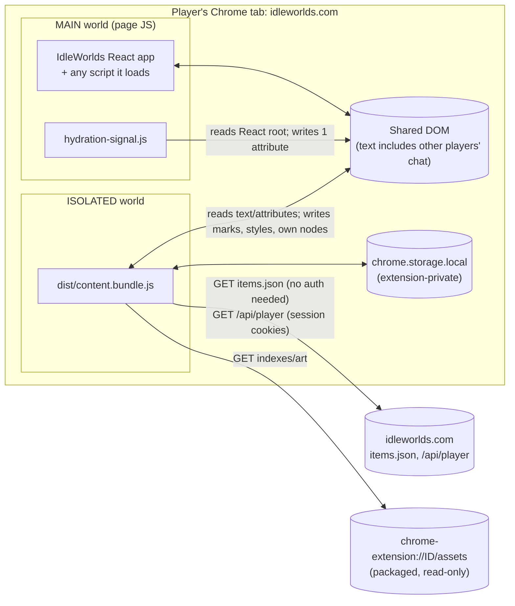

# 5. JavaScript documentation and safety review

This chapter documents every JavaScript feature of the skin and reviews its safety **with evidence**. Every "the code does not do X" statement is backed in one of two ways:

- by the **lexical census** in [`tools/js-api-census.md`](tools/js-api-census.md), which lists every call site of every security-relevant API, and "none" where an API never appears;
- by a **cited line** that shows the guard.

Where a risk or an uncertainty exists, it is disclosed as a finding with a proportionate mitigation (§5.6).

> **Scope.** All shipped JavaScript:
> - `src/content.js`;
> - `src/page/hydration-signal.js`;
> - the 33 files in `src/modules/`.
>
> Together these are 35 files and 11,869 lines, bundled into `dist/content.bundle.js`, except the page script. Build tools, tests and `claude/` probes do not ship. They are reviewed only where they touch secrets or live accounts (SEC-07).

## 5.1 Threat model and method

### 5.1.1 What must be protected

| Asset | Why it matters |
| --- | --- |
| The player's authenticated session (cookies, league context) | Account takeover or unwanted actions |
| Game integrity (actions, purchases, trades, chat) | The skin must never act for the player (rule 1) |
| The game page's integrity | Script injection into `idleworlds.com` would be an XSS in the game's origin |
| Player privacy | No tracking, no exfiltration of player data |
| Game state legibility | Wrong or hidden state misleads the player (rule 5) |
| Performance and availability | A skin that stalls the tab degrades the game |
| The extension's own integrity | Update and supply chain; packaging hygiene |

### 5.1.2 Adversaries and trust boundaries



| Adversary or input | Can it reach the skin? | What the skin does with it |
| --- | --- | --- |
| **Other players** (chat messages, player names, market listings) | Yes: the text is in the DOM | Read as **text only**: `textContent`, `nodeValue`, `Range`. Never parsed as HTML (§5.2.4). Chat text is only indexed for item names (`NameScanner`) |
| **The game's own scripts** (or anything the page loads) | Yes: shared DOM and `document` events | They could forge `iw:*` events or skin attributes. Effect: extra reconciliation work, or a tooltip for a *real* catalogue item (§5.3.1). They cannot read extension storage or call extension APIs |
| **The game server** (`items.json`, `/api/player`) | Yes | Parsed as JSON. Item fields reach one HTML string builder where two fields are unescaped (**SEC-01**). Village data is strictly validated |
| **Network attacker** | No, while HTTPS holds | All runtime requests are `https://` same-site, or `chrome-extension://` |
| **Other extensions** | Shared DOM only | Same capabilities as page scripts |
| **Supply chain** | Build time only | No runtime dependencies; dev dependencies are locked (`package-lock.json`); the bundle is committed and unminified for review (C18) |
| **The developer's own workstation** | Yes (working copy) | A real browser profile with saved credentials sits in the tree (**SEC-07**) |

### 5.1.3 Method

1. **Full read** of every shipped JavaScript file, with notes per function.
2. **Lexical API census** (`tools/js-api-census.mjs`): network, storage, extension APIs, messaging, HTML sinks, dynamic code, navigation, synthetic interaction, observers and timers, listeners, globals, diagnostics, layout reads. The tool fails if it finds zero `fetch`, `MutationObserver` or `addEventListener`, because a census reporting nothing is broken.
3. **Data-flow tracing** from each external input (DOM text, `items.json`, `/api/player`, storage, events) to each sink (`innerHTML`, attributes, URLs, CSS custom properties, storage, network).
4. **Test execution**: `npm test` passed on 2026-09-17 (exit 0; 3 min 26 s; [evidence log](evidence/npm-test-2026-09-17.log)) [Test run].
5. **Classification** of every issue as Confirmed (C), Plausible, needs a test (P), or Verify live/with owner (V), with severity High, Medium, Low or Info.

> **Limits.**
> - This is a source review, not a penetration test. No live page, server or real account was exercised.
> - Chrome-behaviour statements marked [Assumption] come from general platform knowledge, not from this repository: CSP handling of isolated worlds, cross-world `CustomEvent.detail`, storage quotas.

## 5.2 Global security posture

### 5.2.1 Manifest surface

| Item | Value | Assessment |
| --- | --- | --- |
| `permissions` | `["storage"]` | Minimal. No `tabs`, `cookies`, `webRequest`, `scripting`, `activeTab`, `<all_urls>` |
| `host_permissions` | `https://idleworlds.com/*`, `https://www.idleworlds.com/*` | Scoped to the game |
| Content scripts | Bundle (ISOLATED, `document_idle`, top frame); hydration signal (MAIN, `document_start`, top frame) | `all_frames: false`: no injection into iframes |
| Background / service worker | none | No persistent process, no cross-tab messaging |
| Popup / options / devtools pages | none | No extension UI surface |
| `externally_connectable` | absent | Web pages cannot message the extension |
| `content_security_policy` | absent, so the MV3 default applies | No remote code possible for extension pages (none exist) |
| `web_accessible_resources` | `assets/*` (+ 4 PNG globs), matches both game hosts | Game pages can load any packaged asset, and can therefore detect the extension (SEC-05) |
| `minimum_chrome_version` | absent | Effective minimum is 111 (PKG-01) |
| `update_url`, `key` | absent | Distributed unpacked or through the store [Verify distribution channel] |

### 5.2.2 Network destinations (complete)

Source: `fetch()` call sites in [`tools/js-api-census.md`](tools/js-api-census.md). There are **no** `XMLHttpRequest`, `WebSocket`, `EventSource`, `sendBeacon`, `<script>` creation, or `window.open` call sites.

| # | Call site | URL | Method, credentials, cache | Data sent | Response use |
| --- | --- | --- | --- | --- | --- |
| N1 | [`ItemDatabase.js:165`](../../src/modules/ItemDatabase.js#L165) | `https://idleworlds.com/items.json` (constant, L13) | GET; `credentials` default `same-origin`; `cache: 'no-cache'` (conditional revalidation) | Nothing beyond the URL and standard headers. **Cookies are sent** on the apex host (same origin); on `www` the request is cross-origin, so no cookies are sent and CORS applies (SEC-03) | JSON → `items` array → in-memory `Map`s + `chrome.storage.local` cache |
| N2 | [`VillageScene.js:312`](../../src/modules/VillageScene.js#L312) | `/api/player?section=<route>&scope=core` (relative, so the current origin) | GET; `credentials: 'same-origin'`; `cache: 'no-store'`; `AbortController`, 10 s timeout | **Session cookies**; header `x-idleworlds-league: standard\|ssf`; `section` from a fixed whitelist (`dashboard`, `housing`, `market`, `leaderboards`, `dungeon`) via `encodeURIComponent` | `normaliseVillage()` keeps `housing.tier`, `villageAddons.totalSlots`, `installed[].{slot, itemKey, name}`; everything else is dropped with the response object (SEC-04) |
| N3 | [`AtlasService.js:256`](../../src/modules/AtlasService.js#L256) | `chrome-extension://<id>/assets/gear_icons_manifest.json` | GET, `no-store` | — | Validated JSON (icons array, numeric geometry) |
| N4 | [`AtlasService.js:286`](../../src/modules/AtlasService.js#L286) | `chrome-extension://<id>/assets/item_icons_index.csv` | GET, `no-store` | — | CSV parsed; required columns and finite bounds validated |
| N5 | [`SkillsArtService.js:93`](../../src/modules/SkillsArtService.js#L93) | `chrome-extension://<id>/assets/skills_icons_index.json`, `skills_ui_index.json` | GET, `no-store` | — | `validateIndex` |
| — | CSS `url()`, `` | `chrome-extension://<id>/assets/…` only (after `StyleInjector` rewrite, or via `assetUrl` with constant paths) | Browser-initiated | — | Images and fonts |
| — | Links | `https://idleworlds.com/wiki/items/<slug>` (tooltip), `https://idleworldstoolkit.com` (nav) | Navigation **only on click**, `target="_blank" rel="noopener noreferrer"` | Referrer suppressed | — |

**No request goes to any third-party origin at runtime.** No data read from the page, storage or the API is ever placed in a request URL, header or body. The only request inputs are the fixed `section` whitelist and the league derived from `location.pathname` [Source: N2 construction].

### 5.2.3 Storage (complete)

| Key | Area | Writer (file:line) | Value | Contains personal data? | Retention |
| --- | --- | --- | --- | --- | --- |
| `iw-skin-enabled` | `chrome.storage.local` | Developer via DevTools (no code writes it) | `true`/`false` | No | Until changed |
| `iw-item-db-cache` | `chrome.storage.local` | `ItemDatabase._writeCache` (L252–257) | `{ items, generatedAt, validator, cachedAt }`: the public item catalogue (≈5.5 MB per the source comment [Verify]) | No (public game data) | Overwritten on change; never deleted |
| `iw-item-db-cache-checked` | `chrome.storage.local` | `ItemDatabase._markCacheChecked` (L259–262) | `{ generatedAt, checkedAt }` | No | Overwritten |
| `iw-collapsed-frames` | `chrome.storage.local` | `CollapsibleFrames.persist` (L174–178) | `{ "<panel:slug>\|<title:lowercase heading>": true }` | No. Keys are panel or heading names | Until changed |
| `iw-village-ledger` | `chrome.storage.local` | `VillageLedger.persist` (L119–123) | `{ "<entry key>": false }` for closed entries | No | Until changed |
| `iw-boss-rewards-collapsed:<bossKey>` | `chrome.storage.local` | `WorldBossPanels.bindRewardDisclosure` (read L25, write L35) | `true`/`false` | No | Until changed |
| `iw-item-db-cache` (legacy) | **page `localStorage`** | `ItemDatabase.evictLegacyCache` (L38–49): `getItem` then **`removeItem` only** | Removes a ≤v1.5.x cache | No | Deleted once per page session if present |

- No other page storage is touched: `sessionStorage`, `indexedDB` and `document.cookie` are **none** in the census.
- `chrome.storage.local` is readable only by the extension. Content scripts cannot read other extensions' storage, and pages cannot read it [Platform].
- Nothing written is secret. The only player-specific data the skin *holds* is the village snapshot (in memory) and panel preferences (storage).

> **Note.** The storage cache is roughly 5.5 MB. The default `chrome.storage.local` quota is 10 MB in current Chrome [Assumption: quota raised from 5 MB in Chrome 114]. On older Chrome, or if the catalogue grows past the quota, the write fails. `storageSet` catches the failure and warns, and the skin still works from the network copy.

### 5.2.4 HTML sinks and dynamic code

**Dynamic code: none.** The census finds no `eval`, `new Function`, string-argument timers, dynamic `import()`, `<script>` creation, `DOMParser`, `createContextualFragment`, `document.write`, `insertAdjacentHTML` or `outerHTML` writes. The only code that runs is the packaged bundle and the page script. **Remote code: none.**

**`innerHTML` writes: exactly three** [Generated: census].

| Sink | What is interpolated | Escaping | Verdict |
| --- | --- | --- | --- |
| [`SkillPanelRenderer.js:1421`](../../src/modules/SkillPanelRenderer.js#L1421) | Nothing: constant `'<span class="fs-skill-identity-progress-fill"></span>'` | n/a | Safe (constant) |
| [`InventoryRenderer.js:699`](../../src/modules/InventoryRenderer.js#L699) | See the list below this table | `esc()` (L83–87) escapes `& < > "`, not `'`. Every attribute in the template is double-quoted, so `'` cannot break out | **Safe.** Every non-constant value is escaped or numeric |
| [`TooltipEngine.js:353`](../../src/modules/TooltipEngine.js#L353) | Item record fields from `items.json`, the cache, or the bundled fallback: `name`, `category`, `subcategory`, `req_text`, `req_level`, `req_skill`, `effects_raw`, stat labels and values, `acquisition_*`, `source_zone`, `drop_rate`, `drop_boosted_by`, `wiki_slug`, **`craft_level`**, **`tier`**; internal constants | `esc()` (L49–53) escapes `& < > " '` for all fields **except `craft_level` (L101) and `tier` in the recipe line (L102)** | **SEC-01.** Two fields are unescaped |

Values interpolated into the inventory overlay:

- **Item name**: from DOM text or the catalogue, via `itemRef()`, which escapes the name, id and label (TooltipEngine L660–680).
- **Level and enhancement**: from DOM text.
- **Stat chips**: from `itemDisplay.statChips`.
- **Details and requirements**: DOM text via `InventoryModel`.
- **Quantity**: DOM text.
- **`detail.count`**: a number produced by `InventoryModel` aggregation (L236–240).
- **Class names**: constants from `categoryClass`, `detail.kind` (escaped) and `c.kind` (compared to constants).

**SEC-01 in detail.**

```js
// TooltipEngine.js:99-102
main = 'Crafted &middot; ' + esc(skill);
const bits = [];
if (item.craft_level != null && item.craft_level !== '') bits.push(esc(skill) + ' Lv ' + item.craft_level);
if (item.tier != null && item.tier !== '') bits.push('Tier ' + item.tier + ' recipe');
```

- **Precondition.** A record with `acquisition_type === 'Crafted'` whose `craft_level` or `tier` is a string containing markup. The record would have to come from the `items.json` response or the extension's own storage cache. The bundled `rewards.json` contains no such values [Source].
- **Impact.** The markup is parsed into the page's DOM inside `#iw-tip` when a player opens that item's card:
  - an element such as `` would run its handler in the **page's** JavaScript world, under the page's CSP;
  - that is script execution in `idleworlds.com`'s origin, with the player's session.
- **Likelihood.** Low. The data source is the game's own server; an attacker able to change `items.json` already controls content served by that origin. The finding matters for defence in depth, for a compromised CDN or cache, and because the same pattern could be copied elsewhere.
- **Mitigation.**
  - **H-01** (no visual change): `esc(item.craft_level)` and `esc(item.tier)`.
  - **H-02**: type-validate records.
  - **H-03**: build the card with DOM APIs.

### 5.2.5 Listeners, observers and timers (complete)

| Resource | Registered at | Target and options | Lifetime | Active while disabled? |
| --- | --- | --- | --- | --- |
| `MutationObserver` (the only one) | `DOMWatcher.startWatcher` (L358) | `document.body`: `childList`, `subtree`, `characterData`, `attributes` with an 8-name filter | Boot → teardown (`stopWatcher` L459, `disconnect` L461) | No |
| `MediaQueryList` `change` ×5 | `Viewport.startLayoutWatch` (L85–101) | `(min-width: 640/768/1024/1280/1536px)` | Boot → teardown (`removeEventListener`, L104) | No |
| `chrome.storage.onChanged` | `Runtime.onStorageChanged` (L108–122) via `content.js` L216 | `iw-skin-enabled` | **Page lifetime** (by design: the re-enable path) | Yes, required |
| `document` `iw:dom-flush` ×5 | `content.js:97`; `UIFoundation.js:1457`; `HeaderRenderer.js:463`; `TooltipEngine.js:583`; `SkillCardDesignController.js:523` | — | Page lifetime | Registered; work is gated by `guard` (inactive) or finds nothing |
| `document` `iw:name-scan-flush` ×2 | `content.js:109`; `SkillCardDesignController.js:523` | — | Page lifetime | Same |
| `document` `iw:skill-panel` ×4 | `SkillPanelRenderer.js:1576`; `QuestPanelRenderer.js:465`; `UIFoundation.js:1460`; `SkillCardDesignController.js:520` | — | Page lifetime | Same |
| `document` `iw:inventory-row` | `InventoryRenderer.js:757` | — | Page lifetime | Same |
| `document` `iw:item-db-updated` ×4 | `content.js:114`; `InventoryRenderer.js:758`; `TooltipEngine.js:607`; `VillageScene.js:251` | — | Page lifetime | Same (`VillageScene` checks `isRuntimeActive`) |
| `document` `iw:atlas-updated` ×2 | `InventoryRenderer.js:759`; `TooltipEngine.js:606` | — | Page lifetime | Same |
| `document` `mouseover`/`mouseout`/`mousemove` (capture) | `TooltipEngine.js:467, 481, 501` | — | Page lifetime | Registered; with no triggers, return immediately |
| `document` `click`, `keydown` | `TooltipEngine.js:513, 537` | — | Page lifetime | Same |
| `window` `scroll` (capture), `resize`, `blur` | `TooltipEngine.js:577–579` | — | Page lifetime | Same |
| `#iw-tip` `mouseenter`/`mouseleave`/`focusout`/`click` | `TooltipEngine.js:434–459` | Skin element | Page lifetime | Element hidden |
| `document` `mousemove` (passive, capture), `click` | `NameScanner.js:357, 368` | — | Page lifetime, bound on first scan | rAF callback gated by `guard` |
| `window` `scroll` (passive, capture) | `NameScanner.js:380` | — | Page lifetime | Trivial |
| `click` on each collapse toggle | `CollapsibleFrames.js:217` | Skin `<button>` | Until the button is removed | Buttons removed |
| `click` on each ledger toggle | `VillageLedger.js:189` | Skin `<button>` | Until the node is removed | Nodes removed |
| `toggle` on each rewards `<details>` | `WorldBossPanels.js:31` | Skin element | Until the node is removed | Nodes removed |
| `MediaQueryList` `change` (reduced motion) | `WorldBossPanels.js:147–148` | During an impact animation only | Removed on finish or cancel | No |
| `setTimeout` chains | `hydration-signal.js:58` (50 ms, ≤15 s); `HydrationGate.js:47` (50 ms, ≤4 s); `ItemDatabase.js:114` (6 h / 15 min); `TooltipEngine.js:402` (120 ms show delay); `TooltipEngine.js:585` (rAF fallback); `VillageScene.js:310` (10 s abort); `Runtime.js:177` (rAF fallback) | — | Cleared: `stopAutoRefresh` (refresh), `clearShowTimer`, `clearTimeout` in `finally` (village) | Refresh timer cleared on teardown |
| `requestAnimationFrame` (one-shot) | 12 sites (census) | — | One frame | Callbacks guarded |
| `queueMicrotask` | `AtlasService.js:88`; `InventoryRenderer.js:319` | — | One microtask | — |
| `setInterval` | **none** | | | |
| `IntersectionObserver` / `ResizeObserver` | **none** | | | |
| Web Animations | `WorldBossPanels.js:137` | Skin elements | ≤1.25 s; cancelled on stop | — |

### 5.2.6 Globals and page-world exposure

- **No globals.** The bundle is an esbuild IIFE (`format: 'iife'`, `build.mjs:99`). The census finds **no** `window.*`, `globalThis.*` or `self.*` property writes. In any case, content-script globals live in the isolated world and are invisible to the page.
- **Page script scope.** `hydration-signal.js` is wrapped in an IIFE (L24–64). It defines no globals, adds no listeners, and makes one attribute write (L38).
- **Page-visible artefacts.** Everything the skin changes in the shared DOM is visible to the page, and is non-sensitive:
  - `data-iw-*` and `data-fs-*` attributes;
  - four classes on game nodes;
  - inline custom properties, and `chrome-extension://<id>` URLs in custom properties and ``;
  - the seven `<style>` elements;
  - skin-owned elements;
  - `CustomEvent`s on `document`.
  
  The extension ID in those URLs identifies the installed extension.

### 5.2.7 Authentication state and sensitive information

| Question | Answer | Evidence |
| --- | --- | --- |
| Does the skin read cookies, tokens or credentials? | **No** | Census: no `document.cookie`, no `chrome.cookies`, no reads of storage beyond its own keys and the legacy key check |
| Does it send authenticated requests? | **Yes, one** (N2, `/api/player`), plus N1 on the apex host, where the default `same-origin` credentials attach cookies to a public file | `VillageScene.js:312–316`; `ItemDatabase.js:165` |
| Does it change authentication state? | **No** | No login, logout or session endpoints; no writes to cookies or auth storage |
| Does it read form fields or chat input? | **No.** Inputs, textareas and selects are excluded from name scanning (`NameScanner` `SKIP_TAGS`/`SKIP_CONTAINERS`). The chat input is only matched by its `placeholder` attribute | `UIFoundation.js:1107–1108`; `NameScanner.js:45–48` |
| Does it log sensitive data? | **No.** Console output is lifecycle messages, error messages, item counts and **item names without icons** (`AtlasService.js:377`) | Census "console output" |
| Does it transmit page data anywhere? | **No.** No request carries page-derived data (§5.2.2) | — |

### 5.2.8 Does it modify game data or act for the player?

| Question | Answer | Evidence |
| --- | --- | --- |
| Synthetic clicks or submits? | **None** | Census: no `.click()`, no `requestSubmit`/`submit` |
| Calls to game action endpoints? | **None**. Only N1 and N2, both GET reads | §5.2.2 |
| Dispatches events to game elements? | **No.** `dispatchEvent` is used only for the skin's own `iw:*` events on `document` (`AtlasService.js:225`, `DOMWatcher.js:45`, `ItemDatabase.js:224`) | Census |
| Cancels game input? | **Only on skin-owned controls and item triggers**: <ul><li>`CollapsibleFrames.js:218–219` — `preventDefault` + `stopPropagation` on the skin's own toggle button;</li><li>`VillageLedger.js:190` — `preventDefault` on its own button;</li><li>`TooltipEngine.js:553` — `preventDefault` for Enter/Space when focus is on an item trigger.</li></ul> Triggers are skin elements, **or** game `<p>` elements the skin made focusable (quest objective, village building name), which have no default Enter/Space action. Tooltip **clicks are never cancelled** (`TooltipEngine.js:513–535`) | Census; source |
| Moves focus? | **Only for the tooltip**: into the card on keyboard open, back to the trigger on Escape or close (`TooltipEngine.js:374–375, 464, 542, 559`) | Census |
| Changes game values or text? | **No.** No write to game text nodes (smoke test: "game text nodes are never detached"). Values are only *read* | [Test run] `smoke.test.mjs` |
| Changes game control state (`disabled`, `aria-*`)? | **Partly**: <ul><li>`aria-expanded`, `aria-controls` and `aria-haspopup` on item triggers (skin elements, and the two game `<p>` types above);</li><li>`tabindex="0"` on those `<p>`s;</li><li>no `disabled` writes.</li></ul> Teardown removes them unconditionally (FUN-09) | `QuestPanelRenderer.js:183–186`; `VillagePanels.js:155–158` |
| Hides or disables game controls? | **Yes, one**: the "cycle XP display" button (**FUN-01**). Other native elements hidden by CSS are non-interactive text branches replaced by mirrors | §3.12 |

### 5.2.9 Content Security Policy compatibility

| Mechanism | Subject to the page's CSP? | Assessment |
| --- | --- | --- |
| Content script execution (bundle) | No: extension content scripts are not governed by the page CSP [Platform] | Safe from page CSP changes |
| MAIN-world script (`hydration-signal.js`) | Injected by the browser as an extension content script, not as an inline `<script>`. **[Assumption]**: not blocked by `script-src` | If blocked, the gate falls back to its 4 s timeout |
| `<style>` elements inserted from the isolated world | **[Assumption]**: Chromium exempts DOM insertions made from an extension's isolated world from the page's `style-src`. A strict `style-src` without `'unsafe-inline'` should be tested live | **[Verify]** before IdleWorlds deploys a strict style CSP |
| Inline `style` attribute writes (`element.style.setProperty`) | CSSOM writes are not blocked by `style-src` [Platform] | Safe |
| `chrome-extension://` images and fonts | **[Assumption]**: Chromium registers the extension scheme as bypassing page CSP for web-accessible resources. This premise underlies `vendor-assets.mjs` | **[Verify]** with the live CSP |
| `fetch` from the isolated world (N1, N2) | **[Assumption]**: not subject to the page's `connect-src`; subject to CORS with the page origin | N1 on `www` needs CORS (SEC-03) |
| Trusted Types | The page could enforce `require-trusted-types-for 'script'`. Whether that applies to `innerHTML` writes from an isolated world is **[Verify]** | H-03 removes the three `innerHTML` sinks, which makes this moot |

## 5.3 Cross-cutting analysis

### 5.3.1 Forged events and attributes (page scripts)

- **`iw:*` events** are dispatched on the shared `document`, so page scripts can listen and dispatch.
  - Under Chromium's world isolation, an object `detail` created in one world is not readable from the other (it appears as `null`) [Assumption]. Forged events would then reach consumers with `detail === null`.
  - Consumers either use optional chaining (`e.detail?.roots || []` → whole-document work: `content.js:98`, `SkillCardDesignController.js:521–524`) or dereference inside `guard` (`InventoryRenderer.js:757`: `e.detail.row` throws → caught → one `warnOnce`).
  - Even if `detail` were readable, every consumer treats `detail` as **element references to re-validate** (`isConnected`, classification), never as data to trust.
  - **Worst case**: a page script dispatching events in a loop forces repeated whole-document reconciliation. That is a self-inflicted slowdown in its own tab, not a data or integrity risk.
  - Hardening **H-23**: ignore events whose `detail` is not an object the skin created (a module-private `WeakSet` of detail objects).
- **Skin attributes** are read back as inputs in these places:
  - `data-iw-item`/`data-iw-item-name` on triggers are **lookup keys** into the catalogue (`TooltipEngine.show`, L341–346). A forged trigger can only open a card for a *real* catalogue item, rendered from catalogue data.
  - `data-iw-*` role marks drive CSS and later classifier passes. A page could spoof them to restyle its own elements.
  - `data-iw-page-hydrated` can be spoofed to boot early (SEC-06).
  - None of these grant access to storage, network or extension APIs.

### 5.3.2 Injection through game text (other players)

- **Chat, player names and listings** reach the skin as DOM text.
- **Paths that read text**: `NameScanner` (`nodeValue` → trie match → `Range`); classifiers (`textContent` → regex); `InventoryRenderer` (`textContent` → `esc()` → template); `SkillCardDesignController`/`VillageLedger`/`WorldBossPanels` (`textContent` → `textContent` writes).
- **None** assigns page text to `innerHTML`, a URL, `style` or storage.
- **Regular expressions** applied to page text contain no nested quantifiers [Source: heuristic scan]. Patterns such as `/atk\s*\d+.*def\s*\d+.*hp\s*\d+/i` backtrack at worst polynomially, over bounded header text, which is not a practical ReDoS vector.

### 5.3.3 Prototype pollution and JSON handling

- **Records.** `items.json`, `/api/player` and the index JSONs are parsed with `Response.json()`. Item records are stored in `Map`s keyed by strings (`ItemDatabase.js:212–221`), so a `__proto__` item name or id becomes a normal key, not a prototype write.
- **Village data.** `normaliseVillage` builds new objects field by field.
- **Preferences.** They are read with `Object.entries` and copied into `Map`s (`CollapsibleFrames.js:165–169`, `VillageLedger.js:107–111`).
- **Merging.** No recursive merge of untrusted objects exists.

### 5.3.4 URL construction

| URL | Built from | Injection possible? |
| --- | --- | --- |
| `chrome-extension://…/assets/<file>` | `assetUrl()` with **constant** paths, generated tables (`villageBuildings.js`, `zoneThemes.js`), or packaged index fields (`index.atlas`) | No: no page or network data |
| `/api/player?section=…` | Whitelisted section via `encodeURIComponent` | No |
| Wiki link | `https://idleworlds.com/wiki/items/` + `esc(wiki_slug)` | Only the path on `idleworlds.com` can vary. No scheme or host change is possible, because the prefix is a constant `https://` URL. Not URL-encoded (SEC-08) |
| Toolkit link | Constant | No |

### 5.3.5 Race conditions and stale async work

| Hazard | Guard | Evidence |
| --- | --- | --- |
| A village API response arriving after a route or league change or after teardown | Generation counter, `AbortController`, `isRuntimeActive()` check before applying | `VillageScene.js:276–279, 305–322, 334–336` |
| Catalogue refresh after teardown | `stopAutoRefresh` clears the timer. An in-flight fetch can still resolve and dispatch `iw:item-db-updated`; consumers are inert while inactive | `ItemDatabase.js:91–95`; `content.js:74–80` |
| Atlas load failure loops | Backoff (5 s, or 15 s when partial); rejection when nothing loaded | `AtlasService.js:176–253` |
| Kill-switch change during the hydration wait | **Not guarded**: the value is read before the ≤4 s wait and the listener registered after it | `content.js:196–216` (H-07) |
| Tooltip open when React replaces the trigger | Orphan check on `iw:dom-flush` and `mousemove` | `TooltipEngine.js:583–590, 501–511` |
| Label fit measured before web fonts load | Refit after `document.fonts.ready` | `SkillCardDesignController.js:531` |

### 5.3.6 Memory

- **Per-element caches** use `WeakMap` (for example: skill type, structure signatures, fill samples, tooltip items, spines, strength history). `InlineStyleOwner` tracks elements through `WeakRef` + `FinalizationRegistry`.
- **Module-level strong references**:
  - `SkillPanelRenderer.lastCandidatePanel`/`lastCandidates` keep one panel's candidate list (FUN-08).
  - `NameScanner.matchIndex` is a `Map` of text nodes → matches. It is pruned when nodes disconnect (`rebuildHighlight`) and cleared on teardown.
  - `Runtime._warned` and `AtlasService._missingWarned` are unbounded `Set`s of strings (small).
  - `CompactButtons.decorated` is a `Set` of elements, rebuilt each pass.
- **Assets**: see PERF-07 (≈126 MiB of decoded sprite atlases).

### 5.3.7 Error isolation

Every consumer is wrapped in `guard`/`guardEach` ([Runtime.js:145–177](../../src/modules/Runtime.js#L145)), and exceptions are reported once per label (`warnOnce`). One malformed element therefore leaves only itself un-skinned (`smoke.test.mjs`). Async paths catch their own rejections: `content.js:136–143`, `VillageScene.js:323–331`, and the `ItemDatabase` refresh chain.

One gap: `hydration-signal.js` has no `try/catch`. A throwing getter on React internals would stop its polling with an uncaught error in the page console, and the gate would then time out (**H-06**).

### 5.3.8 Supply chain and release integrity

- **Runtime dependencies: none** (`package.json` has `devDependencies` only). The bundle contains only project source and three JSON files.
- **Dev dependencies** are locked by `package-lock.json`; CI uses `npm ci`. Build tools run on the developer machine and in CI only.
- **CI** has `permissions: contents: read`, never writes, and fails when the committed bundle differs from a fresh build. The shipped JavaScript is therefore reproducible from source at a commit.
- **Release** zip: built from an allowlist (`package-release.mjs`), with version agreement and a source-map check. The zip is not signed by the build; Chrome Web Store signing, if used, is out of the repository's scope [Verify distribution].
- **Vendored art** is pinned to a commit of an external repository (`vendor-assets.mjs:25`). The download has no content hash check; integrity relies on HTTPS plus the pinned commit, and the files are committed after download.

## 5.4 Per-feature JavaScript reviews

Every subsection uses the same headings, so the checklist can be audited feature by feature.

The **Safety statement** table always answers the same five questions:

1. Does it handle **external data**?
2. Does it touch **sensitive information**?
3. Does it execute **dynamic code**?
4. Does it read or change **authentication state**?
5. Does it **modify application or game data**?

Hardening IDs (**H-xx**) preserve functionality, and behaviour-change IDs (**B-xx**) alter the feature. Both are listed with priorities in §5.7.

| ID | Feature | Files |
| --- | --- | --- |
| J-01 | Activation lifecycle and kill switch | `content.js` |
| J-02 | Page-world hydration signal | `src/page/hydration-signal.js` |
| J-03 | Hydration gate | `HydrationGate.js` |
| J-04 | Runtime utilities | `Runtime.js` |
| J-05 | Style injection | `StyleInjector.js` |
| J-06 | Reversible inline styles | `InlineStyleOwner.js` |
| J-07 | Viewport and breakpoint epoch | `Viewport.js` |
| J-08 | DOM watcher and event bus | `DOMWatcher.js` |
| J-09 | Item catalogue | `ItemDatabase.js`, `normaliseItemName.js` |
| J-10 | Sprite atlas service | `AtlasService.js`, `aliases.js` |
| J-11 | Skills art service | `SkillsArtService.js` |
| J-12 | Item hovercard | `TooltipEngine.js` |
| J-13 | Item-name scanning | `NameScanner.js` |
| J-14 | Inventory overlay | `InventoryRenderer.js`, `InventoryModel.js`, `itemDisplay.js` |
| J-15 | Surface colour repainting | `BackgroundPainter.js` |
| J-16 | Skill card renderer | `SkillPanelRenderer.js` |
| J-17 | V2 skill card controller | `SkillCardDesignController.js`, `ProgressCadence.js` |
| J-18 | Quest cards | `QuestPanelRenderer.js` |
| J-19 | Classifier hub (frames, nav, zone bar, activity panels, market, boost) | `UIFoundation.js` |
| J-20 | Toolkit link | `UIFoundation.ensureToolkitLink` |
| J-21 | Header renderer and zone theming | `HeaderRenderer.js`, `zoneThemes.js` |
| J-22 | Merged header chrome | `HeaderChrome.js` |
| J-23 | Collapsible frames | `CollapsibleFrames.js` |
| J-24 | Compact buttons | `CompactButtons.js` |
| J-25 | World Boss and Zone Control panels | `WorldBossPanels.js` |
| J-26 | Village route panels | `VillagePanels.js`, `villageBuildings.js` |
| J-27 | Dashboard Village scene (API read) | `VillageScene.js` |
| J-28 | Village ledger | `VillageLedger.js` |
| J-29 | Overlay framing | `OverlayFramer.js` |

---

### J-01 Activation lifecycle and kill switch

**Purpose; why JavaScript.** Decide whether the skin should be active, wait for the page to be ready, build every surface in dependency order, and tear everything down on request without a reload. Stylesheets alone cannot wait for hydration, read a stored preference, or remove themselves.

**Where.** [`src/content.js`](../../src/content.js):

| Symbol | Lines | Role |
| --- | --- | --- |
| `injectPresentationStyles` | 57–72 | Inject the 7 style elements |
| `scanRoots` | 74–81 | Rescan item names |
| `bindConsumersOnce` | 83–117 | Register page-lifetime consumers |
| `boot` | 119–153 | Build the skin |
| `teardown` | 163–189 | Remove the skin |
| `applyEnabled` | 191–194 | Boot or tear down |
| `start` IIFE | 196–217 | Entry point |

**Flow.**

1. `start()` calls `setRuntimeActive(false)`, so nothing can reconcile yet.
2. `await storageGet('iw-skin-enabled')`. On failure → `null`.
3. `await waitForPageHydration()` (J-03), then log the outcome.
4. `applyEnabled(stored === null ? true : stored !== false)`.
5. `boot()`, only if not already booted:
   1. `setRuntimeActive(true)`.
   2. Inject styles.
   3. `bindConsumersOnce()`: init tooltip, inventory, skill panel, quest panel, UI foundation and header; subscribe to `iw:dom-flush`, `iw:name-scan-flush` and `iw:item-db-updated`.
   4. `initSkillCardDesignController()`.
   5. `AtlasService.ready()`, `ItemDatabase.startAutoRefresh()` and `ready()` (rejections are logged).
   6. `paintBackground()`.
   7. `startWatcher()` last.
   8. Log `v1.6.0 booted`.
6. `onStorageChanged('iw-skin-enabled', v => applyEnabled(v !== false))` for the page lifetime.
7. `teardown()`, only if booted: stop the watcher and refresh timer; hide the tooltip; clear the name scan, inventory, V2, skills, quests, UI foundation, header, background paint and overlays; remove styles and the hydration latch. **Then** `setRuntimeActive(false)`, then log.

**Reads and writes.**

| Kind | Detail |
| --- | --- |
| Storage | Reads `iw-skin-enabled`. Never writes it |
| DOM | Indirect, through modules |
| Events | Listens to `iw:dom-flush` (→ `paintBackground`, `frameOverlays`), `iw:name-scan-flush` (→ `scanForItemNames`), `iw:item-db-updated` (→ rescan body) |
| Console | 3 `log` lines; 2 `warn` lines on data-service failure |

**Runs; initialisation and cleanup.** Once per page load, plus on each storage change. Consumers are bound once per page. Teardown reverses boot. `onStorageChanged` is never removed, by design.

**Resources held.** One `chrome.storage.onChanged` listener; three `document` listeners (page lifetime). No timers, observers, network, globals or injected elements of its own.

**Lifecycle, performance, failure modes, edge cases, compatibility.**
- Boot cost is dominated by the initial discovery flush [Project record: `docs/traps/performance.md`].
- If storage is unavailable, the skin boots, with `enabled` as the default.
- A module throwing during init is contained by `guard`, and the rest boots.
- **Edge case (H-07):** the stored value is read before the up-to-4 s hydration wait, and the change listener is attached after it. A kill-switch change during that window is missed until the next change.
- `teardown()` before `boot()` only marks the runtime inactive.
- Compatibility: MV3 `chrome.storage` promises (Chrome 88+ [Assumption]).

**Safety statement.**

| Question | Answer and evidence |
| --- | --- |
| External data | **No** network or page data is used directly; only the stored boolean |
| Sensitive information | **No** |
| Dynamic code | **No** |
| Authentication state | **No** |
| Modifies app or game data | **No**. Orchestration only |

**Concerning APIs and existing safeguards.** `chrome.storage.onChanged` is a page-lifetime listener. It is keyed to one key (`Runtime.js:111`), and handler errors are caught (L114–118).

**Hardening (preserves functionality).** **H-07**: register the storage listener before the hydration wait (or re-read the key after it), so a toggle during the wait is honoured.

**Changes that alter the feature.** A user-facing toggle (popup or keyboard shortcut) would change the product surface (C15).

**Rewrite with internal components.** Replace the whole lifecycle with a theme flag read at render time, for example `<ThemeProvider theme={settings.fantasy ? 'fantasy' : 'classic'}>`. No teardown is needed, because React unmounts.

---

### J-02 Page-world hydration signal

**Purpose; why JavaScript.** Detect when React has finished hydrating, so the skin does not append nodes during hydration (C3). Only page-world JavaScript can see React's root object.

**Where.** [`src/page/hydration-signal.js`](../../src/page/hydration-signal.js) (64 lines, IIFE); manifest `content_scripts[1]` (`world: "MAIN"`, `run_at: document_start`).

**Flow.**

1. `check()` builds the candidate containers: `document`, `<html>`, `<body>`, `#__next`, and each child of `<body>` (L45–46).
2. For each container, find its own property whose name starts with `__reactContainer$` (L30–34).
3. Read `container[key]?.stateNode?.current?.memoizedState` (L53).
4. Decide:
   - not an object, or `isDehydrated` is not boolean → `signal('unknown')`;
   - `isDehydrated === false` → `signal('1')`;
   - `true` → stop scanning containers (still hydrating).
5. If no signal was written and less than 15 s have passed → `setTimeout(check, 50)`.
6. `signal(state)` writes `data-iw-page-hydrated` on `<html>` only if absent (L36–39).

**Reads and writes.** Reads own-property **keys** of up to about 4 + *n* DOM nodes, and one nested React object path. Writes **one attribute** on `<html>`. Nothing else.

**Runs.** At `document_start`. Polls every 50 ms, for up to 15 s (≤300 checks). Stops at the first signal.

**Resources held.** A `setTimeout` chain. No listeners, observers, network, storage or globals (IIFE scope).

**Lifecycle, performance, failure modes, edge cases, compatibility.**
- **Cost**: each check is `Object.keys` on a handful of nodes.
- **React changes shape** → "unknown" → the skin boots immediately.
- **No React root found** → polling until 15 s; the gate has already timed out at 4 s.
- **A getter throws** → uncaught exception in the page console, polling stops (**H-06**).
- `world: "MAIN"` requires Chrome 111.

**Safety statement.**

| Question | Answer and evidence |
| --- | --- |
| External data | Reads page JavaScript objects (React internals) **read-only**; values are compared to booleans and never stored or forwarded |
| Sensitive information | **No**. It reads only `memoizedState.isDehydrated`; React state contents are not traversed |
| Dynamic code | **No** |
| Authentication state | **No** |
| Modifies app or game data | **No**. One attribute on `<html>`, which React does not manage |

**Concerning APIs and existing safeguards.** Access to React private fields is fragile, but read-only. It runs in the page world, so page scripts could tamper with it. That gives them nothing they did not already have. The latch can be spoofed to boot early (SEC-06), with no security impact.

**Hardening (preserves functionality).**
- **H-06**: wrap `check()` in `try/catch`; on error, `signal('unknown')` and stop.
- Optionally cap the scan to `document`, `#__next` and the body's first element.

**Changes that alter the feature.** Replacing the probe with a public event from IdleWorlds (for example `document.dispatchEvent(new Event('idleworlds:hydrated'))`) needs a game change.

**Rewrite with internal components.** Delete it (C3).

---

### J-03 Hydration gate

**Purpose; why JavaScript.** Wait (bounded) for J-02's latch before the first boot.

**Where.** [`HydrationGate.js`](../../src/modules/HydrationGate.js): `waitForPageHydration` (L30–51), `clearHydrationLatch` (L54–56). Constants: `HYDRATION_GATE_ENABLED = true`, `TIMEOUT_MS = 4000`, `POLL_MS = 50`.

**Flow.**
1. If disabled → resolve `{state: 'disabled'}`.
2. Otherwise poll the `data-iw-page-hydrated` attribute every 50 ms.
3. On a value, or on timeout, **remove the attribute** and resolve `{state, waitedMs}`.

**Reads and writes.** Reads and removes one attribute on `<html>`.

**Runs.** Once per page (first boot). `clearHydrationLatch` runs on teardown.

**Resources held.** A `setTimeout` chain of at most 4 s. It polls rather than observes (rule 4 allows only one observer).

**Failure modes and edge cases.** A latch written after the timeout persists until teardown (FUN-13). A spoofed latch releases the boot early (SEC-06).

**Safety statement.**

| Question | Answer |
| --- | --- |
| External data | Reads one attribute value; only its truthiness and string are used, and only for logging |
| Sensitive information | **No** |
| Dynamic code | **No** |
| Authentication state | **No** |
| Modifies app or game data | **No** |

**Hardening.** Also remove a late latch after the timeout, for example in the first `iw:dom-flush` (FUN-13). **Rewrite.** Delete it (C3).

---

### J-04 Runtime utilities

**Purpose; why JavaScript.** Shared services: the activation flag; error isolation (`guard`, `guardEach`, `warnOnce`); `chrome.storage.local` wrappers with a test fallback; `assetUrl`; `raf`.

**Where.** [`Runtime.js`](../../src/modules/Runtime.js):

| Symbol | Lines |
| --- | --- |
| `hasChrome` | 20 |
| `setRuntimeActive` / `isRuntimeActive` | 28–34 |
| `assetUrl` | 42–49 |
| `storageGet` / `storageSet` / `storageRemove` | 59–102 |
| `onStorageChanged` | 108–122 |
| `warnOnce` | 132–138 |
| `guard` | 145 |
| `guardEach` | 160 |
| `raf` | 175–177 |

**Flow.**
- `guard(label, fn)`: returns `false` without calling `fn` when inactive; otherwise `try { fn() } catch { warnOnce }`.
- Storage functions `await chrome.storage.local.*` inside `try/catch`. On failure they warn once and return `null`/`false`.
- `assetUrl` strips leading slashes and calls `chrome.runtime.getURL`.

**Reads and writes.** `chrome.storage.local` (the keys in §5.2.3); console.

**Resources held.** A module `Set` of warned labels; an in-memory `Map` fallback (tests only).

**Safety statement.**

| Question | Answer and evidence |
| --- | --- |
| External data | **No** |
| Sensitive information | **No**. Warnings include error messages and labels only (`Runtime.js:136`) |
| Dynamic code | **No** |
| Authentication state | **No** |
| Modifies app or game data | **No** |

**Concerning APIs.** `chrome.storage.local` is extension-private. `chrome.runtime.getURL` only builds URLs.

**Hardening.** None needed.

**Rewrite.** An app-level error boundary and logger; app settings storage.

---

### J-05 Style injection

**Purpose; why JavaScript.** Make all presentation CSS removable at runtime (C11), and point `url(../assets/…)` at packaged files (C10).

**Where.** [`StyleInjector.js`](../../src/modules/StyleInjector.js): `rewriteAssetUrls` (L17), `inject` (L28), `removeAll` (L39).

**Flow.**
1. `inject(id, css)`: if the `id` is new, create `<style data-iw-style=id>`, set `textContent = rewriteAssetUrls(css)`, and append it to `head`, or to `<html>` if there is no head.
2. `removeAll()`: `document.querySelectorAll('style[data-iw-style]').forEach(el => el.remove())`, then clear the set.

**Reads and writes.** Creates and removes 7 `<style>` elements.

**Runs.** Boot and teardown.

**Safety statement.**

| Question | Answer and evidence |
| --- | --- |
| External data | **No**. The CSS text is compiled into the bundle |
| Sensitive information | **No** |
| Dynamic code | **No**. `textContent` is used (not `innerHTML`), so no markup is parsed; the CSS comes from the package |
| Authentication state | **No** |
| Modifies app or game data | **No** |

**Concerning APIs and safeguards.** Inserting `<style>` into a page with a strict CSP (§5.2.9 [Verify]). `removeAll` would also remove any foreign `style[data-iw-style]`, which is harmless.

**Hardening.** Track the created elements and remove only those, instead of querying by attribute.

**Rewrite.** The app's CSS pipeline (C7/C8).

---

### J-06 Reversible inline styles

**Purpose; why JavaScript.** Some visuals need inline declarations (to beat inline game styles or utilities), and teardown must restore the game's original inline values exactly (rule 3).

**Where.** [`InlineStyleOwner.js`](../../src/modules/InlineStyleOwner.js): `createInlineStyleOwner()` returns `{ set, restoreElement, restoreWithin, restoreAll }`.

**Flow.**
1. `set(el, prop, value, priority = 'important')`:
   1. Look up this element's state. If the current inline value differs from what the owner last applied, treat the current value as the new *native* value (the game changed it).
   2. `style.setProperty(prop, value, priority)`.
   3. Record the post-write serialised value and priority.
   4. Return whether anything changed.
2. `restoreElement(el)`: for each owned property still equal to what was applied, restore the native value or remove the property. A property the game changed since is left alone.
3. Tracking uses a `WeakMap` plus `WeakRef` + `FinalizationRegistry`, so detached elements are collected.

**Reads and writes.** Inline style properties on the elements callers pass.

**Callers.** `BackgroundPainter` (important); `SkillPanelRenderer` × 3 owners (important); `InventoryRenderer` (`display: none`, **normal** priority).

**Safety statement.**

| Question | Answer |
| --- | --- |
| External data | **No**. Values come from callers' constants or computed colours |
| Sensitive information | **No** |
| Dynamic code | **No** |
| Authentication state | **No** |
| Modifies app or game data | Inline presentation only. Native inline values are preserved and restored (smoke test: "native inline skill/background styles survive teardown exactly" [Test run]) |

**Hardening.** None needed.

**Rewrite.** Component styles; no inline ownership.

---

### J-07 Viewport and breakpoint epoch

**Purpose; why JavaScript.** Pick the rendered copy of duplicated panels, and invalidate caches when a Tailwind breakpoint is crossed (C6). CSS cannot tell JavaScript which copy is visible.

**Where.** [`Viewport.js`](../../src/modules/Viewport.js): `isRendered` (L36, `checkVisibility()`, else rect), `pickRendered` (L45), `preferRendered` (L55), `getLayoutEpoch` (L73), `startLayoutWatch` (L85–101), `stopLayoutWatch` (L103–107).

**Flow.**
1. `startLayoutWatch(onCross)` creates five `matchMedia('(min-width: Npx)')` lists and adds a `change` listener to each.
2. Each crossing increments the epoch and calls `onCross` (DOMWatcher → `discover(body)`).

**Reads and writes.** Layout visibility (read); no DOM writes.

**Runs.** Visibility checks are called by classifiers; listeners live from boot to teardown.

**Resources held.** 5 `MediaQueryList` listeners (removed on stop).

**Performance.** `checkVisibility()` forces style calculation; callers limit it (for example the V2 timer's containment pre-check).

**Safety statement.** No external data, sensitive information, dynamic code or authentication. **No modification** of anything.

**Hardening.** None.

**Rewrite.** Components know their layout; delete.

---

### J-08 DOM watcher and event bus

**Purpose; why JavaScript.** Keep every decoration current as React mutates the page, within a per-frame budget (C9). Also identify skill cards (F-25).

**Where.** [`DOMWatcher.js`](../../src/modules/DOMWatcher.js):

| Symbol | Lines / role |
| --- | --- |
| Constants | `SEL_INV_ROW`, `SEL_SKILL_PANEL`, `FLUSH_BUDGET = 60` |
| `emit` | L45: `document.dispatchEvent(new CustomEvent(type, {detail, bubbles: false}))` |
| Skill detection | `detectSkillType` (L143–203) + signature cache |
| Queueing | `queueContext`, `discover`, `scheduleFlush` |
| Draining | `takeConnected`, `takeNameRoot`, `drainGlobalBudget`, `flushPending` |
| Lifecycle | `startWatcher` (L353–434), `stopWatcher` (L459), `getScanRoots`, `on`/`off` |

**Flow.**
1. `startWatcher` creates the observer on `document.body` (§5.2.5 options).
2. For each mutation record:
   - **childList**: queue the target's nearest row/panel context (repaint only for compact buttons); `discover()` each added element; queue parents of added text.
   - **characterData**: queue the parent context, with no repaint.
   - **attributes**: `style` → skills and background; `disabled`/`aria-disabled` → skills only; others → the node's own context.
3. `discover(body)` runs once initially, and again on breakpoint crossings.
4. `flushPending` (rAF) drains at most 60 elements round-robin, then emits:
   - `iw:inventory-row` per row;
   - `iw:skill-panel` per panel, with its detected type;
   - one `iw:dom-flush {roots}`;
   - one `iw:name-scan-flush {roots}`.
5. If work remains, it reschedules.

**Reads and writes.** Reads the DOM structure and text of mutated regions. **Writes nothing to the DOM.** Dispatches four event types on `document`.

**Runs.** On every mutation batch; one rAF flush per frame at most.

**Resources held.** 1 `MutationObserver`; rAF callbacks; four pending `Set`s; a `WeakMap` skill-type cache.

**Lifecycle, performance, failure modes, edge cases, compatibility.**
- **Budget**: large bursts spread over frames.
- **Isolation**: consumers are guarded individually, so one throwing consumer cannot strand the queue (the comment at L336–339).
- **Invisible changes**: changes carried only by `data-iw-*` or by `<html>` are invisible, by design.
- **Pending frame after stop**: a queued rAF may still fire after `stopWatcher`, and drains empty sets.
- **Test**: `flush-quiescence.test.mjs` asserts zero flushes on a quiet page [Test run].

**Safety statement.**

| Question | Answer and evidence |
| --- | --- |
| External data | Page DOM text, used for skill identity **only** through anchored regexes. It never leaves the process |
| Sensitive information | **No**. Observes the whole body, including chat, but only element references and short label strings are kept (`skillSignature`); no text is stored beyond the per-panel signature |
| Dynamic code | **No** |
| Authentication state | **No** |
| Modifies app or game data | **No**. No DOM writes |

**Concerning APIs and existing safeguards.**
- A subtree `MutationObserver` over the whole body is powerful. It is bounded by an attribute filter, a flush budget and cheap per-record handling.
- The events are page-visible and forgeable (§5.3.1). Consumers re-validate element references and are guarded.

**Hardening (preserves functionality).**
- **H-23**: mark genuine event details (module-private `WeakSet`) and ignore others.
- Optionally dispatch on a private `EventTarget` instead of `document`, which also removes page visibility of the bus. This is behaviour-neutral for the skin, but tests that listen on `document` would need updating.

**Rewrite with internal components.** Obsolete: React props and state drive renders.

---

### J-09 Item catalogue

**Purpose; why JavaScript.** The DOM does not carry item stats, tiers or acquisition data. The public `items.json` does. JavaScript fetches, caches, indexes and refreshes it for inventory, tooltips, name scanning, quests, bosses and the Village ledger.

**Where.** [`ItemDatabase.js`](../../src/modules/ItemDatabase.js) (singleton `ItemDatabase`) and [`normaliseItemName.js`](../../src/modules/normaliseItemName.js).

| Symbol | Lines |
| --- | --- |
| Constants `API_URL`, `CACHE_KEY`, `CHECKED_KEY`, `CACHE_MAX_AGE_MS = 6 h`, `REFRESH_RETRY_MS = 15 min` | 13–21 |
| `evictLegacyCache` | 38–49 |
| `responseValidator` | 54–58 |
| `ready` | 75–86 |
| `startAutoRefresh`, `stopAutoRefresh` | 87–95 |
| `_scheduleRefresh` | 111–124 |
| `_refreshOnce` | 126–131 |
| `_load` | 132–158 |
| `_fetchFresh` | 160–203 |
| `_index` | 205–233 |
| `_readCache` | 235–250 |
| `_writeCache`, `_markCacheChecked` | 252–262 |
| Lookups `getById`, `getByName`, `find`, `all` | 264–284 |

**Flow.**

1. `ready()` → `_load()`, memoised. A rejection clears the memo, so a transient failure is retried later.
2. `_load()` evicts the legacy page-`localStorage` key, then reads the cache from `chrome.storage.local`:
   - **Fresh** (<6 h since cached or confirmed): `_index(…, 'cache')`, then a background `_refreshOnce()`.
   - **Stale**: `_index(…, 'stale-cache')`, then `await _refreshOnce()`. On failure it keeps the stale data and warns.
   - **None**: `await _refreshOnce()`.
3. `_fetchFresh()` runs `fetch(API_URL, {cache: 'no-cache'})`:
   - a non-OK status throws;
   - if the ETag/Last-Modified validator matches the indexed table, it cancels the body and records a confirmation;
   - otherwise `res.json()`; a missing or empty `items` array throws;
   - the same `generatedAt` updates only the validator or confirmation;
   - otherwise `_index(…, 'network')` and `_writeCache(…)` (not awaited).
4. `_index()` builds `_byId` (`String(item_id)`) and `_byName` (normalised name, first record wins), increments `_revision`, and dispatches `iw:item-db-updated`.
5. `startAutoRefresh()` chains `setTimeout(_refreshOnce, 6 h)`. After a failure the chain retries in 15 min. `stopAutoRefresh()` clears the timer.

**Reads and writes.**

| Kind | Detail |
| --- | --- |
| Network | N1 (§5.2.2) |
| Storage | `iw-item-db-cache`, `iw-item-db-cache-checked` (read and write); page `localStorage['iw-item-db-cache']` (`getItem` and `removeItem` only) |
| Events | Dispatches `iw:item-db-updated` `{revision, generatedAt, source, count}` |
| Console | Load counts; failure warnings |

**Runs; initialisation and cleanup.** Loads at boot. Refreshes every 6 h while active. Cleanup is `stopAutoRefresh()` on teardown; indexes stay in memory, harmlessly, for the next boot.

**Resources held.** One `setTimeout` (6 h or 15 min). The in-memory catalogue: all records from `items.json`, about 5.5 MB decoded per the source comment [Verify]. No listeners.

**Lifecycle, performance, failure modes, edge cases, compatibility.**

- **Cache writes.** A cache write of several MB is deliberately not awaited. A failed write (quota) is warned and the skin continues.
- **Confirmation writes.** Recording a confirmation avoids rewriting the whole table (L15–18 comment).
- **Name collisions.** First record wins. Collisions are not reported.
- **Malformed records.** A record that is not an object makes `_index` throw. The caller then rejects and the skin logs; there is no partial index. On `www.`, CORS applies (SEC-03).
- **Legacy key check.** `localStorage.getItem` of the legacy key reads the entire legacy value (≤5 MB) once, just to test for its presence. `key()` iteration or a `length` check would avoid that read, but it happens at most once per page.

**Safety statement.**

| Question | Answer and evidence |
| --- | --- |
| External data | **Yes**: the `items.json` response and the storage cache. Validation covers the envelope only (a non-empty `items` array); per-field types are not validated (**SEC-02**). Records are stored in `Map`s, so prototype pollution is not possible (§5.3.3) |
| Sensitive information | **No**. The public catalogue. The request carries cookies on the apex host because of default credentials (SEC-03); no response data is personal |
| Dynamic code | **No** |
| Authentication state | Not read or changed. Cookies may be attached automatically (above) |
| Modifies app or game data | **No**. Its one page-storage effect is removing its own legacy key (L43) |

**Concerning APIs and existing safeguards.** `fetch` (N1): the URL is constant, the request method is GET, the status is checked, and the envelope is validated. Page `localStorage` access is limited to the extension's own legacy key (census: L42–44 only).

**Hardening (preserves functionality).**

- **H-02**: validate each record before indexing: `item_id` string or number; `name` non-empty string; `tier`/`craft_level`/`req_level` finite numbers or absent; text fields strings. Skip invalid records and count them in one warning.
- **H-05**: `credentials: 'omit'`. Consider a same-origin relative URL (`/items.json`) so `www` works without CORS [Verify that `www` serves it].
- Optionally check `Content-Type: application/json` and cap the response size before parsing (for example, reject above 20 MB).

**Changes that alter the feature.** None needed.

**Rewrite with internal components.** Item objects come from the game's own state or API client. Remove the fetch, cache, name index and aliases (C13).

---

### J-10 Sprite atlas service

**Purpose; why JavaScript.** Map an item (id or name, including "+N" upgrades) to a window in the two sprite atlases, and paint it on a host element. Mapping a name to sprite coordinates requires data lookup; CSS cannot do it.

**Where.** [`AtlasService.js`](../../src/modules/AtlasService.js) (singleton), [`aliases.js`](../../src/modules/aliases.js), [`normaliseItemName.js`](../../src/modules/normaliseItemName.js).

| Symbol | Lines / role |
| --- | --- |
| URLs | L45–48, via `assetUrl` |
| `REQUIRED_ITEM_COLUMNS` | L54 |
| `setAttr` | L65 (compare first) |
| `positionBadgeHost` | L79–97 (batched reads in a microtask) |
| `parseCSV` | L106–140 |
| `ready` | L176–197 (backoff) |
| `_loadMissing` | L199–253 |
| `_loadGearAtlas` | L255–283 |
| `_loadItemAtlas` | L285–330 |
| `resolve` | L332–380 |
| `paint` | L382–395 |
| `_applySprite`, `_paintBadge`, `_clearBadge` | L397–466 |

**Flow.**

1. `ready()`: if not complete and not backing off, `_loadMissing()` fetches the missing metadata with `Promise.allSettled`:
   - the gear manifest JSON: the `icons` array must be non-empty; a schema warning if entries lack numeric geometry;
   - the item CSV: required columns and finite bounds are validated, and atlas dimensions are derived from the extents.
2. On any success it bumps the revision and dispatches `iw:atlas-updated`. On failures it backs off: 5 s when nothing loaded, 15 s when partially loaded. It throws if nothing is usable.
3. `resolve({id, name})` tries, in order:
   1. item by id;
   2. item by normalised name;
   3. gear by name;
   4. gear without "+N" (the badge level is recorded);
   5. cloak alias;
   6. without "Lv N";
   7. without "of X";
   8. without a leading affix word.
   
   Otherwise it warns once for that name and returns `null`.
4. `paint(host, ref)`:
   - writes inline `background-image` (constant packaged atlas URL), `background-size`, `background-position` and `background-repeat` on **the host passed in**;
   - sets `data-iw-atlas`;
   - paints or clears the "+N" badge: `span.iw-icon-badge[data-iw-badge]`, `aria-hidden`, a sprite from the gear "+N" entry or the text "+N".

**Hosts.** Always skin-owned elements:

- `.fs-inv-icon` (InventoryRenderer);
- `.iw-tip-art-host` (TooltipEngine);
- `.fs-quest-sigil-icon`, painted detached (QuestPanelRenderer);
- boss reward icons (WorldBossPanels).

**Reads and writes.** Packaged JSON and CSV (N3, N4). Inline styles on skin hosts. The `iw:atlas-updated` event. Console warnings.

**Runs.** Metadata loads once, with retries. Paint runs per icon render.

**Resources held.** In-memory indexes (gear and item maps); a `Set` of warned names; the microtask queue for badge hosts.

**Lifecycle, performance, failure modes, edge cases, compatibility.**
- **Backoff.** It prevents fetch storms when each row calls `ready()` (the Audit S3.2 comment at L182–189).
- **Batched style reads.** Badge-host position checks are batched; they once cost ~10 s at boot [Project record, comment L67–78].
- **Atlas size.** The atlases are very large to decode (**PERF-07**).
- **Unresolved names.** An item without an icon falls back to the caller's glyph.
- **No teardown.** Hosts are removed by their owners. The badge span lives inside the host.

**Safety statement.**

| Question | Answer and evidence |
| --- | --- |
| External data | Packaged files only (integrity is provided by the extension package). Names and ids come from DOM text or the catalogue and are used **only as lookup keys** |
| Sensitive information | **No**. Console warnings include item names (non-sensitive) |
| Dynamic code | **No** |
| Authentication state | **No** |
| Modifies app or game data | **No**. It writes only to skin-owned hosts |

**Concerning APIs.** `fetch` of `chrome-extension://` URLs; `queueMicrotask`; `getComputedStyle` (batched).

**Hardening (preserves functionality).** Limit warnings: cap `_missingWarned` at a few hundred entries, or aggregate them into one summary warning per minute.

**Changes that alter the feature.** **H-24** (split atlases) changes files, not visuals.

**Rewrite with internal components.** Item components render ``, or sprites from the game's asset pipeline, with no name resolution.

---

### J-11 Skills art service

**Purpose; why JavaScript.** Turn the packaged Skills UI and icon indexes into CSS custom properties (sprite windows, three-slice bands, textures), and point button-art variables at the current zone theme. The window geometry is data-driven, which pure CSS cannot compute from JSON.

**Where.** [`SkillsArtService.js`](../../src/modules/SkillsArtService.js):

| Symbol | Lines / role |
| --- | --- |
| `revisedButtonAtlas` import | Bundled JSON, L10 |
| `validateIndex` | L79–90 |
| `fetchIndex` | L92–96 |
| `spriteGeometry`, `bandGeometry` | L97–118 |
| `paint` | L120–130 |
| `setVar`, `setData` | L132–141 |
| `clearThemeVariables` | L143–152 |
| `applyThemeVariables` | L154–184 |
| `applyUiVariables` | L185–219 |
| `clearUiVariables` | L221–235 |
| `load` | L236–246 |
| Public object | `ready`, `isReady`, `paintIcon`, `decoratePanel`, `clearPanel`, `applyThemeVariables`, `clearThemeVariables`, `iconEntry` |

**Flow.**

1. `ready()` → `load()` fetches `skills_icons_index.json` and `skills_ui_index.json` (N5). Each index must have finite dimensions and entries with a key and finite geometry. The service then builds maps. A failure clears the memo and warns once. There is **no backoff**, but callers use pending flags and the files are packaged.
2. `decoratePanel(panel)` writes inline custom properties on the panel:
   - `--fs-skills-panel-texture`, `--fs-skills-ui-atlas: var(--iw-zone-atlas, url(…))`, `--fs-skills-nav-prev/-next`;
   - `--fs-ui-<token>-size/-position` for 9 tokens, plus band variables for 2 sliced tokens;
   - `--fs-ui-action-cap-ratio`;
   - `data-iw-skills-ui-ready="1"`.
   
   The panels are **game nodes**: skill cards, quest cards, the Skill Actions frame, and boss action buttons.
3. `paintIcon(host, key)` → `paint()`: inline background on the skin-owned medallion span; `data-iw-skills-atlas`, `data-iw-skills-atlas-index`.
4. `applyThemeVariables(html, theme)`:
   - writes `data-iw-compact-atlas="compact-ghost-v3"` and `--iw-compact-atlas`;
   - writes `data-iw-button-atlas="revised-v5"`;
   - for 12 button kinds, writes `--iw-<kind>` (image) and `--iw-<kind>-paint` (a full background shorthand with a percentage window).
   
   The `exact-v3` branch is unreachable (SIZE-01).
5. `clearPanel`/`clearThemeVariables` remove exactly those properties and attributes.

**Reads and writes.** Packaged JSON (N5). Inline custom properties and `data-iw-*` on game panels and `<html>`. Inline background on skin spans.

**Runs.** Per card, frame or boss render (the functions compare first where it matters); theme variables on zone changes.

**Resources held.** Module indexes and maps.

**Safety statement.**

| Question | Answer and evidence |
| --- | --- |
| External data | Packaged indexes only. `index.atlas` (a filename from packaged JSON) is placed into `assetUrl('assets/' + …)` |
| Sensitive information | **No** |
| Dynamic code | **No** |
| Authentication state | **No** |
| Modifies app or game data | **No**. Presentation custom properties on game containers; removed on teardown (`clearPanel`) |

**Concerning APIs.** `style.setProperty` on game nodes (custom properties only, under the skin's own prefixes). A CSS injection risk would exist only if an index value contained `)` or `;`; packaged, validated numeric geometry prevents it.

**Hardening (preserves functionality).**
- Validate `index.atlas` against `/^[\w.-]+\.(webp|png)$/`.
- Add a retry backoff to `ready()`, mirroring AtlasService.

**Changes that alter the feature.** Remove the unreachable `exact-v3` branch (no visual change today; removes a fallback).

**Rewrite with internal components.** Theme tokens and component CSS modules, with no runtime geometry. The three-slice logic becomes a CSS `border-image` on standalone images.

---

### J-12 Item hovercard (`TooltipEngine`)

**Purpose; why JavaScript.** Show a rich item card for item triggers across the page, with correct positioning, hover handoff, keyboard access and data refresh. This needs delegated event handling, data lookup and geometry.

**Where.** [`TooltipEngine.js`](../../src/modules/TooltipEngine.js) (688 lines):

| Symbol | Lines / role |
| --- | --- |
| `esc` | L49–53 |
| `isMobile` | L55–57: `(hover: none), (pointer: coarse)` |
| `findItem` | L61 |
| `registerTooltipItem` | L68 |
| `categoryGlyph`, `cleanEffectText` | L72–88 |
| `renderAcquisition` | L91–146 |
| `renderStats` | L148–162 |
| `renderBadges` | L164–184 |
| `renderCard` | L186–229 |
| `position` | L234–265 |
| `clearShowTimer`, `isOpen`, `nodeInside` | L269–282 |
| `TRIGGER_SELECTOR`, `findTrigger` | L284–293 |
| `isVirtual`, `anchorContainsPointer`, `activeSurfaceForNode`, `pointerNode`, `pointerIsOnActiveSurface` | L300–330 |
| `cleanupAnchor` | L332–336 |
| `show` | L338–377 |
| `hide` | L379–398 |
| `scheduleShow` | L400–411 |
| `initTooltipEngine` | L415–608 |
| Virtual anchor, `showForItem`, `hideTooltip`, `isTooltipOpen` | L610–652 |
| `itemRef`, `itemRefIfKnown` | L660–688 |

**Flow.**

1. `initTooltipEngine()`, once per page:
   1. inject the `tooltip-engine` CSS (a no-op after `content.js`);
   2. create `div#iw-tip.iw-tip` with `role="dialog"`, `aria-modal="false"`, `aria-label`, `tabindex="-1"`, `display: none`, and append it to `<body>`;
   3. register listeners (§5.2.5).
2. **Hover.** Capture-phase `mouseover` on a trigger → `scheduleShow` (120 ms). The show fires only if the anchor still `:hover`s, or on touch devices. `mouseout` → hide, unless moving into the card. `mousemove` keeps the pointer invariant (anchor or card).
3. **Click.** On a trigger: show (desktop) or toggle (touch). The click is **not** cancelled. Elsewhere: hide.
4. **Keyboard.** Enter/Space on a trigger → `preventDefault`, toggle, move focus to the first interactive element in the card. Escape → hide and restore focus. `focusout` from a keyboard-owned card → hide.
5. **`show(anchor)`:**
   1. look up the record: `findItem({id, name})` from `data-iw-item`/`data-iw-item-name`, else the registered fallback;
   2. `renderCard(item)` returns `{html, artHost, painted}`;
   3. `STATE.el.innerHTML = html` (**sink**);
   4. insert the painted art host;
   5. set `aria-label`, and set `aria-controls`/`aria-haspopup`/`aria-expanded="true"` on the anchor;
   6. `position()`: measure while hidden, place below or flip above, clamp to a 10 px margin;
   7. add `.is-open`; focus the card if the open came from the keyboard.
6. **`hide()`**: remove `.is-open` (guarded); `display: none`; `visibility: hidden`; `cleanupAnchor` (remove `aria-describedby`, set `aria-expanded="false"`).
7. **Scroll/resize** → reposition, or hide if the pointer left. **Window `blur`** → hide. **`iw:dom-flush`** → orphan check in the next frame. **Data events** → re-render an open card unless it is keyboard-owned.
8. **`showForItem(item, rectProvider, source)`** opens the card on a virtual anchor (NameScanner). `hideTooltip(source)` closes only a card opened by that source.

**Reads and writes.**

| Kind | Detail |
| --- | --- |
| DOM reads | Trigger attributes; `:hover`; geometry; `elementFromPoint` |
| DOM writes | `#iw-tip` (content, inline position/visibility/display, class, `aria-label`); trigger `aria-controls`, `aria-haspopup`, `aria-expanded`; `aria-describedby` **removal** on anchors |
| Focus | Moves focus into the card and back |
| Events | Consumes `iw:dom-flush`, `iw:atlas-updated`, `iw:item-db-updated` |

**Runs.** Listeners live for the page lifetime. A render happens per open or refresh.

**Resources held.** 15 listeners (§5.2.5); one element; one `setTimeout` (the show delay); rAF callbacks; a `WeakMap` of fallback items.

**Lifecycle, performance, failure modes, edge cases, compatibility.**
- **Teardown.** Only calls `hideTooltip()`. The element and listeners persist (FUN-10); with no triggers left they do nothing.
- **Anchors.** React replacing a trigger is caught by the orphan checks. A virtual-anchor containment bug was fixed (L438–442 comment).
- **Very short viewports.** The card clamps and its body scrolls.

**Safety statement.**

| Question | Answer and evidence |
| --- | --- |
| External data | **Yes**: catalogue records (J-09) and fallback records. All text fields go through `esc()` **except `craft_level` and `tier` on L101–102 (SEC-01)**. The wiki slug is escaped but not URL-encoded (SEC-08). DOM attributes are used **only as lookup keys** (L341–346); a forged trigger can only show a real catalogue record |
| Sensitive information | **No** |
| Dynamic code | **No script is created.** The `innerHTML` sink could parse injected markup under SEC-01's precondition, and inline event-handler attributes in that markup would run in the page world |
| Authentication state | **No** |
| Modifies app or game data | **No**. It does not cancel game clicks (L513–535). It cancels Enter/Space only on item triggers (L553). It moves focus only for its own card |

**Concerning APIs and existing safeguards.**
- **`innerHTML` (L353).** `esc()` on nearly every field; constants for classes and glyphs.
- **`focus()`.** Only for keyboard-initiated opens and closes.
- **Document-level capture listeners.** They return early when the event target is not a trigger.
- **`elementFromPoint`.** Only while a card is open.

**Hardening (preserves functionality).**
- **H-01**: `esc(item.craft_level)`, `esc(item.tier)`.
- **H-03**: build the card with `createElement`/`textContent` (or a small tagged-template helper that escapes by default), which removes the `innerHTML` sink.
- **H-04**: `encodeURIComponent(item.wiki_slug)`, and validate the slug with `/^[a-z0-9-]+$/`.
- **H-11** (shared with FUN-09): remove `aria-describedby` only where the skin added it.
- **H-12**: remove `#iw-tip` on teardown and recreate it on boot, keeping listeners bound once.
- **H-22**: early-return listeners when `!isRuntimeActive()`.

**Changes that alter the feature.**
- **B-11**: none required here.
- Making the card persistent on desktop click, or adding a hover grace period, would change interaction design.

**Rewrite with internal components.** An `<ItemTooltip item={item}>` component using the app's popover primitive (with focus management and portal). Data comes from props, and markup is JSX, which escapes by construction.

---

### J-13 Item-name scanning (`NameScanner`)

**Purpose; why JavaScript.** Detect catalogue item names inside arbitrary game text (log, chat, descriptions) without adding elements, and open the hovercard for the word under the pointer. Text matching and geometry hit-testing need JavaScript.

**Where.** [`NameScanner.js`](../../src/modules/NameScanner.js):

| Symbol | Lines / role |
| --- | --- |
| `SKIP_TAGS` | L45–48 |
| `SKIP_CONTAINERS` | L61 |
| Trie build and match | `buildTrie` (L68), `longestMatchAt` (L95), `findMatches` (L138) |
| `queueHighlightRebuild`, `rangesIntact`, `buildRanges`, `rebuildHighlight` | L168–234 |
| `pointTextNode`, `hitInTextNode`, `hitTest` | L254–316 |
| `handlePointer` | L327–352 |
| `bindHover` | L353–386 |
| `scanForItemNames` | L394–443 |
| `clearItemNameScan` | L446–453 |

**Flow.**

1. **Scan.** `scanForItemNames(root)` (on `iw:name-scan-flush` roots, and on `iw:item-db-updated` for the body):
   1. build or reuse a trie of normalised catalogue names (per DB revision);
   2. walk text nodes, pruning skip containers and skip tags;
   3. find the longest matches at word starts (≥3 characters);
   4. update `matchIndex` (text node → matches);
   5. queue a highlight rebuild.
2. **Highlight.** `rebuildHighlight` (rAF) drops disconnected nodes, rebuilds only broken `Range`s, and re-registers `CSS.highlights.set('iw-item-name', new Highlight(...ranges))` only when the range set changed.
3. **Hover.** `bindHover` (once) listens to:
   - `mousemove` (passive, capture) → rAF → `handlePointer` (guarded);
   - `click` (touch-like only) → hit-test → `showForItem`;
   - `scroll` (passive, capture) → hide the name-scan card.
4. **Hit test.** `handlePointer` → `hitTest(x, y)`:
   1. `elementFromPoint`;
   2. the caret API gives the text node; its match ranges' client rects are checked;
   3. otherwise the **fallback** walks the element's text subtree plus the direct children of 5 ancestors (**PERF-06**).
   
   On a hit it calls `showForItem(item, rectProvider, 'name-scan')`; when the pointer leaves, `hideTooltip('name-scan')`.

**Reads and writes.**

| Kind | Detail |
| --- | --- |
| DOM reads | Text node values (including chat); geometry |
| DOM writes | **None**. Painting uses the CSS Highlight registry |
| Events | Consumes the pointer, click and scroll events above |

**Runs.** Per name-scan flush; per animation frame while the pointer moves.

**Resources held.** 3 page-lifetime listeners; `matchIndex` (`Map` of text node → matches and ranges); the trie; one registered highlight.

**Lifecycle, performance, failure modes, edge cases, compatibility.**
- **No visible marking.** There is no `::highlight(iw-item-name)` style (**FUN-02**).
- **Fallback cost.** The walk runs on misses (PERF-06).
- **Stale offsets.** Stale ranges are dropped silently (L193–203).
- **Compatibility.** Without the Highlight API, painting is skipped but hover still works. `caretPositionFromPoint` (Chrome 128) falls back to `caretRangeFromPoint`.
- **Keyboard users** cannot reach prose matches.

**Safety statement.**

| Question | Answer and evidence |
| --- | --- |
| External data | **Yes**: page text, including other players' chat. It is only compared against catalogue names; no page text is written anywhere, stored, or used in HTML or URLs |
| Sensitive information | Chat text is read transiently in memory for matching. `matchIndex` stores only node references and offsets, not text copies (node values stay in the DOM) |
| Dynamic code | **No** |
| Authentication state | **No** |
| Modifies app or game data | **No**. Pure reads plus highlight registration; clicks are never cancelled |

**Concerning APIs and existing safeguards.** Page-lifetime `mousemove`: rAF-throttled, passive, and gated by `guard` while inactive. `elementFromPoint` and caret APIs are read-only.

**Hardening (preserves functionality).**
- **H-15**: run the fallback walk only when the caret APIs are unavailable, or cap it to elements with fewer than N text nodes.
- Skip scanning chat feed rows if chat parsing is judged undesirable (a product decision).
- Fix `SKIP_TAGS` to use lowercase `svg` checks (MAINT-04).

**Changes that alter the feature.** **B-02**: add a visible highlight style, **or** remove prose scanning entirely (FUN-02).

**Rewrite with internal components.** Render item mentions as `<ItemLink>` where the game composes log and quest messages from structured data. Chat could keep a text matcher if wanted.

---

### J-14 Inventory overlay

**Purpose; why JavaScript.** Replace each inventory row's plain text with a structured overlay built from DOM text plus catalogue data, hide the redundant native text branches, keep native action controls live, and classify the panel chrome. This requires parsing, data joins and element creation.

**Where.** [`InventoryRenderer.js`](../../src/modules/InventoryRenderer.js), [`InventoryModel.js`](../../src/modules/InventoryModel.js) (pure) and [`itemDisplay.js`](../../src/modules/itemDisplay.js) (pure).

| Symbol | Lines |
| --- | --- |
| `esc` | L83–87 |
| Context resolution | `findInventoryRoot`, `resolveInventoryContext` |
| `classifyInventoryChromeOnce` | L317 (microtask reset at L319) |
| `classifyInventoryChrome` | L324 |
| `suppressDisplayBranch`, `preserveInteractiveTree`, `hideOriginalChildren` | L452, L469, L493 |
| `displayStyleOwner.set(el, 'display', 'none', '')` | L456 |
| `scheduleEmptyRetry` | L529 (rAF at L532) |
| `configureIconTooltip` | L541 |
| `paintIcon` | L558–586 |
| `detailHTML` | L588–601 |
| `syncRowState` | L603–609 |
| `renderRow` | L611–716 |
| `reconcileAll` | L718–722 |
| `clearInventoryRenderer` | L725+ |
| `initInventoryRenderer` | L757–759 |

**Flow.**

1. On `iw:inventory-row {row}` → `renderRow(row)` (guarded).
2. **Cheap signature**: child count, full text, DB revision, atlas revision. If unchanged and an overlay exists, re-hide new native children, sync state, and return.
3. **Context**: the row must be inside the Inventory root, or contain Equip/Equipped/Unequip/List buttons. Otherwise clear the row and return.
4. **Chrome**: classify the panel once per flush (title, rule, filters with active state, pager, icons, list).
5. **Extraction**: name, quantity, detail texts and enhancement from leaf texts. An empty name retries next frame.
6. **Data**: `item = ItemDatabase.getByName(name)`; `buildInventoryDetails`; `rowSignature`. If it equals `data-fs-inv`, re-hide and return.
7. **Build**: construct `div.fs-inv-row` by `innerHTML` with escaped values (§5.2.4), **append it into the row**, then `hideOriginalChildren`:
   - interactive hosts are preserved and tagged `data-fs-preserved-action` with `data-fs-action-kind`;
   - non-interactive native children are hidden via inline `display: none` (owner-restorable) and `data-fs-suppressed`.
8. `syncRowState` sets `is-equipped`/`has-set-action` from preserved control kinds. `paintIcon` paints the atlas sprite (fallback "❓"). `configureIconTooltip` makes the skin icon a trigger.
9. `reconcileAll` runs on `iw:item-db-updated` and `iw:atlas-updated`.
10. `clearInventoryRenderer` removes overlays, rules and all attributes, and restores `display`.

**Reads and writes.**

| Kind | Detail |
| --- | --- |
| DOM reads | Row text and structure; button labels; ARIA and `data-state` for the active filter |
| DOM writes (game nodes) | `data-fs-inv`, `data-fs-preserved-action`, `data-fs-action-host`, `data-fs-suppressed`, `data-fs-action-kind`, `data-iw-inventory-*`; inline `display: none` on native text branches; **appended** `div.fs-inv-row` and `div.fs-inv-rule` |
| DOM writes (skin nodes) | Overlay content; icon trigger attributes |

**Runs.** Per dirty row; all rows on data events; one chrome sweep per flush per root.

**Resources held.** Two page-lifetime `document` listeners (L758–759) plus the `iw:inventory-row` consumer; `WeakMap` caches; a `Set` for per-flush sweeps; an inline style owner.

**Lifecycle, performance, failure modes, edge cases, compatibility.**
- **Cost.** Signature gating keeps ticks cheap. A full-document heading query runs per root resolution but is cached.
- **Unknown items.** Rendered plainly.
- **Rows leaving the inventory.** Cleared and restored.
- **Row identity.** A React re-render that replaces the row element produces a new row, which is decorated afresh; the old overlay leaves with the old row.

**Safety statement.**

| Question | Answer and evidence |
| --- | --- |
| External data | **Yes**: DOM text (item names can be player-influenced only through the game's item system) and catalogue records. **All** interpolations are escaped with `esc()` inside double-quoted attributes, or are constants or numbers (§5.2.4). `itemRef` escapes name, id and label (TooltipEngine L660–680) |
| Sensitive information | **No** (inventory contents are the player's game data, displayed locally only) |
| Dynamic code | **No** |
| Authentication state | **No** |
| Modifies app or game data | **No**. Native action controls keep their handlers and positions (they are not moved, only restyled and raised). Only presentation attributes, inline `display`, and appended overlay elements are written, and all are removed on teardown (smoke test [Test run]) |

**Concerning APIs and existing safeguards.** `innerHTML` (L699), with escaping evidence in §5.2.4. `esc()` omits `'`, which is safe only because all attributes are double-quoted; a future single-quoted attribute would break this.

**Hardening (preserves functionality).**
- **H-03**: use DOM construction, or make `esc()` also escape `'` (cheap defence in depth).
- Assert (in a test) that every attribute in the template uses double quotes.

**Changes that alter the feature.** None needed.

**Rewrite with internal components.** An `InventoryRow` variant in the game renders the rich layout from the item object, with the existing action buttons. No hiding or overlay is needed.

---

### J-15 Surface colour repainting (`BackgroundPainter`)

**Purpose; why JavaScript.** Some navy backgrounds are set inline or through arbitrary Tailwind values, so no generic stylesheet selector can target them. JavaScript reads computed colours and repaints known navy values.

**Where.** [`BackgroundPainter.js`](../../src/modules/BackgroundPainter.js):

| Symbol | Lines |
| --- | --- |
| `GAME_NAVIES` | L19–24 |
| `SURFACE_SELECTOR` | L26–39 |
| `ourColour` | L41–50 |
| `normHex` | L53–59 |
| `shouldSkip` | L65–71 |
| `isSurfaceCandidate` | L73–84 |
| `paintElement` | L90–116 |
| `paintBackground` | L118–134 |
| `clearBackgroundPaint` | L137–142 |

**Flow.**

1. `paintBackground(root)` walks all elements under `root` (TreeWalker).
2. For each element that is not skipped and is a surface candidate: `getComputedStyle`. A background whose RGB (alpha ignored) is in the 20-colour navy set → inline `background-color: <warm ink> !important`. Each border side in the set → `border-*-color: #342D20 !important`.
3. Mark `data-iw-painted="1"`.
4. On teardown, `restoreAll()` restores the native inline values and removes the marks.

**Reads and writes.** Computed styles (read). Inline colour properties and `data-iw-painted` on game nodes (write).

**Runs.** At boot on `<body>`; per `iw:dom-flush` for changed roots (or the whole document when there are none).

**Resources held.** One `InlineStyleOwner`.

**Lifecycle, performance, failure modes, edge cases, compatibility.**
- **Cost.** PERF-04.
- **Translucency.** Alpha ignored (FUN-11).
- **Game rewrites.** React writing a stock colour back is repainted on the next flush.
- **Error containment.** Exceptions are caught for the whole walk (the `try/catch` in `paintBackground`, L122–132).

**Safety statement.**

| Question | Answer |
| --- | --- |
| External data | Computed colours only |
| Sensitive information | **No** |
| Dynamic code | **No** |
| Authentication state | **No** |
| Modifies app or game data | **No**. Presentation-only inline colours, restored exactly |

**Hardening (preserves functionality).**
- **H-13**: skip elements whose computed colour has alpha < 1. This preserves translucency, so it is listed as **B-05** because it changes appearance.
- Limit the walk to candidates with `querySelectorAll(SURFACE_SELECTOR)` plus two body levels, instead of visiting every element.

**Rewrite with internal components.** Delete it. The palette lives in theme tokens.

---

### J-16 Skill card renderer (`SkillPanelRenderer`)

**Purpose; why JavaScript.** Skill cards have no stable internal hooks. JavaScript identifies each semantic part of a card (identity, title, level readout, action and nav buttons, requirements, rewards, materials, progress), assigns roles and zones, applies inline button plates that must beat inline game styles, neutralises readout and material chrome, and adds medallion art, a progress mirror and a material grid.

**Where.** [`SkillPanelRenderer.js`](../../src/modules/SkillPanelRenderer.js) (1,577 lines):

| Area | Functions (line) |
| --- | --- |
| Buttons | `setOwnedStyle` (56), `classifyButton` (68), `compactCommandButton` (231), `styleButton` (236) |
| Readouts | `readoutCursor` (395), `sameTextShellChain` (401), `readoutBranch` (426), `neutraliseReadouts` (459) |
| Materials | `elementTextStarts` (545), `entryStart` (581), `completedIngredientRanges` (592), `ingredientEntries` (627), `rebuildIngredientHighlight` (652), `updateIngredientHighlights` (668), `updateIngredientLists` (690), `clearIngredientLists` (738), `neutraliseIngredients` (751) |
| Structure | `setRole` (793), `clearStructureRoles` (798), `commonAncestorWithin` (816), `isPresentationHidden` (827), `visibleFirst` (841), `textCandidates` (855; memo 852–853), `findBestText` (872), `findProgress` (879), `structureSignature` (941), `annotateStructure` (959) |
| Presentation | `ensureSkillArtwork` (1250), `ensureSkillActionsFrame` (1341), `setOwnText` (1369), `setOwnData` (1377), `ensureSkillPresentation` (1381) |
| Lifecycle | `applyPanelTreatment` (1447), `clearPanelInlineTreatment` (1459), `ownsPanel` (1479), `clearPanelChrome` (1483), `applyPanelChrome` (1510), `renderPanel` (1524), `clearSkillPanels` (1552), `initSkillPanelRenderer` (1572) |

**Flow.**

1. On `iw:skill-panel {panel, skill}` → `renderPanel`:
   - **not a skill** (`unknown`/quest): clear only if this module owns the card (`ownsPanel`);
   - **a skill**: `applyPanelChrome` (classes `fs-skill-panel` and `fs-skill--<type>`, `data-fs-skill`, `data-iw-ui`, `data-iw-skill`, glyph), then `applyPanelTreatment`.
2. `applyPanelTreatment` runs these in order:
   1. `annotateStructure`, gated by `structureSignature` (type, child count, button labels with digits blanked);
   2. `ensureSkillArtwork` (medallion span; `SkillsArtService.decoratePanel`/`paintIcon`; pending if the art is not ready);
   3. `ensureSkillPresentation` (`data-iw-clean-text`, `data-iw-progress-display`, percent and progress mirror spans, base-EXP chip; the Skill Actions frame);
   4. `styleButton` for every button (`InlineStyleOwner`, important; skipped when the state snapshot is unchanged);
   5. `neutraliseReadouts` (inline chrome removal on readout branches; `cursor` kept as `pointer` for real controls);
   6. `neutraliseIngredients` (inline chrome removal; `data-iw-ingr`; material grid list; CSS highlight ranges for met materials).
3. `clearSkillPanels` restores all owned inline styles and removes classes, attributes, skin spans, grid lists and the highlight.

**Reads and writes.**

| Kind | Detail |
| --- | --- |
| DOM reads | Card text, structure, button labels, `disabled`, requirement text classes, computed visibility (`getComputedStyle`: `visibleFirst` L830, unexpected flow child L1238), `getBoundingClientRect` (in `findProgress`) |
| DOM writes on game nodes | 4 class writes (L1512–1516, L1349); ~25 `data-iw-*`/`data-fs-*` attributes (Appendix D); inline important styles through three owners; inline custom properties via `SkillsArtService` |
| Skin nodes | `span.fs-skill-medallion-art`, `span.fs-skill-identity-percent`, `span.fs-skill-identity-progress > span` (constant `innerHTML`, L1421), `span.fs-skill-base-exp`, `div.fs-skill-ingredient-grid` (`role="list"`) inserted **after** the native material line |
| Highlight | `CSS.highlights['iw-skill-ingredient-met']` |

**Runs.** Per dirty card, gated by signatures. Cleanup at teardown.

**Resources held.** One page-lifetime event consumer; `WeakMap`s (structure signatures, button snapshots); three inline style owners; one highlight registration; the module-level memo (FUN-08).

**Lifecycle, performance, failure modes, edge cases, compatibility.**
- **Structural walk cost.** `annotateStructure` once took 72% of the skin's cost before digit-blanked signatures [Project record, comment L912–925].
- **Busy toggles.** The game disables all buttons during requests, so `disabled` is excluded from signatures (scroll-anchoring jumps) [Project record].
- **Shorthands.** Shorthand and longhand in one inline map caused ~120 flushes/s (`READOUT_STYLES` comment).
- **Card shapes.** Unexpected card shapes skip `three-zone`.
- **Memo.** Stale candidate memo (FUN-08).

**Safety statement.**

| Question | Answer and evidence |
| --- | --- |
| External data | DOM text only, used for regex classification and copied into skin nodes with `textContent` (`setOwnText`, L1369–1375) or into `data-*` attributes via `setAttribute`. It is never parsed as HTML (the only `innerHTML` is a constant, L1421) |
| Sensitive information | **No** |
| Dynamic code | **No** |
| Authentication state | **No** |
| Modifies app or game data | **No values or handlers**: presentation attributes, owned inline styles and appended spans only. **Exception in effect**: the CSS applied to the `level-progress` role makes the game's XP-cycle button unreachable (**FUN-01**, CSS-caused; this module itself preserves its pointer cursor, L380–399) |

**Concerning APIs and existing safeguards.** Inline `!important` on game buttons: owned and restorable, and verified by the smoke test (native inline styles restored exactly). Layout reads: batched inside signature-gated passes.

**Hardening (preserves functionality).**
- **H-09**: clear the `textCandidates` memo at the end of `annotateStructure` (or key it by a pass counter).
- Add a test that the level-progress button keeps `pointer-events` and visibility, once B-01 is decided.

**Changes that alter the feature.** **B-01**: restore access to the XP-cycle control (a design decision on how it should look in the V2 medallion).

**Rewrite with internal components.** A `SkillCard` component with explicit slots (`identity`, `title`, `commands`, `materials`). Roles become component structure; no classification and no inline plates.

---

### J-17 V2 skill card controller (`SkillCardDesignController`, `ProgressCadence`)

**Purpose; why JavaScript.** Adds the V2 card presentation on top of J-16:

- level readout and XP ring value;
- section marks;
- action glyph and fitted label;
- smoothed fill duration;
- long-action countdown mirrored from Current Action;
- material body and requirement note.

Measuring label width, sampling tick intervals and mirroring timer text all need JavaScript.

**Where.** [`SkillCardDesignController.js`](../../src/modules/SkillCardDesignController.js) (548 lines):

| Area | Functions (line) |
| --- | --- |
| Utilities and sections | `setData` (21), `setText` (26), `markSections` (29), `levelReadout` (66), `removeRetiredNodes` (92) |
| Glyph and label | `ensureActionGlyph` (117), `ensureActionLabel` (150), `labelTextBox` (191), `fitActionLabel` (317) |
| Fill and countdown | `smoothActionFill` (223), `actionButtonOf` (235), `durationSeconds` (245), `currentActionRemaining` (255), `clearLongActionTimer` (266), `syncLongActionTimer` (273), `touchesHost` (299), `syncTimersOnTick` (302) |
| Body and note | `controlsHost` (361), `ensureDetailBody` (372), `ensureFootRow` (440), `syncRequirementNote` (459) |
| Lifecycle | `enhanceSkillCardV2` (478), `clearSkillCardV2` (497), `reconcile` (512), `bindOnce` (517), `initSkillCardDesignController` (527), `clearSkillCardDesignController` (543) |

[`ProgressCadence.js`](../../src/modules/ProgressCadence.js): `nowMs` (42), `median` (46), `sampleProgress` (60–111), `formatDuration` (113).

**Flow.**

1. `initSkillCardDesignController()` (each boot): `active = true`; `bindOnce()` (consumers for `iw:skill-panel`, `iw:dom-flush`, `iw:name-scan-flush`, all gated by `active && isRuntimeActive()`); `document.fonts.ready` → refit labels; set `html[data-iw-skill-card-design="new"]`; remove the legacy toggle node.
2. `reconcile(panel, skill)` requires the `fs-skill-panel` class (added by J-16), then `enhanceSkillCardV2`:
   1. `data-iw-skill-v2="1"`, type and state;
   2. `markSections`;
   3. `levelReadout` (`--iw-skill-v2-progress` inline; readout spans);
   4. `removeRetiredNodes`;
   5. `ensureActionGlyph` (sibling of the button), `ensureActionLabel` (`aria-hidden` mirror);
   6. `fitActionLabel` (Range text rect + `getComputedStyle`; writes `--iw-skill-v2-action-label-font` between 4 px and 9.5 px; keyed in `data-iw-skill-v2-label-fit`);
   7. `smoothActionFill` (samples the button's `span[style*=width]` percentage → `--iw-skill-v2-fill-duration`; the reset flag for one frame);
   8. `syncLongActionTimer`;
   9. `ensureDetailBody` and `syncRequirementNote`.
3. `sampleProgress(samples, key, pct)`:
   - keeps the last 5 inter-tick intervals within 60–4000 ms and needs at least 3;
   - returns `{reset, durationMs}`, where `durationMs` = median × 1.12;
   - a drop in percentage marks a reset and excludes the next interval;
   - the returned duration is `null` when it is within 15 ms of the previous one.
4. On a flush whose roots touch the Current Action host → `syncTimersOnTick` reads the remaining time once and updates the running cards' glyph text.

**Reads and writes.**

| Kind | Detail |
| --- | --- |
| DOM reads | Card roles and text; the Current Action panel's timer text (`currentActionRemaining`); geometry for label fit; `checkVisibility` via `pickRendered` |
| DOM writes | `html[data-iw-skill-card-design]`; on cards: `data-iw-skill-v2*` attributes and 4 inline custom properties; `data-iw-skill-v2-section` on native nodes; skin nodes (readout, glyph, label, body, controls, note) created with `createElement`/`textContent` only |

**Runs.** Per `iw:skill-panel`; on flushes touching Current Action; once after fonts load.

**Resources held.** Consumers for three event types (page lifetime, gated); `WeakMap` fill samples; one rAF per fill reset.

**Lifecycle, performance, failure modes, edge cases, compatibility.**
- **Label measurement.** It forces layout only when its key changes. The layout epoch is in the key, so hidden-mirror cards (0 px) retry after a breakpoint crossing.
- **Countdown.** It mirrors the game's timer (it never computes remaining time). If the timer text format changes, no countdown appears.
- **Teardown.** `clearSkillCardDesignController` removes the `<html>` attribute, legacy nodes and all V2 additions.

**Safety statement.**

| Question | Answer and evidence |
| --- | --- |
| External data | DOM text (card labels, timer text), copied via `textContent` only; no `innerHTML` in this module (census) |
| Sensitive information | **No** |
| Dynamic code | **No** |
| Authentication state | **No** |
| Modifies app or game data | **No**. It never changes progress or timer values (rule 5): it measures cadence and mirrors text. Mirrors are `aria-hidden` where they duplicate a control label. Glyph and label nodes are siblings of the button, never inside it (L117–149) |

**Concerning APIs and existing safeguards.** `document.fonts.ready` (read-only promise). `getComputedStyle` inside the fit, gated by its key.

**Hardening (preserves functionality).**
- Guard `fitActionLabel` against 0-width containers (already present via the epoch key).
- Make the V2 readout and material body `aria-hidden` **only if** the native equivalents stay exposed. Otherwise leave as is (see A11Y-01 and B-10).

**Changes that alter the feature.**
- **B-11**: raise `LABEL_FLOOR_PX` (for example to 7 px), and allow ellipsis or wrapping instead of 4 px text.
- **B-10**: decide one accessible source for level and material text.

**Rewrite with internal components.** Props provide level, percentage, timer and materials; CSS transitions keep the smoothing. The countdown reads the game's action state directly.

---

### J-18 Quest cards (`QuestPanelRenderer`)

**Purpose; why JavaScript.** Positively identify quest cards (which share `.compact-panel`), assign roles and zones, add the sigil medallion with the objective item's sprite, measure the command block width, and make the objective line an item hovercard trigger.

**Where.** [`QuestPanelRenderer.js`](../../src/modules/QuestPanelRenderer.js) (466 lines): `textLeaves` (57), `questButtons` (66), `isQuestCard` (81), `findProgress` (106), `setRole`/`setZone`/`clearRoles` (120–147), `structureSignature` (149), `disciplineStyle` (157), `objectiveItemRef` (168), `clearObjectiveTrigger` (183), `ensureObjectiveTrigger` (194), `annotateStructure` (213), `commonAncestor` (282), `ensureDecoration` (291), `ensureAtlas` (353), `measureCommandBlock` (386), `questState` (400), `renderCard` (408), `clearCard` (436), `clearQuestPanels` (457), `initQuestPanelRenderer` (461).

**Flow.**

1. On `iw:skill-panel` → `renderCard(card)`. `isQuestCard` requires, with no word-boundary assumptions (`textContent` joins elements):
   - a `.compact-panel` that is not `fs-skill-panel`;
   - a "turn in" or "% complete" text prefilter;
   - a leaf starting `Reward:`;
   - and a Turn In/Skip button or a `% complete` leaf.
2. Not a quest → clear if previously decorated (`fs-quest-panel` class).
3. `annotateStructure`, gated by signature (leaf count, labels with "(n)" stripped, track presence).
4. Style roles; add the `fs-quest-panel` class; set `--fs-quest-accent` from the discipline in the reward text; set `data-iw-quest-state` (`ready`, `work-order` or `active`) and `data-fs-quest`.
5. `objectiveItemRef`: strip the objective text's leading glyphs and trailing `n/m`, then `ItemDatabase.getByName`. If found → `ensureObjectiveTrigger` on the game `<p>`.
6. `ensureDecoration`: insert `span.fs-quest-sigil` as the first child of the body zone. Paint the icon detached, then attach it if painted. If the atlas is not ready, mark pending and re-render on ready. Add the percentage ring text.
7. `ensureAtlas` (SkillsArtService variables on the card); `measureCommandBlock` (`getBoundingClientRect` → `--fs-quest-cmd-w`; skip when 0).

**Reads and writes.**

| Kind | Detail |
| --- | --- |
| DOM reads | Card text and structure; button labels and `disabled`; geometry of the command block |
| Game nodes | Class `fs-quest-panel`; `data-fs-quest`, `data-iw-quest-*`; inline `--fs-quest-accent`, `--fs-quest-cmd-w`, SkillsArtService variables; **on the objective `<p>`**: `data-iw-item`/`data-iw-item-name`, `data-iw-tooltip-trigger`, **`tabindex="0"`, `aria-haspopup="dialog"`, `aria-controls="iw-tip"`, `aria-expanded="false"`** |
| Skin nodes | Sigil, icon and percentage spans (`aria-hidden` sigil) |

**Runs.** Per dirty `.compact-panel`; one extra pass when atlas data arrives.

**Safety statement.**

| Question | Answer and evidence |
| --- | --- |
| External data | DOM text (quest copy) for classification and for an item-name lookup key; catalogue record (J-09) for the icon. Text reaches skin nodes via `textContent` and attributes via `setAttribute`. No HTML sinks (census) |
| Sensitive information | **No** |
| Dynamic code | **No** |
| Authentication state | **No** |
| Modifies app or game data | **No values or handlers.** It adds focusability and ARIA to one game `<p>` per quest. Turn In/Skip remain native buttons (restyled only) |

**Concerning APIs and existing safeguards.** Focusability added to game text (A11Y-02). Teardown removes the attributes unconditionally (FUN-09).

**Hardening (preserves functionality).** **H-11**: record whether `tabindex`/`aria-*` existed before writing, and restore instead of removing.

**Changes that alter the feature.** **B-12**: give triggers `role="button"`, which changes semantics for assistive technology.

**Rewrite with internal components.** A `QuestCard` component with `<ItemLink>` for the objective.

---

### J-19 Classifier hub (`UIFoundation`)

**Purpose; why JavaScript.** Recognise and tag the page's major surfaces so the shared CSS can style them:

- navigation, zone bar and section frames;
- activity panels (Current Action with progress smoothing, Action Log, World Chat);
- the Daily XP Boost line, World Boss cards, Market rows and Village panels.

It then runs the dependent decorators in a fixed order.

**Where.** [`UIFoundation.js`](../../src/modules/UIFoundation.js) (1,468 lines):

| Area | Functions (line) |
| --- | --- |
| Utilities | `normText` (49), `setRole` (53), `setPanel` (58), `setPanelPart` (63), `commonAncestor` (97), `sameTextShell` (108), `matchingLeaves` (122), `directChildUnder` (127) |
| Navigation | `warmBackground` (133), `deriveTabActive` (145), `resolveMainNav` (199), `applyMainNavState` (240), `ensureToolkitLink` (291), `classifyMainNav` (306) |
| Zone bar | `zoneBarCandidatePresent` (340), `classifyZoneBar` (352) |
| Frames | `ownedElsewhere` (468), `inOverlay` (472), `beginClassifyPass` (506), `headingIndex` (510), `classifySectionFrames` (591) |
| Bosses and market | `classifyBossCards` (724), `classifyMarket` (804) |
| Village | `classifyVillagePanels` (878) |
| Current Action | `findCurrentActionProgress` (902), `progressPercent` (946), `markProgressReset` (962), `smoothActionProgress` (978) |
| Activity panels | `findActivityPanelHost` (1012), `classifyPanelHeader` (1030), `classifyFeed` (1059), `classifyCurrentAction` (1085), `classifyActionLog` (1098), `classifyWorldChat` (1105), `runActivityPanel` (1144), `activityPanelLabelNodes` (1167), `classifyActivityPanels` (1245) |
| Daily boost | `classifyDailyBoost` (1336) |
| Lifecycle | `queueClassify` (1362), `clearUIFoundation` (1404), `injectUIFoundationStyles` (1451), `initUIFoundation` (1455) |

**Flow.**

1. `initUIFoundation`: inject the `ui-system` group; `on('iw:dom-flush', queueClassify)`; `on('iw:skill-panel', …)` for boss cards in the resolved root; queue one pass.
2. `queueClassify` (rAF, at most once per frame) runs, in order:
   1. `beginClassifyPass`;
   2. `classifyMainNav` (+ Toolkit link);
   3. `classifyZoneBar`;
   4. `classifyActivityPanels`;
   5. `classifySectionFrames`;
   6. `classifyHeaderChrome` (J-22);
   7. `classifyDailyBoost`;
   8. `classifyBossCards` (→ J-25);
   9. `classifyMarket`;
   10. `classifyVillagePanels` (→ J-26);
   11. `reconcileVillageScene()` (J-27, async; `.catch(warnOnce)`);
   12. `decorateCompactButtons` (J-24);
   13. `decorateCollapsibleFrames` (J-23), last.
3. **Resolution caching.** Each classifier caches its resolution (host elements, roles) and revalidates it cheaply (connectivity, roles, layout epoch, coverage) before rescanning.
4. **Activity panels.** Hosts are resolved from headings or leaf text plus structural matchers. Per pass, the parts (progress, queue, feed rows, composer) are re-tagged. Current Action progress is sampled into `--iw-progress-duration`, with a one-frame reset flag.
5. `clearUIFoundation` clears, in order: header chrome, collapsible frames, Village scene, compact buttons, boost, boss cards, Village panels, caches, the Toolkit link and progress properties. It then removes every `data-iw-ui`, `-tab`, `-state`, `-panel`, `-panel-part`, `-panel-header`, `-zone-action`, `-zone-link`, `-boss` and `-market` attribute document-wide.

**Reads and writes.**

| Kind | Detail |
| --- | --- |
| DOM reads | Headings, labels, button text, ARIA and class state, computed background colour (`warmBackground`, L135; `inOverlay`, L482), `location.pathname`/`hash` (read only) |
| Game nodes | The `data-iw-*` role attributes listed; inline `--iw-progress-duration` on the Current Action track |
| Skin nodes | The Toolkit `<a>` (J-20) |

**Runs.** One rAF pass after each flush (coalesced).

**Resources held.** Two page-lifetime consumers; module caches of resolutions; `WeakMap` progress samples.

**Lifecycle, performance, failure modes, edge cases, compatibility.**
- **Whole-document scans.** Avoided through cheap probes and caches (the zone-bar probe; the heading index per pass).
- **Classifier misses.** Any miss leaves that surface native (fail-safe).
- **Stale comment.** The attribute filter description in the code comment (L929–933) is out of date (D-04).

**Safety statement.**

| Question | Answer and evidence |
| --- | --- |
| External data | DOM text and attributes for classification only. `location` is read to infer the active route, and never written (census: no location writes) |
| Sensitive information | **No**. Chat text is not read. World Chat is found through the input's `placeholder` attribute (L1106–1107); only the feed's timestamp leaves are matched |
| Dynamic code | **No** |
| Authentication state | **No** |
| Modifies app or game data | **No**. Roles and one inline custom property. Game controls are untouched |

**Concerning APIs and existing safeguards.** Teardown removes `data-iw-ui` document-wide, including marks written by other modules. That is acceptable, because teardown clears everything.

**Hardening (preserves functionality).** Scope `clearUIFoundation`'s sweeps to the attributes this module wrote. This aligns with the ownership rule and prevents a future module from losing marks it still needs during a partial teardown.

**Changes that alter the feature.** None.

**Rewrite with internal components.** Components render roles and variants directly (§6.7). The Current Action smoothing becomes a CSS transition driven by the known tick interval from game state (no sampling).

---

### J-20 Toolkit link

**Purpose; why JavaScript.** Add an outbound navigation link into the game's nav rail. JavaScript is required to insert an element.

**Where.** `UIFoundation.ensureToolkitLink` ([L291–304](../../src/modules/UIFoundation.js#L291)); `TOOLKIT_URL = 'https://idleworldstoolkit.com'` (L289); removal in `clearUIFoundation`.

**Flow.** If the nav track has no `:scope > [data-iw-nav-link="toolkit"]`, create `<a data-iw-nav-link="toolkit" data-iw-ui="nav-tab" href=TOOLKIT_URL target="_blank" rel="noopener noreferrer" title="IdleWorlds Toolkit (opens in a new tab)">Toolkit</a>` with every attribute set before insertion, then `track.append(link)`.

**Reads and writes.** Appends one element to the game's nav track.

**Runs.** Each classify pass (a no-op once present).

**Safety statement.**

| Question | Answer and evidence |
| --- | --- |
| External data | **No**. The URL is a constant |
| Sensitive information | **No**. `rel="noreferrer"` prevents sending the game URL as a referrer; `noopener` prevents the new tab from accessing `window.opener` |
| Dynamic code | **No** |
| Authentication state | **No** |
| Modifies app or game data | **No**. It adds a link, and does not alter game nav items or their handlers |

**Concerning aspects.** A third-party destination (SEC-09): it is controlled by the skin author [Assumption], and its content and privacy practices are outside this review.

**Hardening (preserves functionality).** None needed technically.

**Changes that alter the feature.** **B-07**: remove the link, move it to a settings or about area, or keep it with owner approval.

**Rewrite with internal components.** If kept, a normal nav item in the game's router config with an external-link icon.

---

### J-21 Header renderer and zone theming (`HeaderRenderer`, `zoneThemes`)

**Purpose; why JavaScript.** Identify the live header's parts (profile, utilities, status tiles), prepend the crest, point art variables at packaged images, read the current zone number, and apply the per-zone header painting and page theme. The zone comes from page text, so JavaScript must read it.

**Where.** [`HeaderRenderer.js`](../../src/modules/HeaderRenderer.js) (465 lines):

| Area | Functions (line) |
| --- | --- |
| Zone | `currentZoneNumber` (70), `zoneSurfaceUrl` (83), `applyZoneSurface` (90), `applyZoneTheme` (118) |
| Variables | `setRole` (139), `setAssetVar` (144), `applyHeaderVars` (149), `applyNavVars` (159), `applyAnnouncementVars` (165), `applyZoneVars` (169) |
| Header parts | `isVisible` (185), `pickVisible` (190), `findLiveHeader` (194), `ensureCrest` (211), `classifyProfile` (223), `statKind` (294), `classifyStatus` (308), `tagStatusCards` (338) |
| Resolution | `headerResolutionValid` (357), `classifyHeader` (366), `findAnnouncement` (390), `classifyAdjacent` (407) |
| Lifecycle | `reconcile` (429), `queueReconcile` (436), `clearHeaderRenderer` (445), `initHeaderRenderer` (462) |

[`zoneThemes.js`](../../src/modules/zoneThemes.js) is **generated**: `ZONE_THEMES`, `THEME_NAMES`, `zoneTheme()`.

**Flow.**

1. `initHeaderRenderer` injects the header CSS, subscribes `queueReconcile` to `iw:dom-flush`, and queues one pass.
2. `reconcile` (rAF) → `classifyHeader` (cached):
   - `findLiveHeader` (text probes) → layout;
   - `classifyProfile` (roles, crest prepended into the identity region);
   - `classifyStatus` (roles, stat kinds) and `applyHeaderVars` (URL variables for packaged art).
3. `classifyAdjacent`: nav rail variables; announcement role and variables; zone shell role and variables.
4. `applyZoneSurface(root)`: `currentZoneNumber()` returns `[data-iw-ui="zone-title"]`, else a text scan (PERF-02); remember the last zone; write the surface variables only when the key changes.
5. `applyZoneTheme()`: `zoneTheme(zone)` gives the theme, then on `<html>`: `data-iw-zone-theme`, three URL variables, and `SkillsArtService.applyThemeVariables`. With no theme, remove them.
6. `clearHeaderRenderer`: reset caches; remove the `<html>` theme attribute and variables; remove header roles and card, stat and zone attributes; remove the crest; remove the header variables from every element (`querySelectorAll('*')`).

**Reads and writes.**

| Kind | Detail |
| --- | --- |
| DOM reads | Header text, classes, visibility rects; the zone label text |
| Game nodes | `data-iw-header*`, `data-iw-zone`; inline `--iw-header-*`, `--iw-nav-*`, `--iw-announcement-frame`, `--iw-zone-*` custom properties |
| `<html>` | `data-iw-zone-theme`; `--iw-zone-atlas`, `--iw-corner-filigree`, `--iw-zone-separator`; button-art variables and two attributes (via J-11) |
| Skin nodes | `span.fs-header-crest` (`aria-hidden`), prepended into a game container |

**Runs.** One rAF pass after each flush.

**Resources held.** One page-lifetime consumer; resolution cache; `lastZoneNumber`.

**Safety statement.**

| Question | Answer and evidence |
| --- | --- |
| External data | DOM text (header copy, zone label). The zone number is parsed as an integer and used only as a table index (`ZONE_THEMES[zone]`) and in a constant-pattern filename (`zone_${zone}.webp`, validated as an integer between 1 and 34, L84–86) |
| Sensitive information | The header contains the player's name and stats. They are read for **structure detection only** (regex tests), never stored or transmitted, and the name colour is left untouched |
| Dynamic code | **No** |
| Authentication state | **No** |
| Modifies app or game data | **No**. Roles, custom properties and one decorative prepended span |

**Concerning APIs and existing safeguards.** URL construction from page-derived data is limited to an integer in a fixed range (L84). A crafted zone label could only select another packaged zone image.

**Hardening (preserves functionality).**
- **H-16**: skip the full-document zone text scan when the zone bar is absent and a last zone is known. Or cache the scan result per flush.
- Remove the dead `--iw-header-frame-bar` mapping (MAINT-04), and fix the joined-statement formatting (D-10).

**Changes that alter the feature.** None.

**Rewrite with internal components.** The header component receives `zone` and `theme` from game state, and sets `data-zone-theme` on the app root.

---

### J-22 Merged header chrome (`HeaderChrome`)

**Purpose; why JavaScript.** Detect the exact sibling structure (nav rail, optional announcement, zone bar) so CSS grid can present them as one framed box without moving nodes.

**Where.** [`HeaderChrome.js`](../../src/modules/HeaderChrome.js) (144 lines): `setRole` (27), `clearMarks` (31), `norm` (35), `looksLikeShell` (42), `resolutionValid` (46), `elementChildren` (61), `resolve` (65–124), `classifyHeaderChrome` (126), `clearHeaderChrome` (141).

**Flow.**
1. `resolve()`: the rendered zone bar (`pickRendered`) whose parent has a direct `<header>` child becomes the shell.
2. Nav = the nearest preceding sibling containing nav tabs (stopping at `HEADER`).
3. Notice = zero or one qualifying sibling in between.
4. The zone bar must have exactly two children: text with the title, and actions.
5. Any mismatch → `clearMarks()` and return. Otherwise write `data-iw-chrome` roles.

**Reads and writes.** Reads DOM structure and short text lengths. Writes `data-iw-chrome` on game nodes.

**Runs.** Step 6 of each classify pass; cached, and re-resolved when the notice appears or disappears.

**Safety statement.** No external data beyond structure; no sensitive information; no dynamic code; no authentication. **No modification** except role attributes (CSS `display: contents` and grid placement do the visual merge).

**Hardening.** None needed.

**Rewrite with internal components.** Render the merged header layout directly.

---

### J-23 Collapsible frames (`CollapsibleFrames`)

**Purpose; why JavaScript.** Add a collapse control to each frame, remember the choice per panel, and mark the heading "spine" so CSS can hide everything except the title. Toggle state, persistence and the per-panel title depth need JavaScript.

**Where.** [`CollapsibleFrames.js`](../../src/modules/CollapsibleFrames.js) (295 lines):

| Symbol | Line |
| --- | --- |
| `FRAME`, `STORE_KEY = 'iw-collapsed-frames'` | top of file |
| `frameTitle` | 54 |
| `frameLandmarks` | 67 |
| `headOf` | 83 |
| `spines` WeakMap | 91 |
| `markSpine` | 106 |
| `collapseTarget` | 136 |
| `frameKey` | 152 |
| `loadPreferences` | 162 |
| `persist` | 174 |
| `applyState` | 180 |
| `ensureToggle` | 205 |
| `decorateCollapsibleFrames` | 230 |
| `clearCollapsibleFrames` | 284 |

**Flow.**

1. `decorateCollapsibleFrames(document)` is the last step of each classify pass:
   1. `loadPreferences()` runs once per activation: `storageGet` → a `Map` of keys that are `true`, excluding keys touched meanwhile.
   2. Find the leaf frames, and for each one:
      - find the title, the head (the frame child containing the title) and the target (the closest leaf `.panel`, else the frame);
      - build the key (`panel:<slug>` or `title:<lowercase title>`);
      - `markSpine(head, title)`;
      - `data-iw-collapse-head="1"`;
      - `ensureToggle(head, frame, key, name)`;
      - `applyState`.
   3. Remove orphaned toggles and their marks.
2. **Toggle click:**
   1. `preventDefault()` + `stopPropagation()`;
   2. flip the preference;
   3. `persist()` (`storageSet` of the whole bag);
   4. `applyState()`: `data-iw-collapsed` on the target, `aria-expanded`, `aria-label`/`title` `Collapse <name>` or `Expand <name>`.
3. `clearCollapsibleFrames` removes toggles and all five attributes, and drops the in-memory preferences. Stored preferences are kept. **The `spines` cache is not reset (FUN-04).**

**Reads and writes.**

| Kind | Detail |
| --- | --- |
| DOM reads | Frame structure; title text |
| Game nodes | `data-iw-collapse-head`, `data-iw-collapse-title`, `data-iw-collapse-spine`, `data-iw-collapsed`; **appended** `<button type="button" data-iw-collapse>` in the head |
| Storage | `iw-collapsed-frames` |

**Runs.** Each classify pass; each toggle click.

**Resources held.** One `click` listener per toggle button, released with the button; the preference `Map`; the `spines` `WeakMap`.

**Safety statement.**

| Question | Answer and evidence |
| --- | --- |
| External data | Stored preference bag: only `value === true` entries are accepted (L168). Title text is used as a key |
| Sensitive information | **No**. Keys are panel slugs or heading names, stored locally |
| Dynamic code | **No** |
| Authentication state | **No** |
| Modifies app or game data | **No**. The click handler stops propagation **only for its own button** (L217–225), so a heading row's game click handler does not also fire |

**Concerning APIs and existing safeguards.** `stopPropagation` on a skin control inside a game container. It is scoped to the skin's own button, which is the intended isolation.

**Hardening (preserves functionality).**
- **H-08**: reset `spines` in `clearCollapsibleFrames` (`let spines = new WeakMap()` reassigned), or early-return only when the title still carries `data-iw-collapse-title`.
- Add a kill-switch round-trip test for collapsed titles (§7.6).

**Changes that alter the feature.** None.

**Rewrite with internal components.** A `CollapsiblePanel` wrapper with persisted state in app settings.

---

### J-24 Compact buttons (`CompactButtons`)

**Purpose; why JavaScript.** Mark small game controls with a shape kind and selection state, and append three art layer spans into each, so CSS can crossfade themed art. Classification by label and neighbours needs JavaScript.

**Where.** [`CompactButtons.js`](../../src/modules/CompactButtons.js) (77 lines): `CONTROL` (L2), `loadoutPair` (14), `kind` (20), `clear` (37), `decorateCompactButtons` (43–72), `clearCompactButtons` (74).

**Flow.** For every element matching `CONTROL`:
1. `kind()` classifies it:
   - skin collapse toggle → skip;
   - preserved inventory action → `icon`/`text`;
   - classified filter, pager, nav tab, zone action or send → `text`;
   - I/II loadout pair → `icon`;
   - "Change Zone" → `text`;
   - an empty or timer-glyph button beside "Change Zone" → `icon`.
2. Set `data-iw-compact-button`.
3. Selection is read from `aria-pressed`/`aria-selected`, else `data-state="active"`, else an active-looking class. Set or remove `data-iw-compact-selected`.
4. Append any missing `span[data-iw-compact-layer="idle|hover|clicked"][aria-hidden="true"]`.
5. Controls that no longer match are cleared.

**Reads and writes.** Reads labels, ARIA, `data-state` and classes. Writes two attributes, and **appends up to three spans into native buttons**.

**Runs.** Each classify pass.

**Resources held.** A `Set` of decorated elements (rebuilt each pass).

**Safety statement.**

| Question | Answer |
| --- | --- |
| External data | DOM labels only |
| Sensitive information | **No** |
| Dynamic code | **No** |
| Authentication state | **No** |
| Modifies app or game data | **No**. Spans are `aria-hidden` and decorative. The button's label, handlers and `disabled` are untouched |

**Concerning aspects.** Children appended inside React-owned buttons. React tolerates extra trailing children in most updates, and the observer re-adds layers if React replaces them [Project record: `compact-button-reconcile.test.mjs`].

**Hardening.** None needed.

**Rewrite with internal components.** A `Button variant="compact"` with the art in CSS (or pseudo-elements on the component's own markup).

---

### J-25 World Boss and Zone Control panels (`WorldBossPanels`)

**Purpose; why JavaScript.** Assign roles on boss cards, add portrait art and a rewards disclosure derived from item data, relabel the join action visually, and build the Dominion Ward mirror for Zone Control, including an impact animation when strengths change.

**Where.** [`WorldBossPanels.js`](../../src/modules/WorldBossPanels.js) (364 lines):

| Area | Symbols (line) |
| --- | --- |
| Data | `BOSSES` (L9–13), inline fallback records (L15–16), bundled `rewards.json` |
| Rewards disclosure | `bindRewardDisclosure` (20), `rewards` (250) |
| Helpers | `mark`/`setText`/`owned` (45–56) |
| Zone Control | `controlProgress` (57), `strengthTeam` (67), `controlStrengths` (77), `ensureCrestLayers` (104), `stopStrengthImpact` (117), `playStrengthImpact` (124), `ensureDominion` (155), `updateDominion` (188) |
| Lifecycle | `decorateWorldBossPanel` (284), `clearWorldBossPanel` (356) |

**Flow.**

1. `decorateWorldBossPanel({root, heading})`, called from `UIFoundation`:
   1. insert the skin notice paragraph, once per root (L285–290);
   2. for each leaf `.compact-panel`, identify the boss by name, or Zone Control by text;
   3. write `data-iw-encounter` and `data-iw-boss-role` roles;
   4. append `div.iw-boss-art`;
   5. set the action state and label: "Queued" when the button text matches `prejoined`, "Prejoin" when it matches `prejoin` (L312–313);
   6. decorate the action button with atlas variables.
2. **Boss cards** → `rewards(card, boss)`, signature `key|dbRevision|atlasReady`:
   1. build `details.iw-boss-rewards` > `summary` + `button.iw-boss-reward` tiles (`data-iw-tooltip-trigger`, `data-iw-item`, `data-iw-item-name`, `aria-label`);
   2. `registerTooltipItem(tile, record)`;
   3. paint the icon.
   
   Reward ids come from `BOSSES`, plus catalogue `BossDrop` records whose acquisition text names the boss, plus two fixed ids. `bindRewardDisclosure` restores and persists the open state on `toggle`.
3. **Zone Control** → `ensureDominion` (the `section` structure, meter `role="progressbar"`) and `updateDominion`:
   1. read strengths and progress from native numbers, and team from colour words and classes;
   2. mark the native nodes;
   3. set texts, fill inline `width` and `--iw-control-split`, and the meter's `aria-value*`;
   4. `playStrengthImpact` when a value changed.
4. **Impact animation:** skipped under reduced motion. `Element.animate` runs for 1000–1250 ms. A temporary `change` listener on the reduced-motion query is removed on finish.
5. `clearWorldBossPanel(root)`: stop animations, clear the atlas variables, remove owned nodes and attributes.

**Reads and writes.**

| Kind | Detail |
| --- | --- |
| DOM reads | Card text, numbers, class and style colour words |
| Game nodes | `data-iw-encounter`, `data-iw-boss-role`, `data-iw-boss-action-state`, `data-iw-boss-action-label`, `data-iw-boss-art-ready`, `data-iw-control`, `data-iw-control-crest`; inline atlas custom properties on the action button |
| Skin nodes | Notice `p`, art `div`, rewards `details` and tiles, Dominion `section` (all `data-iw-boss-owned`); inline `width` and `--iw-control-split` on the skin meter |
| Storage | `iw-boss-rewards-collapsed:<bossKey>` |
| Tooltip | `registerTooltipItem` |

**Runs.** Each classify pass (and on `iw:skill-panel` for boss cards); animations only on value changes.

**Resources held.** One `toggle` listener per rewards element; one temporary media-query listener per running impact; `WeakMap`s of history, animations and cleanups; the `Map` of reward preferences.

**Safety statement.**

| Question | Answer and evidence |
| --- | --- |
| External data | DOM text and numbers (parsed to numbers); catalogue records; bundled fallbacks. Tile labels and texts use `textContent` and `setAttribute` (no HTML sinks, census) |
| Sensitive information | **No** |
| Dynamic code | **No** |
| Authentication state | **No** |
| Modifies app or game data | **No values or handlers.** It **adds skin-authored gameplay statements** to the page (**CONT-01**), and **visually relabels** "Prejoined" as "QUEUED" (CONT-02; the accessible name stays the game's) |

**Concerning aspects.**
- **Content accuracy.** CONT-01/CONT-02.
- **Team colour inference.** The position fallback (FUN-12).
- **Web Animations.** Reduced-motion aware; temporary listeners removed.

**Hardening (preserves functionality).** When team colours cannot be read, prefer not rendering the Dominion mirror (leave the card native) over guessing red-then-blue. This changes a degraded case only, and is listed as **B-13**.

**Changes that alter the feature.**
- **B-06**: remove or replace the notice and fallback copy with game-provided text, and keep the game's "Prejoined" wording.
- **B-13**: as above.

**Rewrite with internal components.** `BossCard` and `ZoneControlCard` components using the game's own boss and zone-control state, and reward tables from the server.

---

### J-26 Village route panels (`VillagePanels`, `villageBuildings`)

**Purpose; why JavaScript.** Parse the Village route's housing and add-on slot cards, attach the matching building or house art, mark actions, and make building names item hovercard triggers.

**Where.** [`VillagePanels.js`](../../src/modules/VillagePanels.js) (380 lines):

| Symbol | Line |
| --- | --- |
| `mark` / `unmark` / `owned` | 74–87 |
| `nativeChildren` | 88 |
| `ensureArt` | 102 |
| `removeArt` | 124 |
| `resolveBuilding` | 130 |
| `ensureTrigger` | 143 |
| `clearTrigger` | 155 |
| `decorateSlot` | 169 |
| `ensureOptionArt` | 239 |
| `undecorateSlot` | 250 |
| `slotSignature` | 265 |
| `houseTier` | 281 |
| `ensureTierTrack` | 293 |
| `decorateHousing` | 308 |
| `decorateVillagePanel` | 350 |
| `clearVillagePanel` | 370 |

[`villageBuildings.js`](../../src/modules/villageBuildings.js) is **generated**: 34 buildings and 5 houses → file names.

**Flow.**
1. For the `addons` kind, each slot card is gated by `slotSignature`. `decorateSlot` then:
   - parses the head row and copy positionally;
   - marks slot state, name and effects;
   - classifies action verbs;
   - decorates the picker options (option art prepended into the option name `<p>`: **FUN-06**);
   - calls `ensureArt` (`div.iw-village-art` with inline `--iw-village-sprite: url(chrome-extension://…/assets/village/<file>)`);
   - calls `ensureTrigger` on the building name `<p>`, when the item resolves.
2. For the `housing` kind, `decorateHousing` reads the tier from "Current tier: N" (or the house name), marks roles, and adds the tier pips and house art.
3. `clearVillagePanel(root)` undoes both.

**Reads and writes.**

| Kind | Detail |
| --- | --- |
| DOM reads | Headings, lines and button labels |
| Game nodes | `data-iw-village*` attributes; trigger attributes including `tabindex`/`aria-*` on the building name `<p>` |
| Skin nodes | Art, option art, tier track (`data-iw-village-owned`) |

**Runs.** Each classify pass on the Village route.

**Safety statement.**

| Question | Answer and evidence |
| --- | --- |
| External data | DOM text; the generated table. Names are used as lookup keys. Art URLs come only from the generated table's file names (constants) |
| Sensitive information | **No** |
| Dynamic code | **No** |
| Authentication state | **No** |
| Modifies app or game data | **No values or handlers.** Install, Upgrade, Uninstall and Destroy remain native buttons (restyled; destroy gets a danger hover) |

**Concerning aspects.** FUN-06 (option art flip-flop), FUN-09 (unconditional trigger teardown), A11Y-02.

**Hardening (preserves functionality).** **H-10**: read the option name from the first **text** node, or skip skin-owned children. **H-11**: attribute ownership for triggers.

**Changes that alter the feature.** None needed.

**Rewrite with internal components.** Village components with the building art from the game's asset pipeline.

---

### J-27 Dashboard Village scene (`VillageScene`): authenticated API read

**Purpose; why JavaScript.** Show the player's village (house and installed buildings) on the dashboard, where the game renders no village markup. The data must come from somewhere: either the Village route's rendered DOM (when the player has visited it) or the game's own `/api/player` endpoint.

**Where.** [`VillageScene.js`](../../src/modules/VillageScene.js) (346 lines):

| Symbol | Line |
| --- | --- |
| Constants `REFRESH_MS = 300000`, `RETRY_MS = 30000`, `ROUTE_REFRESH_MS = 10000` | 14–17 |
| Module state | 18–41 |
| `leagueOf` | 51–53 |
| `sectionOf` + `SECTIONS` whitelist | 61–66 |
| `normaliseVillage` | 68–94 |
| `own` | 104–110 |
| `art` | 112–119 |
| `findAnchor` | 121 |
| `readHousingPerks` | 146 |
| `readRenderedVillage` | 164 |
| `render` | 181 |
| `bindOnce` | 248–254 |
| `reconcileVillageScene` | 256–332 |
| `clearVillageScene` | 334–346 |

**Flow.**

1. `reconcileVillageScene()` (each classify pass, and on `iw:item-db-updated`):
   1. return immediately if the runtime is inactive;
   2. if the route (`pathname + search`) changed: when the **league** changed (`/ssf` prefix), drop the snapshot, perks and message; increment `generation`; abort any in-flight request; pull `nextRead` forward to at most 10 s;
   3. if the Village route's rendered panels are tagged (J-26), `readRenderedVillage()` becomes the snapshot (no network);
   4. `findAnchor()`: the rendered `.panel` (or Skill Actions frame) holding an `h2` "Skill Actions"/"Actions". None → remove the frame, abort, return;
   5. ensure `section.iw-village-scene` (all nodes via `own()`), inserted with `target.after(frame)`;
   6. `render()`.
2. **Network read**, only if no request is in flight, `Date.now() ≥ nextRead`, and `document.visibilityState !== 'hidden'`:
   1. `nextRead = now + 5 min`; create an `AbortController` with a 10 s timeout;
   2. `fetch('/api/player?section=' + encodeURIComponent(sectionOf(pathname)) + '&scope=core', {method: 'GET', credentials: 'same-origin', cache: 'no-store', signal, headers: {'x-idleworlds-league': league}})`;
   3. `!response.ok` → error; `normaliseVillage(await response.json())` → `null` → error;
   4. if aborted, superseded (`generation`) or inactive → drop the result;
   5. otherwise `snapshot = result`; `render('')`.
3. **On error**: `nextRead = now + 30 s`; render "Showing the last loaded village. Refresh unavailable; retrying shortly." or "Village could not be loaded. Open the Village tab to view your buildings."
4. `normaliseVillage(data)`, **strict**:
   - `player.housing.tier` is an integer 0–5;
   - `player.villageAddons.totalSlots` is an integer 0–5;
   - `installed` is an array, and every row has an integer `slot` in `1…totalSlots`;
   - each row resolves by `itemKey` or name, or has a name;
   - no duplicate slot.
   
   Otherwise `null`. It returns only `{tier, capacity, slots[5]: {slot, state, name, file, itemKey}}`.
5. `render(status)`: signature `JSON [snapshot, status, perks, dbRevision]`. It removes only its own children, keeping the collapse toggle, and builds the heading, count, stage and ledger (J-28) with `createElement`/`textContent`; art uses ``.
6. `clearVillageScene()`: increment `generation`, abort, remove the frame, clear the ledger, reset state.

**Reads and writes.**

| Kind | Detail |
| --- | --- |
| Network | **N2** (§5.2.2): authenticated GET with session cookies and the league header |
| DOM reads | The Skill Actions heading and panel; the Village route's tagged panels (text) |
| DOM writes | Inserts **one skin `section`** as the next sibling of the Skill Actions panel. All descendants are skin nodes |
| Memory | The snapshot (tier, capacity, slot names and keys), perks lines, status message |

**Runs.** Every classify pass, which returns early unless the anchor exists. Network at most every 5 min per page (30 s after failures), plus up to one read ≤10 s after each route change, only while the tab is visible.

**Resources held.** One page-lifetime `iw:item-db-updated` listener; one `AbortController` and one `setTimeout` per request (both cleared in `finally`); module state.

**Lifecycle, performance, failure modes, edge cases, compatibility.**
- **Server-side changes.** An API shape change → `normaliseVillage` returns `null` → the error copy, no crash. Tier or slot values above 5 are rejected; the game adding a 6th tier would break the scene until the constants are updated.
- **Session expiry.** Expired session: the API likely returns 401 → an error message → retries every 30 s **[Verify server behaviour]**.
- **Multiple tabs.** Each tab polls independently.

**Safety statement.**

| Question | Answer and evidence |
| --- | --- |
| External data | **Yes**: the authenticated `/api/player` JSON. Parsed with `Response.json()`, validated strictly, reduced to a minimal snapshot. Strings (`name`, `itemKey`) are rendered with `textContent` or used as lookup keys, and **never used in URLs**. Image files come only from the generated table |
| Sensitive information | **Yes, transiently**: the `scope=core` response is the player's core profile payload **[Verify contents with IdleWorlds]**. It lives in memory only for the duration of `normaliseVillage`. Only tier, capacity and slot names and keys are retained (in memory). Nothing is stored, logged or sent anywhere |
| Dynamic code | **No** |
| Authentication state | **Uses** the session: cookies are sent automatically by `credentials: 'same-origin'`. **Does not read or modify** authentication state: no cookie access, no token handling, no login or logout requests |
| Modifies app or game data | **No**. GET only; no state-changing endpoints; the league header only selects which character's data is read (the page itself sends the same header [Project record: `docs/traps/village.md`]) |

**Concerning APIs and existing safeguards.**
- **Authenticated `fetch`.** Mitigated by: GET only; fixed path; whitelisted `section`; derived league; a 10 s timeout; a generation counter against stale writes; `isRuntimeActive` checks; visibility gating; the refresh interval and route floor; strict schema validation; the data-minimising snapshot.
- **Residual concerns (SEC-04).** Owner approval of the API use and polling rate; the full payload being parsed in the extension; no backoff for auth or rate-limit statuses.

**Hardening (preserves functionality).**
- **H-14**:
  - treat 401/403 as "stop polling until the next route change";
  - honour `429`/`Retry-After` with exponential backoff;
  - skip the network read while the scene frame is collapsed;
  - add `Accept: application/json`;
  - reject responses whose `Content-Type` is not JSON.
- Keep the in-memory snapshot minimal (already true).
- Document the endpoint use for IdleWorlds.

**Changes that alter the feature.** **B-08**: remove the network read and use only the Village route's rendered data. The scene then shows "Open the Village tab…" until visited. Alternatively, get owner sign-off, or an official lightweight endpoint (for example `GET /api/player/village`).

**Rewrite with internal components.** A dashboard `VillageSummary` component fed by the game's existing player store. No extra request.

---

### J-28 Village ledger (`VillageLedger`)

**Purpose; why JavaScript.** Compute each installed building's benefits and the totals from catalogue records, and render a two-level disclosure with persisted open and closed state.

**Where.** [`VillageLedger.js`](../../src/modules/VillageLedger.js) (415 lines):

| Symbol | Line |
| --- | --- |
| `STORE_KEY = 'iw-village-ledger'`, `BENEFITS` (15 stat specs) | top of file |
| `loadPreferences` | 104 |
| `persist` | 119 |
| `applyEntry` | 125 |
| `icon` | 143 |
| `statList` | 157 |
| `chevron` | 171 |
| `wire` | 187 |
| `entry` | 203 |
| `buildingItem` | 238 |
| `buildingBenefits` | 244 |
| `totalBenefits` | 274 |
| `buildVillageLedger` | 316 |
| `clearVillageLedger` | 410 |

**Flow.**
1. `buildVillageLedger({snapshot, house, perks, own})`:
   1. load preferences (once);
   2. build the head with a section toggle, the home entry (slots and perks lines), vacant lines, building entries (`ItemDatabase.find({id: itemKey, name})` → `buildingBenefits`), the totals block (`totalBenefits` over installed items only) and a note.
2. Each toggle button → `wire()`: on `click`, `preventDefault`, flip the preference, `persist()`, then `applyEntry` (`data-iw-vs-open`, `aria-expanded`, `title`).
3. `clearVillageLedger` resets caches; stored preferences are kept.

**Reads and writes.** Catalogue records (read); skin nodes only (through VillageScene's `own()`); storage `iw-village-ledger` (only `false` values accepted and stored, L110 and L121).

**Runs.** On each scene render (signature-gated).

**Resources held.** One `click` listener per toggle button; a `live` rows array (reset on clear).

**Safety statement.**

| Question | Answer |
| --- | --- |
| External data | Catalogue fields (numbers formatted, labels as `textContent`); snapshot strings via `textContent` |
| Sensitive information | The player's own building list, displayed locally |
| Dynamic code | **No** |
| Authentication state | **No** |
| Modifies app or game data | **No**. `preventDefault` only on its own buttons |

**Hardening.** Clamp or format numbers defensively (for example ignore non-finite catalogue values), which also covers H-02.

**Rewrite with internal components.** A ledger component using server-computed benefit totals, if IdleWorlds exposes them.

---

### J-29 Overlay framing (`OverlayFramer`)

**Purpose; why JavaScript.** Detect the game's full-screen modal layers by **rendered state** (portalled dialogs have no stable classes), and mark the scrim and its content card for the frame CSS.

**Where.** [`OverlayFramer.js`](../../src/modules/OverlayFramer.js) (188 lines): `SKIN_OWNED`, `ALREADY_FRAMED`; `visible` (56), `area` (64), `isScrim` (70), `pickCard` (101), `tagScrim` (121), `untag` (132), `frameOverlays` (145), `clearOverlayFramer` (185).

**Flow.**
1. `frameOverlays()` runs on every `iw:dom-flush`.
2. Revalidate the tagged scrims: untag those that are disconnected or no longer qualify.
3. Query candidates: `[class*="fixed"]`, and `[style*="position: fixed"]` or `[style*="position:fixed"]`. Skip skin-owned ones.
4. `isScrim(el)` requires:
   - computed `position: fixed`;
   - `z-index ≥ 20`;
   - a box covering ≥85% of the viewport on both axes, starting within 15%;
   - visibility and descendants;
   - a backdrop blur, **or** a dark translucent background.
5. `tagScrim` sets `data-iw-overlay="scrim"`. `pickCard` (FUN-07) chooses the card; `data-iw-overlay="panel"` is added unless the card is skin-owned or already framed.
6. `clearOverlayFramer` removes all `data-iw-overlay` attributes.

**Reads and writes.** Computed style and geometry (read). One attribute on game nodes (write).

**Runs.** Every flush (PERF-03).

**Resources held.** A `Set` of tagged elements.

**Safety statement.** No external data beyond rendered state; no sensitive information (dialog contents are not read); no dynamic code; no authentication. **No modification** beyond the attribute. Dialog behaviour, focus traps and ARIA are the game's.

**Hardening (preserves functionality).**
- Skip the candidate query when no childList mutation added a fixed-position element since the last pass (cache by flush roots).
- Correct the comment or the behaviour of `pickCard` (FUN-07; **B-09** if the behaviour changes).

**Rewrite with internal components.** A `Modal` component variant with the frame styling.

## 5.5 Permission and exposure minimisation

The extension already requests the minimum it needs (§5.2.1). The remaining exposure can be reduced without changing features:

| Surface | Today | Recommendation | Effect on features |
| --- | --- | --- | --- |
| `web_accessible_resources` | `assets/*` plus redundant PNG globs; every packaged file is fetchable by game pages | List only the directories referenced at runtime (fonts, header, header/zones, inventory, quest-frames art, skills-ui atlases and buttons (not `exact-v3`), village, world-bosses art, and the three runtime index files). Consider `use_dynamic_url: true` **[Verify: behaviour with CSS `url()` in injected styles before adopting]** | None if the list is complete; `extension-e2e.test.mjs` would catch a missing path |
| Packaged files | 60.8 MB unreachable `exact-v3` art; metadata JSON | Exclude in `package-release.mjs` (§4.3) | None |
| Host permissions | apex + `www` | Keep. Confirm `www` is still served [Verify]; drop it if it redirects to the apex host | None |
| Manifest | No `minimum_chrome_version` | `"minimum_chrome_version": "111"` | Older browsers cannot install, instead of rendering broken CSS |
| Network credentials | N1 sends cookies on the apex host | `credentials: 'omit'` for `items.json` (H-05) | None [Verify: the endpoint is public] |
| Authenticated read | N2 polls `/api/player` | Owner decision (SEC-04); H-14 backoff | See B-08 |
| Event bus | `iw:*` on the page `document` | Private `EventTarget` or detail token (H-23) | None |
| Development secrets | A real browser profile in the working tree | Remove it from the tree (H-20, SEC-07) | None |

<a id="findings-register"></a>
## 5.6 Findings register

**Severity**: High / Medium / Low / Info.

**Confidence**:
- **C** — confirmed by source reading, with the cited line;
- **P** — plausible from the source; a test is recommended to demonstrate it;
- **V** — needs verification against the live game or with the IdleWorlds team.

**Result**: no High-severity issue was found. Every Medium item is a policy, performance, accessibility or product-behaviour decision rather than an exploitable flaw.

### Security and privacy

| ID | Sev. | Conf. | Finding | Evidence | Impact | Action |
| --- | --- | --- | --- | --- | --- | --- |
| SEC-01 | Low | C | Two catalogue fields reach `innerHTML` unescaped | `TooltipEngine.js:101–102` → `:353` | Markup injection into the page (a script via inline handlers) **only** if `items.json` or the extension cache were hostile | H-01; H-02; H-03 |
| SEC-02 | Low | C | Catalogue records are not type-validated (network and cache) | `ItemDatabase.js:180–182`, `205–221`, `235–246` | Defence-in-depth gap for SEC-01 and for malformed data | H-02 |
| SEC-03 | Info | V | `items.json` fetched from an absolute apex URL with default credentials | `ItemDatabase.js:13, 165` | Cookies sent needlessly on apex; on `www` depends on CORS; degraded skin if blocked | H-05 |
| SEC-04 | Medium | C+V | Authenticated `/api/player` polling (session cookies, league header), full core payload parsed | `VillageScene.js:305–331` | API use and server load outside the game's own client; needs owner approval; no auth or rate-limit backoff | Owner decision; H-14; B-08 |
| SEC-05 | Info | C | Page-visible surface: forgeable `iw:*` events, readable marks, fetchable packaged files, extension detectable | `DOMWatcher.js:45`; manifest `web_accessible_resources` | Page scripts can cause extra work or detect the extension; no data exposure | H-19; H-23 |
| SEC-06 | Low | C | MAIN-world probe of React internals; spoofable latch | `hydration-signal.js:30–58` | Early boot only; brittle across React upgrades | H-06; replace with a public signal (C3) |
| SEC-07 | Medium | V | Real browser profile (saved logins, autofill, wallet per `.gitignore`) and business documents inside the working tree | `.gitignore`; `build-tools/header-live-profile/`; `output/` | Credential leak if the folder is zipped, synced or shared during handover | H-20; rotate credentials if shared |
| SEC-08 | Info | C | Wiki slug HTML-escaped but not URL-encoded | `TooltipEngine.js:203` | Path-only variation on `idleworlds.com` | H-04 |
| SEC-09 | Info | C | Outbound third-party link injected into game navigation | `UIFoundation.js:289–304` | Product and trust decision; `noopener noreferrer` present | B-07 |

### Functional

| ID | Sev. | Conf. | Finding | Evidence | Impact | Action |
| --- | --- | --- | --- | --- | --- | --- |
| FUN-01 | Medium | C+V | The game's "cycle XP display" button is disabled and hidden by CSS | `skillpanel.css:1563–1580`; `skillcard-v2.css:164`; contrast `SkillPanelRenderer.js:380–399` | A game control is unreachable (rule 1) | B-01; add an operability test |
| FUN-02 | Low | C | Item-name highlight registered with no `::highlight(iw-item-name)` style | `NameScanner.js:227–230`; no rule in any sheet | Hover cards on prose have no visual affordance; scanning cost for an invisible effect | B-02 |
| FUN-03 | Low–Med | V | Page-wide reduced-motion rule also stops the game's animations and transitions | `base.css:693` | Game activity indicators may freeze for reduced-motion users (rule 5) | B-03 |
| FUN-04 | Low | C/P | Collapse spine cache survives teardown, so collapsed titles can disappear after a kill-switch round trip | `CollapsibleFrames.js:91, 106–117, 284–295`; `collapsible.css:139` | A collapsed bar shows only the chevron | H-08 + test |
| FUN-05 | Low | C | Undefined font tokens (`--iw-font-flavour`, `--iw-font-body`) | `skillpanel.css:2840`; `ui-system.css:1478, 1701` | Quest brief and boss reward names use unintended fonts | B-04 |
| FUN-06 | Low | C/P | Village picker option art flip-flops between re-decorations | `VillagePanels.js:224, 239–247` | Icons appear and disappear on alternate passes | H-10 + test |
| FUN-07 | Low | V | Overlay card selection picks the innermost `.panel` (comment says outermost) | `OverlayFramer.js:104–105` | Frame on a sub-panel in nested modals | Decide intent; B-09 |
| FUN-08 | Low | P | Candidate memo never invalidated | `SkillPanelRenderer.js:852–869` | Stale role resolution when the same card re-annotates with no other card in between | H-09 + test |
| FUN-09 | Low | C | Trigger teardown removes `tabindex`/`aria-*`/`aria-describedby` it may not own | `QuestPanelRenderer.js:183–186`; `VillagePanels.js:155–158`; `TooltipEngine.js:332–336` | Would delete native values if the game adds them (rule 3) | H-11 |
| FUN-10 | Info | C | `#iw-tip` and page-lifetime listeners persist after teardown | `TooltipEngine.js:415–428` | Deviation from rule 3 wording; inert | H-12 or document |
| FUN-11 | Low | V | Alpha ignored when repainting navy surfaces | `BackgroundPainter.js:53–59, 93–97` | Translucent layers become opaque | B-05 |
| FUN-12 | Low | V | Position-based fallbacks for team colour and zone action tone | `header.css:902, 915`; `WorldBossPanels.js:77–103` | Wrong state colour if the game reorders (rule 5) | B-13; stable hooks |
| FUN-13 | Info | C | A late hydration latch persists until teardown | `HydrationGate.js:39–47`; `hydration-signal.js:58` | Stray attribute | J-03 hardening |

### Accessibility

| ID | Sev. | Conf. | Finding | Evidence | Impact | Action |
| --- | --- | --- | --- | --- | --- | --- |
| A11Y-01 | Medium | V | Visible text supplied by CSS generated content over zero-size native text; mirrors not `aria-hidden` while native sections stay exposed | `skillpanel.css` L1325+ and quest reward chip; `ui-system.css` boss label; `skillcard-v2-runtime-safe.css`; `SkillCardDesignController.js:66–86, 372–439` | Duplicate or mismatched announcements (e.g. "QUEUED" shown, "Prejoined" read) | B-10; screen-reader test |
| A11Y-02 | Low | C | Focusable `<p>` triggers without a role | `QuestPanelRenderer.js:194–211`; `VillagePanels.js:143–153` | Unclear semantics for assistive technology | B-12 |
| A11Y-03 | Low | C | Fitted labels down to 4 px; 9 px names | `SkillCardDesignController.js:184–187, 351` | Illegible text for many users (the native accessible name remains) | B-11 |

### Performance

| ID | Sev. | Conf. | Finding | Evidence | Impact | Action |
| --- | --- | --- | --- | --- | --- | --- |
| PERF-01 | Medium | C | Infinite decorative CSS animations for the page lifetime | `ui-system.css:435, 1530, 1572, 1630–1654, 1759` | Continuous paint and composite work | H-17 |
| PERF-02 | Low | P | Full-document zone text scan on routes without the zone bar, twice per header reconcile | `HeaderRenderer.js:70–81, 92, 121` | Per-flush cost on Market, Village and similar routes | H-16; perf harness on those routes |
| PERF-03 | Low | Project record | Overlay candidate query over the whole document every flush | `OverlayFramer.js:145–183` | ~48 ms of 225 ms at 13k nodes (recorded) | J-29 hardening |
| PERF-04 | Low | C | Background walk visits every element of each root | `BackgroundPainter.js:118–134` | Boot and layout-change cost | J-15 hardening |
| PERF-05 | Info | C | 668 KB unminified bundle (48.6% CSS); 3,879 `!important` | build output; Appendix B | Parse and cascade cost | §3.13 |
| PERF-06 | Low | P | Name-scan pointer fallback walks the hovered element's text subtree on misses | `NameScanner.js:284–316` | Per-frame cost while moving over large containers | H-15; perf harness with pointer movement |
| PERF-07 | Medium | C/V | Sprite atlases decode to ~126 MiB (gear 1280×19,584 px) | `assets/gear_icons_atlas.png`, `assets/item_icons_atlas.png` | Memory and GPU pressure, especially on phones | H-24 |

### Content, maintainability and packaging

| ID | Sev. | Conf. | Finding | Evidence | Impact | Action |
| --- | --- | --- | --- | --- | --- | --- |
| CONT-01 | Medium | V | Skin-authored gameplay statements shown as if they were game UI | `WorldBossPanels.js:15–16, 286`; `rewards.json`; `TooltipEngine.js:130` | Players may be misinformed if the rules differ | B-06 |
| CONT-02 | Low | V | Invented terminology and a relabelled game state ("Prejoined" → "QUEUED") | `WorldBossPanels.js:312–313`; Dominion labels | Confusion with official terms | B-06 |
| MAINT-01 | — | C | CSS history layers and dead rules (350 proven dead declarations) | `tools/css-superseded.md`; §3.4.4 | Maintenance cost | §3.13 step 1 |
| MAINT-02 | — | C | Specificity escalation, (0,30,3); retired `:not()` hooks | `ui-system.css:1019` | Fragile cascade | §3.13 |
| MAINT-03 | — | C | Detection by English copy and utility-class substrings | §6.5 | Breaks on copy, localisation or markup changes | §6.7 phase 1 |
| MAINT-04 | — | C | Dead or odd code: `--iw-header-frame-bar`; `exact-v3` branch; ineffective `SKIP_TAGS`; joined statements | `HeaderRenderer.js:151, 155, 232, 462`; `SkillsArtService.js:178–181`; `NameScanner.js:45–48` | Confusion | Clean up |
| MAINT-05 | — | C | Generated files and non-rebuildable art sources | §1.8; C17, C24 | Reproducibility | C24 removal |
| MAINT-06 | — | C | Committed build output with a CI staleness gate | `ci.yml` | Merge friction (by design) | Keep for the extension |
| MAINT-07 | — | C | Documentation drift D-01…D-10 | §1.13 | Misleading guidance | Fix docs |
| TEST-01 | Low | C | A regression suite tests a **stale copy** of the module's logic instead of the shipping code. The copied `textLeaves` lacks the `.fs-quest-sigil` exclusion; the copied `structureSignature` still includes `disabled`, which the source deliberately removed | `tests/quest-structure-signature.test.mjs` ("logic copied verbatim") vs `QuestPanelRenderer.js:57–64, 149–155` | The suite can pass while the real signature regresses, and it asserts an outdated contract | Extract the real functions from the source, as `skill-structure-signature.test.mjs` does (§7.6 T-09) |
| SIZE-01 | Medium | C | 60.8 MB unreachable art plus metadata in the release | §1.8 | Download size; web-accessible clutter | H-18 |
| PKG-01 | Low | C | No icons; no `minimum_chrome_version`; build target 109 vs effective 111 | `manifest.json`; `build.mjs:89, 101` | Store requirement; misleading support floor | H-18 |

## 5.7 Hardening and behaviour-change plan

### 5.7.1 Hardening that preserves functionality (H)

Effort: S < ½ day, M ≈ 1–2 days, L > 2 days.

| ID | Change | Findings | Effort | Verification |
| --- | --- | --- | --- | --- |
| **H-01** | `esc()` the `craft_level` and `tier` interpolations | SEC-01 | S | Unit test: a record with `craft_level: ''` renders literal text; no `img` element inside `#iw-tip` |
| **H-02** | Validate catalogue records (types, required fields) at `_index`, for network and cache | SEC-02 | S–M | `data-services.test.mjs`: malformed records skipped with a count; valid records unchanged |
| **H-03** | Replace the tooltip and inventory `innerHTML` templates with DOM construction, or an auto-escaping template helper; make inventory `esc()` also escape `'` | SEC-01 | M | Snapshot the rendered DOM before and after on the fixtures; the census shows 1 constant `innerHTML` (or 0) |
| **H-04** | `encodeURIComponent` and validate the wiki slug | SEC-08 | S | Unit test with `../` and `?` in a slug |
| **H-05** | `credentials: 'omit'` for `items.json`; consider a relative URL | SEC-03 | S | Live check on apex and `www` [Verify] |
| **H-06** | `try/catch` in `hydration-signal.js`; `signal('unknown')` on error | SEC-06 | S | `hydration-gate.test.mjs`: a throwing getter yields "unknown" |
| **H-07** | Register the kill-switch listener before the hydration wait, or re-read after it | J-01 | S | Test: a toggle during the wait is honoured |
| **H-08** | Reset `spines` on collapse teardown | FUN-04 | S | `collapsible-frames.test.mjs`: disable → enable → collapse keeps the title visible |
| **H-09** | Invalidate the `textCandidates` memo per annotate pass | FUN-08 | S | `skill-structure-signature.test.mjs`: re-annotate the same card after a structural change |
| **H-10** | Read option names from text nodes, ignoring skin children | FUN-06 | S | `village-panels.test.mjs`: two re-decorations keep the art |
| **H-11** | Attribute ownership for `tabindex`/`aria-*` written on game nodes (record native values, restore on teardown) | FUN-09 | M | Test: a pre-existing `aria-describedby` survives open, close and teardown |
| **H-12** | Remove `#iw-tip` on teardown, recreate on boot (listeners stay bound once) | FUN-10 | S | Smoke round trip: no `#iw-tip` while disabled; exactly one after re-enable |
| **H-14** | Village API backoff: stop on 401/403 until a route change; honour 429 and `Retry-After`; skip while the frame is collapsed; check the JSON content type | SEC-04 | M | `village-scene.test.mjs` with mocked statuses |
| **H-15** | Restrict the name-scan fallback walk (caret API present, or size cap) | PERF-06 | S | Perf harness with synthetic pointer movement |
| **H-16** | Avoid the full-document zone scan when the zone bar is absent | PERF-02 | S | Perf harness on a Market-shaped page |
| **H-17** | Pause decorative loops when off-screen or the tab is hidden (for example `animation-play-state: paused` via a `data-iw-offscreen` flag) | PERF-01 | M | Perf harness; `zone-control-motion.test.mjs` |
| **H-18** | Packaging: exclude `exact-v3` and metadata; add icons, `minimum_chrome_version: "111"`, esbuild `chrome111` | SIZE-01, PKG-01 | S | `npm run package`; `extension-e2e.test.mjs` |
| **H-19** | Narrow `web_accessible_resources` | SEC-05 | S | `extension-e2e.test.mjs` plus fixture screenshots |
| **H-20** | Remove the real browser profile from the working tree; use a test account for live audits | SEC-07 | S | Manual |
| **H-22** | Early-return page-lifetime listeners while the runtime is inactive | FUN-10 | S | Smoke: no listener work while disabled |
| **H-23** | Accept only skin-created event details (private `EventTarget` or `WeakSet` token) | SEC-05 | S | Test: a forged `iw:skill-panel` from the page is ignored |
| **H-24** | Split or recompress the sprite atlases (no visual change) | PERF-07 | M–L | Sprite-window audit; fixture screenshots; memory measurement |

(H-13 was reclassified as B-05 because it changes appearance.)

### 5.7.2 Changes that alter the feature (B)

These need a product or design decision before implementation.

| ID | Change | Findings | Decision owner |
| --- | --- | --- | --- |
| **B-01** | Make the XP-cycle control reachable again (style the native button inside the V2 medallion, or show it on hover/focus) | FUN-01 | Design and IdleWorlds |
| **B-02** | Add a visible item-name highlight, or remove prose scanning | FUN-02 | Design |
| **B-03** | Scope reduced-motion rules to skin-owned selectors | FUN-03 | Accessibility |
| **B-04** | Fix the font tokens (the quest brief and reward names change font) | FUN-05 | Design |
| **B-05** | Preserve translucency when repainting navy surfaces | FUN-11 | Design |
| **B-06** | Replace skin-authored boss copy with game-provided text; keep the "Prejoined" wording | CONT-01, CONT-02 | IdleWorlds |
| **B-07** | Remove, relocate or approve the Toolkit link | SEC-09 | IdleWorlds |
| **B-08** | Remove the `/api/player` read (Village route data only), or replace it with an approved endpoint | SEC-04 | IdleWorlds |
| **B-09** | Frame the outermost modal panel | FUN-07 | Design [Verify live] |
| **B-10** | One accessible source for replaced text (real text or `aria-hidden` generated content) | A11Y-01 | Accessibility |
| **B-11** | Raise the minimum fitted label size; allow wrapping or ellipsis | A11Y-03 | Design |
| **B-12** | `role="button"` on focusable item triggers | A11Y-02 | Accessibility |
| **B-13** | Leave Zone Control native when team colours cannot be read, instead of guessing | FUN-12 | Design |

### 5.7.3 Recommended order

1. **Before any wider distribution:** H-20 (secrets out of the tree), H-01, H-18, and owner decisions on SEC-04/B-08, CONT-01/B-06 and SEC-09/B-07.
2. **Next maintenance release:** H-02, H-04, H-05, H-06, H-07, H-08, H-09, H-10, H-12, H-14, H-16, H-22, H-23, with the tests listed.
3. **Performance pass:** H-15, H-17, H-24, plus the CSS cleanup (§3.13 steps 1–4).
4. **Design and accessibility pass:** B-01, B-02, B-03, B-04, B-10, B-11, B-12.
5. **Official integration:** Chapter 6 §6.7. Most findings disappear with the classifiers.

## 5.8 Conclusion of the safety review

**What the evidence shows the JavaScript does not do:**

- no remote or dynamic code (census: no `eval`, `Function`, dynamic `import()`, script creation, or string timers);
- no third-party network requests at runtime (all five `fetch` sites listed);
- no access to cookies or other sites' data;
- no messaging or globals;
- no synthetic clicks, form submissions or game action requests;
- no persistence of personal data beyond panel preferences.

Game text, including other players' chat, is handled as text: never parsed as HTML, never used in URLs, never stored.

**Genuine risks and uncertainties, disclosed above and none of them High severity:**

- **Two unescaped catalogue fields in one HTML template (SEC-01).** Low likelihood, because the data source is the game's own server; trivial to fix.
- **An authenticated polling read of the game's player API (SEC-04).** Carefully constrained, but it needs the owner's approval.
- **Development-environment secret material in the working tree (SEC-07).**
- **Items that alter game behaviour, legibility or accessibility.** Content, behaviour and accessibility decisions: CONT-01, FUN-01, FUN-03, A11Y-01.

**Verified live?** No. Claims about live-page behaviour, CSP handling, server responses and assistive technology output are labelled [Verify] and must be confirmed on the live game (§7.8).
