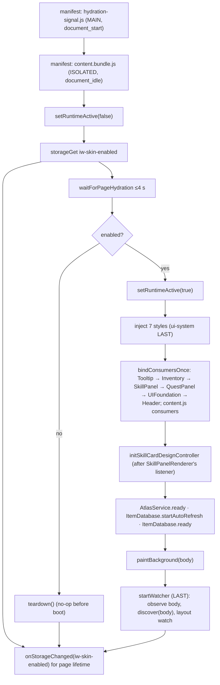
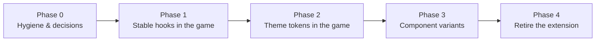

# 6. Integration and maintenance guide

This chapter covers:

- installing and running the skin;
- options for integrating it with IdleWorlds;
- start-up order and dependencies;
- every configuration constant and customisation procedure;
- **every assumption** the skin makes about the game;
- how game updates break it, and how to diagnose and fix that;
- troubleshooting;
- the long-term migration path;
- how to prove that a change preserves visuals and functionality.

## 6.1 Installation and setup

### 6.1.1 Prerequisites

| For | Requirement |
| --- | --- |
| Running the skin | Chrome (or Chromium) **111 or newer** (§1.10). Other browsers are unsupported |
| Building and testing | Node.js (CI uses **24**); `npm ci`; `npx playwright install chromium` once |
| Rebuilding art (optional) | Python 3 with imaging libraries **[Verify packages]**, Windows PowerShell, and the sibling art repositories (C24) |

### 6.1.2 Load the extension

**From the repository (developer):**

1. `npm ci`
2. `npm run build` (or `node build-tools/build.mjs --allow-missing-assets` if the vendored atlases are absent)
3. Open `chrome://extensions`, enable **Developer mode**, then **Load unpacked** → select the repository root (the folder containing `manifest.json`).
4. Open `https://idleworlds.com` and log in.

**From a release zip:**

1. `npm run package` writes `release/idleworlds-fantasy-skin-v<version>.zip`.
2. Unzip it into a folder.
3. **Load unpacked** → that folder.

The Chrome Web Store needs a manifest icon set before submission (PKG-01).

### 6.1.3 Development loop

```bash
npm ci
```

```bash
npm run build
```

```bash
npm test
```

```bash
npm run fixtures
```

- After editing `src/`, run `npm run build`, **commit `dist/content.bundle.js` together with the change** (CI fails on a stale bundle), then click the reload icon for the extension in `chrome://extensions` and refresh the game tab.
- `npm test` rebuilds with `--allow-missing-assets`, syntax-checks the bundle, runs all 47 suites and the sprite-window audit. It takes about 3.5 minutes on the inspection machine [Test run].
- A single suite runs with `node tests/<name>.test.mjs`. Most suites load `dist/`, so **build first**.
- `npm run vendor` is needed only when `ASSET_REVISION` changes (`build-tools/vendor-assets.mjs:25`).

### 6.1.4 Kill switch

The skin can be removed from, and restored to, the open page without a reload. There is no UI for it (C15).

1. On the IdleWorlds tab, open **DevTools → Console**.
2. In the **JavaScript context selector** (top-left of the Console, normally "top"), choose the **IdleWorlds Fantasy Skin** content-script context.
3. Run one of:

```js
chrome.storage.local.set({ 'iw-skin-enabled': false })   // full teardown
```

```js
chrome.storage.local.set({ 'iw-skin-enabled': true })    // rebuild
```

**Expected results:**

| After | Console shows | Page state |
| --- | --- | --- |
| `false` | `[IW Fantasy Skin] disabled — active presentation removed` | Removed: all 7 `style[data-iw-style]`, every `data-iw-*` and `data-fs-*` mark, skin nodes, and owned inline styles (restored to native). `#iw-tip` remains, hidden (FUN-10) |
| `true` | `[IW Fantasy Skin] v1.6.0 booted` | Skin rebuilt |

**Notes:**

- The value persists across reloads and tabs. Remember to set it back to `true`.
- `chrome.storage.local.remove('iw-skin-enabled')` also enables the skin (a missing key means enabled).
- A change made during the first ≤4 s of a page load may be missed (H-07).

### 6.1.5 Confirming the skin is active

Run in the **page** context (the default "top" context):

```js
({
  styles: [...document.querySelectorAll('style[data-iw-style]')].map(s => s.dataset.iwStyle),
  theme: document.documentElement.dataset.iwZoneTheme,
  design: document.documentElement.dataset.iwSkillCardDesign,
  frames: document.querySelectorAll('[data-iw-ui="section-frame"]').length,
  skillCards: document.querySelectorAll('.fs-skill-panel').length,
  inventoryRows: document.querySelectorAll('.fs-inv-row').length,
})
```

**Expected:**

- `styles`: `["base","tooltip-engine","inventory","skillpanel","header","overlay","ui-system"]`;
- `theme`: a theme name, or `"default"`;
- `design`: `"new"`;
- non-zero counts on the matching routes.

The console also logs `[IW Fantasy Skin] boot after page hydration: 1 (…ms)`. A state of `timeout` or `unknown` means the hydration probe did not work (§6.6).

## 6.2 Integration options

| Option | What it is | Pros | Cons | When to choose |
| --- | --- | --- | --- | --- |
| **A. Keep the extension, with light cooperation from IdleWorlds** | The skin stays a Chrome extension. IdleWorlds adds **stable hooks** (`data-*` roles on panels, cards, controls), a **public hydration signal**, and optionally an approved village endpoint | Minimal game work; removes the biggest fragilities (C3, C5, C6, SEC-04) | Still a runtime overlay (C2, C7, C9); Chrome-only; players must install it | Community theme, opt-in |
| **B. Official opt-in theme loaded by the game** | The game ships the stylesheets and a trimmed runtime as a selectable theme | Available to all players and browsers the game supports; no extension permissions | Keeps the classifier approach inside the app, which is not idiomatic for React; the runtime adapters must change: <ul><li>`chrome.storage` → app settings;</li><li>`assetUrl` → CDN paths;</li><li>no hydration gate;</li><li>no kill switch → theme toggle.</li></ul> | A stepping stone while components are migrated |
| **C. Port into the IdleWorlds codebase** (recommended long-term) | Theme tokens and component variants implement the look. The classifiers, observer and overlays are deleted | Idiomatic, fast, accessible, testable; removes most findings | The largest effort (§6.7) | The skin becomes the official look |

**Option B adapter sketch** (only the runtime seams change):

| Seam | Extension implementation | Option B replacement |
| --- | --- | --- |
| Storage | `Runtime.storageGet/Set/Remove`, `onStorageChanged` (`chrome.storage.local`) | App settings store (or `localStorage` with a prefixed namespace) |
| Assets | `Runtime.assetUrl` → `chrome.runtime.getURL` | `new URL(path, CDN_BASE)`; `StyleInjector.rewriteAssetUrls` points to the CDN |
| Styles | `StyleInjector` runtime `<style>` elements | Bundle the CSS in the app build; drop the injector |
| Boot | `content.js` `start()` with hydration gate | Call `boot()` from a top-level `useEffect` after hydration; `teardown()` on theme switch |
| Village data | `VillageScene` fetch | Read from the app's player store |
| Kill switch | Storage listener | Theme setting |

## 6.3 Initialisation order and dependencies



**Hard ordering constraints** (breaking one causes a real defect):

| Constraint | Why | Enforced by |
| --- | --- | --- |
| Hydration signal before the first boot | React #418 when appending mid-hydration (C3) | `start()` awaits the gate |
| `setRuntimeActive(true)` first; `setRuntimeActive(false)` last in teardown | `guard` skips work while inactive, and teardown's own guarded cleanup must still run | `content.js` |
| `ui-system` injected last | Its generic rules must win ties | `static-invariants.test.mjs` |
| Consumers bound before `startWatcher` | The initial discovery flush would otherwise be lost | `content.js` comment; `smoke.test.mjs` |
| `SkillPanelRenderer` listener before `QuestPanelRenderer` and `SkillCardDesignController` | The quest renderer rejects `fs-skill-panel` cards; V2 requires the class the renderer adds | Registration order in `bindConsumersOnce` and `boot` |
| Classify pass order (12 steps, §1.5.4) | Later steps read earlier marks (collapse needs frames; compact buttons need nav, zone and inventory marks; header chrome needs nav and zone bar) | `UIFoundation.queueClassify` |
| `iw:item-db-updated` / `iw:atlas-updated` consumers are idempotent | Data can arrive at any time, including while disabled | `guard` + `isRuntimeActive` |

**Module dependency layers** (imports only flow downward):

```text
content.js
  └─ UIFoundation ─┬─ WorldBossPanels ─┬─ AtlasService ── aliases, normaliseItemName, Runtime
                   │                   ├─ ItemDatabase ── normaliseItemName, Runtime
                   │                   ├─ SkillsArtService ── Runtime (+ revised-v5/index.json)
                   │                   └─ TooltipEngine ── ItemDatabase, AtlasService, itemDisplay, StyleInjector
                   ├─ VillagePanels ── ItemDatabase, Runtime, villageBuildings
                   ├─ VillageScene ── Runtime, Viewport, villageBuildings, ItemDatabase, VillageLedger
                   ├─ CollapsibleFrames ── Runtime
                   ├─ HeaderChrome ── Viewport
                   ├─ CompactButtons
                   └─ DOMWatcher, StyleInjector, Runtime, ProgressCadence, Viewport
  ├─ HeaderRenderer ── DOMWatcher, StyleInjector, Runtime, zoneThemes, SkillsArtService
  ├─ SkillPanelRenderer ── DOMWatcher, StyleInjector, Runtime, InlineStyleOwner, SkillsArtService
  ├─ SkillCardDesignController ── DOMWatcher, Runtime, ProgressCadence, Viewport
  ├─ QuestPanelRenderer ── DOMWatcher, StyleInjector, Runtime, SkillsArtService, AtlasService, ItemDatabase
  ├─ InventoryRenderer ── DOMWatcher, AtlasService, ItemDatabase, TooltipEngine, StyleInjector, itemDisplay, InventoryModel, Runtime, InlineStyleOwner
  ├─ NameScanner ── ItemDatabase, TooltipEngine, Runtime
  ├─ BackgroundPainter ── Runtime, InlineStyleOwner
  ├─ OverlayFramer ── Runtime
  └─ HydrationGate
```

There are no import cycles [Generated: `tools/js-api-census.md` "Import graph": 35 runtime files, 0 cycles].

## 6.4 Configuration and customisation

### 6.4.1 Constants

None of these are user settings. Change them in source, rebuild, and run the listed tests.

| Constant | File:line | Value | Effect | Safe range and notes | Tests |
| --- | --- | --- | --- | --- | --- |
| `ENABLED_KEY` | `content.js:51` | `'iw-skin-enabled'` | Kill-switch storage key | Changing it resets everyone to enabled | `smoke` |
| `VERSION` | `content.js:52` | `'1.6.0'` | Logged version | Must equal `manifest.json` and `package.json` (enforced by `npm run package`) | package step |
| `HYDRATION_GATE_ENABLED` | `HydrationGate.js:21` | `true` | Wait for hydration | `false` = immediate boot (risk of #418) | `hydration-gate` |
| `TIMEOUT_MS` / `POLL_MS` | `HydrationGate.js:23–24` | 4000 / 50 | Maximum wait / poll interval | 2000–8000 / 25–100 | `hydration-gate` |
| `GIVE_UP_MS` | `hydration-signal.js:26` | 15000 | Signal polling limit | ≥ `TIMEOUT_MS` | `hydration-gate` |
| `FLUSH_BUDGET` | `DOMWatcher.js:42` | 60 | Elements per animation frame | 30–150; higher means longer frames on bursts | `flush-quiescence`, `smoke` |
| `SEL_INV_ROW` / `SEL_SKILL_PANEL` | `DOMWatcher.js:29–30` | `.compact-row, [class*="item-row"]` / `.compact-panel` | Which game nodes are observed as rows and cards | Must match the game's markup | many |
| `BREAKPOINTS` | `Viewport.js:66` | 640, 768, 1024, 1280, 1536 | Layout epoch triggers | Must match the game's Tailwind breakpoints | `viewport-swap` |
| `API_URL` | `ItemDatabase.js:13` | `https://idleworlds.com/items.json` | Catalogue source | See SEC-03 | `data-services` |
| `CACHE_MAX_AGE_MS` / `REFRESH_RETRY_MS` | `ItemDatabase.js:20–21` | 6 h / 15 min | Cache freshness / retry | ≥1 h / ≥5 min to limit load | `data-services` |
| `SHOW_DELAY` / `EDGE_GAP` / `EDGE_MARGIN` | `TooltipEngine.js:35–37` | 120 ms / 0 / 10 px | Hover delay / trigger–card gap / viewport margin | `EDGE_GAP` must stay 0: the hover handoff relies on the surfaces touching | `tooltip-virtual-anchor` |
| `MIN_NAME_LENGTH` | `NameScanner.js:43` | 3 | Minimum matched name length | Lower values cause false matches | `smoke` |
| `PROGRESS_EPSILON` / `PROGRESS_LEAD_BIAS` / `PROGRESS_DURATION_EPSILON_MS` | `ProgressCadence.js:22, 35, 40` | 0.05 / 1.12 / 15 | Ignore tiny changes / lead factor / write threshold | Bias 1.0–1.2 (lower lags, higher overshoots) | `action-progress-theme`, `skill-card-v2-render` |
| `LABEL_CEILING_PX` / `LABEL_FLOOR_PX` | `SkillCardDesignController.js:184, 187` | 9.5 / 4 | V2 action label font range | Raise the floor for legibility (B-11) | `skill-card-v2-render` |
| `LONG_ACTION_SECONDS` | `SkillCardDesignController.js:244` | 11 | Countdown threshold | — | `skill-action-countdown` |
| `ACTION_CAP_PX` | `SkillsArtService.js:58` | 60 | Three-slice cap width in atlas pixels | Measured from the art; change only with new art | `quest-command-width`, sprite audit |
| `ZONE_SURFACE_MAX` | `HeaderRenderer.js:58` | 34 | Highest zone with header art | Bump when new zone art is imported | `zone-headers` |
| `NAV_LABELS` | `UIFoundation.js:25` | game, market, leaderboards, village, dungeon | Route tabs styled | Add new routes here | `header-compact`, `menu-rows` |
| `TOOLKIT_URL` | `UIFoundation.js:289` | `https://idleworldstoolkit.com` | Outbound link | B-07 | `header-compact` |
| `SECTION_FRAME_NAMES` | `UIFoundation.js:439` | Regex of panel headings | Orphan heading frames | Add panels here | `panel-frame-nesting` |
| `DAILY_BOOST` | `UIFoundation.js:1325` | Regex | Boost chip detection | Update if the copy changes | `collapsible-frames` |
| `REFRESH_MS` / `RETRY_MS` / `ROUTE_REFRESH_MS` | `VillageScene.js:14, 15, 17` | 5 min / 30 s / 10 s | Village API cadence | Keep ≥ current values (server load) | `village-scene` |
| `STORE_KEY` | `CollapsibleFrames.js:29`; `VillageLedger.js:45` | `iw-collapsed-frames`; `iw-village-ledger` | Preference keys | Changing them loses saved choices | `collapsible-frames`, `village-ledger` |
| `GAME_NAVIES` | `BackgroundPainter.js:19` | 20 hex colours | Colours repainted | Add the game's new surface colours | `smoke` |
| `BUNDLE_SOFT_BUDGET` | `build-tools/build.mjs:117` | 300,000 bytes | Build warning threshold | Advisory only | — |
| `ASSET_REVISION` | `build-tools/vendor-assets.mjs:25` | sprite repo commit | Pinned atlas source | Bump, then `npm run vendor`, then commit the assets | `data-services` |

### 6.4.2 Customisation procedures

**Change the palette.**
- Edit the `--iw-th-*` defaults in `base.css` `:root` (L74–193), or a theme block (L216–318).
- Derived edges update automatically through `color-mix` (L320–368).
- Check contrast (§7.5) and run `npm run fixtures`.

**Add or re-map a zone theme** (a new zone number, or a zone moving to another theme):
1. Update `assets/skills-ui/zone-theme-map.json` in the sprite repository.
2. Run `npm run import:skill-themes`. This regenerates `src/modules/zoneThemes.js` and copies `theme_<t>.webp`, `panel_corners_<t>.webp` and `separator_flourish_<t>.webp`.
3. A **new theme name** also needs:
   - a palette block in `base.css`;
   - `card-button-atlas.css` windows (rerun `build-tools/build-card-buttons.mjs` with the new art);
   - revised-v5 and compact-ghost-v3 atlases for the theme (and its name in `revised-v5/index.json → themes`, or the unreachable `exact-v3` branch is taken, and it has no art);
   - `--fs-quest-frame-position` in `skillpanel.css` L2706–2735.
4. Test: `zone-themes`, `revised-button-atlas`, `compact-button-atlas`, `card-button-art`.

**Add header art for a new zone.**
1. Run `npm run import:zone-headers` and `npm run import:zone-headers:mobile` (or `npm run art:zones` for placeholders).
2. Raise `ZONE_SURFACE_MAX`.
3. Test: `zone-headers`.

**Support a new skill discipline.** Five places, per the project record (`docs/traps/classification.md`):
1. `DOMWatcher.js`: `SKILL_IDENTITY_ALIASES`, plus the verb and anchored-label branches in `detectSkillType`.
2. `SkillPanelRenderer.js`: a `SKILL_META` row (`actions` exact button texts; `titleActions` title prefixes).
3. `skillpanel.css`: an accent (`.fs-skill--<type>`).
4. `QuestPanelRenderer.js`: a `DISCIPLINE_STYLE` row.
5. The test fixture maps (`SKILL_GLYPHS`, `SKILL_ART`, `SKILL_LEVELS`).

Optionally:
- a V2 action icon: `npm run import:action-icons` with updated artwork, plus a per-type rule in `skillcard-v2.css` L376–385;
- `SkillsArtService.ICON_ALIASES` for the medallion.

Test: `skill-card-system`, `skill-card-v2*`, `quest-card-detection`, `smoke`.

**Frame a new game panel.**
- Panels rendered as `.panel` are framed automatically.
- A heading-only panel needs its name in `SECTION_FRAME_NAMES`.
- Add a collapse key only if the default title key is unsuitable.
- Test: `panel-frame-nesting`, `collapsible-frames`.

**Opt a new self-painting control out of the generic button rule.** Add its hook to the `:not()` chain of `ui-system.css:1019`, `:1033` and `:1065`, and to the matching `base.css` chains (L428–552). Never raise specificity instead (§3.2.2).

**Add a stylesheet.** Prefer appending to an existing injection group: the smoke test pins the count at 7. If a new sheet is unavoidable:
1. import it in `content.js` (or `UIFoundation.injectUIFoundationStyles`) at the right cascade position;
2. update `tests/static-invariants.test.mjs` and `tests/smoke.test.mjs`;
3. update the `INJECTION` map in `tools/css-inventory.mjs` and `FILE_ORDER` in `tools/css-superseded.mjs` (both fail otherwise).

**Add a test suite.** Append it to `test:run` in `package.json` by hand, or it never runs in CI [Source: `CLAUDE.md`].

## 6.5 Assumptions about the application

Every item below is something the skin **relies on** in the game. When one changes, the corresponding surface usually falls back to native (fail-safe). The **Detection** column says how the break shows up.

### 6.5.1 Platform and framework

| # | Assumption | Used by | If it changes | Detection |
| --- | --- | --- | --- | --- |
| A1 | React root exposes `__reactContainer$…` → `stateNode.current.memoizedState.isDehydrated` | `hydration-signal.js` | Boot waits 4 s ("timeout") or reports "unknown" | Console hydration line |
| A2 | Tailwind breakpoints 640/768/1024/1280/1536 | `Viewport.js`, CSS media queries | Hidden-column mismatches; layouts switch at the wrong widths | `viewport-swap`; mobile audit |
| A3 | The panel stack is duplicated (`hidden xl:grid` / `xl:hidden`) | `Viewport`, all classifiers | If removed: no harm. If a third copy appears: the wrong copy may be decorated | Visual check at 1279/1280 px |
| A4 | The game's design tokens are named `--background`, `--card`, `--primary`, … | `base.css` L74+ | Unclassified components keep stock colours | Visual |
| A5 | Progress fills use inline `width: N%` (or `aria-valuenow`) | `UIFoundation` progress, V2 fill, CSS `[style*="width"]` | No smoothing; fill band lost | `action-progress-theme` |
| A6 | The game fetch client adds `x-idleworlds-league` from a `/ssf` path prefix | `VillageScene` | Wrong league's village, or an error | Village scene on an SSF character |

### 6.5.2 Markup hooks

| # | Hook | Used by | If it changes |
| --- | --- | --- | --- |
| A7 | `.panel` | Section frames, overlay card choice, village and boss roots | Frames missing |
| A8 | `.compact-panel` | Skill, quest, boss and village cards; `base.css` ground; 561 CSS rules | Cards unskinned |
| A9 | `.compact-row`, `[class*="item-row"]` | Inventory rows, market rows, row ground | Inventory overlay missing |
| A10 | `#current-action-panel` | Activity panel fallback; V2 countdown host | Countdown and progress styling missing |
| A11 | `<header>` with player text; `h1.header-player-name`; `.min-w-0.overflow-hidden`; `button.header-icon-btn`; `.grid.grid-cols-2` / `.stat-chip` | `HeaderRenderer` | Header unskinned or partly skinned |
| A12 | `.feed-panel` | Chat and log background CSS | Stock background |
| A13 | Tailwind class substrings: `hover:underline`, `chat-name-`, `decoration-dotted`, `rounded-*`, `opacity-30`, `px-`, `border`, `tab`, `text-left`, `flex-1`, `bg-ember/orange/primary/accent`, danger or warning text hues | `base.css`/`ui-system.css` exclusions; button state; requirement state; market | Player names gain plates; wrong primary button state; unmet requirements not red |
| A14 | Active state via `aria-selected`, `aria-current="page"`, `aria-pressed`, `data-state="active"`, or active-looking classes | Nav, filters, loadout toggle | Active tab or filter not highlighted |
| A15 | Lucide `<svg>` inside pager buttons | V2 pager CSS | Double chevrons |
| A16 | Portalled dialogs are `position: fixed`, z-index ≥20, viewport-covering, with blur or a dark translucent background | `OverlayFramer` | Modal frames missing |
| A17 | Card inner structure (identity, title, readout, buttons, material line, requirement line, reward line in one card) | `SkillPanelRenderer.annotateStructure` | `three-zone` not applied; V2 incomplete |
| A18 | Header chrome sibling layout (nav, optional notice, zone bar with exactly 2 children) | `HeaderChrome` | Unmerged header (fail-safe) |
| A19 | Village slot card shape (head row first, picker second; names as direct `<p>`) | `VillagePanels` | Slot art and roles missing |

### 6.5.3 English copy

| # | Text pattern | Used by |
| --- | --- | --- |
| A20 | Panel headings: "Inventory", "Market", "Leaderboards", "Quests", "World Bosses", "Village", "Village Add-ons", "Salvaging", "Skill Actions"/"Actions", "Zone Selector", "Current Action", "Action Log", "World Chat" | Frames, activity panels, Village, bosses, market, `VillageScene` anchor |
| A21 | Nav labels: Game, Market, Leaderboards, Village, Dungeon | `NAV_LABELS` |
| A22 | Zone bar: "Zone N:", "Zones", "Next zone", "Change Zone" | Zone bar, compact buttons, header zone |
| A23 | Header: "Combat Lv N", "Players online: N", "ATK N … DEF N … HP N", "IdleWorlds" | `HeaderRenderer` |
| A24 | Skill verbs: Fight, Mine, Prospect, Cut, Smelt, Forge, Brew, Enchant, Tailor, Sew, Weave, Fish, Chop, Craft Parts, Build, Craft, Gather, Harvest; identities; "coming soon"/"upcoming skill" | `DOMWatcher.detectSkillType` |
| A25 | Readout "Lv N - X% • … to go"; "Base reward:"; "N/M" material counts; "Requires …" | `SkillPanelRenderer` |
| A26 | Quests: "Reward:", "Turn In", "Skip (n)", "N% complete", "Work Order" | `QuestPanelRenderer`, `DOMWatcher` |
| A27 | Inventory: "Equip", "Equipped", "Unequip", "List", filter names (All, Gear, Materials, Consumables, Drops), "Prev"/"Previous"/"Next", "n / m" | `InventoryRenderer` |
| A28 | Activity: "View All", `[\d,.]+ xp / hr`, `hh:mm:ss` timestamps, "system", "queued", placeholder "Message World Chat", "Send" | `UIFoundation` |
| A29 | Boost: "Daily XP Boost … +N% XP" | `classifyDailyBoost` |
| A30 | Bosses: boss names, "Prejoin"/"Prejoined", "controls Zone N", "Race to capture", "contested", team colour words | `WorldBossPanels` |
| A31 | Village: "Current tier: N", building and house names matching `villageBuildings.js`, action verbs (Install, Upgrade, Uninstall, Destroy, Cancel) | `VillagePanels`, `VillageScene.readHousingPerks` |
| A32 | Timer formats `h:mm:ss`, `m:ss`, `1h 2m 3s` | V2 countdown |

### 6.5.4 Data contracts

| # | Contract | Used by |
| --- | --- | --- |
| A33 | `items.json`: `{ generatedAt, items: [{ item_id, name, category, subcategory, tier, effects_raw, acquisition_type, acquisition_summary, acquisition_detail, craft_skill, craft_level, source_zone, drop_rate, drop_boosted_by, req_text, req_level, req_skill, wiki_slug, base_value, work_order_turn_in_gold, work_order_turn_in_note, stat fields… }] }`; ETag/Last-Modified | `ItemDatabase`, `itemDisplay`, `TooltipEngine`, `WorldBossPanels`, `VillageLedger` (validated manually by `npm run audit:items`) |
| A34 | Building items are `construction_building_tier_<N>` | `VillageScene`, `VillageLedger` |
| A35 | `/api/player?section=…&scope=core` → `player.housing.tier` (0–5), `player.villageAddons.totalSlots` (0–5), `installed[] {slot, itemKey, name}` | `VillageScene.normaliseVillage` |
| A36 | Item names in the DOM match catalogue names after normalisation (with cloak aliases) | Inventory, quests, name scanner, atlas |
| A37 | The wiki path `https://idleworlds.com/wiki/items/<slug>` | Tooltip link |

## 6.6 When a game update breaks the skin: diagnosis

### 6.6.1 Symptom → cause → fix

| Symptom | Likely cause | Diagnose | Fix location |
| --- | --- | --- | --- |
| Skin appears **4 s late** on every load | Hydration probe cannot find React's root (A1) | Console: `boot after page hydration: timeout (4000ms)` | `hydration-signal.js` container list or field path; or ask for a public signal |
| Skin never appears | Extension not loaded; kill switch `false`; host changed; Chrome <111; exception at boot | `chrome://extensions` errors; the content-script context shows `[IW Fantasy Skin]` logs; `chrome.storage.local.get('iw-skin-enabled')` | Manifest `matches`; enable the key |
| A whole panel is **unframed** | `.panel` removed or renamed (A7); heading renamed (A20) | Page context: `document.querySelectorAll('.panel').length`; check `[data-iw-ui="section-frame"]` | `UIFoundation.classifySectionFrames`, `SECTION_FRAME_NAMES` |
| Skill cards look stock | `.compact-panel` change (A8); verbs or identities changed (A24) | In page context, inspect the card for `data-fs-skill`; if absent → detection; if present but no `data-iw-skill-layout` → structure (A17) | `DOMWatcher.detectSkillType`; `SkillPanelRenderer.annotateStructure` |
| Skill card partly broken (misplaced title, wrong button) | Role mis-resolution after a markup change | List roles: `[...card.querySelectorAll('[data-iw-skill-role]')].map(e => [e.dataset.iwSkillRole, e.textContent.trim()])` | `annotateStructure` resolvers; the candidate memo (H-09) |
| Inventory rows show **raw text and overlay together** | New native child not suppressed; row class change (A9) | Check `data-fs-suppressed` on native children; the `data-fs-inv` signature | `InventoryRenderer.hideOriginalChildren` |
| Inventory shows ❓ icons everywhere | Atlas metadata failed, or names changed (A36) | Content-script console: `[AtlasService]` warnings | Atlas vendoring; `aliases.js`; `AtlasService.resolve` |
| No tooltips, and plain item names | Catalogue failed (network, CORS on `www`, schema) | Content-script console: `[ItemDatabase]` warnings; Network panel for `items.json` | `ItemDatabase` (SEC-03, A33) |
| Quests unskinned | "Reward:"/"Turn In" copy changed (A26) | Card lacks `fs-quest-panel` | `QuestPanelRenderer.isQuestCard` |
| Header unskinned | Header text probes fail (A23) or classes changed (A11) | No `[data-iw-header="root"]` | `HeaderRenderer.findLiveHeader`/`classifyProfile` |
| Header shows three stacked boxes instead of one | `HeaderChrome` refused the structure (A18) | No `[data-iw-chrome="shell"]` | `HeaderChrome.resolve` |
| Theme stuck on "default" | Zone label copy changed (A22) | `document.documentElement.dataset.iwZoneTheme`; `[data-iw-ui="zone-title"]` present? | `classifyZoneBar`, `currentZoneNumber` |
| Active tab or filter not highlighted | Active-state mechanism changed (A14) | Inspect native ARIA and classes on the active tab | `deriveTabActive`; inventory filter state; compact selection |
| A player name suddenly has a button plate | Text-link class substring changed (A13) | Inspect the name button's classes | Add a new exclusion to the generic control `:not()` chains |
| Progress bar jumps instead of gliding | Fill no longer uses inline `width` % (A5) | Inspect the fill element's `style` | `findCurrentActionProgress`; `progressPercent`; V2 `FILL` selector |
| Village scene says "could not be loaded" | API shape, status or league header changed (A35, A6) | Network: `/api/player` status and JSON | `normaliseVillage`; `leagueOf`; B-08 |
| Modal pop-ups unframed | Overlay layer shape changed (A16) | `document.querySelectorAll('[data-iw-overlay]')` | `OverlayFramer.isScrim` thresholds |
| Page becomes **slow** after a game update | A classifier cache stopped validating (the `[].every()` trap), or a new mutation loop | Perf harness; Performance panel shows `flushPending` every frame on an idle page; `flush-quiescence` fixture with the new shape | Compare-before-write; cache coverage checks (`docs/traps/performance.md`) |
| Everything looks right, but a **game control stopped working** | Skin CSS hides or blocks a new control (`pointer-events`, `display`), or a mirror covers it | Kill switch: does the control work with the skin off? DevTools → inspect the element at the click point | The responsible CSS rule (Appendix B lookup by selector); rule 1 fix |

### 6.6.2 Diagnostic toolkit

| Tool | Use |
| --- | --- |
| Kill switch (§6.1.4) | A/B test the same live state with and without the skin |
| Content-script console context | Skin logs and warnings (`[IW Fantasy Skin] <label>: <message>`, once per label) |
| Attribute inspection | All skin marks are readable `data-iw-*`/`data-fs-*` attributes (Appendix D lists every one with its owner) |
| `claude/capture-*.js` DevTools snippets (for example `capture-inventory.js`, `capture-skill-cards.js`, `capture-header.js`) | Read-only dumps of live DOM and computed styles to JSON, for reproducing live shapes in fixtures. **Review a snippet before pasting it into a logged-in console**, and never share dumps that include player data |
| `node claude/audit-mobile.mjs --widths 360,390,430,768` | Phone and tablet layout audit to `tmp/mobile-audit/` [Project record: `docs/traps/mobile.md`] |
| `node claude/perf-harness.mjs --runs 3 [--noskin \| --bundle <file>]` | Main-thread cost on a ticking 15k-node page to `tmp/perf/` |
| `npm run audit:items` | Validates the live `items.json` contract (network) |
| `build-tools/audit-header-live.mjs` | Live header audit using a **local browser profile** (SEC-07: use a test account) |
| Appendix B/C | Find which rules target a selector or hook; check specificity and `!important` |

### 6.6.3 Troubleshooting FAQ

- **"The skin works on apex but not on `www.idleworlds.com`."** Check the `items.json` request in the Network panel (CORS). Check whether `www` redirects to apex. See SEC-03.
- **"My CSS change does nothing."**
  1. Is the rule in a sheet that is imported, and did you rebuild and reload the extension?
  2. Is it beaten by a later rule (Appendix B, sort by selector), a renderer's inline `!important` (steer via `var()`), or the generic control rule (add a `:not()` exclusion)?
  3. Is the element's role mark present?
- **"A test passes locally, but the live page differs."** Fixtures omit live shapes or sheets [Project record: `docs/traps/test-harness.md`]. Capture the live DOM with a `claude/capture-*.js` snippet and model that shape.
- **"Suites fail intermittently on my machine."** `smoke`, `skill-card-system` and `quest-command-width` are timing-sensitive under load (project memory). Re-run them alone before debugging.
- **"The bundle check fails in CI."** Run `npm run build` and commit `dist/content.bundle.js`.
- **"Icons blank after bumping `ASSET_REVISION`."** Run `npm run vendor`, commit the assets, and confirm `item_icons_index.csv` columns (the `AtlasService` validation warns).

## 6.7 Long-term improvement and migration plan



| Phase | Goal | Work | Exit criteria |
| --- | --- | --- | --- |
| **0. Hygiene and decisions** | Make the current skin safe to share and cheaper to maintain | <ul><li>H-20 (remove secrets from the tree);</li><li>H-01, H-18, H-02, H-06–H-10, H-12;</li><li>delete dead CSS (§3.13 step 1);</li><li>owner decisions on SEC-04, CONT-01, SEC-09, FUN-01;</li><li>fix doc drift D-01…D-10.</li></ul> | `npm test` green; `css-superseded.md` shows 0 rows; zip < 90 MB; decisions recorded |
| **1. Stable hooks** (game change, small) | Remove copy-based detection | The game renders `data-*` hooks on: <ul><li>panels (`data-panel="inventory"`, …) and cards (`data-card="skill"`, `data-skill="mining"`, `data-card="quest"`);</li><li>roles inside cards (identity, title, readout, action, pager, materials, requirement, reward);</li><li>nav tabs (`data-route`), zone bar parts, activity panel parts, village slots, boss cards;</li></ul> plus a public hydration event. Update the classifiers to prefer hooks (keeping text fallbacks for one release) | Detection works with localisation; `hydration-signal.js` deleted; A20–A32 no longer required |
| **2. Theme tokens** (game change, medium) | Remove `!important` and specificity escalation | <ul><li>Move the Ashen Iron and per-zone palettes into the game's theme variables.</li><li>Set `data-zone-theme` from game state.</li><li>Use cascade layers or the Tailwind theme so skin CSS wins without `!important`.</li><li>Serve art from the game CDN.</li><li>Split the atlases (PERF-07).</li></ul> | `!important` count below 5% of declarations; BackgroundPainter deleted; no text scan for zones |
| **3. Component variants** (game change, large) | Move the classifier work into React components | Implement the variants (`Panel variant="forged"`, `SkillCard`, `QuestCard`, `InventoryRow`, `BossCard`, `VillageSummary`, `ItemTooltip`, `CollapsiblePanel`, `Button variant="compact"`), using the existing CSS as the visual spec. Resolve A11Y-01..03 with real markup | Each surface renders the fantasy look with the extension disabled; per-component tests and visual regression |
| **4. Retire the extension** | One implementation | Ship a theme setting; migrate stored preferences if desired; archive the repository | The extension is no longer needed; the store listing (if any) is unpublished |

**Suggested mapping from skin marks to component props** (the CSS in `src/styles` can keep working during migration if components emit the same attributes):

| Skin mark (today) | Component prop or attribute (future) |
| --- | --- |
| `data-iw-ui="section-frame"` + `section-title` | `<Panel variant="forged" title="…">` |
| `fs-skill-panel`, `data-fs-skill`, `data-iw-skill-role`/`-zone` | `<SkillCard skill="mining" slots={{ identity, title, commands, materials }}>` |
| `data-iw-skill-v2-*` | `SkillCard` internal state (level, percent, fill duration from the tick interval, timer) |
| `fs-quest-panel`, `data-iw-quest-*` | `<QuestCard state="ready" discipline="…" objective={item}>` |
| `.fs-inv-row` overlay + `data-fs-*` | `<InventoryRow item={item} owned={ownedDetails} actions={…}>` |
| `data-iw-panel="current-action"` + parts | `<CurrentAction progress={p} tickMs={t} queue={…}>` |
| `data-iw-collapse*` | `<CollapsiblePanel persistKey="…">` |
| `data-iw-compact-button` + layers | `<Button variant="compact" selected>` |
| `data-iw-overlay` | `<Modal variant="forged">` |
| `html[data-iw-zone-theme]` + inline art variables | `<ThemeRoot zoneTheme={theme}>` with CSS variables |

## 6.8 Package-size clean-up (SIZE-01)

1. In `build-tools/package-release.mjs`, extend `EXCLUDE` with:
   - `/^assets\/skills-ui\/buttons\/exact-v3\//`;
   - `/(^|\/)(registration|verification)\.json$/`;
   - the non-runtime index and provenance files: `assets/skills-ui/buttons/card-v6/index.json`, `assets/skills-ui/buttons/compact-ghost-v3/index.json`, `assets/quest-frames/index.json`, `assets/skills-ui/zone-theme-map.json`, `assets/village/buildings.json`, `assets/skills-ui/action-icons/index.json` **[Verify each is not fetched: the census lists the only runtime fetches, N3–N5]**;
   - `assets/skills_xp_plaque_wide.webp`.
2. Remove the matching `web_accessible_resources` glob for `exact-v3` in `manifest.json`. The package step fails if a pattern matches no file.
3. Optionally delete the `else` branch in `SkillsArtService.applyThemeVariables` and the folder itself (keep the generator script if the art might return).
4. Run `npm run build && npm test && npm run package`. Load the zip unpacked, open each zone theme (or force `data-iw-zone-theme` per theme in DevTools), and confirm button art renders.

Expected result: the zip shrinks by about 60 MB (about 42% of 142.8 MB).

## 6.9 Decision checklist for IdleWorlds

| # | Decision | Context |
| --- | --- | --- |
| 1 | May the skin (or its successor) read `/api/player`, and at what rate? Or will IdleWorlds provide village data another way? | SEC-04, B-08 |
| 2 | Are the World Boss notice, orb explanation, drop-rate texts and terms ("Dominion Ward", "Queued") acceptable, or should they come from the game? | CONT-01, CONT-02, B-06 |
| 3 | Keep, move or remove the Toolkit link? | SEC-09, B-07 |
| 4 | Should the XP-cycle button be restored in the new skill card design? | FUN-01, B-01 |
| 5 | Is re-hosting the game's item, gear, village and housing art inside the extension permitted? | §1.8, C23 |
| 6 | Is AI-generated art acceptable under the game's content policy? | §1.8 |
| 7 | Which reduced-motion behaviour is intended for the game's own animations? | FUN-03, B-03 |
| 8 | Which integration option (A/B/C) and timeline? | §6.2, §6.7 |
| 9 | Distribution channel (unpacked, private store listing, public listing) and who owns updates? | PKG-01 |
| 10 | Font licence attribution (SIL OFL) in releases | §1.8 |

## 6.10 Proving that a change preserves visuals and functionality

**Definition of done for any change to `src/`:**

1. `npm run build`, then `npm test`, **green**. Commit `dist/content.bundle.js`.
2. `npm run fixtures`: compare the rendered fixtures at 320/360/390/430/600/768 px (and desktop) with the previous run (keep the last good screenshots). Any difference must be intended.
3. For CSS changes, regenerate `tools/css-inventory.mjs` and `tools/css-superseded.mjs`, and review the diff of Appendix B and `css-superseded.md`. No new host-hook dependency without a note.
4. For classifier changes:
   - add or extend a suite with **a negative control** (break the fixture on purpose and confirm the test fails) [Project record: `CLAUDE.md` "Verification discipline"];
   - include the flush-quiescence check if the change writes to the DOM.
5. **Live verification by a person** (no automated session can do this). Use the checklist in [§7.8](07-testing-and-verification.md#78-final-verification-checklist), with the kill switch for A/B comparison. Record exactly which kind of verification was done: "built", "fixture-rendered", or "live-verified".
6. Functionality spot-checks with the skin on:
   - every control on the changed surface works with mouse, keyboard (Tab, Enter, Space) and touch;
   - disabled states still look disabled;
   - active, equipped, met/unmet and team colours still differ.
