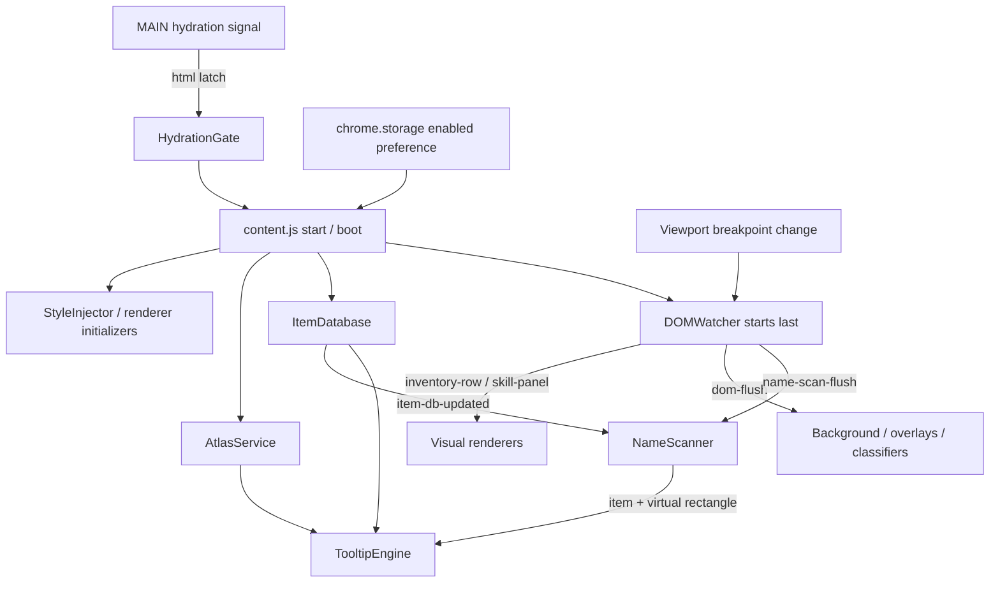

# JavaScript core: runtime, data, text, tooltips, and security

This is a source-level handover of the core JavaScript as inspected on 17 September 2026. It describes the code that exists, including its limitations; comments and historical notes are not treated as proof of current behavior. No production files were changed for this handover. Source links below are relative to this document. Line ranges are stated in prose so the references remain useful in a local checkout as well as a source browser.

Scope: `content.js`, the MAIN-world hydration signal, `Runtime`, `HydrationGate`, `DOMWatcher`, `StyleInjector`, `InlineStyleOwner`, `Viewport`, `AtlasService`, `SkillsArtService`, `ItemDatabase`, `InventoryModel`, `itemDisplay`, `aliases`, `normaliseItemName`, `ProgressCadence`, `NameScanner`, and `TooltipEngine`. Renderer call sites are included where they explain a core contract. The companion renderer handover covers the visual modules and the authenticated Village request in detail. This document does not claim a security audit of the live game, browser profile, remote server configuration, dependencies, or an authenticated session.

## 1. Execution and ownership model

The extension has two scripts, in two JavaScript worlds, sharing the document. [manifest.json](../../manifest.json), lines 13–37, loads `dist/content.bundle.js` at `document_idle` in the default isolated world and `src/page/hydration-signal.js` at `document_start` in `MAIN`, on HTTPS `idleworlds.com` and `www.idleworlds.com`, top frame only. There is no background service worker in this manifest. The isolated bundle can see and decorate DOM, but does not automatically see the page's JavaScript variables or monkey-patched functions. Chrome documents this separation and the shared DOM boundary in [Content scripts](https://developer.chrome.com/docs/extensions/develop/concepts/content-scripts).

The project contract in [CLAUDE.md](../../CLAUDE.md) is presentation-only, no reparenting of game nodes, reversible decoration, one MutationObserver, and preserving visible game state. Most core services follow that division: they read text/attributes, compute presentation metadata, append extension-owned UI, or set namespaced presentation hooks. This is an architectural constraint, not a guarantee that every current path has perfect reversal. Specific exceptions and gaps are recorded below.

There are three lifetimes to keep distinct:

| Lifetime | Objects/work | Consequence |
| --- | --- | --- |
| Page | module singletons, item and atlas maps, `consumersBound`, delegated tooltip/name listeners, enabled-storage listener, one hidden tooltip element | A disable/enable cycle is not a fresh module import. Retained flags and references matter. |
| Activation | injected styles, DOMWatcher, breakpoint listeners, item refresh timer, renderer decoration, highlights | These should stop or be cleared by `teardown()`. |
| Pending asynchronous job | fetch, timeout, animation frame, microtask | Disabling usually stops future scheduling or guards work, but does not cancel all jobs already pending. Every completion must obey its own lifetime checks. |

## 2. Activation, kill switch, and consumer coordination — `content.js`

**Purpose and why JavaScript:** enable/disable preference, delayed first boot, runtime CSS injection, service startup, event subscription order, and reversible cleanup require lifecycle code. CSS cannot discover hydration completion, load an item table, cancel observation, or restore the game's previous inline values.

**Source:** [content.js](../../src/content.js), imports lines 14–49; `injectPresentationStyles()` 57–72; `scanRoots()` 74–81; `bindConsumersOnce()` 83–117; `boot()` 119–153; `teardown()` 163–189; `applyEnabled()` 191–194; startup IIFE 196–217.

### 2.1 First boot and stylesheet order

1. Startup sets `Runtime` inactive before any awaited storage/hydration work (line 198).
2. Read `iw-skin-enabled` through `storageGet()` (line 202). A missing key or failed read returns `null`, which ultimately means enabled. Only literal boolean `false` disables; strings such as `"false"` enable.
3. Await the hydration gate, including when the saved preference is disabled (line 207). Log the signal state/time unless gate state is `disabled`.
4. Apply the preference captured before that wait (line 212).
5. Only afterward subscribe to changes of that preference (line 216). The returned unsubscribe callback is intentionally not retained.
6. `boot()` is idempotent through `booted`; it marks the runtime active before injection. The seven lifecycle style tags are injected in this order: `base`, `tooltip-engine`, `inventory`, `skillpanel`, `header`, `overlay`, then `ui-system` through UIFoundation. `skillpanel` concatenates five source sheets: `skillpanel.css`, `skillcard-v2.css`, `skillcard-v2-runtime-safe.css`, `card-button-atlas.css`, and `card-buttons.css` (61–71). UIFoundation supplies its own combined final sheet.
7. Register tooltip, inventory, skill, quest, UI-foundation, and header consumers once, each through `guard()` (90–95). Initialize skill-card design on every activation, because its choice/decorations are activation-owned (133).
8. Start `AtlasService.ready()` with a rejection logger; enable ItemDatabase auto-refresh then request its data (137–144). Neither fetch blocks initial painting.
9. Paint initial background (147), then start DOMWatcher last (150), so initial discovery cannot run before event consumers exist.

### 2.2 Central event connections

| Event/listener | Registered at | Work / guards | Lifetime |
| --- | --- | --- | --- |
| `document` `iw:dom-flush` | content 97–107 via `DOMWatcher.on` | Background paint on each supplied root; whole document if list empty. Always reconcile overlays globally. Each operation is guarded. | Page, bound once. |
| `document` `iw:name-scan-flush` | 109–112 | If DB ready, scan connected unique roots with per-root guards. | Page. |
| `document` `iw:item-db-updated` | 114–116 | Scan `getScanRoots()` (normally the entire body), even if the update came from a background fetch; guards in `scanRoots()` suppress active work while disabled. | Page. |
| `chrome.storage.onChanged` filtered to `iw-skin-enabled` / local | 216 through Runtime | Call `applyEnabled(value !== false)`; intentionally works when runtime inactive. | Page. |

There is no direct DOM attribute write in this entry point beyond delegating to the modules. Its module-level booleans are private isolated-world state, not `window` properties. Storage is the only persistent state directly owned here; no network call is made directly here.

### 2.3 Disable and re-enable, including limits

`teardown()` first stops the observer and layout watch, then item refresh scheduling, hides the tooltip, clears name highlights, clears inventory, skill-design, skills, quests, UIFoundation, header, background, overlays, every injected sheet, and the hydration latch (170–183). Runtime stays active during those calls because their own `guardEach()` restorations need to run; it becomes inactive only at 186. If never booted, teardown only sets Runtime inactive (164–167).

Re-enable repeats CSS injection and activation-specific initialization and restarts observation/services. It does not wait for hydration again, rebind page listeners, recreate service maps, or recreate the tooltip.

**Source-derived failure/edge cases:**

- The preference listener is installed after the first awaited storage read and hydration wait. A preference change during that interval can be missed, and startup can apply a stale saved value. There is no second read or generation check.
- `booted = true` is set before style injection (121). Injection and `ItemDatabase.startAutoRefresh()` are not individually guarded. A synchronous failure can leave a partially booted state that later `boot()` calls consider complete.
- `consumersBound = true` is set before initializers run (85). A throwing initializer is warned and skipped, but it will not be retried by this function on the next enable cycle.
- Runtime guards suppress only paths that actually call them. Tooltip delegates and several service callbacks do not. “Late callbacks are inert” in the entry-point comments is an intention, not a universal property.
- Cleanup exceptions are isolated by `guard()` so later cleanup steps continue, but skipped/failed cleanup is not automatically retried once `booted` becomes false.
- Fetches are not aborted. A completed ItemDatabase refresh can update memory/storage and dispatch its event after disable. The text-scan listener is guarded; other consumers need their own checks.
- This is an extension preference switch, not a logout, account change, browser reload, or hard destruction of the module graph. The tooltip element/listeners and cached item metadata remain.

**Official-app migration:** put the theme choice in the app's settings state and render the theme root from that state. Let application components own decoration and cleanup with their mounts. Move stylesheet ordering to the app build. A root mounted effect or explicit app-ready contract replaces external hydration probing; do not call `hydrateRoot()` a second time over a root the game already owns.

## 3. Hydration barrier — MAIN signal and isolated gate

**Purpose and why JavaScript:** the extension appends nodes the server HTML never contained. `document_idle` is a browser DOM scheduling point, not a guarantee that React hydration has committed. Waiting reduces the risk of appending unfamiliar children while React is matching server DOM. React's [hydrateRoot documentation](https://react.dev/reference/react-dom/client/hydrateRoot) requires matching server/client output and discusses hydration mismatch recovery. The particular historical failure rate in source comments is a historical report, not reproduced by this handover.

**Source:** [hydration-signal.js](../../src/page/hydration-signal.js), entire IIFE lines 24–64; `rootKeyOf()` 30–34; `signal()` 36–39; `check()` 41–61. [HydrationGate.js](../../src/modules/HydrationGate.js), configuration 21–24; `waitForPageHydration()` 30–51; `clearHydrationLatch()` 54–56.

### 3.1 MAIN-world signal, step by step

1. Capture `performance.now()`, 15,000 ms maximum polling window, and 50 ms delay.
2. On each `check()`, inspect candidate containers in order: `document`, `<html>`, `<body>`, `#__next`, then every direct body child.
3. `Object.keys(container)` searches an enumerable key starting `__reactContainer$`. Read `container[key]?.stateNode?.current?.memoizedState` on the first claimed container.
4. If that state is missing or `isDehydrated` is not boolean, write `<html data-iw-page-hydrated="unknown">` and stop. If false, write `"1"` and stop. If true, stop checking further containers this poll and wait.
5. If no completed/unknown root and elapsed time is below 15 seconds, schedule another `setTimeout(check, 50)`. At or after the limit, schedule nothing and write nothing.
6. `signal()` only writes if `<html>` exists and the attribute does not already exist. It does not overwrite an existing value.

This is the only React-private-object access in this source scope. It reads a hydration flag, not hooks, account state, inventory state, session tokens, or an application store. It never assigns to those React objects. It reads page-owned properties in MAIN world, so unexpected getters or changed object shape can still throw; there is no enclosing `try/catch` or listener fallback. It does not install a global function, message bridge, fetch hook, or `postMessage` listener.

### 3.2 Isolated gate, step by step

1. Default `enabled=true`, `timeoutMs=4000`, `pollMs=50`, `root=document.documentElement`.
2. Resolve immediately with `{state:'disabled', waitedMs:0}` when gate disabled or root absent.
3. Otherwise poll the captured root attribute. Any nonempty value releases the gate; it is not restricted to `1` or `unknown`.
4. If no nonempty latch by elapsed timeout, resolve `state:'timeout'`.
5. On finish, remove the attribute if present and report rounded elapsed milliseconds. The polling chain stops because it schedules only when not finished.

**DOM/API/timing inventory:** read React expando property names and state in MAIN; read/write/remove one `<html>` attribute; `performance.now`; one sequential timeout chain per signal/gate invocation. No observer, interval, network, storage, event listener, credential API, or dynamic code compilation. Gate does not expose a cancellation handle; `clearHydrationLatch()` removes the attribute but does not cancel MAIN polling.

**Gaps and browser behavior:** the page can forge or clear the latch because DOM is shared; it is a timing hint, not authenticated inter-world messaging. The 4-second timeout deliberately allows boot without evidence of hydration. MAIN's 15-second limit is checked only after the root tests, so hydration detected after the gate times out can still write a late latch. The gate cannot remove that future write; a later teardown can. The first false/unknown root wins, even if another root is still hydrating. Browser timer throttling or a blocked main thread means 4 seconds is not a strict wall-clock scheduling guarantee. `unknown` is fail-open. No root causes the gate to time out. Re-enabling never rechecks a new root.

**Migration:** remove both scripts/protocols in an official integration. Mount the theme as part of the same React tree and perform browser-only setup after commit. [React useEffect](https://react.dev/reference/react/useEffect) provides setup/cleanup tied to component lifecycle; an app-controlled ready event can serve external consumers if a plugin remains necessary. Do not migrate the `__reactContainer$` inspection into official code as a supported React API.

## 4. Runtime wrappers, guards, storage, and scheduling

**Purpose and why JavaScript:** [Runtime.js](../../src/modules/Runtime.js) centralizes browser-extension APIs, an active-state gate, logging, and scheduling so renderers can run in both an extension and a test DOM. It owns no DOM.

| Feature / exact source | Execution and state | Limits / migration |
| --- | --- | --- |
| `hasChrome`, line 20 | Capture whether global `chrome` exists with `chrome.runtime.id`, once at module load. | Not recalculated if context is later invalidated or a test installs a mock late. |
| `setRuntimeActive`, `isRuntimeActive`, 26–34 | Boolean is false only for literal `false`; default true supports direct module tests; content explicitly resets false before boot. | Module-private, no global hook. App state/context can replace it. |
| `assetUrl(path)`, 42–49 | Coerce to string, strip leading `/`, call `chrome.runtime.getURL(clean)` if available; otherwise return relative path for tests/dev. | Not a general URL sanitizer or path allowlist. Production call sites supply package paths. An app build should import/resolve versioned assets instead. |
| `storageGet`, 59–70 | Await `chrome.storage.local.get(key)`, return value or `null`; catch and warn once. | Missing and failed read are indistinguishable. |
| `storageSet`, 76–88 | Await local set, return boolean success; log once on rejection. | Caller must inspect false. No serialization/schema/quota policy here. |
| `storageRemove`, 90–102 | Await local remove and return success; catch/false on failure. | Exported, but no current production call found in the core. |
| `LOCAL_FALLBACK`, 53 / 69 / 86 / 100 | In-memory Map used when extension API unavailable. | Not durable; does not emit change events. It does not use page localStorage. |
| `onStorageChanged`, 108–122 | Register one Chrome listener; filter area `local` and key existence; invoke handler under `try/catch`; return unregister closure. | Not active-state gated, by design for re-enable. The entry point retains listener for page life. |
| `warnOnce`, 126–137 | Keep a Set of warning keys and print `err.message` or supplied value once per key. | No reset/cap; repeated failures can be invisible after first warning. Logged item names/metadata may appear in developer console, not sent remotely. |
| `guard`, 145–154 | Skip if inactive; synchronously call function; return true or warn/false. | Does **not** await returned Promises, cancel work, undo partial writes, or catch future asynchronous rejection. |
| `guardEach`, 160–167 | Skip if inactive; call guard separately per iterable item and count successes. | A failing item cannot cancel later items in this loop. Iterable creation/iteration errors outside individual calls are not separately isolated. |
| `raf`, 175–177 | Capture bound `window.requestAnimationFrame`; fallback `setTimeout(fn,16)`. | Returns native handle but has no cancellation wrapper. Callback always runs, so queue flags must be cleared **outside** guards. Browser may delay RAF in hidden tabs. |

There is no runtime messaging, tabs API, cookies API, scripting injection API, or authentication helper here. `chrome.storage.local` is an extension storage boundary; it is not the same as encrypting content or declaring cached metadata safe for HTML. The module makes no network call itself.

**Migration:** replace Chrome storage with an app-owned preference/cache repository with explicit schemas, replace `assetUrl` with the bundler/CDN path contract, and use abort/dispose ownership for asynchronous effects. Preserve per-item error isolation where one malformed record should not blank an entire screen. Keep queue bookkeeping outside cancellation guards. Do not carry the test Map's success semantics into production persistence.

## 5. Central DOM reconciliation and skill identification — `DOMWatcher`

**Purpose and why JavaScript:** the extension cannot subscribe to the game's component state. It observes rendered changes and translates them into typed reconciliation events. A single observer reduces duplicate subtree walks; a work-item budget spreads bursts over frames. In an official app this exists because ownership is external, and is largely removable.

**Source:** [DOMWatcher.js](../../src/modules/DOMWatcher.js), selectors 29–30; event helpers 44–56; skill recognition 65–203; queue sets/algorithms 205–321; `flushPending()` 323–349; `startWatcher()` 354–450; `stopWatcher()` 459–471; `getScanRoots`, `on`, `off` 473–484.

### 5.1 Observer and mutation routing

`startWatcher()` returns when `_started`, otherwise marks started, creates the one `MutationObserver`, observes `document.body`, discovers the whole body, and starts Viewport watching. Observation options (426–432): `childList`, `subtree`, `characterData`, and `attributes`, with exactly these watched attributes: `class`, `style`, `disabled`, `aria-disabled`, `aria-pressed`, `aria-selected`, `aria-current`, `data-state`. No `data-iw-*` is watched; `<html>` is outside the body root. No `ResizeObserver`, `IntersectionObserver`, interval, native route listener, `popstate`, or history patch is installed by this module.

| Mutation | Routing, lines 358–423 | Important exclusion |
| --- | --- | --- |
| `childList` | Queue the changed parent for nearest inventory row/skill panel. Discover each added element's matching rows/panels plus name and background root. An added text node queues its parent for text work. | Parent alone gets no name scan and no background work unless inside `[data-iw-compact-button]`. Removed nodes are not individually traversed. |
| `characterData` | Queue parent context for inventory, skills, names. | No background paint; text cannot itself change a surface color. |
| `style` | Queue nearest skill + background root. | Inventory metadata and names skipped. |
| `disabled` / `aria-disabled` | Queue nearest skill only. | Inventory, names, background skipped. |
| Other watched attributes | Queue nearest inventory/skill and background, with reason argument `attr:class` even for ARIA/data-state changes. | No descendant rediscovery and no name scan. |

`queueContext()` (230–244) locates closest `.compact-row, [class*="item-row"]` and closest `.compact-panel` using `matches` then `closest`. `discover()` (246–259) includes the root itself and matching descendants. The selectors are coarse discovery signals, not proof a panel is a skill. Renderers must reject unsupported shapes.

### 5.2 Queue, budget, and events

1. Four insertion-ordered Sets hold inventory rows, skill panels, background roots, and name roots (205–208). Despite `addIfConnected()`'s name, admission checks only element type; connectivity is checked while draining (211–213, 278–283).
2. `addNameRoot()` walks ancestors to skip roots already covered by a pending ancestor; this avoids scanning all pending roots on each insertion (222–228).
3. `scheduleFlush()` sets one `flushQueued` flag and queues RAF (261–265). Passed reasons are not retained.
4. `drainGlobalBudget(60)` round-robins all four queues, taking at most 60 connected roots/elements total (299–321). Disconnected entries are deleted without using the budget. Names covered by pending ancestors or previously taken ancestors are dropped (287–298).
5. `flushPending()` clears its queue flag **before** guarded work. Emit `iw:inventory-row {row, reason:'reconcile'}`, then `iw:skill-panel {panel, skill, reason:'reconcile'}`, then `iw:dom-flush {roots:bgRoots}` if nonempty and `iw:name-scan-flush {roots:nameRoots}` if nonempty. All are `CustomEvent`s on `document`, `bubbles:false` (44–46, 331–342).
6. Schedule another RAF if any queue remains. Viewport crossings call `discover(document.body,'layout-change')`, feeding the same pipeline (448–449).

**Budget meaning:** it limits the number of work items, not elapsed milliseconds or descendants examined. One body name root can scan a large page. Initial `discover()` and the observer callback run outside the 60-item drain. Background roots can overlap. Skill signature collection still walks relevant panel descendants on every reconciliation. Budget fairness restarts from inventory each frame, but round-robin prevents a single populated category from consuming all slots before other nonempty categories get work.

**Error behavior:** per-row dispatch and per-category work are guarded. However, `guard(() => document.dispatchEvent(...))` is not an error boundary around arbitrary DOM event handlers: browser event-listener exceptions are reported as uncaught and do not propagate to the `dispatchEvent()` caller. Consumers that require suppression/logging need their own guard. See [dispatchEvent behavior](https://developer.mozilla.org/en-US/docs/Web/API/EventTarget/dispatchEvent).

### 5.3 Skill identity feature

`skillSignature()` (118–132) gathers all button texts, identity labels, and a locked-copy boolean. Normalize whitespace, trim, lowercase. Identity candidates (87–97) are `h1–h4`, class containing `skill-name`, and leaf `div/span/p/strong`; skip anything inside `button,a`, strip leading non-ASCII-letter/digit symbols, and retain at most 32 characters. Locked copy (106–116) requires both `coming soon`/`upcoming skill` and `unlock in a future update` in short text. JSON of these signals keys a WeakMap cache (134–140); equal-length changed text therefore invalidates correctly.

Detection order (143–203):

1. A `Turn In` or `Skip`/`Skip(N)` button plus an anchored `Reward:` line rejects the shared quest-card shape as `unknown`.
2. Exact button actions are authoritative: Fight→combat; Mine→mining; Prospect/Cut→jewelcrafting; Smelt/Forge→smithing; Brew→alchemy; Enchant→spellcrafting; Tailor/Sew/Weave→tailoring; Fish→fishing; Chop→woodcutting; Craft Parts/Build→construction.
3. Disabled/ARIA-disabled control plus locked copy yields `locked`.
4. Exact short identity aliases resolve combat, mining, smithing, gathering/herbalism/herb, alchemy, jewel/jewelcrafting, spellcraft/spellcrafting, tailor/tailoring, wood/woodcutting, build/construction, crafting, fishing, or locked labels.
5. Bare Craft falls back to crafting; Gather/Harvest to gathering. Anchored identity/verb expressions then supply the listed discipline fallbacks. Otherwise `unknown`.

**Cache gap:** `detectSkillType()` reads current button `disabled`/`aria-disabled` and reward-line existence, but neither is part of `skillSignature()`. An attribute-only disabled toggle or reward-line change with otherwise identical signature can reuse an old skill classification. This is a source-derived condition, not a claim that the live game's locked cards routinely hit it. Skill cache has no explicit reset but weak keys permit detached panel collection.

### 5.4 Cleanup, stale shapes, and migration

`stopWatcher()` disconnects the observer, stops breakpoint listeners, clears `_started`, `flushQueued`, and all pending Sets (459–471). It does not cancel an already queued RAF; that callback drains nothing, and inactive guards normally suppress work. A very fast stop/start can leave an old RAF alongside the new one; flags/sets are shared, not activation-versioned. `on`/`off` are thin document listener helpers with no registry/unsubscribe return; caller owns removal. `getScanRoots(root=document)` returns `[root.body || root]` only if it is an element, usually the whole body.

The observer never reconnects if the body element itself is replaced. Attribute changes outside its filter, pure CSS layout changes outside known breakpoints, and state represented only in private game objects are invisible. Name records for removed nodes are pruned on a later name-highlight rebuild, not necessarily immediately on removal-only mutation, because that routing need not queue a name root. The observer sees extension class/style/node changes too, so equality checks and owned-node exclusions are essential to avoid self-triggered loops.

**Official-app migration:** replace structural selectors and English text heuristics with component props (`kind`, `itemId`, `discipline`, `isLocked`, `progress`, `isActive`) and known DOM refs. Use React render lifecycle instead of observing the app's own output. If a compatibility adapter remains, retain this module at that boundary only, document supported DOM contracts, version its cache with every input actually read, and use an elapsed-time budget if responsiveness requires one.

## 6. Reversible stylesheet injection — `StyleInjector`

**Purpose and why JavaScript:** runtime-owned styles can be removed by the kill switch; a manifest-declared stylesheet cannot be removed through this module. Imported CSS text must resolve asset paths against the extension package rather than the page URL.

**Source:** [StyleInjector.js](../../src/modules/StyleInjector.js), `_injected` line 15; `rewriteAssetUrls()` 17–22; `inject()` 28–36; `removeAll()` 39–42.

`inject(id,css)` checks an ID Set, adds the ID, creates `<style data-iw-style="id">`, assigns textContent after rewriting, and appends to `document.head || document.documentElement`. The regex matches only `url('../assets/path')`, the equivalent double-quoted form, or unquoted form with no whitespace/quote/`)` in `path`. It rewrites to `url("${assetUrl('assets/'+path)}")`. It does not parse arbitrary CSS, sanitize CSS, rewrite `@import`, or rewrite other relative/absolute URL shapes. All current inputs are build-imported stylesheet strings, not fetched user content.

`removeAll()` removes every `style[data-iw-style]` in the document, then clears the Set. No listener, observer, timer, storage, fetch, or inline style write is owned here. CSS image/font references do result in browser asset loads, and extension resources must be declared in the manifest. The “CSP-proof” wording in old comments should be read as removal of reliance on third-party asset hosts, not a universal guarantee against every CSP/resource policy.

**Gaps:** if insertion fails after the ID is added, retry with the same ID is skipped. If another actor removes the style node while enabled, the Set prevents self-repair. Removal uses a namespace selector, not exact node references, so it can remove a colliding page/extension tag. Appending to `<html>` before `<head>` exists is supported as a fallback but may change cascade placement. Migration should use bundled CSS modules/design tokens and one explicit theme class; if dynamic injection remains, own exact nodes and make state commit follow successful insertion.

## 7. Property-level inline restoration — `InlineStyleOwner`

**Purpose and why JavaScript:** an external skin sometimes must override React-managed inline styles. Restoring the whole `style` attribute would delete unrelated game updates. This service tracks only each property a caller writes.

**Source:** [InlineStyleOwner.js](../../src/modules/InlineStyleOwner.js), factory 24–144; tracking 25–52; `stateFor()` 54–85; `set()` 87–104; `restoreElement()` 106–130; `restoreWithin()` 132–137; `restoreAll()` 139–141.

1. A factory creates a WeakMap from element to property Map, a Set for enumerable tracking, and a WeakMap of element references. If both WeakRef and FinalizationRegistry exist, tracking does not strongly retain elements; otherwise the Set retains them until restore.
2. First `set(el,prop,value,priority='important')` reads the property's current inline value/priority as the native underlay.
3. Later set calls compare the current inline value/priority with this owner's last applied values. If they differ, treat the current value as a newer external/game underlay before reapplying.
4. Always call `style.setProperty()` so the browser parses/normalizes the requested value; record the actual post-write value/priority, not the raw requested color/string. Return whether the serialized property changed.
5. Restore only if current value/priority still equal the last applied ones. If the game changed it after the last reconcile, leave that current value intact. Otherwise restore the saved native property/priority or remove that property when the original value was empty.
6. Remove tracking for the restored element. `restoreWithin(root)` enumerates tracked live elements and restores those equal to/contained by root; `restoreAll()` restores all tracked elements, including reachable detached ones.

The service does not enumerate all CSS properties, remove a `style` attribute, or observe game writes itself. Its contract depends on callers using `set()` consistently and restoring when finished. BackgroundPainter, InventoryRenderer, and SkillPanelRenderer create separate owners ([BackgroundPainter.js](../../src/modules/BackgroundPainter.js), 15–17; [InventoryRenderer.js](../../src/modules/InventoryRenderer.js), 19/52; [SkillPanelRenderer.js](../../src/modules/SkillPanelRenderer.js), 12/30–32).

**Limits:** property ownership is value-based, not provenance-based. An external write equal to the skin's serialized value cannot be distinguished; two owners writing the same property can misinterpret each other's values as native. Shorthand/longhand pairs interact through CSS serialization and must not be mixed in one ownership scheme. No observer, timer, event listener, storage, network, or game-state mutation exists here. Finalization is nondeterministic; the fallback strong Set must be restored explicitly. An official component should compute final style from state rather than record/override its own former style; retain this helper only for external/adapted DOM.

## 8. Rendered-column selection and breakpoint invalidation — `Viewport`

**Purpose and why JavaScript:** the page contains duplicate narrow/wide panel stacks. Selecting a column by class spelling can choose the hidden copy; a CSS-only breakpoint crossing does not create a mutation. This module supplies a rendered-state tie-break and a shared cache epoch.

**Source:** [Viewport.js](../../src/modules/Viewport.js), `isRendered()` 36–41; `pickRendered()` 45–47; `preferRendered()` 55–58; breakpoints/state 66–70; `getLayoutEpoch()` 73–75; `startLayoutWatch()` 85–98; `stopLayoutWatch()` 103–107.

`isRendered()` rejects disconnected elements, calls `checkVisibility()` when present, otherwise regards a bounding box with either nonzero width or height as rendered. `pickRendered()` returns first rendered candidate, else the first candidate, else null. `preferRendered()` returns all rendered candidates, except an empty result returns the original list. The fallback intentionally keeps layout-less jsdom fixtures usable, but in a real all-hidden group it also keeps hidden candidates. The default `checkVisibility()` call does not check opacity zero or `visibility:hidden` unless options are supplied; this is a display-box test for the duplicate-column use case, not proof of visual visibility or hit-testability. See [checkVisibility options](https://developer.mozilla.org/en-US/docs/Web/API/Element/checkVisibility).

Start creates matchMedia queries for `(min-width: 640px)`, `768px`, `1024px`, `1280px`, `1536px`; one shared `change` handler increments `layoutEpoch` then invokes `onCross`. It is idempotent when query array is nonempty and returns quietly if matchMedia unavailable. It assumes modern `addEventListener('change')`, with no legacy `addListener`. Stop removes the five listeners and resets arrays/handler, but preserves the epoch. Crossing several boundaries can fire several events; DOMWatcher's queue generally coalesces discovery output.

No DOM writes, storage, network, timer, resize listener, or observer is owned here. Reading fallback geometry may flush layout, so callers should batch reads before writes. Hardcoded breakpoints are assumptions about the host's Tailwind defaults. A layout change from container queries or different breakpoints has no epoch event. If a breakpoint changes while watching is stopped, restart does not compare previous `.matches` values or increment the epoch; fresh activation discovery/caller cleanup must invalidate stale caches. Official integration should avoid duplicate semantic trees where possible, use responsive CSS, and invalidate only actual layout-dependent calculations from app-owned refs/media contracts.
