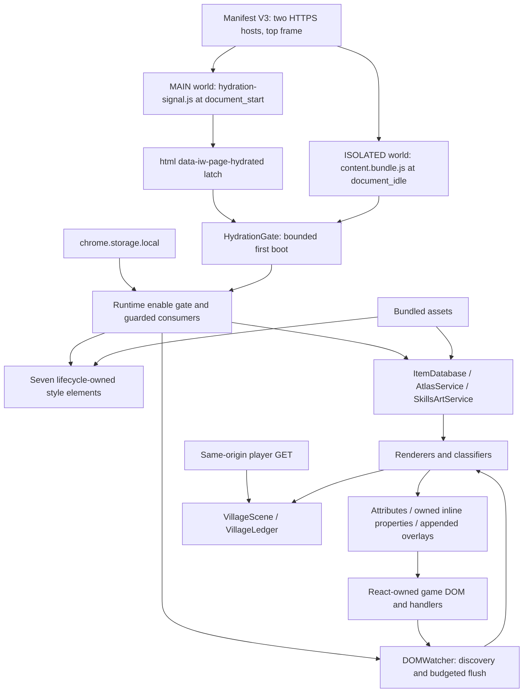

# IdleWorlds Fantasy Skin: complete technical handover

**Audited source:** repository commit `059081671bf3af4490a025121f25f13ada142b7e`, version `1.6.0`, inspected 17 September 2026. This is a source audit and integration manual, not a certification of the deployed IdleWorlds application. Source locations refer to this snapshot; follow function names after later edits.

## Reading and evidence conventions

The assembled [TECHNICAL_HANDOVER.md](../TECHNICAL_HANDOVER.md) contains the narrative chapters. Two exhaustive appendices are integral to it: [CSS_RULE_REFERENCE.md](CSS_RULE_REFERENCE.md), which enumerates every stylesheet rule and declaration, and [PROJECT_REFERENCE.md](PROJECT_REFERENCE.md), which lists every tracked project file, every local asset, and every locked npm dependency. The chapters also remain available separately for maintenance: [JavaScript core](JAVASCRIPT_CORE.md), [JavaScript features](JAVASCRIPT_FEATURES.md), [CSS guide](CSS_GUIDE.md), [build and assets](BUILD_ASSETS.md), and [verification](TESTING.md).

“Observed” means present in the inspected code or a recorded command result. “Source-derived risk” means a concrete code path warrants attention but has not been reproduced against an authenticated live account. “Recommendation” describes work that has **not** been implemented. Historical documentation is evidence of prior intent or incidents, not proof of the current runtime.

The audit inspected the extension source, manifest, package lock, build/import utilities, tests, artwork metadata, and repository notes. It did not inspect the original application repository, server implementation, real account payloads, private browser profiles, or unrelated documents in `output/`. Existing local `.claude/` material was left untouched. No game transactions, login changes, deployments, or runtime bug fixes were performed to produce this handover.

## 1. Purpose, scope, and user experience

The extension turns IdleWorlds' existing React interface into a dark fantasy interface with illustrated zone headers, coordinated forged frames, item sprites, themed controls, skill medallions and progress treatments, quest frames, inventory detail overlays, item hovercards, world-boss/zone-control artwork, village illustrations and a dashboard village ledger. Panels can collapse independently, and the whole presentation can be disabled without reloading the page.

The intended gameplay contract is to preserve the existing game controls, their identities, handlers, state, and network actions. The code achieves much of its visual change by annotating existing nodes, applying CSS, owning individual inline style properties, and appending extension-owned nodes. **“Presentation only” is a design boundary, not a literal claim that nothing is modified:** native display branches may be hidden while mirrors are shown; ARIA attributes are written; the dashboard village reads an authenticated player endpoint; the item database removes one legacy page-storage cache; and extension preferences are persisted. These behaviors need the detailed review below.

The reskin does not implement combat, crafting, purchases, selling, joining bosses, inventory mutation, authentication, or server progression. It has no backend service, background worker, popup, options page, telemetry service, remote executable script, or game-source build integration. Its module-scope JavaScript normally executes in a content-script isolated world; the separate hydration signal deliberately runs in the page's MAIN world.

### 1.1 Current versus historical features

| Topic | Current implementation | Historical material requiring care |
|---|---|---|
| Skill design | V2 is always selected through `html[data-iw-skill-card-design="new"]`; no live old/new preference toggle | `content.js` still mentions restoring the persisted New/Current choice |
| Panel rearranging | Removed; no `PanelOrder` runtime module | `handoff/rearrangeable-panels.*` and `docs/traps/panel-order.md` remain; selector exclusions preserve specificity |
| Collapse | Active per-panel control and persisted preference | Older frozen spec is a product reference, not the executable implementation |
| Styles | Fourteen imported CSS files compose seven style elements; `header.claude.css` is inactive | Root README still describes five runtime sheets |
| Tests | Forty-seven standalone test files are listed by `test:run`, followed by the sprite audit | README and stability notes still describe five suites |
| Assets | Both main atlases and six fonts are tracked in this snapshot | README says the large PNGs are not stored in the repository |
| Storage | Extension storage for current caches/preferences, plus one legacy localStorage deletion | “Never localStorage” is too absolute for the migration path |
| Network | Bundled art; public item metadata and authenticated village reads | “No runtime network needed” in the vendor script describes art availability, not the entire extension |
| Mutation observation | One `MutationObserver` constructor in the runtime source; other scheduling mechanisms still exist | “One observer” does not mean one listener, timer, or asynchronous service |

### 1.2 Deployment boundary and architecture



The host page and content script share the DOM, but not their ordinary JavaScript variable environments. The MAIN-world probe is therefore a narrow bridge through an HTML attribute rather than a general application API. Do not treat the latch, custom events, or `data-iw-*` attributes as authenticated messages: the page can modify them. Chrome documents the distinction between worlds and the visibility of declared resources in its [content-script guide](https://developer.chrome.com/docs/extensions/develop/concepts/content-scripts).

### 1.3 Boot, reconciliation, and teardown

Read [src/content.js](../../src/content.js), particularly `start`, `boot`, `bindConsumersOnce`, `injectPresentationStyles`, and `teardown`, together with the core JavaScript chapter.

1. The MAIN script begins a bounded React hydration probe; it publishes the root latch. The isolated entry sets runtime inactive while reading `iw-skin-enabled`.
2. The entry awaits the hydration gate. The four-second bound is a fail-open fallback, not proof that React is ready. Stored `false` disables; missing/failed storage defaults to enabled.
3. `boot()` marks the runtime active, injects styles in the exact order below, binds page-lifetime consumers once, and initializes the fixed V2 controller.
4. Atlas and item services initialize asynchronously; item auto-refresh begins. A failed service logs and leaves fallback/native presentation available where the renderer supports it.
5. Initial background painting precedes `startWatcher()`. Consumers exist before initial discovery emits typed events.
6. React mutations are classified and queued. The watcher emits inventory/skill/header/scan/flush events; consumers reconcile their own namespaces. Resizing and route changes can invalidate cached rendered-element choices even without a structural mutation.
7. Disabling first stops the watcher and item refresh, then hides tooltips, clears scanners/renderers/controller/UI/header/background/overlay presentation, removes styles, clears the latch, and finally gates runtime activity off. Keeping the runtime active during cleanup lets guarded restoration execute.
8. Page-lifetime listeners remain registered. Re-enable calls the same boot path without registering duplicates. Some cleanup shortcomings are listed in the security and lifecycle audit; the implementation should not be described as removing every listener or every DOM marker.

| Injection order | Style ID suffix | Source concatenation |
|---:|---|---|
| 1 | `base` | `base.css` |
| 2 | `tooltip-engine` | `tooltip-engine.css` |
| 3 | `inventory` | `inventory.css` |
| 4 | `skillpanel` | `skillpanel.css`, `skillcard-v2.css`, `skillcard-v2-runtime-safe.css`, `card-button-atlas.css`, `card-buttons.css` |
| 5 | `header` | `header.css` |
| 6 | `overlay` | `overlay.css` |
| 7 | `ui-system` | `ui-system.css`, `compact-buttons.css`, `village-scene.css`, `collapsible.css` |

The last injection is owned by `UIFoundation.injectUIFoundationStyles()`. Reordering any layer changes the cascade even if every declaration is unchanged. `StyleInjector` rewrites exactly the relative `../assets/…` URL convention to extension URLs. CSS is bundled as text, not declared as persistent manifest CSS, so it can be removed on disable.

## 2. Integration contract, constraints, and their replacements

The available project is the extension repository. The sources document work against captured/deployed markup, but this audit cannot establish every development restriction that existed in earlier sessions. In particular, modern Node, esbuild, Playwright, and npm are available now; there is no evidence that the current project lacks a build tool. Distinguish a limitation of application access from a limitation of the extension's own toolchain.

| Constraint or deliberate decision | Current consequence / workaround | Cleaner official integration | What must remain equivalent |
|---|---|---|---|
| No application component source in this repository | DOM discovery, heading/text regexes, Tailwind shape probes | Add stable component props/roles and use direct state selectors | Visible state, control identity, labels, live updates |
| No safe React ownership of appended siblings | Add owned decoration; never reparent React's nodes | Render art/labels inside the component tree | Native actions and focus order |
| Hydration can be in progress at injection | MAIN-world React-private-root probe plus latch and timeout | Mount the theme after application hydration using a supported lifecycle effect | No React mismatch and no visible duplicate UI |
| Application and skin share a global CSS cascade | Namespaces, structural exclusions, `!important`, late override layers | Component-scoped classes and an explicit token/layer policy | Priority of disabled, equipped, active, ownership, requirement states |
| Inline host values can beat ordinary stylesheet rules | Property-level ownership and inline `var(--token, fallback)` indirection | Components own styles and expose tokens | Ability to update native live values while themed |
| Shared `.compact-panel` is not a semantic type | Positive identification and module-specific namespaces | Explicit card type and typed data props | A quest/boss/village card never becomes a skill card |
| Hidden duplicate page columns swap at 1280px | Rendered-state detection plus layout epoch invalidation | One responsive component tree, or explicit visibility state | Correct live branch before/after breakpoint crossings |
| Text is used as a data API | Normalization, emoji stripping, split/count regexes, caches | Pass names/counts/requirements as data | Localization and equal-length updates must work |
| Dashboard lacks village DOM | Authenticated `/api/player` read and last snapshot fallback | Share the authenticated village state/query cache | Correct account/league, loading/failure/empty state |
| Native game progress arrives in steps | Measured cadence interpolation with completion reset | Drive progress from game start/end timestamps | Completion timing and no delayed rewind animation |
| Need item statistics without application selectors | Public `items.json` fetch and indexed cache | Use the game's versioned item service/store | Current enhancement/tier effects and fallback labels |
| Avoid replacing native text nodes | CSS Highlights, ranges, virtual tooltip anchors | Structured inline item-reference component | Original text meaning and native clicks |
| Art was supplied as sheets | Atlas indices and percentage sprite windows | Asset pipeline emits typed named sprites | Aspect ratio, pixel alignment, stable hover silhouette |
| CDN image/font requests were brittle | Bundle local resources and rewrite URLs | Host versioned assets under app origin | Correct CSP, offline/cache behavior, font fallback |
| Reversible kill switch is deliberate | Activation-owned CSS/DOM plus property restoration | Theme flag and component unmount cleanup | Immediate A/B comparison without reloading game state |
| Fallback/live cache behavior is deliberate | Stale item/village data may remain visible after errors | Explicit query states and version labels | Useful UI during outage without claiming stale data is fresh |
| Accessibility must coexist with host controls | Decorative pseudo-elements and some added ARIA/keyboard handling | Native semantic component variants and owned descriptions | Accessible names, focus, touch, escape, screen reader output |
| Original artwork/generator inputs are external or local-only | Sibling-repository imports and platform-specific art tools | Versioned art-source repository with reproducible build manifest | Approved artwork, provenance, density and crop |

### 2.1 Non-negotiable maintenance invariants

- Preserve gameplay handlers and native interactive elements. A visually correct control that loses its handler, covers another hit target, hides unmet requirements, or changes the accessible name is a regression.
- Keep ownership per module. `data-iw-ui`, `data-iw-header`, `data-iw-chrome`, `data-iw-skill-*`, `data-iw-quest-*`, `data-iw-village-*`, and `data-iw-village-scene-owned` have distinct consumers. A broad cleanup selector can remove another feature.
- Exclude owned mirrored content from every scanner that reads native text. Reading a copy into its own next copy causes growing repeated text.
- Compare before writing watched attributes or text. One `MutationObserver` does not prevent a self-triggered loop.
- Read geometry in a batch before mutating rows/cards. Avoid `getComputedStyle` inside write loops or sort comparators.
- A cache must validate both semantic structure and current connected/rendered elements. An empty array's `.every()` is not evidence that a route was successfully classified.
- Test the full composed stylesheet set and actual inline writers. A component with only its own CSS does not reproduce production specificity.
- Rebuild the committed bundle whenever runtime source changes. Reconcile test copies of algorithms with production functions, or replace them with direct behavioral tests.

## 3. Security and privacy review: decisions before integration

### 3.1 Permission and data boundary

`manifest.json` declares only the `storage` API permission and host permissions for `https://idleworlds.com/*` and `https://www.idleworlds.com/*`. Both content scripts run only in the top frame. There is no `cookies`, `tabs`, `webRequest`, scripting API, background, or externally-connectable declaration. Absence of those permissions does not mean the script cannot read the matched page's DOM or perform credentialed same-origin requests.

| Operation | Actual behavior and boundary | Integration implication |
|---|---|---|
| Public metadata | `ItemDatabase` requests hard-coded `https://idleworlds.com/items.json` with `cache: 'no-cache'`; no explicit credentials option | On `www`, this is cross-origin. Verify CORS and caching behavior; do not assume canonical/noncanonical hosts behave identically |
| Village player read | Relative GET `/api/player?section=<encoded section>&scope=core`, `credentials: 'same-origin'`, explicit league header | The browser sends applicable session credentials to IdleWorlds. The script does not read cookie strings, but it receives authenticated player data |
| Art metadata | `fetch` on extension URLs from atlas/art services; image/font loads from bundled resources | Exposed assets are readable by the matching site; narrow the resource allowlist if pruning unused art |
| User-activated outbound links | Toolkit opens `https://idleworldstoolkit.com`; tooltip Wiki links open an IdleWorlds item path; use `noopener noreferrer` | These are navigation, not telemetry. Removing Toolkit changes a visible feature |
| Extension persistence | Enable key, item cache/check timestamp, collapsed frames and ledger preferences | Avoid storing account secrets or complete player API payloads when migrating |
| Legacy page persistence | One best-effort deletion of `localStorage['iw-item-db-cache']` | This is a deliberate write to shared origin storage; retire only after deciding whether old installations still need cleanup |
| Dynamic HTML | Tooltip and owned-element string renderers use `innerHTML`; selected data is escaped, but not every field | Audit data-to-markup boundaries independently from node ownership |
| Executable code | No `eval`, `new Function`, remote script loader, WebSocket, beacon, or XHR found in runtime `src/` | Build/test scripts may execute evaluated fixture code; that is a different trust boundary |
| Gameplay/auth state | No gameplay POST/PUT/PATCH/DELETE or login-state setter found in runtime source | Server GET side effects are not known from this repository; verify the endpoint contract with the developer |

There is no evidence of deliberate third-party exfiltration in the runtime source. This does not prove that every data path is safe: a markup injection can initiate loads or alter UI, the page can influence shared DOM events, and broad host matching applies on login/account pages too. The core/feature chapters enumerate the exact APIs and lifetimes rather than making a blanket safety assertion.

### 3.2 Concrete findings and recommendations

| Priority | Evidence | Impact / uncertainty | Hardening that preserves intended functionality |
|---|---|---|---|
| Before official release | `TooltipEngine.renderAcquisition`, lines 101–102, concatenates `item.craft_level` and `item.tier` without `esc`; `show`, line 353, assigns the built string to `innerHTML`; `ItemDatabase._fetchFresh` only verifies a nonempty array | Source-confirmed HTML-injection path if a crafted-item record/cache contains markup in these fields. No live malicious payload or deployed exploit was tested | Validate types/ranges at ingestion and render these values with text nodes or `esc`; regression-test hostile strings. Do not depend on CSP to repair unsafe templating |
| Before official release | `itemRef(..., opts)` supports raw `opts.html` | Explicit internal raw-HTML escape hatch; current inventory caller does not pass that option | Remove unused HTML option or make a narrowly typed trusted-fragment API. Check all future callers |
| Lifecycle review | Tooltip listeners are page-lifetime and not uniformly runtime-gated; `hide()` leaves `#iw-tip` and some accessibility markers; NameScanner's queued-pointer reset is inside a guarded callback | Disabled-state mousemove can strand its queue flag across re-enable; externally supplied matching markers may still trigger tooltip work | Put queue reset in an unconditional callback/finally; gate delegated handlers; use an activation cleanup record for native ARIA/marker attributes |
| Correctness review | Quest percentage/reward attributes and some skill requirement state are assigned during structure annotation; cache signatures exclude some live values | Stale visual state is a source-derived risk. Some signature tests copy earlier logic instead of invoking current implementation | Separate structural discovery from value/state updates; assert the actual DOM after ticks and disabled/requirement changes |
| Data robustness | Atlas item maps can be partially populated before a bad later row fails; item schema is permissive | Partial or malformed metadata can survive beyond the rejected load | Validate into temporary maps, commit atomically, bound input sizes/types, and preserve a known-good revision |
| Session isolation | VillageScene distinguishes league and route, but no inspected internal account-change signal is available | Same-document account changes require explicit verification; a league key alone is not an account key | Use official authenticated user/league identity, cancel prior work and clear snapshots on identity change |
| Release reproducibility | Packager walks all local `assets/` except a narrow exclusion list | Untracked source art can be packaged; the local asset set can differ from a clean clone | Package a checked manifest of shipped assets; preserve required dynamic theme/tier paths; compare package manifest in CI |
| Supply-chain reproducibility | Sprites use a commit pin; font URLs come from a live Google Fonts CSS response; no download hash manifest | Re-vendoring fonts is not byte-reproducible, and file signatures are not authenticity checks | Store reviewed hashes, font licensing/subset metadata, and immutable downloads; check them before overwriting |
| Exposure/performance | `assets/*` broadly exposes packaged art; same-site custom events/latches are observable; services have separate timers | Larger exposure and work surface than strictly necessary, without an observed attack | Narrow resource groups, validate event payloads, cap service inputs and scope consumers. Keep the legitimate page-to-content hydration signal minimal |

`innerHTML` is a documented injection sink even when the target element belongs to the extension. Prefer DOM construction/text nodes or a carefully defined trusted-markup policy; do not simply permit arbitrary strings to satisfy Trusted Types. See [MDN's innerHTML security guidance](https://developer.mozilla.org/en-US/docs/Web/API/Element/innerHTML). CSP/Trusted Types behavior must be tested in the actual application and extension worlds, especially if migrating the same code into the page bundle.

**Changes that materially alter behavior must be treated separately:** removing the village request disables first-visit dashboard village data; disabling the scanner removes prose tooltips; removing persistence loses remembered panel choices; moving all decoration into a shadow root prevents existing CSS from styling the game's nodes; removing `!important` en masse changes the cascade; and removing the MAIN-world gate without an official hydration lifecycle reintroduces the hydration race. These are product/architecture changes, not drop-in security hardening.

### 3.3 CSP, storage, and release controls

Bundle resources solve the specific previous dependency on external runtime art/font hosts. They do not establish compatibility with every CSP. Test image/font/style behavior under the production policy and do not relax `script-src`, add `unsafe-eval`, or disable Trusted Types merely to preserve a string-rendering implementation. The MAIN-world signal follows the page execution environment; its exact behavior under application policy belongs in the release matrix.

Keep extension caches in `chrome.storage.local` while shipping as an extension. Storage access restrictions that exclude content scripts would break the existing direct callers and require a reviewed worker/message architecture instead; they are not an automatic one-line hardening. Refer to the [Chrome storage API](https://developer.chrome.com/docs/extensions/reference/api/storage) for quota/access semantics and the [web-accessible-resource manifest documentation](https://developer.chrome.com/docs/extensions/reference/manifest/web-accessible-resources) for exposure rules. The relevant implementation remains `Runtime.js`, not the platform documentation alone.

Never distribute a zip of the entire working directory. `.gitignore` explicitly identifies `build-tools/header-live-profile/` as a real browser profile; it is not needed for the extension. `output/`, `tmp/`, CPU profiles, `node_modules/`, and diagnostic captures also do not belong in a runtime release. Use the packaging script and inspect its actual file list. Repository inclusion is not evidence that artwork has a redistribution license; confirm the rights to game art, supplied EPS/reference images, generated assets, and font files with the owner before official distribution.

## 4. Installation, configuration, maintenance, and official migration

### 4.1 Extension developer installation

Use Node 24, matching CI. This audit ran Node `24.19.0` and npm `11.17.0`. The package does not declare an `engines` field; older Node installations may fail on `import.meta.dirname`, modern `zlib.crc32`, or locked tool requirements.

```sh
npm ci
npx playwright install chromium
npm run build
npm test
```

The current tracked checkout contains the main atlases and fonts. If any of the ten strict-build prerequisites are missing, run `npm run vendor`, review changes/provenance, and rebuild. Vendoring only downloads its named sprite/font set: it does not recreate all zone, skill, quest, boss, and village art. A clean clone must retain those tracked assets. Linux CI uses `npx playwright install --with-deps chromium` for system libraries too.

Open Chrome's extensions page, enable Developer mode, choose **Load unpacked**, and select the project root containing `manifest.json`. Open/reload an HTTPS IdleWorlds top-level page. Loading the extension does not execute build tools or diagnostic scripts. The manifest target includes all paths on both named hosts, so test login/non-game pages as well as `/game`.

The build transpiles for Chrome 109, but the manifest does not set `minimum_chrome_version`; that transpilation target is not a full browser-support guarantee. Modern CSS features and extension-world behavior require the actual browser matrix in the verification chapter. Firefox/Safari ports have not been established by the source or this audit.

### 4.2 Disable, re-enable, and remove

There is no extension popup or background console. In the IdleWorlds page's DevTools console select the **IdleWorlds Fantasy Skin content-script execution context**, then use:

```js
chrome.storage.local.set({ 'iw-skin-enabled': false });
chrome.storage.local.set({ 'iw-skin-enabled': true });
```

These snippets change extension settings, not the game's account data. The asynchronous storage-change listener performs teardown/boot. Verify native appearance and controls after disabling; do not assume success solely from the console log. Uninstalling/removing the extension prevents future injection, but a page reload is the clean way to remove an already injected instance. Do not manually run the bundle twice in one document: per-module `bound` flags only deduplicate within one instance.

### 4.3 Configuration and customization points

| Setting / extension point | Source of truth | Maintenance rule |
|---|---|---|
| Enable default and stored flag | `src/content.js`, `iw-skin-enabled` | Only strict boolean false disables; preserve recovery after storage failure |
| Panel preferences | `CollapsibleFrames`, `iw-collapsed-frames` | Keys must identify independent panels; validate stored data and handle new panels |
| Ledger disclosure | `VillageLedger`, `iw-village-ledger` | Keep independent from the global panel-collapse namespace |
| Item cache policy | `ItemDatabase`: six-hour freshness, fifteen-minute retry constants and checked key | Account for multi-tab refresh, memory, size, server validators and stale fallback |
| Village fetch gates | `VillageScene`: refresh/retry/route delays and section/league parsing | A next-read timestamp is not a polling scheduler; activity triggers the check |
| Zone-to-theme assignment | `assets/skills-ui/zone-theme-map.json`, generated `zoneThemes.js` | Regenerate with importer and run theme tests; do not hand-edit generated mapping only |
| Building tier/name/item joins | `assets/village/buildings.json`, generated `villageBuildings.js` | Import both together and test every file and itemKey |
| Art geometry | Sprite indices, CSS variables, `SkillsArtService`, generated card/compact CSS | Preserve aspect ratios and state silhouette; rebuild metadata with artwork |
| Color, space, type and progress treatment | Custom properties in the CSS reference; setters in JS chapters | Check inheritance and inline important writers before overriding a token |
| Skill design | Fixed V2 controller | Historical preference is not a supported configuration option |
| Tooltip delay/placement and scanner budget | `TooltipEngine`, `NameScanner`, `DOMWatcher` constants | Preserve keyboard/touch access and test short viewports/high text density |
| External Toolkit link | `UIFoundation.ensureToolkitLink` | Mobile CSS hides below 768px; its removal is a feature change |
| Version | `manifest.json`, `package.json`, `src/content.js` | All three must match for packaging |

### 4.4 Troubleshooting decision table

| Symptom | First evidence to collect | Likely cause and repair path |
|---|---|---|
| Entire page stays native | Correct host/top frame, extension enabled, content context console, storage flag, presence of seven style IDs | Wrong unpacked directory, stale bundle, disabled key, boot exception, hydration delay; rebuild and reload before changing selectors |
| First render corrupts/reloads React tree | Hydration log state and timing; MAIN script registration | Premature hydration signal/timeout or duplicate injection; use official post-hydration mount when integrated |
| Plain/fallback icons or fonts | Network entries for extension URLs, strict build, manifest resources | Missing assets, malformed metadata, incorrect relative URL form; repair packaged files and indices |
| Only one theme/zone is broken | Zone root attribute, surface variables, theme map and concrete file paths | Missing dynamic-path asset, mapping drift, bad source crop |
| Works in fixture, fails in game | Compare live wrapper structure, preflight, active column, every injected sheet, inline declarations | Fixture lacks production shape or style priority; capture a minimal faithful regression fixture |
| Wrong/empty inventory/header after resize | Rendered duplicate branch, `getLayoutEpoch()`, connected cache nodes | Stale cached selection across 1280px; invalidate/re-resolve from rendered state |
| Quest looks like a skill | Shared `.compact-panel`, whitespace-free labels, positive quest predicates | Regex boundary or classifier collision; add a negative control for every other card type |
| Text grows or duplicates each tick | Source/mirror ownership markers, text signatures, recent body reads | Scanner included its own copied text; exclude owned descendants and stabilize native source selection |
| Native control becomes unclickable | `elementFromPoint`, overlays/grid overlap, pointer-events/z-index | Decorative box covers live handler; fix hit testing without replacing the button |
| Wrong active/equipped/met/unmet color | Host classes/ARIA/state, computed winner, structure cache | State repainted uniformly or stale cached role state; maintain a separate live-value pass |
| Scroll jumps on requests | Disabled-state mutations, repeated role clear/set, forced geometry reads | Unnecessary reclassification perturbs scroll anchoring; cache structure independently of transient disabled state |
| Quiet tab keeps using CPU | Mutation/flush rate, watched writes, CSS animations, profile with/without skin | Shorthand/longhand conflict or repeated same-value class/text writes; use quiescence test and batched reads/writes |
| Tooltip remains after leaving or disable | Anchor kind, timer state, owned attributes, runtime flag | Virtual anchor assumption or incomplete lifecycle gate; test element and Range/virtual anchors |
| Village shows old/no information | Network status, section/league header, hidden document, snapshot message, items DB revision | Endpoint failure, no dashboard anchor, retry gate awaiting activity, metadata join miss; inspect explicit loading/stale/empty states |
| Tooltip metadata is old | `generatedAt`, response validator, checked/cache keys and network errors | Stale-cache fallback or unchanged version identity; verify server data before clearing anything |
| Build cannot read parent directory | Tool output and sandbox/environment permissions | Environment restriction rather than source failure; run in an authorized local tool environment; do not rewrite imports to hide it |
| Test passes but production bug persists | Whether suite imports source/bundle or a copied helper; check `dist` hash | Stale bundle, copied logic, missing stylesheet, or mocked layout; add an end-to-end behavioral regression |

### 4.5 Official component migration sequence

1. Freeze representative screenshots, owned/native node invariants, action-call counts, accessibility tree examples, item data, and expected loading/error states. Record exact viewport, font load, DPR, theme, league and browser.
2. Create a versioned theme-token/art manifest covering every active asset, font, sprite cell and state. Keep current visual geometry until a separate design change is approved.
3. Introduce shared components for panel frames, section headings, themed native controls, item art and hovercards. Replace unescaped string templating before moving tooltip code into the page execution world.
4. Pass semantic data and stable IDs from the application's state. Remove DOM text parsers, duplicate route classifiers and React-private hydration inspection as each surface becomes component-owned.
5. Consume existing item/player/village stores with explicit account and league keys. Deduplicate requests; define loading, stale, failed and no-data states. Do not issue a second player request merely because the extension did.
6. Convert inventory/skill mirrors into proper component children, retaining every native action and useful detail. Keep requirements, enhancement, equipped state, progress completion, and tooltips observable to assistive technology.
7. Replace document observers with scoped component effects. Clean up listeners, timers, pending requests and highlights on unmount. Preserve route and responsive behavior.
8. Move remembered collapse/ledger choices into the application's supported preferences layer with migration, versioning and stable keys. Preserve a reversible theme flag for comparison and rollback.
9. Consolidate CSS only after computing matched winners in representative states. Remove redundant important declarations and retired exclusions incrementally; do not flatten the entire cascade in one change.
10. Run the verification matrix, compare to the frozen baseline, then remove the extension path from the official build. Ship a tested rollback; do not run both component and extension decorators on the same surface.

No source changes implementing these recommendations are included in this handover. The deep chapters that follow explain the current implementation and identify where each replacement attaches.
